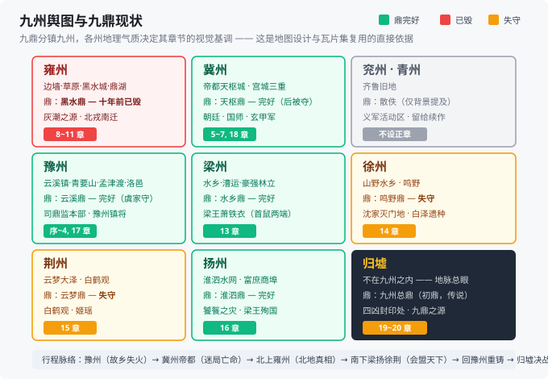
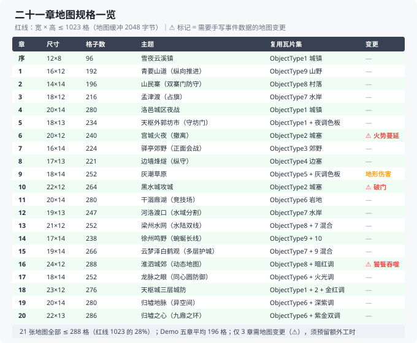

# 《山河烬》世界观与剧情设定 v1.5

> 日期：2026-09-24（v1.1：主角更名虞聪；新增女主沈婉莹与主线感情支线；新增神器系统；Demo 五章剧情细化。v1.2：新增武器档位系统 C/B/A/S/★。v1.3：神器与武器档位系统迁移至《游戏数值设定.md》，本文档只保留设定描述。**v1.4：世界观扩展至 §1.5~§1.11（编年史 / 九州舆图 / 朝廷结构 / 煞的生态学 / 九鼎逐鼎设定 / 民俗称谓 / 主题母题）+ 全二十章逐章剧情与地图设计（§4.6~§4.7）**）　|　配套文档：`0.调研报告.md`、`2.设计文档.md`（v0.6）、`3.游戏数值设定.md`（v0.1）、`4.项目规划手册.md`（规划唯一来源）、`5.改版工程手册.md`（v0.1）　|　目录：`D:\workbuddy\FireEmblem Realm-in-Ashes\docs`
> 状态：初稿，待审阅后迭代
> 对应设计文档第 9 节"待用户提供"清单：①世界观与 20 章大纲 ②角色名单（15~25 人）③职业命名/克制映射/转职树 ④游戏名

---

## 0. 一句话定位

**"九鼎镇四凶，鼎在人守。一个守鼎世家的少年，在王朝崩坏、妖祸再起的乱世中重聚天下，以人心为火，照亮山河。"**

- 体裁：架空古典中国（不对应任何真实朝代，取"九州"神话地理）
- 基调：少年热血 × 乱世苍凉，战争有代价（经典模式战死即永别）
- 全年龄向；残酷描写点到即止，重在"人如何在乱世守住心里的火"
- 对火纹的致敬转译：**"火焰纹章"→"九鼎之火"**；圣器 = 九鼎，圣血 = 守鼎人血脉，隐藏 BOSS = 上古四凶

---

## 1. 世界观

### 1.1 上神话：天倾之祸与九鼎

太古之时，天柱折断，**天火坠世**，四头凶兽随天火降临人间，是为**四凶**：

| 凶 | 司掌 | 定位 |
|---|---|---|
| **饕餮** | 吞噬 | 第十六章大敌（吞州灭国之灾） |
| **穷奇** | 疾暴 | 第十一章大敌（中期转折） |
| **梼杌** | 顽凶 | 最终章大敌（与国师合体） |
| **混沌** | 无面 | 不直接登场——外传伏笔 + 续作钩子 |

人皇**圣皇燧**（燧，取火之意）率九位部族之长（后世称**九牧**，九州始祖），采九州山川龙脉之精，铸**九鼎**，将四凶镇压于大地脉胳深处。九鼎各镇一州，分守于九州龙脉之眼。

**关键设定：鼎是锁，不是宝物。**
- 鼎需要**守鼎人**世代以血气香火温养；守鼎人绝嗣，鼎力便随岁月衰减。
- 鼎力衰减 → 地脉妖气外泄，是为**煞**。人畜沾煞则病，深陷则化为**尸傀**（普通妖兵），凶兽残魂借煞可凝出**凶相分身**。
- **毁鼎有代价**：须以守鼎人之血为祭，且逆乱龙脉、天谴缠身——所以反派不能一毁了之，这决定了整个剧情的博弈方式。

大熙王朝立国八百年，司鼎之事早已成为传说。朝廷设**司鼎监**，九家守鼎人世袭其职，如今大多散佚、衰微、或"被消失"。

### 1.2 当今天下（游戏开场时的格局）

- **朝廷**：先帝暴毙，八岁幼帝**承光帝**即位。**国师归无咎**辅政专权，把持司天监与玄甲军。天下奏报"煞疫横行"，皆被压下。
- **梁王萧铁衣**：坐拥梁、扬、荆三州的南方强藩，打"清君侧"旗号，实则观望待价。
- **北戎**：草原诸部。近十年不断南下劫掠——**真相：北方雍州鼎十年前已被暗中摧毁，草原被"灰潮"（妖灾）吞没，北戎是逃难而来的**（中期大反转）。
- **中原**：流民遍野，官军军阀化，义军四起。
- **白鹤观 / 南疆巫祝 / 山海遗种（妖族）**：三股在野势力，各有立场，陆续卷入。

### 1.3 力量体系：三才之道

世上法术分三脉，对应**天、地、人**三才（这就是法术克制的世界观依据）：

| 三才 | 流派 | 风格 | 代表 |
|---|---|---|---|
| **天道** | 道门雷法、符箓、观星 | 攻伐、驱邪、天象 | 云虚道人、洛清霜 |
| **地脉** | 南疆巫蛊、山泽之灵、通幽 | 咒杀、控场、幽冥 | 阿蛮、闻人夜 |
| **人和** | 儒门礼乐、正气、药理 | 净化、鼓舞、治疗 | 温子墨、白鹿鸣、阿蘅 |

武人走"武艺+军阵"的路子，不涉法术。**妖**（山海遗种）有善有恶；"煞化"是病，不是原罪——这句话是全剧情的道德底色。

### 1.4 专有名词表（写对话/事件时统一用语）

| 名词 | 含义 |
|---|---|
| 九鼎 / 九州 | 豫、冀、兖、青、徐、扬、荆、梁、雍，一州一鼎 |
| 守鼎人 | 九家世袭者；信物为**玉圭**（可感应鼎、净化煞） |
| 煞 / 尸傀 / 凶相 | 妖气 / 普通妖兵 / 凶兽分身（章 BOSS） |
| 天枢城 | 帝都（北斗第一星为名） |
| 玄甲军 | 朝廷最精锐重甲军，兄长虞旻所在 |
| 三狱使 | 国师麾下三名人形凶器：**离火、沉沙、无声**（第 12/16/17 章 BOSS） |
| 归墟 | 地脉总眼、九鼎初铸之地，最终战场 |
| 圣皇之火 | 圣皇燧传下的心火，只在"守鼎之志"者身上复燃（主角的血统与成长线） |
| 司鼎监 | 朝廷主管九鼎祭祀与守鼎人世袭事务的衙门，虞家世代任监正 |
| 灰潮 | 雍州鼎毁后，北地草原上蔓延的妖灾形态——灰白色的煞雾，所过之处草木尽枯 |
| 锁魂钉 | 国师用以强制忠诚的禁术；钉入脊柱，宿主神智被夺但武艺精进（虞旻所中） |
| 归家血书 | 国师先祖留下的叛逆宣言，是他全部行动的信念来源（第 15 章揭晓） |
| 义军 | 中原民间自发的抗煞武装，旗号"执炬"（主角团后期以此为号） |

### 1.5 编年史：从铸鼎到今朝的八百年

世界观需要一个**可被反复引用的时间轴**——玩家在对话、旁白、道具描述里听到的年份，必须能对上。

| 纪元 | 事件 | 剧情作用 |
|---|---|---|
| **太古·天倾** | 天柱折，天火坠世，四凶降临人间 | 神话层，序章旁白引用 |
| **太古·铸鼎** | 圣皇燧率九牧，采九州龙脉之精铸九鼎，镇四凶于地脉深处；封九牧后裔为**守鼎人**，世袭其职 | 世界观基石 |
| **燧朝** | 圣皇燧以九鼎立国，定"火在鼎中，鼎在人在"的祖训 | 第 20 章揭晓祖训真义 |
| **大熙·开国** | 大熙太祖代燧朝而立，定都天枢，设**司鼎监**，收九家守鼎人入朝 | 时间跨度最大的建制 |
| **大熙·中衰（约 200 年前）** | 王朝更替周期律显现，司鼎监渐成虚职，守鼎人散落州郡 | 解释为何今日守鼎人势弱 |
| **大熙·三十年前** | **归家因"私通妖物"被除名**——真相：归家先祖留下叛逆血书，主动叛出；国师归无咎即其后裔 | 第 4 章首次出现"归"字花押；第 15 章揭底 |
| **大熙·十年前** | **雍州鼎被暗中摧毁** → 灰潮生成，草原被吞，北戎被迫南迁 | 中期大反转的伏笔（第 8~11 章） |
| **大熙·三年前** | **徐州沈家满门"疫病"暴毙**——实为国师猎杀守鼎人的第一次演练，沈婉莹为唯一活口 | 女主家案（第 14 章并线） |
| **大熙·承光元年·冬（游戏开场）** | 先帝暴毙，八岁幼帝即位，国师辅政；豫州煞疫爆发，云溪镇被袭 | 序章起点 |

> **叙事设计**：这张表是"分层揭秘"的骨架。序章只讲太古铸鼎与当今天子年幼；十年前雍州之变到第 11 章才揭示；三十年前归家之事第 15 章才掀底。**每一层揭示都推翻玩家前一层的理解**，这是本作悬疑感的来源。

### 1.6 九州舆图：地理与势力格局

九鼎分镇九州，**每州的地理气质决定其章节的视觉基调**。这是地图设计与瓦片集复用的直接依据（见 §4.6）。



| 州 | 地理气质 | 鼎的现状 | 主要势力 | 对应章节 |
|---|---|---|---|---|
| **豫** | 中原腹地，云溪雪镇、青要山、孟津渡、洛邑 | **完好**（虞家守护） | 司鼎监本部、豫州镇将（秦烈） | 序~4 |
| **冀** | 帝都天枢城所在，宫城与朱门 | **完好**（入京后成焦点） | 朝廷、国师、玄甲军 | 5~7、18 |
| **雍** | 边墙、草原、黑水城、鼎湖 | **已毁（十年前）** → 灰潮之源 | 北戎诸部、边军、虞旻（敌将时） | 8~11 |
| **徐** | 山野水乡，鸣野 | **失守**（沈家灭门后无人温养） | 白泽遗种（白鹿鸣）、流民 | 14 |
| **荆** | 云梦大泽，白鹤观 | **失守** | 白鹤观（姬瑶） | 15 |
| **扬** | 淮泗水网，富庶商埠 | **完好**（被梁王掌控） | 梁王势力 | 16 |
| **梁** | 水乡漕运，豪强林立 | **完好**（梁王首鼠两端） | 梁王萧铁衣、地方豪强 | 13 |
| **兖、青** | 齐鲁旧地（背景提及，不设正章） | 散佚 | 义军活动区 | 背景 |
| **归墟** | 不在九州之内——地脉总眼，九鼎初铸之地 | 九鼎源头 | 四凶封印处 | 19~20 |

**关键地理设定**：

- **天枢城**（帝都）：取北斗第一星为名。城分三重——**外郭**（平民与市井）、**内城**（百官衙署，司鼎监在此）、**宫城**（幼帝与国师所在）。第 5~7 章的宫闱戏与第 18 章的攻城戏都在此展开。
- **归墟**：不在任何一州，是"九州之下"的地脉总眼。九鼎初铸之地，也是四凶被封之处。**九鼎之力最终都汇向归墟**——这是终章的地理依据。
- **灰潮**：雍州鼎毁后出现的新灾变形态。**不是煞，却比煞更可怕**——煞是妖气外泄（可净化），灰潮是地脉死透后的产物（不可逆）。这个区分是第 9~11 章的认知升级点。

### 1.7 司鼎监与朝廷：权力结构

朝廷不是背景板，是**第 5~7 章与第 18 章的主战场**。需要一个能支撑朝堂戏的清晰结构：

```
                    幼帝（承光帝，八岁）
                           │
        ┌──────────────────┼──────────────────┐
        │                  │                  │
   国师·归无咎         三公九卿           玄甲军
   （辅政专权）        （各怀心思）      （禁军精锐）
        │                                    │
   ┌────┴────┐                              │
司天监    司鼎监                         虞旻（被控）
（观星/    （九鼎祭祀、
  占卜）    守鼎人世袭）
     │          │
  洛清霜     虞衡（老监正，虞聪之父）
（叛逃女官）  （序章重伤）
```

| 机构 | 职能 | 剧情作用 |
|---|---|---|
| **司鼎监** | 掌九鼎祭祀、守鼎人世袭名册、玉圭发放 | 虞家世代任监正；**"监中有鬼"是第 4 章的核心疑点** |
| **司天监** | 观星、占卜、灾异奏报 | 国师把持；**洛清霜**从司天监叛逃，带去被灭口的真相（第 12 章） |
| **玄甲军** | 朝廷最精锐重甲军 | 兄长**虞旻**所在；第 6 章起成为敌阵；第 10 章"说得" |
| **三狱使** | 国师私人武力，非朝廷编制 | 离火、沉沙、无声，第 12/16/17 章 BOSS |

> **一个重要的政治设定**：国师的权力**不是靠军队，是靠"信息封锁 + 仪式正当性"**。他压下煞疫奏报、把持占卜解释权、以"奉旨"名义调走九鼎——**他做的事全都有合法外壳**。这决定了主角前期的困境：**他面对的不是一个可被武力击败的敌人，而是一套无法反驳的程序**。第 4 章"印从何来"的疑问，就是这套机制的第一次暴露。

### 1.8 煞的生态学（世界观层，非数值）

**"煞是病不是原罪"是全剧道德底色**——但这句话要立得住，煞就必须有可理解的"病理学"：

| 阶段 | 表现 | 可逆性 |
|---|---|---|
| **沾染** | 情绪失控、噩梦、伤口难愈 | **可净化**（玉圭 / 礼乐 / 药理） |
| **深陷** | 皮肤灰白、失语、攻击活人（即**尸傀**） | **难逆**，但礼乐可"安魂"使其平静（第 2 章婉莹弹《安魂引》） |
| **化煞** | 彻底失去人形，成为妖物 | **不可逆**，只能解脱 |
| **凶相** | 凶兽残魂借煞凝出分身 | 随本体封印而灭 |

**三条煞的传播途径**（对应三种战场形态）：

1. **地脉泄漏**：鼎力衰减处天然外泄 → 区域性、持续性（如豫州煞疫）
2. **人为驱赶**：用"驱煞鞭"把煞化者往某方向赶（第 2 章温子墨验尸发现）→ **证明有幕后黑手**
3. **心煞**：恶念自身引煞——第 4 章"煞化郡丞"是首次出现，**把克制对象从凶兽扩展到人心之恶**

> **这一层是世界观的道德支点**：如果煞只是"怪物化"，屠杀就没有负担；但煞是**病**——那么每一次战斗都是在杀病人。第 2 章阿蘅想冲出去救邻居张屠户、温子墨死死拉住，就是这句话的第一次落地。**玩家必须在这里感到不舒服，后面的"以人心为火"才成立。**

### 1.9 九鼎：逐鼎设定表

九鼎在剧情里会**逐件登场**，每鼎必须有自己的"性格"：

| 州 | 鼎名 | 属性 | 形制特征 | 现状 | 剧情节点 |
|---|---|---|---|---|---|
| **豫** | **云溪鼎**（豫州鼎） | 土 / 承载 | 三足圆鼎，鼎身云纹 | **完好**，虞家守护 | 序章被袭；第 17 章重燃"心火" |
| **冀** | **天枢鼎**（冀州鼎） | 火 / 中枢 | 四足方鼎，鼎身为九州图 | **完好**，在帝都 | 第 6 章被国师夺；第 18 章光复 |
| **雍** | **黑水鼎**（雍州鼎） | 水 / 北镇 | 深腹敛口，鼎身玄色 | **十年前已毁** | 第 11 章揭示——灰潮之源 |
| **徐** | **鸣野鼎**（徐州鼎） | 木 / 生发 | 矮足鼓腹，鼎身草木纹 | 沈家灭门后**失守** | 第 14 章查明；婉莹家案的物证 |
| **荆** | **云梦鼎**（荆州鼎） | 风 / 泽国 | 细足高耳，鼎身鹤纹 | **失守** | 第 15 章白鹤观线 |
| **扬** | **淮泗鼎**（扬州鼎） | 金 / 富庶 | 铸有漕运图 | **完好**，被梁王掌控 | 第 16 章饕餮之灾中受威胁 |
| **梁** | **水乡鼎**（梁州鼎） | 木 / 漕运 | 鼎耳作舟形 | **完好**，梁王首鼠两端 | 第 13 章"鼎料"私运案 |
| **兖、青** | （二鼎） | — | — | 散佚，仅背景提及 | 不设正章，留给续作 |
| **归墟** | **九州总鼎**（传说中的"初鼎"） | 全 | 九鼎之源 | 传说 | 第 17 章揭"人心为薪"；第 20 章终局 |

**九鼎的三条铁律**（贯穿全剧的机制，也是反派不能简单毁鼎的原因）：

1. **鼎是锁，不是宝物**——鼎本身无神力，它的作用是"锁住地脉"。抢鼎无用，**必须毁鼎或控鼎**。
2. **毁鼎需守鼎人之血为祭**，且逆乱龙脉、天谴缠身 → 反派**必须活捉守鼎人**，这解释了为何国师要"猎杀"而非"灭绝"守鼎人血脉。
3. **鼎力需世代温养**，守鼎人绝嗣则鼎自衰 → **守鼎人血脉本身就是资源**。这解释了沈婉莹"唯一活口"为何危险、也解释了终章"九鼎化万灯"的解法——**把"血脉独守"变成"人心共守"**。

### 1.10 民俗、称谓与语言质感

写对话时最容易出戏的是"现代腔"与"日式腔"。以下为**统一用语规范**：

**称谓**

| 场合 | 用法 | 忌用 |
|---|---|---|
| 官方文书 | "司鼎监监正虞公"、"陛下"、"国师大人" | 直呼其名 |
| 军中 | "将军"、"校尉"、"都尉" | 现代军衔 |
| 民间 | "郎君"、"娘子"、"阿翁"、"阿婆" | "先生/小姐" |
| 平辈伙伴 | "阿满"、"老温"、"道长"（戏称） | 全名连呼 |
| 主角对婉莹 | 前期"沈姑娘" → 中期直呼"婉莹"（第 4 章后） | 常用"你"带过 |

**诗号 / 定场（火纹式角色登场语，每人一句）**

| 角色 | 诗号（登场或关键战引用） |
|---|---|
| 虞聪 | "鼎在人在。"（贯穿全剧的口头禅级台词） |
| 沈婉莹 | "我救不了他们，只能让他们走得没那么疼。" |
| 温子墨 | "三天前你还请我喝过酒。" |
| 秦红缨 | "我爹的枪，我扛。" |
| 云虚道人 | "酒葫芦里一半酒，一半符水。" |
| 石阿满 | "山路我熟，跟着我爹的记号走。" |
| 裴松年 | "帝都还没烂透，因为还有个老东西站着。" |
| 归无咎 | "守着一口破锅的少年，才是在害天下。" |

**用语避雷**：不写"系统"、"界面"、"数据"…… 一切现代词汇；不写日式"殿"称呼（用"阁下/大人"）；不写西式感叹（"Oh my god"式）；**旁白用史书体**（"史官记曰……"），角色对话用白话但有古意。

### 1.11 主题与叙事母题（写作时的"北极星"）

所有章节的细节设计都应能**回指这三条母题**：

| 母题 | 表述 | 落点 |
|---|---|---|
| **① 火不在鼎里，在人间** | 圣皇之火不是血统特权，是"守鼎之志"——器物是空，人心是火 | 序章旁白埋 → 17 章证成 → 20 章揭底 |
| **② 煞是病不是原罪** | 被煞化者首先是受害者；恶行的根源是人心之恶（心煞） | 第 2 章张屠户 → 第 4 章煞化郡丞 → 终章 |
| **③ 独守必倾，共守方存** | 守鼎人世袭制本身就是病根——血脉独守终会绝嗣 | 沈家灭门 → 国师"鼎锁人道"的指控 → 终章"九鼎化万灯" |

> **第 ③ 条是回击国师的关键**。国师的指控有道理：**九鼎锁住四凶的同时，也锁住了人道气数，王朝八百年轮回正是这个机制的副作用**。主角不能靠"正义必胜"驳倒他——必须给出**制度层面的替代答案**：不是"毁鼎放凶"，也不是"守旧维持"，而是**把守鼎从血脉垄断变成人心共守**。这是终章的立论，也是全作区别于一般"打败大魔王"故事的立意所在。

---

## 2. 主角与核心角色

### 2.1 主角：虞聪

- 17 岁，豫州云溪镇人，**司鼎监守鼎世家"虞家"次子**（虞，上古掌山泽之官——守鼎人姓氏的来历）。
- 父**虞衡**（司鼎监老监正），兄**虞旻**（禁军玄甲军官）。
- 性格：温和执拗。不是天才，是"被推着走但绝不撒手"的少年。口头禅级台词：**"鼎在人在。"**
- 佩家传剑**照夜**（神器，觉醒后为"明烛"，数值见《游戏数值设定》第 3 节）；随身信物是豫州鼎的**玉圭**。
- 血脉天赋"**耳聪**"：守鼎人后裔听得见**鼎鸣**——鼎力衰减时，鼎会像钟一样呜咽。序章夜袭前，他就是被镇外豫州鼎的鸣声惊醒的（玩家开场第一个画面：少年在黑暗中睁眼，远处传来只有他听得见的钟声）。
- 成长弧线：从"守着一只鼎的少年" → "明白守的不是鼎，是人心" → 终章领悟"圣皇之火"的真义：**火不在鼎里，在人间。**

> 命名说明：虞聪（聪＝耳聪，守鼎人血脉的直觉，与"耳听鼎鸣"设定互文）、虞旻（旻＝秋日苍天）、虞衡（借古官名）。女主**沈婉莹**（婉＝琴音婉转，莹＝玉圭之光），与玉圭、流照琴两件随身物呼应。

### 2.2 女主：沈婉莹

- 18 岁，**徐州守鼎世家"沈家"唯一活口**。明面上是流亡的琴师少女，实际上怀里揣着徐州鼎的玉圭。
- 三年前徐州沈家满门被灭，官府以"疫病"结案——**真相：国师猎杀守鼎人的第一次演练**（第 14 章灭门旧案与她的家案并线，是揭开国师全盘计划的关键证人）。
- 性格：外柔内韧。三年流亡教会她把真话藏在琴里——表面温婉滴水不漏，混熟后（支援 B 级起）毒舌程度不输温子墨。**只有弹琴的时候最像她自己。**
- 战斗定位：**人和系·琴士**（雅乐师→大司乐的琴系分支），治疗 + 控场光环；佩家传古琴**流照**（神器，数值见《游戏数值设定》第 3 节）。
- 与虞聪的关系本质是"**同命人**"：两家都是守鼎人，沈家的今天就是虞家的预演——她比虞聪更早知道这条血脉意味着被猎杀。她的心结：**"在乎的人会因这血脉而死。"** 这是感情线的全部阻力，也是第 20 章突破的支点。
- 感情线全程贯穿主线（锚点见 5.1），终章结局：**"山河为聘"**（支援达"生死之交"触发专属结局对话）。

### 2.3 可玩角色名单（22 人：主线 21 + 外传 1）

| # | 姓名 | 身份 | 职业链 | 加入章 | 一句话人设 |
|---|---|---|---|---|---|
| 1 | 虞聪 | 主角，守鼎人次子 | 佩剑郎→荡寇游侠→**明烛剑主**（专属） | 序章 | "鼎在人在。" |
| 2 | 石阿满 | 猎户之子，虞聪发小 | 猎户→神射→落雁 | 1 | 嘴笨手稳，全村最会藏的少年 |
| 3 | **沈婉莹** | **女主，徐州守鼎人沈家遗孤（琴师）** | 琴士→雅乐师→大司乐（琴系） | 1 登场 / 2 入队 | 温婉是保护色，琴声才是真话 |
| 4 | 温子墨 | 落第书生，主角军师 | 儒生→雅乐师→大司乐 | 2 | 温吞皮囊，毒舌心里，算无遗策 |
| 5 | 阿蘅 | 随军医女，楚辞香草之名 | 药童→药师→悬壶 | 2 | 见惯生死，所以格外温柔 |
| 6 | 云虚道人 | 云游醉道人 | 道童→雷法道士→掌心雷真人 | 3 | 酒葫芦里一半酒一半符水 |
| 7 | 秦红缨 | 豫州镇将遗孤 | 长枪手→银枪卫→破军 | 3 | 父亲战死当夜扛起红缨枪 |
| 8 | 胡九儿 | 被追捕的狐妖少女 | 灵狐→妖姬→九尾（特殊链） | 5 | 报恩式加入，报着报着成了家 |
| 9 | 裴松年 | 殿前老将 | 甲士→玄甲→铁壁 | 5（17 归队） | 帝都唯一没烂掉的老人 |
| 10 | 柳青鸾 | 女飞贼，梁王细作 | 飞贼→夜枭 | 6 | 奉命偷玉圭，偷完倒戈了 |
| 11 | 柴多福 | 行脚商，北地通 | 连弩手→机关师（特殊链） | 7 | 一切向"钱"看，关键处比谁都向前 |
| 12 | 燕不归 | 北戎少主，质子出身 | 游骑→骁骑→逐北王骑 | 9 | 汉名是当质子时自己起的 |
| 13 | 慕晚晴 | 玄甲军副将（可说得敌将） | 骠骑 | 10 | 说得条件：虞聪对话（玄甲军线钥匙） |
| 14 | 邓阿七 | 随军铁匠 | 力士→重锤营→震山 | 11 | 修兵器不要钱，要故事听 |
| 15 | 阿蛮 | 南疆巫女，追煞源北上 | 巫女→山泽祭→百虫圣母 | 11 | 全天下怕她，她只怕没人为她说话 |
| 16 | 洛清霜 | 司天监叛逃女官 | 道童→司星→观星真人 | 12 | 带着司天监被灭口的真相逃出来 |
| 17 | 雷万钧 | 梁王先锋猛将（先战后服） | 力士→断岳锤 | 13 | 锤下不留情，认主不认天 |
| 18 | 谢危楼 | 浪人剑客，守鼎人遗孤护卫 | 佩剑郎→游侠→剑魁 | 14 | 十年前那场灭门案唯一的活口 |
| 19 | 白鹿鸣 | 白泽血统的少年（百晓生） | 司籍→天机（人和辅助系） | 14 | 知道所有事，只说该说的 |
| 20 | 姬瑶 | 白鹤观道姑 | 鹤羽卫→乘鸾仙使（飞行+雅乐） | 15 | 骑鹤下云梦，为观中弟子讨公道 |
| 21 | 虞旻 | 兄长，被"锁魂钉"控制的玄甲将 | 玄甲卫→玄甲将军 | 10 敌将 / 16 归队 | 序章失踪，北地重逢已成敌将 |
| 外 | 闻人夜 | 幽都判官（外传 2 加入） | 判官笔+幽冥（地脉三阶） | 外传2 | 一支笔写生死簿，替死人记账 |

> 加入节奏：序~3 章 7 人（demo 队伍：虞聪、婉莹、石阿满、温子墨、阿蘅、云虚、秦红缨）、5~7 章 +4、9~12 章 +5、13~16 章 +4、外传 +1。分布均匀，每幕都有新面孔。

### 2.4 主要反派

| 名字 | 定位 | 备注 |
|---|---|---|
| **国师归无咎** | 大反派 | 出场优雅温润，理想主义到骨子里的怪物 |
| 三狱使·离火 / 沉沙 / 无声 | 中后期 BOSS 三连 | 人形凶器，各镇 12/16/17 章 |
| 梁王萧铁衣 | 中期亦敌亦友 | 第十六章以死谢罪殉国（本作最大泪点之一） |
| 穷奇 / 饕餮 / 梼杌 | 四凶之三 | 第 11/16/20 章凶相 BOSS |
| 各章郡丞、军头、煞化头目 | 前期杂鱼 BOSS | 逐章配置见第 4 节 |

**国师动机（写好他是剧情成败的关键）**：
归无咎是九家守鼎人之一"归家"叛徒的后裔。他的祖上留下血书：**"鼎锁四凶，也锁人道。人间八百年王朝轮回兴亡，皆因九鼎锁死气数。"** 他要毁尽九鼎、放出四凶，再以圣皇后裔之血开天门、取"圣皇之火"自代——**他要亲手做那个把乱世烧干净的新圣皇**。他不觉得自己在作恶，他觉得虞聪这种"守着一口破锅的少年"才是在害天下。理念对决贯穿终章。

---

## 3. 职业与克制（对接设计文档第 2 节）

### 3.1 兵刃三环：枪 → 刀 → 锤 → 枪

**枪克刀**（一寸长，一寸强）｜**刀克锤**（刀疾锤迟）｜**锤克枪**（重刃断杆）

- **剑不入三环**——"剑为百兵之君"，与三系互不克制，属于主角/剑客系的中立生态位（对应火纹主角剑的惯例，且比原版更有说法）。
- 弓、弩、法术在环外，规则同火纹（射程优势 vs 被贴脸克制）。

### 3.2 三才法环：天 → 地 → 人 → 天

**天克地**（雷霆坠于山泽）｜**地克人**（众生出自尘土）｜**人克天**（礼乐可通神明）

- 天道（雷法）克地脉（巫蛊），地脉克人和（礼乐），人和克天道。循环闭环，对应火纹"理克光克暗克理"。

### 3.3 职业链总表（15 条链，敌我通用）

| 系 | 链（低→中→高） | 武器 | 对应角色 |
|---|---|---|---|
| 剑 | 佩剑郎→游侠→剑魁 | 剑 | 谢危楼（虞聪高阶变体：明烛剑主） |
| 刀 | 游刀手→百战刀客→断浪 | 刀 | 敌方常用 |
| 枪 | 长枪手→银枪卫→破军 | 枪 | 秦红缨 |
| 锤 | 力士→重锤营→震山 | 锤 | 邓阿七、雷万钧 |
| 弓 | 猎户→神射→落雁 | 弓 | 石阿满 |
| 弩 | 连弩手→机关师 | 弩+道具 | 柴多福（特殊链，2 阶） |
| 轻骑 | 游骑→骁骑→逐北 | 枪（马上） | 燕不归、慕晚晴 |
| 重甲 | 甲士→玄甲→铁壁 | 枪/锤 | 裴松年、虞旻 |
| 飞行 | 鹤羽卫→乘鸾 | 枪/雅乐 | 姬瑶（特殊链，2 阶） |
| 盗贼 | 飞贼→夜枭 | 短刀 | 柳青鸾（2 阶） |
| 医 | 药童→药师→悬壶 | 药囊/杖 | 阿蘅 |
| 天道 | 道童→雷法道士→真人 | 符箓 | 云虚、洛清霜 |
| 地脉 | 巫女→山泽祭→幽都 | 咒具 | 阿蛮、闻人夜 |
| 人和 | 儒生→雅乐师→大司乐 | 乐器/书 | 温子墨、白鹿鸣（辅助分支）；**沈婉莹走琴系变体（琴士起手）** |
| 兽灵 | 灵狐→妖姬→九尾 | 爪 | 胡九儿（特殊链，敌方另有妖兽系） |

**分支示例**（满足设计文档"1~3 阶 + 分支"要求）：天道链在高阶分岔——**雷部真人**（输出向，暴击成长）与**符箓真人**（辅助向，净化/召唤符兵）。其余各链同理在高阶做 2 分支，具体数值在后续"数值表"文档中配置。

**Demo（序章~第 4 章）需要的骨架动画**：剑步（虞聪）、弓手（石阿满）、法师（温子墨、云虚）——正好等于设计文档第 4 节的"demo 先做 3 个骨架"，无需额外工时。

---

## 4. 主线剧情：五幕二十章

### 4.0 五幕结构总览

| 幕 | 章 | 标题 | 地理 | 核心事件 | 基调 |
|---|---|---|---|---|---|
| 一 | 序~4 | 故乡失火 | 豫州 | 家破、出逃、集结伙伴、立志进京 | 雪夜与火 |
| 二 | 5~7 | 帝都迷局 | 冀州·天枢城 | 朝堂阴谋、兄长变敌将、亡命出京 | 朱门与刀 |
| 三 | 8~12 | 北地真相 | 雍州 | 北戎真相、救兄、穷奇现世 | 风沙与血 |
| 四 | 13~16 | 会盟天下 | 梁扬徐荆 | 游说诸侯、饕餮吞州、梁王殉国 | 烈火与泪 |
| 五 | 17~20 | 归墟决战 | 天枢→归墟 | 重铸九鼎、光复帝都、终战梼杌 | 山河长明 |

> **Demo = 序章~第 4 章**（第一幕完整 + 进京钩子），正好覆盖设计文档 P3 的决策门。

### 4.1 章节表（目标 / 登场 / 事件）

| 章 | 章名 | 地点 | 胜利条件 | 新伙伴 | 关键事件 |
|---|---|---|---|---|---|
| 序 | 雪夜云溪 | 豫州·云溪镇 | 击退煞兵（教学关） | 虞聪 | 煞兵夜袭；父重伤；兄押鼎突围失踪 |
| 1 | 故园烟尘 | 云溪→青要山道 | 护送村民（生存/护送） | 石阿满；沈婉莹（登场） | 撤离战；雪道救婉莹；立誓追鼎 |
| 2 | 山道问路 | 青要山 | 全灭（据点攻防） | 温子墨、阿蘅；沈婉莹（入队） | 煞化山贼攻寨；琴音安魂；查出煞兵是"被驱赶的" |
| 3 | 渡口争锋 | 孟津渡 | 压制（占旗） | 云虚、秦红缨 | 秦父战死；神器破军继承；婉莹亮玉圭揭沈家灭门 |
| 4 | 洛邑风云 | 豫州治·洛邑 | 夜战全灭（限时） | — | 郡丞通敌案；获得神器落雁；查出鼎被"奉旨"押往天枢——**Demo 终点** |
| 5 | 天枢之城 | 冀州·天枢城 | 守夜（防守 N 回合） | 胡九儿、裴松年 | 朝堂初见国师；救狐妖；老将暗中相护 |
| 6 | 宫闱之变 | 天枢·宫城 | 撤离（护送主角出城） | 柳青鸾 | 国师夺鼎之意暴露；**兄长以玄甲将身份现身敌阵**；裴松年重伤断后 |
| 7 | 南尘北望 | 出京岔口·驿亭 | 全灭 + 拒盟 | 柴多福 | 梁王"迎驾"实为夺圭；抉择北上查雍州异变 |
| 8 | 风沙渡 | 雍州边墙 | 守烽燧（防守+增援） | — | 边军不解：北戎游骑不攻城，在逃 |
| 9 | 胡笳与雪 | 雍州·草原 | 联防（生存 8 回合） | 燕不归 | 真相揭露：草原已被灰潮吞没 |
| 10 | 玄甲旧影 | 雍州·黑水城 | 攻城 + 说得 | 慕晚晴 | 战兄长；发现锁魂钉；救回昏迷的虞旻 |
| 11 | 灰潮之源 | 雍州·鼎湖 | 击退穷奇（BOSS 战） | 阿蛮、邓阿七 | **雍州鼎十年前已被毁**；穷奇现世，玉圭圣火初燃将其逼退 |
| 12 | 重聚与誓约 | 回师中原·河洛 | 全灭（遭遇三狱使） | 洛清霜 | "天下共守九鼎"会盟提案；国师爪牙首现 |
| 13 | 梁地行 | 梁州·水乡 | 平乱（混合：全灭+护船） | 雷万钧 | 梁王首鼠两端；豪强私运"鼎料"案 |
| 14 | 白鹿鸣野 | 徐州·鸣野 | 护送（守鼎人遗孤） | 谢危楼、白鹿鸣 | 灭门旧案浮出：国师在猎杀守鼎人血脉 |
| 15 | 云梦鹤唳 | 荆州·云梦泽 | 解围（据点防守） | 姬瑶 | 白鹤观之围；得知国师真身与"归家血书" |
| 16 | 饕餮之腹 | 扬州·淮泗 | 击杀凶相（大战） | 虞旻（归队） | 血祭唤饕餮；**梁王殉国**；会盟终成；兄长苏醒 |
| 17 | 九鼎重铸 | 豫州·龙脉之眼 | 保卫仪式（防守） | 裴松年（归队） | 重燃豫州鼎"心火"——证明"人心为薪"可行 |
| 18 | 天枢光复 | 冀州·天枢城 | 攻城（压制王座） | — | 国师挟幼帝遁走归墟；终局计划全盘揭露 |
| 19 | 归墟之门 | 归墟·地脉 | 突进（全灭） | — | 穷奇二次现世被圣火净化收场；最终门前 vs 合体半神（前置战） |
| 20 | 山河长明 | 归墟之心 | **击杀梼杌·归无咎** | — | 终战；九鼎化万灯散入民间；各角色支援结局 |

### 4.2 外传（可选挑战，1~2 个）

| 外传 | 名称 | 开放 | 内容 |
|---|---|---|---|
| 1 | 白鹤观旧事 | 15 章后 | 姬瑶往事，取秘宝"云外信"，补飞行系装备 |
| 2 | 幽都判官 | 12 章后 | 闻人夜加入；**混沌伏笔**——无面之神在归墟更深处沉睡（续作钩子） |

### 4.3 序章开场白样例（定调用，史书体旁白——致敬火纹每章开场的"编年史"质感）

> 大熙承光元年，冬。
> 史官记曰：豫州煞疫，不过数村。
> 没有人记下那一夜的雪有多深，也没有人记下，云溪镇的火烧了三天三夜。
> ——八百年前，圣皇燧以九州之火铸九鼎，镇四凶于地脉。
> 如今火将熄，鼎将倾。
> 而雪夜里提剑出门的那个少年，还不知道自己要守的，从来不只是豫州的一只鼎。

### 4.4 三条主线暗扣（写作时的备忘）

1. **玉圭 = 火种**：序章只是"信物"→ 11 章初次发烫 → 17 章重燃鼎火 → 20 章揭晓圣皇之火的本体是"守鼎之志"（人心），器物是空，人心是火。
2. **兄长 = 镜像**：虞旻被锁魂钉控身（强制忠诚）vs 国师被血书锁心（自愿忠诚）——同一场戏里救兄，就是提前回答终章的问题。
3. **北戎 = 预演**：雍州鼎被毁后的草原就是"九鼎尽毁后的人间"预演——让玩家在第 9 章亲眼看到终局赌注。

### 4.5 Demo 五章详细剧情（序章~第 4 章）

> 用途：直接指导关卡表与事件脚本制作。每章含【开场】【战斗】【BOSS】【战后】【锚点】五要素；教学曲线为"一章一个新机制"（序章移动攻击 → 1 章护送 → 2 章防守/治疗 → 3 章占旗/神器展示 → 4 章限时夜战）。

#### 序章 · 雪夜云溪（教学关）

- **开场**：黑屏，只有钟声（只有虞聪听得见的鼎鸣）。少年睁眼。切虞衡夜观天象："妖星犯豫州。"同时收到密报：朝廷钦差明日到，要"移鼎入京暂养"。虞旻皱眉："八百年没动过鼎，为什么是现在？"
- **战斗**：分三段的小教学图（12×8 镇子局部）——①宅院内 3 只尸傀破门，父亲教移动/攻击/地形加成；②镇口火起，兄长虞旻（强力 NPC）演示克制与追击；③**护送段**：护鼎车从虞宅撤到镇口撤离点。借宿祠堂的云虚道人客串助战（埋"这老道很强"的印象，第 3 章正式入队）。
- **BOSS**：煞化猎户头目"瘸爷"（教学级数值，两刀就倒，重点是让玩家体验暴击演出）。
- **战后**：虞衡重伤，托付玉圭与照夜剑："鼎在人在。"混乱中虞旻奉命护鼎车向北突围——职责与家人，他选了职责（兄长线起点）。**玩家彩蛋**：远处钟楼上立着一个黑影（三狱使·无声，玩家此刻不知是谁）。
- **锚点**：主角动机成立（追鼎=追兄=追真相）；"耳聪"设定展示。

#### 第 1 章 · 故园烟尘

- **开场**：清晨清点幸存者，撤离青要山。石阿满（猎户之子）断后引路："山路我熟，跟着我爹的记号走。"
- **战斗**：山道纵向推进图（16×12）。护送 6 名村民单位到撤离点，路上两波伏击；石阿满的陷阱点（提前踩点，敌人踩上扣血）首次展示"准备"的乐趣。
- **中场事件**：岔路口——婉莹护着几个流民孩子被煞兵围困，虞聪赶到救下。她作为客串 NPC 参与本章剩余战斗（琴音辅助，玩家先"试用"女主）。
- **BOSS**：煞化野猪王（野兽系，演示弓对野兽的优势）。
- **战后（夜宿山洞）**：婉莹看到虞聪贴身的玉圭，眼神一变："别把它给人看。官府的人也不行。"拒绝透露身份。石阿满小声嘀咕："她手上有箭茧，指腹上又有琴茧——怪人。"
- **锚点**：感情线"陌路→相识"；婉莹身份悬念埋下。

#### 第 2 章 · 山道问路

- **开场**：青要山民寨休整。温子墨（被村民请来写祭文的落第书生）登场即毒舌；阿蘅（义诊医女）沉默地给伤者换药。
- **战斗**：寨子防守图（14×14，双寨门）。第一波煞化山贼攻门——**残酷一课**：敌兵里有昨天还来送粮的邻居张屠户。阿蘅想冲出去救，温子墨死死拉住（"你出去，死的就是两个人！"）。
- **中场事件**：婉莹正式入队。她上箭楼弹《安魂引》，煞化村民在琴音中迟滞、流泪、停下——虞聪第一次见到"可以不用杀"。战后他问她："能救他们吗？"她摇头："我救不了他们，只能让他们走得没那么疼。"（**"煞是病不是原罪"的道德底色在此落地**）
- **BOSS**：煞化寨主（人类 BOSS，温子墨专属对话："三天前你还请我喝过酒。"）
- **战后**：温子墨验尸——煞兵背上有"驱煞鞭"的旧伤："不是野兽，是被人像赶羊一样往南赶。"方向：孟津渡。
- **锚点**：婉莹入队；主线疑点升级（有幕后黑手）。

#### 第 3 章 · 渡口争锋

- **开场**：孟津渡。秦红缨登场：跟她爹秦烈老将军来讨说法——郡丞下令弃渡撤军。政局首次展示：郡丞早已通敌，布防图被卖，只为让"钦差"顺利用鼎。
- **战斗**：渡口压制图（18×12，河流+桥）。胜利条件：占领三处烽旗——**占旗激活友军弓手**（交互地图机制首秀，教玩家多目标权衡）。
- **中场事件**：郡丞引煞兵入城，秦烈殿后战死（剧情演出，火纹式"老将断后"名场面）。**破军枪继承**：秦红缨含泪拔起父亲的长枪入队，神器获得——**全游戏第一次神器数值卡 UI 高亮展示**（弹窗展示专属外观立绘+特效说明）。
- **章末（重磅）**：温子墨私下逼问婉莹（他早看出破绽）。她当众亮出徐州玉圭：三年前徐州沈家满门"疫病"暴毙，她是唯一活口。"下一个'疫病'，就轮到你们虞家。"秦红缨沉默地把枪插进土里——她的"疫病"，就是今天。
- **BOSS**：郡丞卫队长（人类，可说服：温子墨对话说得→第 4 章他来送情报；杀死→掉落稀有装备。二选一，让玩家记住"说得"系统）。
- **锚点**：感情线"相识→相知（C）"；守鼎人被猎杀的真相初揭。

#### 第 4 章 · 洛邑风云（Demo 终点）

- **开场**：洛邑，豫州治。查明鼎被"奉旨"北上，文书盖着司鼎监大印——但监正就是虞衡，印从何来？监中有鬼，或父亲出事了。（玩家第一次对"朝廷"本身产生怀疑）
- **战斗**：城区夜战图（20×14，巷战）。胜利条件：限时 12 回合内全灭郡丞府私兵并撤离（天亮前）。**隐藏宝箱**：府库密室中的落雁弓（石阿满专属对话触发发现）。
- **中场事件**：搜出押鼎行程单，签押是"归"字花押。温子墨查档：归家——守鼎人叛户，三十年前因"私通妖物"被除名。线索指向京城。
- **BOSS**：煞化郡丞（**人也会煞化**——贪欲化煞，人形强化 BOSS；向玩家宣告：恶行本身会引煞上身，克制对象从"凶兽"扩展到"人心之恶"）。
- **战后（感情线 B 段）**：洛邑城头，两枚玉圭在夜里同时微光共鸣（"同命人"第一次视觉化）。婉莹："从今往后，你的事就是我的事。"虞聪望着北面没接话，只是把照夜剑往她那边挪了挪，挡住了风口。
- **Demo 结尾钩子**：北面官道，鼎车与玄甲护卫队的旗帜隐入夜色。队伍中有一张少年们没见过的脸——**虞旻回头望了一眼家的方向，又转回去**。（玩家知道、主角不知道——经典戏剧反讽，Demo 完。）
- **锚点**：感情线"相知（解锁 B）"；"归"字线索；兄长存活确认。

### 4.6 全二十章关卡剧情与地图设计

> **本节用途**：把 §4.1 的浓缩章节表，扩展为**可直接指导关卡表与事件脚本制作**的逐章详案。Demo 五章（序~4）已在 §4.5 详写，本节补全第 5~20 章 + 2 外传，并为**每一章**给出地图设计意图。
>
> **每章结构**：【序章旁白】【开场】【战场与目标】【中场事件】【BOSS】【战后】【锚点】＋【**地图设计**】。
>
> **地图设计的硬约束**（详见文档 8 §4.2）：单图层正交 TMX；1..255 宽高；16×16 元瓦片；GID 1..4096；**地图缓冲上限 2048 字节 = 2 字节头 + 每格 2 字节 → 最多 1023 格**。**"格子数 = 宽 × 高 ≤ 1023"是所有地图设计的红线**（32×32 = 1024 格会直接失败）。

---

#### 第二幕 · 帝都迷局（第 5~7 章）

> **幕的主题**：从"地方灾难"升级为"朝廷阴谋"。玩家第一次意识到：**敌人不是妖，是一套无法反驳的程序。**

##### 第 5 章 · 天枢之城

| 要素 | 内容 |
|---|---|
| **序章旁白** | "承光元年，腊月。史官记曰：豫州进鼎，帝嘉之。——没有人记下，押鼎的队伍里少了一个人。" |
| **开场** | 初入帝都。三重城郭的描写：外郭人声鼎沸、内城朱门紧闭、宫城高墙无字。裴松年（殿前老将）在城门口拦下盘查，暗中递话："今晚别住驿馆。"胡九儿（逃命中的狐妖少女）从檐上跌落，被卷入。 |
| **战场与目标** | **防守 N 回合**。夜，天枢外郭某坊——国师的爪牙以"搜捕妖物"名义围攻。玩家需要守住坊门（不要求全灭），撑过 N 回合后裴松年接应。 |
| **中场事件** | 胡九儿暴露妖身（她是"报恩式"投奔——虞聪在雪道上救过她，她一路跟来）。裴松年认出婉莹的琴："这首《安魂引》，沈家的人才弹得出。"——**第二个人看破婉莹身份**。 |
| **BOSS** | 司天监巡夜校尉（人类，可说得不能；纯守关）。老将裴松年以 NPC 身份参战，演示"重甲堵路"的战术价值。 |
| **战后** | 裴松年引荐："司鼎监还在，但监正不在。你父亲进京后就再没露过面。"——虞衡下落成第二主线。 |
| **锚点** | 胡九儿、裴松年入队；帝都线开启；婉莹身份第二人知晓。 |
| **地图设计** | **主题**：帝都外郭坊市夜景。**尺寸 18×13（234 格）**。**地形构成**：街道（可通行，无加成）40%、屋舍（障碍，封路）35%、坊墙（障碍，高）15%、坊门口（窄口，2 格宽，必守点）5%、巷弄（可通行，回避 +10）5%。**布局意图**：地图呈"回"字形——外圈街道，内圈民居；玩家需在坊门口 2 格窄口布防，**首次体验"堵路"比"杀伤"更重要**。**瓦片集复用**：`ObjectType1`（城镇，256 元瓦片）+ `MapPalette1`（日间城镇调色板变暗夜景）。**通行性**：屋舍不可通行、不可飞行；坊墙不可越过（飞行单位可越）。 |

##### 第 6 章 · 宫闱之变

| 要素 | 内容 |
|---|---|
| **序章旁白** | "史官记曰：是夜，宫中有火，国师入觐，天明乃出。——火是谁放的，没有人问。" |
| **开场** | 国师召见虞聪一行，以"守鼎人失职"问罪。堂上他优雅温润，说出的话却字字诛心：**"你父亲守的鼎，去年一年的温养记录是空的——你替他解释解释？"**（读者此刻不知虞衡已被控制/囚禁） |
| **战场与目标** | **撤离（护送主角出城）**。宫城起火（国师自导自演，用以制造混乱、名正言顺控制幼帝并"封存"天枢鼎）。主角一行需从宫城侧门突围出外郭。 |
| **中场事件** | **柳青鸾**（女飞贼，梁王细作）奉命偷玉圭，反被卷入混战；她见势倒戈，为玩家指路。**兄长以玄甲将身份现身敌阵**——虞聪喊他，他不应（锁魂钉生效）。**裴松年重伤断后**："老东西跑不动了，你们走。"（裴松年暂时退场，第 17 章归队） |
| **BOSS** | 玄甲军队正（人类，不可说得；虞旻作为不可攻击的"演出单位"在场，攻击他会触发特殊对话而非战斗） |
| **战后** | 婉莹被扣为质（国师要挟），虞聪弃圭救她。她："你没选玉圭。"他："圭没了能找，人没了找谁？"——**感情线的高光，也是主角"重人不重物"的第一次表态**。 |
| **锚点** | 兄长确认成为敌将（锁魂钉伏笔）；裴松年退场；柳青鸾入队；主角失去玉圭（后期找回）。 |
| **地图设计** | **主题**：宫城火夜。**尺寸 20×12（240 格）**。**地形构成**：宫道（可通行）30%、殿宇（障碍）30%、宫墙与门（窄口，需钥匙/事件开启）20%、**火场（地形伤害，每回合 -2 HP）10%**、空地（无加成）10%。**布局意图**：**纵向"漏斗"结构**——宽进窄出，出路在右下侧门；火场随时间蔓延（**这是本作首个"地图变更"需求**，需事件脚本控制火势扩散，标注为额外预算项）。**瓦片集复用**：`ObjectType2`（城塞）+ 暖色调 `MapPalette`。**通行性**：火场可通行但掉血；殿宇不可通行。**⚠️ 地图变更**：火势扩散需手写章节事件数据（Manual-only，文档 8 §4.3）。 |

##### 第 7 章 · 南尘北望

| 要素 | 内容 |
|---|---|
| **序章旁白** | "史官记曰：梁王奉表入觐，迎驾于城南。——史官没有写，他带了两万甲士。" |
| **开场** | 出京岔口·驿亭。梁王萧铁衣设"迎驾"宴，实为夺圭（他也要九鼎，作为称帝的资本）。柴多福（行脚商，北地通）混在商队里通风报信。 |
| **战场与目标** | **全灭 + 拒盟**。梁王的"护驾"军队变相围困；玩家需击退前军，逼梁王收回成命，并做出**北上查雍州异变的抉择**。 |
| **中场事件** | 梁王的台词是全篇最"政治"的一段：**"你们守鼎？你们守着的是八百年的规矩。规矩要人饿死，还守它做什么？"**——他是"机会主义者"，但他说的问题是真的。 |
| **BOSS** | 梁王先锋 雷万钧（力士→断岳锤，先战后服；**可说得**，条件是本章内用虞聪或秦红缨对话并在其 HP < 50% 时触发） |
| **战后** | 雷万钧未能说得 → 第 13 章再遇；若说得成功 → 提前入队（**分支设计**）。线索指向雍州：**"北戎游骑在逃，不是在攻。"** |
| **锚点** | 抉择：北上（查雍州）为唯一推进路线；柴多福入队；梁王从"潜在盟友"变为"不可信任"。 |
| **地图设计** | **主题**：驿亭郊野。**尺寸 16×14（224 格）**。**地形构成**：官道（可通行）25%、草地（回避 +5）30%、林木（回避 +15，通行消耗 +1）20%、驿亭建筑（障碍）10%、**栅栏/拒马（障碍，可被破坏）10%**、溪流（不可通行，仅桥可过）5%。**布局意图**：**开阔对战**——与第 5 章的"堵路"、第 6 章的"漏斗"形成对照，本章教"开阔地形的正面会战与侧翼包抄"。桥是唯一通路，可守可攻。**瓦片集复用**：`ObjectType3`（郊野）+ `MapPalette3`。 |

---

#### 第三幕 · 北地真相（第 8~12 章）

> **幕的主题**：**中期大反转**。玩家以为的"外敌入侵"，其实是"灾难难民"。**终局的赌注第一次被亲眼看到。**

##### 第 8 章 · 风沙渡

| 要素 | 内容 |
|---|---|
| **序章旁白** | "史官记曰：雍州边墙，烽燧连日有警。——驻军报：敌不攻城。史官依例不录。" |
| **开场** | 雍州边墙。守军不解：**北戎游骑不攻城、不劫粮，他们在逃。** 边军将领怀疑主角一行是朝廷细作。 |
| **战场与目标** | **守烽燧（防守 + 增援）**。玩家需守住烽燧 N 回合，同时应对"来路不明"的煞化游骑（**这些其实是煞化的北戎平民**——第 9 章才明说）。 |
| **中场事件** | 烽燧守军与主角团从互相戒备到并肩作战；边军老兵对虞聪说："你们中原人，管这个叫'妖祸'。我们管它叫'天罚'。" |
| **BOSS** | 煞化游骑首领（骑兵系，机动性强，演示"被包抄"的威胁）。 |
| **战后** | 从死者衣饰判断：**不是敌军正规军，是牧民。** 温子墨："看伤口——不是战伤，是逃难时被什么追上咬的。" |
| **锚点** | 线索："他们在逃什么？"；燕不归（北戎少主）第 9 章登场铺垫。 |
| **地图设计** | **主题**：北地边墙烽燧。**尺寸 17×13（221 格）**。**地形构成**：城墙（障碍，高）20%、墙头（可通行，回避 +20，防御 +1）8%、沙地（通行消耗 +1，无加成）35%、烽燧建筑（障碍，被保护对象）10%、**马厩/栅栏（障碍）12%**、荒草（回避 +5）15%。**布局意图**：**纵向防守**——城墙是天然屏障，但敌从两侧沙地迂回；玩家须分兵守两点。**瓦片集复用**：`ObjectType4`（沙漠/边塞）+ `MapPalette` 土黄调。**通行性**：城墙不可通行，墙头仅守军可上（用"地形高度"设定）。 |

##### 第 9 章 · 胡笳与雪

| 要素 | 内容 |
|---|---|
| **序章旁白** | "史官记曰：雍州大雪，草木尽枯。——史官不知道，那一年，草原上的草再没有长出来过。" |
| **开场** | 出边墙，入草原。所见是**灰白色的死地**——这就是"灰潮"。燕不归（北戎少主，质子出身，汉名是自己起的）带残部截住主角一行，仇视中原人："你们把天罚带来的。" |
| **战场与目标** | **联防（生存 8 回合）**。燕不归最初是敌对单位（可说服），同时灰潮中涌出煞化兽群。**本章的敌人是"灾难本身"**。 |
| **中场事件** | 并肩作战中，燕不归讲述：**十年前，雍州的鼎"像灯一样灭了"，然后草原开始变灰。** 北戎南下不是入侵，是**逃难**——中原人却把他们当侵略者杀。 |
| **BOSS** | 灰潮中凝出的**凶相雏形**（弱化版穷奇，为第 11 章铺垫）；燕不归在 HP 低时转为友军。 |
| **战后** | 燕不归入队。他问虞聪："你们的鼎，还能点着吗？"——**这句话是终章伏笔**。 |
| **锚点** | **中期大反转完成**；燕不归入队；"灰潮不可逆"的认知升级。 |
| **地图设计** | **主题**：灰潮草原。**尺寸 18×14（252 格）**。**地形构成**：枯草（回避 +5，暮气）45%、**灰潮地（地形伤害，每回合 -1 HP，且降低回避）20%**、枯木林（回避 +15，障碍半数）15%、冻河（不可通行）10%、石堆（障碍）10%。**布局意图**：**无险可守的开阔地 + 移动伤害地形**——强制玩家"移动中作战"，与第 8 章的"据守"形成对照。灰潮地是"不可逆伤害区"，视觉上用灰白瓦片区分。**瓦片集复用**：`ObjectType5`（草原）+ 自定义灰白调色板（**调色板派生，零新增美术**）。**⚠️ 地形伤害**：需地形效果配置（非地图变更，属常规数据）。 |

##### 第 10 章 · 玄甲旧影

| 要素 | 内容 |
|---|---|
| **序章旁白** | "史官记曰：玄甲副将虞旻，破黑水城，斩首三千。——史官不知道，他每夜都在梦见同一场雪。" |
| **开场** | 雍州·黑水城。**与兄长正面为敌**。慕晚晴（玄甲军副将）先登场为敌将，她其实已察觉虞旻异常。 |
| **战场与目标** | **攻城 + 说得**。玩家需攻入黑水城，击败慕晚晴（可说得，条件是虞聪对话）并从虞旻枪下救出他。**"说得"在本章是主要解法，强攻会留下遗憾**。 |
| **中场事件** | 战斗中，玩家发现虞旻后颈的**锁魂钉**。救回后他昏迷不醒——**国师的控制手法第一次被揭穿**。 |
| **BOSS** | 玄甲将军 虞旻（**不可击杀，须"说得"或"救出"**；若被击杀则触发坏结局分支：兄长永久死亡，本章后感情线走"沉重"支线） |
| **战后** | 慕晚晴若说得成功则入队；虞旻昏迷（第 16 章归队）。洛清霜（司天监叛逃女官）在第 12 章登场前，此处先埋"锁魂钉是禁术，只有司天监有记载"的线索。 |
| **锚点** | 兄长线转折；慕晚晴入队（可选）；锁魂钉禁术伏笔。 |
| **地图设计** | **主题**：黑水城攻城战。**尺寸 22×12（264 格）**。**地形构成**：城墙（障碍，高）18%、**城门（2 格宽，可被破门事件开启）**、城内街道（可通行）25%、**民居（障碍，部分可"说得"单位的掩体）20%**、广场（无加成，BOSS 下场处）12%、**城楼（可通行，高台，回避 +20）**15%、护城河（不可通行，仅桥）10%。**布局意图**：**双层结构**——外墙攻坚 + 城内巷战。**推荐解法是"围三缺一"**：留一条退路，逼敌从指定方向出来，再从高台夹击。**瓦片集复用**：`ObjectType2`（城塞）+ 寒色调调色板。**⚠️ 地图变更**：破门后地形变化（城门格变可通行），需事件数据。 |

##### 第 11 章 · 灰潮之源

| 要素 | 内容 |
|---|---|
| **序章旁白** | "史官记曰：雍州鼎湖，湖涸十年。——朝廷的奏报写的是'天旱'。" |
| **开场** | 雍州·鼎湖。曾经的鼎所在——现在是一个**干涸的巨坑**。阿蛮（南疆巫女，追煞源北上）、邓阿七（随军铁匠）在此登场。 |
| **战场与目标** | **击退穷奇（BOSS 战）**。**玉圭圣火初燃**——婉莹的玉圭在鼎湖感应到残存鼎力，第一次发出火光，将穷奇逼退。**这是玩家第一次看到"玉圭不是信物，是火种"**（三条暗扣之一）。 |
| **中场事件** | 阿蛮以地脉巫术探知真相：**雍州鼎十年前被人为摧毁**，且"毁鼎的手法出自守鼎人"。灰潮是地脉死透后的产物，**不可逆**。 |
| **BOSS** | **穷奇**（四凶之二，疾暴）。它是"凶相"级——本体的残魂借灰潮凝出。表现为高速 + 高攻的物理系大敌。 |
| **战后** | 玉圭的火光让所有人沉默：如果玉圭能点火，那九鼎就还能重铸——但**需要守鼎人的血**。伏笔指向"重铸九鼎"的主线目标。 |
| **锚点** | **穷奇被逼退（非击杀，为第 19 章二次现世留伏笔）**；"零号真相"：雍州鼎是被人毁的，且手法出自守鼎人（指向国师身份）；阿蛮、邓阿七入队。 |
| **地图设计** | **主题**：干涸鼎湖。**尺寸 20×14（280 格）**。**地形构成**：**湖底龟裂地（回避 -10，暴露）40%**、**环形湖岸（高地，回避 +20）25%**、巨石（障碍）15%、**鼎残骸（场景物，不可通行，但围绕它有地形加成）10%**、裂隙（不可通行）10%。**布局意图**：**中心对称的"竞技场"结构**——BOSS 从中心出现，玩家从四周岸上下场。**核心战术**：龟裂地无回避加成，是危险区；湖岸高地是安全区。玩家必须在"下到湖底打"与"在岸上等"之间抉择。**瓦片集复用**：`ObjectType6`（岩地/荒原）+ 灰褐调色板。 |

##### 第 12 章 · 重聚与誓约

| 要素 | 内容 |
|---|---|
| **序章旁白** | "史官记曰：河洛会盟，诸侯不至。——天下已经不相信朝廷了。" |
| **开场** | 回师中原·河洛。洛清霜（司天监叛逃女官）带着**司天监被灭口的真相**投奔：司天监曾记录到"某年某月，雍州鼎有人为毁损之象"，记录者全部暴毙。 |
| **战场与目标** | **全灭（遭遇三狱使）**。三狱使之一**离火**首次现身，试探主角团实力后从容退走。 |
| **中场事件** | 洛清霜提出**"天下共守九鼎"会盟提案**——这是终章"人心共守"的第一次成型。但诸侯响应者寥寥。 |
| **BOSS** | **三狱使·离火**（女法骑，高阶）。**不可击杀**——她是"探测"性质，HP 降至一定值即退场，玩家须撑过 N 回合。 |
| **战后** | 国师爪牙首现，意味**主角团的行踪已暴露**。路线转向南方诸侯。 |
| **锚点** | 会盟提案提出；洛清霜入队；三狱使威胁升级。 |
| **地图设计** | **主题**：河洛渡口会盟地。**尺寸 19×13（247 格）**。**地形构成**：河岸（可通行）25%、渡口码头（木质，回避 +5）15%、**河流（不可通行，仅渡船/桥）25%**、会盟帐篷（障碍）12%、芦苇荡（回避 +15，通行消耗 +1）15%、浅滩（通行消耗 +2）8%。**布局意图**：**水域分割**——河流把地图切为两半，三狱使从对岸突入。玩家必须快速重新集结。**瓦片集复用**：`ObjectType7`（水面/河岸）+ `MapPalette` 青绿调。 |

---

#### 第四幕 · 会盟天下（第 13~16 章）

> **幕的主题**：**从"打妖怪"到"说服人"**。这一幕的敌人一半是凶兽，一半是**人心与利益**。

##### 第 13 章 · 梁地行

| 要素 | 内容 |
|---|---|
| **序章旁白** | "史官记曰：梁州水乡，私船千艘，往来如织。——船上装的是什么，无人过问。" |
| **开场** | 梁州·水乡。豪强私运**"鼎料"**（铸鼎所需的龙脉之石）——说明**有人在做重铸或者毁鼎的准备**。雷万钧（若第 7 章未说得）在此再遇，是梁王的先锋。 |
| **战场与目标** | **平乱（混合：全灭 + 护船）**。玩家需全灭豪强私兵，同时保护己方船只不被击沉。 |
| **中场事件** | 雷万钧的理念："我锤下不留情，认主不认天。"他是"忠"的极端——**忠于梁王，不问对错**。说得他的关键：让他明白梁王在拿天下人的命赌。 |
| **BOSS** | 雷万钧（**再给一次说得机会**；若两次失败则本章后无法入队，其位置由后续角色补） |
| **战后** | 查明"鼎料"去向：运往天枢，收货方盖的是**司鼎监的印**（第二次出现这个问题，第 4 章已埋）。 |
| **锚点** | 雷万钧去留；"鼎料"与司鼎监的关联加深。 |
| **地图设计** | **主题**：梁州水网漕运。**尺寸 21×12（252 格）**。**地形构成**：**水道（船只专用，陆地单位不可通行）30%**、**岸堤（可通行，回避 +10）20%**、桥梁（窄口，2 格）8%、码头与栈桥（木质）12%、**货运仓库（障碍，藏物）15%**、民居（障碍）15%。**布局意图**：**水陆双线**——陆地单位沿岸推进，船只沿水道航行，两条线互相掩护。**首次引入"保护非战斗单位"的战术**（船）。**瓦片集复用**：`ObjectType8`（城郊/村落）+ `ObjectType7`（水）混合 + 青绿调色板。 |

##### 第 14 章 · 白鹿鸣野

| 要素 | 内容 |
|---|---|
| **序章旁白** | "史官记曰：徐州鸣野，疫病，举家殁。——那一年，这样结案的有十七家。" |
| **开场** | 徐州·鸣野。**这是沈婉莹的故乡**。谢危楼（浪人剑客，灭门案唯一活口）、白鹿鸣（白泽血统少年，百晓生）登场。白鹿鸣知道所有事，只说该说的。 |
| **战场与目标** | **护送（守鼎人遗孤）**。护送达官人家的守鼎人后裔（他们是徐州的隐居守鼎人，沈家同族）撤离。 |
| **中场事件** | **灭门旧案并线**：十七家"疫病"，全是守鼎人血脉。手法一致。婉莹站在自家废墟前，第一次失态——她一直知道，但第一次有人证明她不是"克星"，是**被害者**。 |
| **BOSS** | 国师派来的执行者（人类，高阶，**可说得？不可**——他是"知道真相仍选择执行"的人，是国师理念的镜像） |
| **战后** | 白鹿鸣给出关键情报：**国师真身是"归家"后裔**，而"归家血书"就在他手里。线索指向荆州云梦泽的白鹤观。 |
| **锚点** | 灭门案并线；谢危楼、白鹿鸣入队；婉莹的心结第一次被正面处理。 |
| **地图设计** | **主题**：徐州山野水乡。**尺寸 17×14（238 格）**。**地形构成**：林间小径（可通行，窄）30%、**竹/松林（回避 +15，视野阻挡）25%**、溪流与石桥（不可通行 / 窄口）15%、田埂（回避 +5）15%、**废墟屋舍（障碍，剧情物）10%**、湿地（通行消耗 +2）5%。**布局意图**：**蜿蜒长线**——护送路线是一条曲折小径，两侧是伏击林地。**核心战术**：vanguard vs rearguard 的分工。**瓦片集复用**：`ObjectType9`（林地/山野）+ `MapPalette10`。 |

##### 第 15 章 · 云梦鹤唳

| 要素 | 内容 |
|---|---|
| **序章旁白** | "史官记曰：荆州云梦泽，有白鹤万只。——白鹤观的道士说，那是弟子们的魂。" |
| **开场** | 荆州·云梦泽，白鹤观被围。姬瑶（白鹤观道姑）登场——她的弟子们被困。 |
| **战场与目标** | **解围（据点防守）**。玩家从外圈突入，为白鹤观解围。姬瑶是飞行单位（鹤羽卫），演示"飞行单位的战术价值"。 |
| **中场事件** | 白鹤观保存着**上古文献**——其中记载了"归家血书"的原文。**叙事高潮**：血书内容揭晓："鼎锁四凶，也锁人道。人间八百年王朝轮回兴亡，皆因九鼎锁死气数。"——**国师的动机全套揭晓**。 |
| **BOSS** | 三狱使之一 **无声**（第 12 章已埋"钟楼黑影"）。他是三狱使中最阴的一个，善用暗器与幻术。 |
| **战后** | 白鹿鸣确认：国师**不是"想当皇帝"，是想"当新圣皇"**——以圣皇后裔之血开天门、取圣皇之火自代。他的目标是**重构人间秩序**。 |
| **锚点** | **国师真身与动机全揭**；姬瑶入队；外传 1 解锁。 |
| **地图设计** | **主题**：云梦泽水乡 + 白鹤观。**尺寸 19×14（266 格）**。**地形构成**：**沼泽/浅水（通行消耗 +2，回避 -5）30%**、深水（不可通行）20%、**观宇建筑（障碍，被保护对象）15%**、石桥与栈道（窄口）12%、**高地/堤岸（回避 +20）13%**、荷塘（障碍）10%。**布局意图**：**多层护城**——白鹤观在中心，四周是"沼泽→浅水→栈道"三重阻碍。**姬瑶（飞行）可越过全部障碍直达**，这是"飞行 vs 步行"差异化的最佳教学关。**瓦片集复用**：`ObjectType7`（水）+ `ObjectType9`（林地）混合。 |

##### 第 16 章 · 饕餮之腹

| 要素 | 内容 |
|---|---|
| **序章旁白** | "史官记曰：扬州淮泗，城陷，饿殍蔽野。——饕餮所过，连土地都被吃掉了。" |
| **开场** | 扬州·淮泗。**最大规模的一战**。血祭唤出饕餮，半个州被吞。梁王萧铁衣终于领军来援——**不是良心发现，是他自己的地盘也被吞了**。 |
| **战场与目标** | **击杀凶相（大战）**。多波增援，梁王友军在特定回合加入。玩家需在饕餮"吞食"地图格（**又一个地图变更需求**）之前击杀它。 |
| **中场事件** | **梁王殉国**（本作最大泪点之一）：他以身填饕餮之口，为虞聪争取一击之机。死前的话："我这辈子算尽了天下人，唯独没算到……我会想当个好人。" |
| **BOSS** | **饕餮**（吞噬）。机制：每 N 回合"吞掉"一片地图，被吞区域不可通行。**它是一个会"改造地图"的 BOSS**。 |
| **战后** | 兄长虞旻苏醒归队；会盟终于成功（梁王之死让诸侯意识到"鼎坏了的代价"）；婉莹的心结在残城墙上被正面化解。 |
| **锚点** | 梁王殉国；虞旻归队；会盟达成；感情线 A 级；三狱使之一 沉沙 在此战中出现（若未被击杀则第 17 章再遇）。 |
| **地图设计** | **主题**：淮泗城郊战。**尺寸 24×12（288 格，接近上限）**。**地形构成**：城郊平原（可通行）40%、河渠（不可通行）12%、村落（障碍，可作掩体）18%、**饕餮吞噬区（每回合变化）？**、城墙残段（障碍，高）15%、高台（回避 +20）15%。**布局意图**：**动态地图**——饕餮逐渐吞掉可通行区域，玩家活动空间持续收缩，形成"压迫感"。**这是全作最复杂的地图变更**。**瓦片集复用**：`ObjectType8`（城郊）+ 暗红调色板。**⚠️ 地图变更（重度）**：需事件脚本动态删除地图块，须预留充足工时。 |

---

#### 第五幕 · 归墟决战（第 17~20 章）

> **幕的主题**：**从"守鼎"到"重铸"，从"血脉独守"到"人心共守"**。这是立意收束的四章。

##### 第 17 章 · 九鼎重铸

| 要素 | 内容 |
|---|---|
| **序章旁白** | "史官记曰：豫州龙脉之眼，夜有火光，三日不熄。——那是八百年来，第九鼎以外的第一次点火。" |
| **开场** | 豫州·龙脉之眼。主角一行回到起点，要为云溪鼎**重燃"心火"**。裴松年归队（伤愈）。 |
| **战场与目标** | **保卫仪式（防守）**。仪式需要 N 回合，期间国师倾力阻止。**这一战的敌人是"时间"**。 |
| **中场事件** | 重燃的尝试失败——因为"需要守鼎人之血为祭"。虞聪准备割血，被婉莹拦住：**"两个人总比一个人撑得久。"** 双圭共鸣 → **以"守鼎之志"而非"守鼎之血"点火成功**。 |
| **BOSS** | 三狱使之一 **沉沙**（若第 16 章未击杀）；国师本人**不出手**，只在远处观战——他要看主角用什么方法点火。 |
| **战后** | **"人心为薪"被证实可行**——这是终章立论的实证。国师设下最后一局：挟幼帝遁走归墟。 |
| **锚点** | 重铸成功；裴松年归队；外传 2 解锁；国师退往归墟。 |
| **地图设计** | **主题**：豫州龙脉之眼（仪式场）。**尺寸 18×14（252 格）**。**地形构成**：**仪式台（中心，被保护对象）**、环形石阵（障碍，构成三道防线）30%、龙脉裂隙（地形伤害，发光）15%、岩地（避回 +5）25%、**高地（回避 +20）**20%、通道（窄口，三处入口）10%。**布局意图**：**同心圆防御**——中心仪式台，敌从三个方向涌入。**玩家首次面临"多线防守"的极限挑战**。**瓦片集复用**：`ObjectType6`（岩地）+ 暖色调调色板（火光）。 |

##### 第 18 章 · 天枢光复

| 要素 | 内容 |
|---|---|
| **序章旁白** | "史官记曰：王师入天枢，宫门自开。——没有人抵抗。因为城里的兵，早就被抽空了。" |
| **开场** | 冀州·天枢城。**攻城 + 压制王座**。国师的主力已退往归墟，留下空城与最后一支玄甲军。 |
| **战场与目标** | **攻城（压制王座）**。三层城防，逐层推进。**玄甲军在此章全员为敌，但击杀虞旻旧部会触发"遗憾"提示**——他们是被控的，不是敌人。 |
| **中场事件** | 搜出**国师的全盘计划文书**：毁尽九鼎 → 放出四凶 → 以圣皇后裔之血开天门 → 取圣皇之火自代。**"他不是想当皇帝，他想当神。"** |
| **BOSS** | 玄甲军最后的指挥官（高阶，人类）；国师本人不在城中。 |
| **战后** | 光复帝都；幼帝被带往归墟；鼎力正在随国师过境而流失。至此所有线索齐备。 |
| **锚点** | 计划全盘揭露；帝都光复；进入终局。 |
| **地图设计** | **主题**：天枢城攻城（三层城防）。**尺寸 23×12（276 格）**。**地形构成**：外郭（可通行，街市）25%、内城（障碍密集）20%、**宫城（多层城墙 + 宫门）25%**、御道（可通行，宽）10%、**宫楼（可通行，高台，压制点）**15%、**宫门（3 格宽，最终目标）**5%。**布局意图**：**逐层推进的"堡垒群"**——三层城墙，每层都是一个独立战场，逐层攻克形成成就感。**瓦片集复用**：`ObjectType1`（城镇）+ `ObjectType2`（城塞）混合 + 金红调色板（帝都）。 |

##### 第 19 章 · 归墟之门

| 要素 | 内容 |
|---|---|
| **序章旁白** | "史官记曰：归墟之地，不在九州。——那里没有白昼，也没有夜晚。" |
| **开场** | 归墟·地脉。**不在任何一州**的异空间。地脉总眼，四凶封印处。 |
| **战场与目标** | **突进（全灭）**。多层地脉空间，逐层推进。**穷奇二次现世**，被圣火净化收场。 |
| **中场事件** | **穷奇被净化**——不是杀死，是"安抚"。虞聪用"人心为火"的原理净化它。**这是主题的第一次兑现**：兽也可被理解。 |
| **BOSS** | **合体半神（前置战）**——国师与部分四凶之力融合的形态。**这是最终战的前哨**。 |
| **战后** | 国师拖着残躯进入归墟之心，准备取圣皇之火。最终对峙在即。 |
| **锚点** | 穷奇净化；合体半神击败（非终局）；主题第一次兑现。 |
| **地图设计** | **主题**：归墟地脉（异空间）。**尺寸 20×14（280 格）**。**地形构成**：**地脉纹路（发光地面，无加成）40%**、**深渊裂隙（不可通行，跌落）15%**、**地脉柱（障碍，可作掩体）20%**、浮石（可通行，仅飞行/特殊单位）10%、**封印铭文（场景物，地形加成）15%**。**布局意图**：**超现实几何**——非自然布局（非对称、环形、断裂），强调"异世界感"。裂隙把地图切碎，强制玩家应对"不连续战场"。**瓦片集复用**：`ObjectType6`（岩地）+ **自定义深紫调色板（调色板派生）**。 |

##### 第 20 章 · 山河长明（终章）

| 要素 | 内容 |
|---|---|
| **序章旁白** | "史官记曰：归墟之火，三日不绝。归墟之人，无一人生还。——这一条，史官写错了。" |
| **开场** | 归墟之心。国师已取得部分圣皇之力的形态，与梼杌融合。**最终对决**。 |
| **战场与目标** | **击杀梼杌·归无咎**。终极战场，全角色（含所有幸存同伴）参战。**机制上做"多阶段 BOSS"**。 |
| **中场事件** | **最后的思想对决**：国师败局已定，但仍在问："你们守着的东西，救过几个人？"虞聪的回答不靠武力——**"九鼎化万灯"**：他把九鼎之力打散，散入民间千家万户。**鼎不再是需要世代守护的锁，火成为人人可持的灯。** |
| **BOSS** | **梼杌·归无咎**（最终形态，多阶段：人形 → 半凶 → 完全体） |
| **战后** | 九鼎化灯，山河长明。各角色支援结局文本。感情线专属结局"**山河为聘**"（若达"生死之交"）。 |
| **锚点** | 主题三条母题全部收束：① 火不在鼎里，在人间 ② 煞是病不是罪（穷奇被净化）③ 独守必倾，共守方存（九鼎化万灯）。 |
| **地图设计** | **主题**：归墟之心（最终仪式场）。**尺寸 22×13（286 格）**。**地形构成**：**中央祭坛（最终 BOSS 所在，被九鼎环绕）**、**九鼎之环（九座鼎形障碍，可被击碎以削弱 BOSS）**27%、**地脉深渊（不可通行，环绕外圈）**15%、**浮空石台（多层，需飞行或特定通道）**20%、**火种池（地形加成，恢复）**13%、通道（窄口）10%。**布局意图**：**九宫格最终战场**——九座鼎形障碍围绕中央，形成"锁"的具象化。**玩家可以选择"击碎九鼎削弱 BOSS"或"保留九鼎尝试净化"**——前者简单但走向"毁鼎"结局（坏），后者困难但走向"化灯"结局（真结局）。**这是地图机制与叙事主题的最终统一**。**瓦片集复用**：`ObjectType6` + 自定义深紫/金双色调色板。 |

---

#### 外传（可选挑战，第 15 章 / 第 12 章后解锁）

##### 外传 1 · 白鹤观旧事

| 要素 | 内容 |
|---|---|
| **解锁** | 第 15 章后 |
| **序章旁白** | "史官记曰：白鹤观有道士，善驭鹤。——她们的故事，不在正史里。" |
| **开场** | 姬瑶往事。白鹤观曾有一场浩劫——她的师姐们为阻挡一次煞潮全部殉难。 |
| **战场与目标** | **全灭（挑战关 + 限制条件）**。可用角色限姬瑶一人（或固定小队），高难度。 |
| **中场事件** | 揭示"白鹤"的由来：观中弟子死后魂化白鹤，守护云梦泽。 |
| **BOSS** | 白鹤观老观主（**并非敌人**——她是"心煞"化的前任观主，最终被姬瑶亲手解脱，是本作的"意难平"之一） |
| **战后** | 获得秘宝"云外信"（补飞行系装备）；姬瑶获得专属成长。 |
| **锚点** | 姬瑶角色深度；飞行系装备补充。 |
| **地图设计** | **主题**：云梦泽深处的白鹤观旧址。**尺寸 15×13（195 格）**（小图，高难度）。**地形构成**：浅水（通行消耗 +2）35%、观宇残迹（障碍）25%、石阶（窄口）15%、**鹤栖高台（仅飞行可达）**15%、雾区（视野受限，回避 +10）10%。**布局意图**：**飞行单位专属关**——大量地形只有飞行可达，地面单位寸步难行。强制玩家使用姬瑶的机动性。 |

##### 外传 2 · 幽都判官

| 要素 | 内容 |
|---|---|
| **解锁** | 第 12 章后 |
| **序章旁白** | "史官记曰：幽都，死者之所。——活人不得入，入者不得出。" |
| **开场** | **闻人夜**（幽都判官）登场。一支笔写生死簿，替死人记账。 |
| **战场与目标** | **解谜型战斗（特殊胜利条件）**。不是全灭，而是"找到正确的路"/"在 N 回合内达成特定条件"。 |
| **中场事件** | **混沌伏笔**——无面之神在归墟更深处沉睡。闻人夜："归墟不是最深处。判官簿上，有一页没有名字。"（**续作钩子**） |
| **BOSS** | 幽都的守门者（非人形，程序化敌人） |
| **战后** | 闻人夜入队（地脉三阶：判官笔 + 幽冥）。 |
| **锚点** | 闻人夜入队；**混沌伏笔 + 续作钩子**。 |
| **地图设计** | **主题**：幽都（冥界意象）。**尺寸 16×13（208 格）**。**地形构成**：**迷雾通道（视野受限）40%**、判官殿（障碍）20%、**生死簿石台（互动点，解谜关键）**15%、**桥（窄口，跨越"忘川"）**15%、阴影地（地形减益）10%。**布局意图**：**迷宫式结构**——正确路径需要通过"生死簿"线索推理。与正传的"战术关"形成差异化。**瓦片集复用**：`ObjectType10` + **自定义冷青调色板**。 |

---

### 4.7 关卡地图设计的通用规则

上面每章的地图设计都遵循同一套规则，此处汇总结论供 Tiled 绘制时参考：



| 规则 | 内容 | 依据 |
|---|---|---|
| **格子上限** | **宽 × 高 ≤ 1023** —— 这是硬红线 | 地图缓冲 2048 字节 = 2 字节头 + 2 字节/格（文档 8 §4.2） |
| **单图层** | 只有一层 `Main`，无对象层、无第二图层 | `tmx-safe-v1` |
| **元瓦片** | 16×16，GID 1..4096（GID - 1 = FE8 元瓦片 ID） | 同上 |
| **瓦片集复用** | 优先复用原版 10 套 `ObjectType*.png`（每套最多 256 元瓦片） | 文档 8 §14.5 |
| **配色差异化** | 同一瓦片集通过**调色板派生**做出不同区域氛围（零新增美术） | 文档 8 §8 |
| **尺寸梯度** | Demo 图偏小（12×8 ~ 20×14）便于教学；后期图偏大（22×13 ~ 24×12）承载大战 | 本表 |
| **地形多样性** | 每图至少 5 类地形（含至少 1 类"不可通行"、至少 1 类"特殊加成"） | 战术需要 |
| **地图变更** | 火势蔓延（6 章）、破门（10 章）、饕餮吞噬（16 章）需**手写事件数据**，属额外预算 | 文档 8 §4.3 |

**⚠️ 尺寸校验快查表**（宽 × 高 ≤ 1023）：

| 尺寸 | 格子数 | 是否合规 |
|---|---|---|
| 12×8 | 96 | ✅ |
| 16×12 | 192 | ✅ |
| 20×14 | 280 | ✅ |
| 24×12 | 288 | ✅ |
| **32×32** | **1024** | ❌ **超限** |
| 31×33 | 1023 | ✅ 恰好合规（官方文档示例） |

---

## 5. 支援系统风味（对接 20~40 组目标）

- **义理值**替代"好感度"，等级命名：**陌路 → 相识 → 相知 → 生死之交**（C/B/A）。
- 三段对话 + 结局：达到"生死之交"的角色在终章获得配对结局文本（火纹传统）。
- 彩蛋机制：石阿满、虞聪、燕不归可触发**结义**事件（三人同时"相知"以上）。

### 5.1 主线感情支线：虞聪 × 沈婉莹（专用资源，最高优先级）

感情线采用**双轨制**：主线事件强制推进（玩家不可跳过、不会错过）+ 支援对话在锚点之间"加糖"（C/B/A 三段对话只有到达对应锚点后才解锁）。这样保证感情线节奏与 20 章主线完全同步，避免出现"终章了还是陌路"的出戏。

| 章 | 锚点事件 | 关系进度 |
|---|---|---|
| 1 | 雪道初遇：她护着流民孩子挡在煞兵刀前，虞聪赶到救下 | 陌路 → 相识 |
| 2 | 她以琴音迟滞煞化村民；虞聪第一次见到"人心里的病能被抚平" | 相识 |
| 3 | 她当众亮出徐州玉圭："下一个被灭门的，就是你们虞家。"——虞聪没有退开半步 | 相识 → 相知（解锁 C） |
| 4 | 洛邑城头夜谈：两枚玉圭同时微光共鸣。她："从今往后，你的事就是我的事。"——不是情话，是同命人的誓言 | 相知（解锁 B） |
| 6 | 天枢宫变她被扣为质，虞聪弃圭救她。她："你没选玉圭。" 他："圭没了能找，人没了找谁？" | 相知 |
| 11 | 她为护虞旻中煞毒昏睡，虞聪玉圭初燃为她驱煞、守夜三日；她醒来第一次露出真心 | 相知 → 生死之交（解锁 A） |
| 16 | 梁王殉国夜，残城墙上分酒。她终于说出心结："我在乎的人会因这血脉而死。" 虞聪："那你就守着活人，别守着死人的话。" | 生死之交 |
| 20 | 归墟终战前夜双圭共鸣；终战胜利后专属结局"**山河为聘**"：九鼎化灯之后，虞聪以照夜剑削簪——"山河为聘，余生为期。" | 专属结局 |

> 写作提示：这条线的三段支援对话（C/B/A）分别挂在第 3/4/11 章锚点之后，全部为两人独处戏，不安排战斗插科打诨；B 段（洛邑城头）是全篇感情线的"定场诗"，优先打磨。

**首批建议支援对（13 组，写作优先级从上往下）**：

| 支援对 | 引擎（关系张力） |
|---|---|
| **虞聪 × 沈婉莹** | **主线感情线，双轨推进（见 5.1），最高写作优先级** |
| 虞聪 × 秦红缨 | 剑与枪，两个"接了父辈班"的少年（主线向） |
| 虞聪 × 胡九儿 | 人妖殊途，报恩变归属（催泪向） |
| 虞聪 × 燕不归 | 南北少年，从戒备到结义（热血向） |
| 虞聪 × 虞旻 | 兄弟重逢后的裂痕与和解（主线向） |
| 温子墨 × 柳青鸾 | 书生与女贼，偷心者反被偷（欢喜冤家） |
| 云虚 × 裴松年 | 老家伙们的酒与旧事（老人组） |
| 阿蛮 × 胡九儿 | 被天下惧怕的两个人互相取暖（边缘者组） |
| 慕晚晴 × 秦红缨 | 敌营双姝，双枪并辔（战友向） |
| 白鹿鸣 × 洛清霜 | "知一切"与"守一物"（哲思向） |
| 石阿满 × 柴多福 | 小人物的大义（平民组） |
| 谢危楼 × 虞旻 | 灭门案活口与当年玄甲军官（旧案向，信息量大） |
| 阿蘅 × 洛清霜 | 都替别人保守秘密的两个人（后期解锁，安静组） |

---

## 6. 神器与武器系统（已迁移）

> **神器系统与武器档位系统（C/B/A/S/★）已整体迁移至《游戏数值设定.md》第 2、3 节。**
> 本文档从此只保留设定描述（神器有几件、叫什么名字、谁持有、剧情意义），一切数值（威力/命中/耐久/价格/获取规则）以《游戏数值设定.md》为唯一来源。
> 迁移原因：数值需要高频调参，与剧情文本混在一起会造成双处维护、版本漂移。

## 7. 游戏名（暂定，供拍板）

| 候选 | 味道 | 备注 |
|---|---|---|
| **《山河烬》**（推荐） | 烬中有火——四个字装下主题 | 主标题干净，续作可挂副题（如"山河烬·混沌纪"） |
| 《执炬山河》 | 更热血直白 | "执炬"呼应主角团义军旗号 |
| 《九鼎风云录》 | 传统武侠味 | 最保守稳妥，信息量最足 |

> 定名后建议做一次同名游戏/商标检索再最终拍板。

---

## 8. 与设计文档的对接清单（下一步动作）

1. ✅ 世界观与 20 章大纲 → 本文档
2. ✅ 角色名单（22 人：主线 21 + 外传 1，含女主沈婉莹）→ 本文档
3. ✅ 职业命名 / 克制映射 / 转职树 → 本文档（15 链 + 分支示例）
4. ✅ 主线感情支线（虞聪 × 沈婉莹，8 个章节锚点）→ 本文档 5.1
5. ✅ 神器系统（9 件）→ 设定描述在本文档第 6 节；**数值已迁移至《游戏数值设定.md》第 3 节**
6. ✅ Demo 五章详细剧情（序章~第 4 章）→ 本文档 4.5
7. ✅ 武器档位系统（C/B/A/S/★）→ **已迁移至《游戏数值设定.md》第 2 节**
8. ✅ 数值体系框架（战斗公式定稿、支援加成、地形表、经济曲线、状态效果、敌人模板）→ 《游戏数值设定.md》；Demo 七人/七职业数值已填
9. ⬜ 数值全量填充：剩余 14 名角色五维、15 条职业链全阶基值、BOSS/凶相数值 → 见《游戏数值设定.md》第 13 节 TODO
10. ✅ **全二十章逐章关卡剧情与地图设计** → 本文档 §4.6（21 章含 2 外传，每章含【序章旁白/开场/战场与目标/中场事件/BOSS/战后/锚点/地图设计】）+ §4.7 地图通用规则
11. ⬜ **每章关卡表的数据化**（地图尺寸、敌配置、增援波次、宝箱、说得条件、商店）→ **产出方式见 D-6**（`4.项目规划手册.md` §10）
12. ⬜ 游戏名拍板
13. Demo 五章骨架动画 = 剑步 / 弓手 / 法师（与设计文档 P2 战斗画面 v1 完全对齐，零额外工时；婉莹琴士与法师共用骨架，同样零额外工时）

---

## 9. 版本记录

| 版本 | 日期 | 变更 |
|---|---|---|
| **v1.5** | 2026-09-25 | **世界观扩展**：新增 §1.5 编年史（八百年时间轴，分层揭秘骨架）/ §1.6 九州舆图与势力格局（含 `images/jiuzhou-map.svg`）/ §1.7 司鼎监与朝廷权力结构 / §1.8 煞的生态学（四阶段 + 三条传播途径）/ §1.9 九鼎逐鼎设定表（8 鼎 + 总鼎，含三条铁律）/ §1.10 民俗称谓与语言质感（含诗号表）/ §1.11 主题与叙事母题。**剧情扩展**：新增 §4.6 全二十章逐章关卡剧情与地图设计（21 章含 2 外传，每章含地图设计五要素，含 `images/chapter-map-specs.svg`）+ §4.7 地图设计通用规则与尺寸校验表。**§4.6 的机读实现方式（D-6）见 `10.关卡表数据化方案.md`** |
| v1.4 | 2026-09-25 | 配套列表更新（`4.关卡表_Demo五章.md` 死链改指 `4.项目规划手册.md`；其产出方式 D-6 见 `10.关卡表数据化方案.md`） |
| v1.3 | 2026-09-24 | 神器与武器档位系统迁移至《游戏数值设定.md》，本文档只保留设定描述 |
| v1.2 | 2026-09-24 | 新增武器档位系统 C/B/A/S/★ |
| v1.1 | 2026-09-24 | 主角更名虞聪；新增女主沈婉莹与主线感情支线；新增神器系统；Demo 五章剧情细化 |

> 角色名、地名均为原创架空命名，不使用任何真实朝代年号与人名（"承光"等均为虚构年号）；玩法致敬不属于侵权，世界观文本完全原创。
