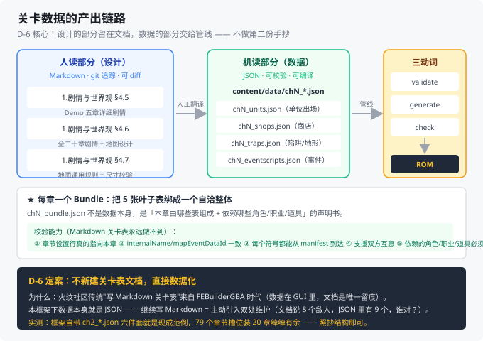

# 关卡表：数据化产出方案（D-6 定案）

> **文档版本**：v1.1
> **编写日期**：2026-09-25
> **文档定位**：回答 **D-6「关卡表怎么产出」**——把 `1.剧情与世界观设定.md` §4.6 的逐章剧情与地图设计，转成能进框架数据管线的 **JSON 关卡数据**。
>
> **与其它文档的分工**：
>
> - **剧情与地图设计意图**见 `1.剧情与世界观设定.md` §4.5/§4.6/§4.7（本文档的上游输入）
> - **所有数字**（敌人数值、BOSS 数值、商店价格）见 `3.游戏数值设定.md`（唯一来源，本文档只引用不定义）
> - **数据结构与 schema 细节**见 `6.方案B内容外置规划.md` §3（同步脚本）与本文档 §3
> - **规划与里程碑**见 `4.项目规划手册.md`（D-6 登记在 §10）
>
> **本文档的所有 schema 与约束均为 2026-09-25 对框架 commit `ec1dc855` 的实测结果。**

---

## 0. 结论先行

**D-6 采用「不进文档体系，直接数据化」方案。**

| # | 结论 | 性质 |
|---|---|---|
| 1 | **不新建 `4.关卡表_Demo五章.md`。** 关卡表不是"文档"，是**数据**——它的最终形态是 `content/data/chN_*.json`，写进 Markdown 只会造成"文档一份、JSON 一份"的双处维护。 | ✅ 核心决策 |
| 2 | **关卡设计的"人读部分"已由 `1.剧情与世界观设定.md` §4.5/§4.6/§4.7 承担**，不需要第二份文档重复。 | ✅ 已就位 |
| 3 | **关卡数据的"机读部分"直接落 `content/data/`**，走框架既有的三动词管线（`validate`/`generate`/`check`）。 | ✅ 符合方案 B |
| 4 | **删掉 5 处死链**，全部改指本文档 + 文档 1 §4.6。**（2026-09-25 已执行完毕，详见 §5）** | ✅ 已清理 |
| 5 | **框架有 79 个章节设置槽位**（实测 `chapter_settings.json` 79 条），装 20 章绰绰有余。**不需要扩展章节 ID 空间。** | 实测 |

> **一句话**：**关卡表不是"写出来的文档"，是"填出来的 JSON"。** 把设计的部分留在文档 1，把数据的部分交给框架管线。

---

## 1. 问题回顾：D-6 是怎么来的

### 1.1 一个从未创建的文档，5 处死链

文档 `4.关卡表_Demo五章.md` 曾被 5 处引用，但**从未创建**（已查证 `git log --all` 全历史无 `docs/4*`）：

| 引用位置 | 原文 |
| --- | --- |
| `2.设计文档.md:217` | 标了 ✅（**误标**，实际不存在） |
| `1.剧情与世界观设定.md` 第 5 行 | 配套文档列表 |
| `3.游戏数值设定.md` | 交叉引用 |
| `5.改版工程手册.md` §8 | 待办清单 |
| `6.方案B内容外置规划.md` | 资产/数据引用 |

2026-09-25 文档 4 号位被 `4.项目规划手册.md` 占用后，这 5 处引用已统一改指文档 4，**但"关卡到底怎么产出"这个问题本身没有回答**——这就是 D-6。

### 1.2 为什么当初会想"写一份关卡表文档"

因为**火纹改版社区的传统做法**是维护一份 Markdown 关卡表（列地图尺寸、敌配置、增援、宝箱）。这个传统来自 **FEBuilderGBA 时代**——那时数据是 GUI 里的二进制，文档是唯一的"设计留痕"。

**但在本框架下这个前提不成立**：

| 传统改版（FEBuilderGBA） | 本项目（FE8 扩展框架） |
| --- | --- |
| 数据在 GUI 里，文档是唯一可读留痕 | **数据本身就是 JSON**，可直接读、可 diff、可 git 追踪 |
| 改数据 = 点 GUI | 改数据 = 改 JSON |
| 文档与数据必然两份 | **文档与数据可以合一**（JSON 即文档） |

→ **继续写 Markdown 关卡表 = 主动引入双处维护。**

---

## 2. 三个方案对比

| 维度 | **方案 A：新建 Markdown 关卡表文档** | **方案 B：并入文档 1（作 §4.8）** | **方案 C：直接数据化 ★推荐** |
| --- | --- | --- | --- |
| **具体做法** | 新建 `docs/4.关卡表_Demo五章.md`（或复号），逐章列表 | 在 `1.剧情与世界观设定.md` 加一节关卡表 | 关卡设计的**人读部分**留文档 1 §4.6；**机读部分**直接写 `content/data/chN_*.json` |
| **维护成本** | **高**——数据一改就要同步两处 | 中——文档体积膨胀，但只有一份 | **低**——单一来源 |
| **与方案 B 的契合度** | 差（文档在 `docs/`，数据在 `content/`，天然分离） | 差（剧情文档混入数据表） | **最好**（数据天然落在 `content/data/`） |
| **可被框架校验** | ❌ 不能（Markdown 不进管线） | ❌ 不能 | **✅ 三动词全过**（`validate`/`generate`/`check`） |
| **悬空引用能否被抓住** | ❌ 不能 | ❌ 不能 | **✅ 能**（引用 `CHARACTER_*`/`CLASS_*` 悬空立即报错，给出 `file:line:column`） |
| **漂移风险** | **高**（文档说 8 个敌人，JSON 里有 9 个） | 高 | **零**（只有 JSON 一处） |
| **可扩展性** | 差（20 章 × 5 表 = 100 张表要手抄） | 差 | **好**（每章一个 bundle，模板化） |
| **对 M1 的依赖** | 无 | 无 | **需要 M1 骨架**（`content/` 目录先就位） |
| **上手难度** | 最低 | 低 | 中（要懂 schema，但框架文档齐全） |

### 2.1 为什么否掉方案 A

**因为它把"设计"和"数据"当成两件事，而在这个框架里它们是同一件事。**

举个具体例子：方案 A 的关卡表会写

```
| 序章 | 雪夜云溪 | 12×8 | 敌方：尸傀 ×3（Lv1）、瘸爷（Lv3 BOSS） |
```

而方案 C 的 JSON 直接就是

```json
{ "charIndex": "CHARACTER_SHANHE_ZOMBIE", "classIndex": "CLASS_REVENANT",
  "allegiance": "FACTION_ID_RED", "level": 1, "xPosition": 3, "yPosition": 2,
  "items": ["ITEM_NONE"] }
```

**后者能被机器校验、能被 git diff、能直接进 ROM。前者只能被眼睛读。** 多写一份后者已经存在的东西，是纯浪费。

### 2.2 为什么否掉方案 B

剧情文档（文档 1）是**叙事设计**，它的读者是"写故事的人"；关卡数据是**结构化配置**，它的读者是"构建系统"。把两者混在一起，会让剧情文档变得既不好读也不好改——**而且仍然解决不了"不能被校验"的问题**。

### 2.3 那"人读的关卡全貌"放哪？

**已经在文档 1 §4.6 里了。** 每章都有：

- 【战场与目标】= 胜利条件的自然语言版
- 【地图设计】= 尺寸、格子数、地形构成百分比、布局意图、复用的瓦片集
- 【BOSS】= BOSS 是谁、可否说得
- 【锚点】= 剧情效果

**这已经是"人读关卡表"该有的全部内容**，只是用叙述而非表格写。**加一个 §4.7 的尺寸校验快查表**，工程侧需要查的数字也齐了。

---

## 3. ★ 落地方案：每章一个 Bundle

整条产出链路如下——**人读部分留在文档 1，机读部分落 `content/data/`，两边靠"人工翻译"这一道工序对接**，中间不经过任何 Markdown 关卡表：



### 3.1 框架的既有 schema（实测）

框架**已经为"每章一套数据"设计好了结构**——第 2 章就是完整范例。**我们不是发明结构，是照抄结构。**

#### 3.1.1 一个章节 = 5 张叶子表 + 1 个 bundle

```
content/data/
├── ch0_units.json          # 单位出场（我方/敌方/NPC）
├── ch0_shops.json          # 商店 / 武器店
├── ch0_traps.json          # 陷阱 / 地形伤害
├── ch0_eventscripts.json   # 事件脚本（对话 / 增援 / 宝箱 / 教学）
├── ch0_eventlists.json     # 事件清单（把上述脚本挂到章节事件里）
└── ch0_bundle.json         # ★ Bundle：声明本章由以上 5 表组成 + 依赖哪些角色/职业/道具
```

> **对照实测**：框架自带 `ch2_units.json` / `ch2_shops.json` / `ch2_traps.json` / `ch2_eventscripts.json` / `ch2_eventlists.json` / `ch2_bundle.json` —— **正是这个结构**。

#### 3.1.2 各表的 schema（实测字段）

| 表 | `$schema` | 关键字段 |
| --- | --- | --- |
| **units** | `fe8.units.v1` | `groups[].symbol`、`units[].{charIndex, classIndex, allegiance, level, xPosition, yPosition, redas[], items[]}` |
| **shops** | `fe8.shops.v1` | `shops[].{symbol, items[]}` |
| **traps** | `fe8.traps.v1` | `traps[].{symbol, entries[]}` |
| **eventscripts** | （见框架 `docs/generated_data.md`） | 事件脚本符号 + 指令序列 |
| **eventlists** | （见框架 `docs/generated_data.md`） | `EventListScr_ChN_*` → `ChNEvents` 清单 |
| **bundle** | `fe8.chapterbundle.v1` | 见下 |

**`fe8.chapterbundle.v1` 的完整结构**（实测自 `scripts/generated_data/chapterbundle/schema.py`）：

```json
{
  "$schema": "fe8.chapterbundle.v1",
  "chapter": {
    "id": "CHAPTER_L_2",              // 章节常量
    "name": "Ch2",                     // 章名
    "chapterSettingsIndex": 2,         // chapter_settings.json 的行号
    "internalName": "L02",             // 内部名（须与 settings 的 internalName 一致）
    "mapEventDataId": 13               // 地图事件数据 ID（须与 settings 一致）
  },
  "manifest": { "table": "eventlists", "symbol": "Ch2Events" },
  "tables": {
    "units":        { "source": "src/data/ch2_units.json",        "symbols": [...] },
    "shops":        { "source": "src/data/ch2_shops.json",        "symbols": [...] },
    "traps":        { "source": "src/data/ch2_traps.json",        "symbols": [...] },
    "eventscripts": { "source": "src/data/ch2_eventscripts.json", "symbols": [...] },
    "eventlists":   { "source": "src/data/ch2_eventlists.json",   "symbols": [...] }
  },
  "supportOwners": { "source": "src/data/supports.json", "required": [...] },
  "externalReferences": [
    { "table": "units", "symbol": "UnitDef_Ch2Enemy_0", "file": "src/events/ch2-eventscript.h" }
  ],
  "dependencies": { "characters": [...], "classes": [...], "items": [...] }
}
```

> **注意 `dependencies` 的语义**：它**只声明引用**，不声明"作者身份"。schema 文档原文：*"it does **not** claim those characters/classes/items are themselves authored by this slice"*。也就是说——**`dependencies` 里列出的角色/职业/道具必须已存在于全剧表里**，且会被交叉校验。

#### 3.1.3 Bundle 的校验能力（这是方案 C 的最大优势）

框架的 bundle schema **不只校验本章内部**，还校验**跨表一致性**：

| 校验项 | 作用 |
| --- | --- |
| `chapterSettingsIndex` ↔ `chapter_settings.json` | 选中的章节行**真的指向**本 bundle 的事件清单 |
| `internalName` 一致 | 防止复制粘贴后忘记改名 |
| `mapEventDataId` 一致 | 防止地图事件挂错 |
| `tables[].symbols` 可达性 | 每个表拥有的符号**都能从 manifest 到达**（防"数据写了但没挂上"） |
| `supportOwners` 互惠 | 支援关系的**双方都声明** |
| `dependencies` 存在性 | 引用的 `CHARACTER_*`/`CLASS_*`/`ITEM_*` **必须真实存在**（防悬空引用） |
| `externalReferences` | 手写 C 文件里的引用也要登记在册 |

> **这套校验正好覆盖了文档 8 §11.3 列的所有"静默失败"陷阱**（"数据写了但游戏里没有"）。这正是 Markdown 关卡表永远做不到的。

### 3.2 章节映射表（20 章 + 2 外传 → 框架槽位）

**实测**：`chapter_settings.json` 有 **79 条**章节设置槽位。20 章 + 2 外传占 22 条，**余量充足**。

| 《山河烬》章 | 建议内部名 | 说明 |
| --- | --- | --- |
| 序章 | `ShanheP`（或用 `L00`） | 教学关 |
| 第 1~20 章 | `Shanhe01` ~ `Shanhe20` | **一律用自定义内部名**，不复用原版 `L01`~`L20` |
| 外传 1 | `ShanheX1` | 白鹤观旧事 |
| 外传 2 | `ShanheX2` | 幽都判官 |

> **为什么不复用原版内部名**：因为要**明确区分"被我们改过的章节"与"原版未动的章节"**。用 `ShanheNN` 前缀，`git diff` 一眼能看出我们动过哪些章。这也符合方案 B 的铁律"框架里不出现手改"。

### 3.3 与前序决策的对接

| 上游决策 | 对关卡表的约束 |
| --- | --- |
| **D-1（22 角色槽位）** | `chN_units.json` 的 `charIndex` 用**原创角色符号**，但 `classIndex` 指向**原版职业**（Demo 期做法 A）——见文档 9 §5 |
| **D-2（神器特效）** | 神器的获得在 `chN_eventscripts.json` 里挂事件（第 3 章得破军、第 4 章得落雁） |
| **D-3（美术分期）** | 关卡表的 `map` 字段（`obj1Id`/`paletteId`/`tileConfigId`）**复用原版瓦片集**；地图变更（6/10/16 章）单列 |
| **3.游戏数值设定.md** | 所有敌人数值、BOSS 数值、商店价格**引用不定义**（数值文档是唯一来源） |

---

## 4. 产出节奏：随章做，不提前批量

**关键纪律：关卡 JSON 与章节制作同步产出，不做"先把 20 章都写好再开发"的事。**

| 阶段 | 产出 | 依据 |
| --- | --- | --- |
| **M2** | 虞聪三表落位（`characters.json`/`classes.json`/`items.json`），**不涉及关卡** | 文档 4 §M2 |
| **M4** | **序章 ~ 第 4 章的 6 个 bundle 全套**（含 Demo 五章 + 序章） | 文档 1 §4.5 + 本文档 §3.1 |
| **M6** | 第 5~20 章 + 2 外传，逐章产出 | 文档 1 §4.6 |

> **为什么随章做**：因为**关卡设计会在制作中迭代**。提前把 20 章 JSON 全写好，等制作到第 12 章时早就过时了。文档 1 §4.6 提供"设计意图"作为足够稳定的上游，JSON 按需产出。

### 4.1 每章的 JSON 产出清单（模板）

制作一章时，需要产出 **6 个文件**：

| # | 文件 | 内容 | 上游依据 |
| --- | --- | --- | --- |
| 1 | `chN_units.json` | 我方出场 + 敌方配置 + NPC | 文档 1 §4.6【战场与目标】【BOSS】 |
| 2 | `chN_shops.json` | 武器店/道具店 | 文档 1 §4.6 + 数值文档 |
| 3 | `chN_traps.json` | 陷阱、地形伤害（第 9 章灰潮、第 6 章火场） | 文档 1 §4.6【地图设计】 |
| 4 | `chN_eventscripts.json` | 开场对话、中场事件、BOSS 对话、战后、宝箱 | 文档 1 §4.6【开场】【中场事件】【战后】 |
| 5 | `chN_eventlists.json` | 把上述脚本挂到回合/条件触发 | 同上 |
| 6 | `chN_bundle.json` | 声明本章组成 + 依赖 | 本文档 §3.1.2 |

**外加两项不在 JSON 里、但同章必须产出的**：

| # | 产出 | 说明 |
| --- | --- | --- |
| 7 | `content/assets/tmx/ShanheNN.tmx` | 章节地图（Tiled 绘制） |
| 8 | `content/src/events/shanhe_chN_events.c` | 事件脚本的 C 实现（**章节制作唯一需要写代码处**，见文档 6 §2.2） |

> **第 4 项与第 8 项的关系**：`chN_eventscripts.json` 声明"有哪些事件脚本"，`shanhe_chN_events.c` 是这些脚本的**实现**。这是框架的设计——数据声明 + C 实现分离。

---

## 5. 死链清理（已执行）

D-6 定案后，`4.关卡表_Demo五章.md` 的引用须统一改写。**2026-09-25 实检结果**：全仓共 5 处提及，其中 **3 处是活跃引用**（须改），2 处是历史叙述（保留）：

| # | 位置 | 性质 | 处理 |
| --- | --- | --- | --- |
| 1 | `2.设计文档.md:194` | 活跃引用 | ✅ 已改为指向文档 1 §4.6 + 本文档 |
| 2 | `2.设计文档.md:87` | 活跃引用 | ✅ 已标注"见 D-6 定案" |
| 3 | `4.项目规划手册.md:163`（§2.4） | 活跃引用 | ✅ 已关闭，指针 → 本文档 |
| 4 | `4.项目规划手册.md:478`（编号说明） | 历史叙述 | 保留并补注"D-6 已定案" |
| 5 | `1.剧情与世界观设定.md` §9 版本记录 | 历史叙述 | 保留并补注本文档 |

> **补充**：`3.游戏数值设定.md`、`5.改版工程手册.md`、`6.方案B内容外置规划.md` 在 2026-09-25 改指文档 4 时已同步消解，无需二次改动。文档 6 §2.2 另新增第 4 项登记 D-6。

**终检命令**（应无输出）：

```bash
grep -rn "4\.关卡表_Demo五章" docs/ | grep -v "10.关卡表数据化方案" | grep -v "1.剧情与世界观设定.md"
```

---

## 6. 与框架数据管线的关系

### 6.1 三动词（每改一次关卡数据都要跑）

```bash
make generated-data-validate    # 校验：schema / 引用 / 唯一性
make generated-data-generate    # 生成：JSON → C89
make generated-data-check       # 门禁：生成物与源是否漂移
```

### 6.2 Bundle 专属校验

```bash
make generated-data-bundle-validate   # 单章 bundle 内部一致性
make generated-data-bundle-check      # 漂移检测
```

### 6.3 常见失败模式（对照文档 8 §11.3）

| 症状 | 真实原因 |
| --- | --- |
| 单位数据写了，游戏里没有 | `chN_bundle.json` 的 `tables[].symbols` 没列这个符号 |
| bundle 校验过，但章节选不到 | `chapterSettingsIndex` 指错行 |
| 事件脚本存在但没触发 | `chN_eventlists.json` 没把它挂进清单 |
| `dependencies` 报错 | 引用了不存在的 `CHARACTER_*`（拼写错或还没入表） |
| 支援不生效 | `supportOwners` 只声明了一方（须**互惠**） |

---

## 7. 对 M4 的影响

**D-6 定案直接解除了 M4 的一个阻塞项。**

| 项 | 定案前 | 定案后 |
| --- | --- | --- |
| M4 备注 | 「关卡表缺失问题必须在此前解决」（§2.4 第 6 项） | ✅ **已解决**：设计在文档 1 §4.6，数据按本文档 §3 产出 |
| M4 交付物 | ① 5 章关卡全套 JSON（含事件脚本） | ✅ 明确为：**6 个 bundle × 6 个 JSON 文件 + 5 张 TMX + 5 个事件 C 文件** |
| 阻塞项 #6 | 「关卡表文档缺失」 | ✅ 关闭 |

---

## 附录 A：事实来源

所有 schema 与约束基于对框架 commit `ec1dc855` 的实测：

| 结论 | 证据位置 |
| --- | --- |
| 章节数据 = 5 叶子表 + 1 bundle | `src/data/ch2_*.json`（6 个文件） |
| `fe8.chapterbundle.v1` 结构 | `scripts/generated_data/chapterbundle/schema.py` 文档串 |
| bundle 的 7 项交叉校验 | 同上（schema 文档串逐项列出） |
| `dependencies` 是"引用声明"非"作者声明" | 同上（"does **not** claim... are themselves authored"） |
| `fe8.units.v1` 字段 | `src/data/ch2_units.json` |
| `fe8.shops.v1` 字段 | `src/data/ch2_shops.json` |
| `fe8.traps.v1` 字段 | `src/data/ch2_traps.json` |
| 三动词 make 目标 | `generated_data.mk:37/42/50/59` |
| bundle 专属目标 | `generated_data.mk:77/80` |
| **79 个章节设置槽位** | `src/data/chapter_settings.json`（实测 79 条） |
| `chapter_settings.json` 的 map 字段 | 同上（`obj1Id`/`obj2Id`/`paletteId`/`tileConfigId`/`mainLayerId`/`changeLayerId`） |
| 悬空引用报错含 `file:line:column` | 文档 2 §6 数据驱动层 |
| 事件脚本实现写在 `src/events/*.c` | 文档 6 §2.2 |

## 附录 B：版本记录

| 版本 | 日期 | 变更 |
| --- | --- | --- |
| v1.1 | 2026-09-25 | 收尾执行：① §3 开头插入 `images/d6-leveldata-pipeline.svg` 产出链路图；② §5 改写为「已执行」的实检结果表（3 处活跃引用已改 + 2 处历史叙述保留）+ 终检命令；③ 同步文档 2/4/6 的交叉引用（文档 2 头部配套列表与 §12 状态行、文档 4 §2.4/§10/附录 A/版本记录 v1.4、文档 6 §2.2 新增第 4 项 / v1.6）；④ 文档 1 §9 版本记录补注本文档 |
| v1.0 | 2026-09-25 | 首版。D-6 定案：「不进文档体系，直接数据化」；含三方案对比、框架 bundle schema 完整测绘、章节映射表、产出节奏与模板清单、死链清理、管线关系、对 M4 的影响 |
