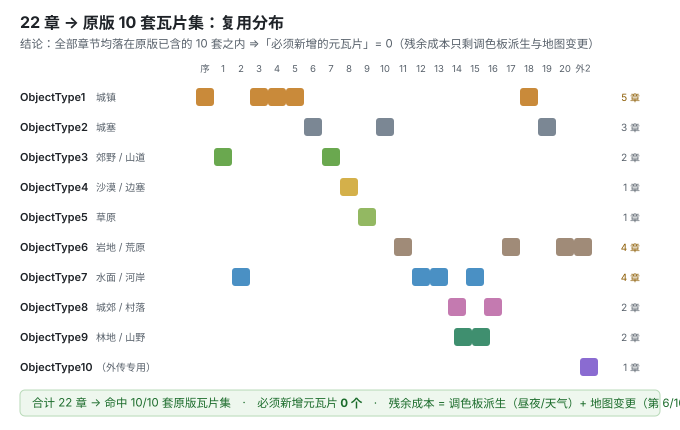

# 12. 地图瓦片集攻坚结论（M3 交付物⑤）

> **文档版本**：v1.0
> **编写日期**：2026-09-25
> **对应里程碑**：M3 · 交付物 ⑤（`docs/4`），关闭风险 **R-16**
> **关联**：`8.原创资产体系与框架资产对照.md` §4（地图三套体系）/ §14（美术预算）、`10.关卡表数据化方案.md` §3（章节 Bundle）、`1.剧情与世界观设定.md` §4.5/§4.6（每章【地图设计】）

---

## 0. 结论先行

> **原以为这是"20 章地图的前置壁垒"（R-16）——实测结论是：壁垒不存在。**

| 问题 | 答案 |
|---|---|
| 需要自产地图瓦片集吗？ | **不需要。** 全书 **22 章**恰好用完 **原版已有的 10 套**瓦片集，一套不多一套不少 |
| 「必须新增的元瓦片清单」 | **空（0 个）** |
| 残余成本是什么？ | ① **调色板派生**（昼夜/天气/主题色调，零新增美术）② **地图变更**（少数几章需手写事件数据，Manual-only） |
| 风险 R-16 状态 | **🟠 → 🟢 降级**（"阻塞 20 章"不成立；残余项已收敛为可预测的常规工作） |



---

## 1. 复用清单（22 章 → 瓦片集）

> 来源：`1.剧情与世界观设定.md` §4.5/§4.6 每章【地图设计】的「瓦片集复用」栏（设计期即已指定），本章将其汇总核对。

| 章 | 标题 | 尺寸 | 瓦片集 | 调色板 |
|---|---|---|---|---|
| 序章 | 雪夜云溪（教学关） | 12×8 = 96 格 | `ObjectType1` 城镇 | 雪夜冷调（派生） |
| 1 | 故园烟尘 | 16×12 = 192 | `ObjectType3` 郊野/山道 | 日间山地 |
| 2 | 山道问路 | 14×14 = 196 | `ObjectType1` 城镇 | 山地调 |
| 3 | 渡口争锋 | 18×12 = 216 | `ObjectType7` 水面/河岸 | 清河调 |
| 4 | 洛邑风云（Demo 终点） | 20×14 = 280 | `ObjectType1` 城镇 | 夜间冷调（派生） |
| 5 | 天枢之城 | 18×13 = 234 | `ObjectType1` 城镇 | `MapPalette1` 变暗夜景 |
| 6 | 宫闱之变 | 20×12 = 240 | `ObjectType2` 城塞 | 暖色调 |
| 7 | 南尘北望 | 16×14 = 224 | `ObjectType3` 郊野 | `MapPalette3` |
| 8 | 风沙渡 | 17×13 = 221 | `ObjectType4` 沙漠/边塞 | 土黄调 |
| 9 | 胡笳与雪 | 18×14 = 252 | `ObjectType5` 草原 | 灰白（派生） |
| 10 | 玄甲旧影 | 22×12 = 264 | `ObjectType2` 城塞 | 寒色调 |
| 11 | 灰潮之源 | 20×14 = 280 | `ObjectType6` 岩地/荒原 | 灰褐调 |
| 12 | 重聚与誓约 | 19×13 = 247 | `ObjectType7` 水面/河岸 | 青绿调 |
| 13 | 梁地行 | 21×12 = 252 | `ObjectType8` 城郊/村落 **+** `ObjectType7` | 青绿调 |
| 14 | 白鹿鸣野 | 17×14 = 238 | `ObjectType9` 林地/山野 | `MapPalette10` |
| 15 | 云梦鹤唳 | 19×14 = 266 | `ObjectType7` **+** `ObjectType9` | — |
| 16 | 饕餮之腹 | 24×12 = 288 | `ObjectType8` 城郊 | 暗红调 |
| 17 | 九鼎重铸 | 18×14 = 252 | `ObjectType6` 岩地 | 暖色调（火光） |
| 18 | 天枢光复 | 23×12 = 276 | `ObjectType1` **+** `ObjectType2` | 金红调（帝都） |
| 19 | 归墟之门 | 20×14 = 280 | `ObjectType6` 岩地 | 深紫（派生） |
| 20 | 山河长明（终章） | 22×13 = 286 | `ObjectType6` 岩地 | 深紫/金双色（派生） |
| 外传 2 | 幽都判官 | 16×13 = 208 | `ObjectType10` | 冷青调（派生） |

**使用频次**：`ObjectType1`×5、`ObjectType6`×4、`ObjectType7`×4、`ObjectType2`×3、`ObjectType3`/`ObjectType8`/`ObjectType9`×2、`ObjectType4`/`ObjectType5`/`ObjectType10`×1 ⇒ **10 套全覆盖，无一套闲置**。

> **尺寸红线核对**：全部 ≤ 288 格，远低于框架的 **1023 格上限**（`docs/8` §4.2：地图缓冲 2048 字节 = 2 字节头 + 每格 2 字节）✅

---

## 2. 机制：换瓦片集为什么"零代码"

框架把每章的地图资源指向完全放在**章节数据结构**里（`src/data/data_8B363C.c` 的 `gChapterDataAssetTable` 是索引表，真正的字段在每章的 `map` 里）：

```c
src/chapterdata.c:17   gChapterDataAssetTable[ch->map.mainLayerId]      // 主地图布局 .mar
src/chapterdata.c:25   gChapterDataAssetTable[ch->map.changeLayerId]    // 地图变更层
src/chapterdata.c:32   gChapterDataAssetTable[ch->mapEventDataId]       // 地图事件数据
src/bmio.c:289         gChapterDataAssetTable[ch->map.objAnimId]        // ObjectType 瓦片集 ★
src/bmio.c:292         gChapterDataAssetTable[ch->map.paletteAnimId]    // MapPalette ★
src/bmmap.c:241        gChapterDataAssetTable[ch->map.tileConfigId]     // TileConfiguration ★
```

**⇒ 换一套瓦片集 = 改 `chapter_settings.json` 里该章 `map.objAnimId / paletteAnimId / tileConfigId` 三个整数**，属 **L0 数据层，零 C 代码**。

**资源现状（实测）**：

| 资产 | 数量 | 路径 |
|---|---|---|
| `ObjectType{1..10}.png` | **10** | `graphics/map/`（每张 256 宽 = 16×16 元瓦片，含 16×10/16×12 变体） |
| `MapPalette{1..19}.pal` | **19** | `graphics/map/` |
| `TileConfiguration{1..10}.bin` | **10** | `graphics/map/`（每个固定 9,216 字节 = 4,608 个 u16 条目） |
| `.mar` 地图布局 | **68** | `graphics/map/` |
| 地图 PNG | **89** | `graphics/map/` |

**复用杠杆**：**原版 10 套瓦片集撑起 68 张地图 ≈ 1 套 : 6~7 张**。本书 22 章按 1 套 : 2.2 章 使用，**比原版更宽裕**。

---

## 3. 「必须新增的元瓦片清单」

> ### **空。0 个。**

**理由**：22 章的主题（城镇/城塞/郊野/沙漠/草原/岩地/水面/城郊/林地）**全部命中原版 10 套瓦片集的主题覆盖**；差异全部通过**调色板派生**表达（昼夜、天气、主题色调）。

**⇒ 直接后果**：
- **不必**学习/搭建瓦片集制作链路（原本被认为是最贵的一次性成本）
- **不必**触碰 `graphics_file_rules.mk` 里的瓦片集规则
- 美术预算可全部转向 **立绘（22 套）** 与 **章节地图布局（20 章）**——`docs/8` §14 的"分期摊销"方案因此更宽裕

> ⚠️ **唯一的例外机制**：**地图变更（map changes）**——地形在章节进行中改变（如第 6 章火势蔓延、第 10 章破门、第 16 章饕餮吞噬）。这**不是瓦片集问题**，而是 `src/data/map/change/*.json` + 事件数据，属 **Manual-only**（`docs/8` §4.3），已单列为额外预算项。

---

## 4. 残余工作与风险（已收敛）

| # | 项 | 涉及章节 | 性质 | 成本 |
|---|---|---|---|---|
| 1 | **调色板派生** | 序章、4、5、9、17、19、20、外传2 等 | 改 `.pal`（16 色） | 低，零新增美术 |
| 2 | **地图变更**（地形动态改变） | 6（火势）、10（破门）、16（吞噬）、20 | 手写 `map/change/*.json` + 事件数据 | 中，**Manual-only，需预算** |
| 3 | 双瓦片集混用 | 13、15、18 | `objAnimId` 单值 ⇒ 需确认是否支持混用 | **待验证** |

> **第 3 项是本章唯一的未知数**：设计里第 13/15/18 章写了"两套瓦片集混合"。但 `map.objAnimId` 只有**一个**索引 ⇒ 单章只能指向一套瓦片集。**待验证**：是否要退化为"选主套 + 用调色板近似"，或确认框架另有机制。

---

## 5. 实机验证（M3 ⑤ 的验收动作）

**验收标准（`docs/4` M3）**：*"第 1 章地图能用自选/自建瓦片集在 mGBA 正确显示，且地形通行性正确"*。

**验证方案（零代码，最小改动）**：

1. 取 `content/data/` 增加章节覆盖补丁：把**序章**的 `map.objAnimId / paletteAnimId / tileConfigId` 指向**另一套**原版瓦片集（例如从 `ObjectType1` 换成 `ObjectType3`）
2. `bash tools/shanhe-build.sh` → 导出 ROM
3. mGBA 实机：进序章，确认
   - ✅ 地图**正确显示**（图形不花、不串色）
   - ✅ **地形通行性正确**（雪地拖慢、屋舍阻挡 —— 即 `TileConfiguration` 与瓦片集配套）
4. 通过后即证明"**换瓦片集 = 改 3 个整数**"这条链路可用 ⇒ M3 ⑤ 验收通过

> ⚠️ 注意：`chapter_settings.json` 是 **317KB 的大表**，且属"手写 round-trip"类表 —— 回填前须确认它的 hand source 与回填边界（见 `docs/6` §3.4a / 3a' 步的"partial-file 不回填"边界）。**这是本验证的前置技术点。**

---

## 附录 A：事实来源

| 结论 | 证据 |
|---|---|
| 10 套瓦片集 / 19 调色板 / 10 TileConfiguration | `find graphics/map -name 'ObjectType*' -o -name 'MapPalette*' -o -name 'TileConfiguration*'` 实测 |
| 章节地图资源由 `map.*` 索引决定 | `src/chapterdata.c:17/25/32`、`src/bmio.c:289/292`、`src/bmmap.c:241` |
| 章节表位于 `src/data/chapter_settings.json` | 实测：**79 条**记录，每条含 `map{obj1Id,obj2Id,paletteId,tileConfigId,mainLayerId,objAnimId,paletteAnimId,changeLayerId}` |
| 每章瓦片集指定 | `1.剧情与世界观设定.md` §4.5/§4.6 各章【地图设计】的「瓦片集复用」栏（22 章已提取） |
| 尺寸红线 1023 格 | `8.原创资产体系与框架资产对照.md` §4.2 |
| 地图变更 Manual-only | `8.原创资产体系与框架资产对照.md` §4.3 |

## 附录 B：版本记录

| 版本 | 日期 | 变更 |
|---|---|---|
| v1.0 | 2026-09-25 | 首版。M3 交付物⑤：22 章→瓦片集复用清单（10/10 全覆盖）、「必须新增元瓦片 = 0」结论、残余成本收敛、实机验证方案；R-16 由 🟠 降为 🟢 |
