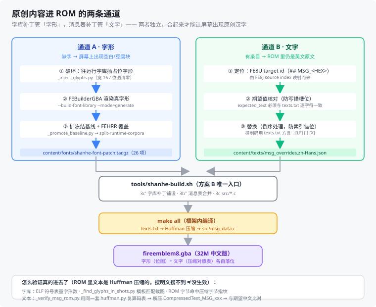

# 《山河烬》改版工程手册 v0.41

> 面向：未来的自己（一个人开发，Windows 主机 + WSL2 Ubuntu）
> 日期：2026-09-28
> 定位：**操作手册**——环境怎么搭、命令怎么敲、内容怎么改、补丁怎么发。系统意图看 `2.设计文档.md`，数字看 `3.游戏数值设定.md`。
> 状态：**v0.41，字库补字：工具链在 WSL 重建完成 + 修掉我自己引入的 catalog 回归 + 定位上游 ja 闸门（新增 §5.18.11）**。目标 = 补 6 个缺字（圭/州/曰/煞/熙/疫）好让序章文案落盘。**三件事**：① **工具链缺失并已重建** —— 文档管线的第②步要 `FEBuilderGBA.CLI`，而本机上 `~/.dotnet` 里**没有 dotnet**、`~/FEBuilderGBA` **不存在** ⇒ 按官方途径重装：`dotnet-install.sh --channel 10.0` 装到 `~/.dotnet`（实得 **10.0.401**）+ `git clone --depth 1 laqieer/FEBuilderGBA` + `dotnet build FEBuilderGBA.CLI/FEBuilderGBA.CLI.csproj -c Release`（**0 warning / 0 error**，产出 `bin/Release/net10.0/FEBuilderGBA.CLI.dll` —— 与原脚本期望路径**逐字一致**）⇒ **渲染能力恢复**。② **★★ 修掉我上一轮自己引入的回归** —— 上轮那 5 个 catalog 补丁是 **JSON 重序列化**（`json.load` → 加键 → `json.dumps`），而上游 catalog **有 8 个键各出现两次**（文本层 153 行键 vs JSON 有效 145 键）⇒ 重序列化把它们**合并成一条并让后值生效**，于是除了我们的 3 条还**悄悄改了上游取值**（实测 `autoplay.charge.help` 被改）。已改为**纯文本插入**（只加行，`+4/-1`）并加自检（插入后 JSON 仍可解析 **且原有键值一字不变**）⇒ 这是"中间层重写上游文件"的又一起，与「`grep -m1` 只取第一个目标」「合并层部分放行字段」同族。③ **卡点定位到上游**：管线第 1 步 `generate-inventory` 报 `error: ja/character_name_40/0x0212: canonical width 46px exceeds 40px without a display alias`。**已排除"我们的 catalog 补丁导致"**（改成增量式后依旧），根因在 `texts/locales/fixed_width_display_aliases.json` —— 它的 `ja.character_name_40` **只列了 `0x0266` 一条 alias，没有 `0x0212`** ⇒ 上游侧 ja alias 数据与 ja 宽度不一致。★ **该步不属于 `shanhe-build.sh`**（构建全程不调它）⇒ **不影响 ROM 构建**，只挡补字管线的第 1 步；且 **ja 不是本项目启用的语言**（`[locales] enabled = en,zh-Hans`）。**顺带把字库工装参数化+加固**：`_inject_glyphs.py` / `_promote_baseline.py` 认 `SHANHE_FONT_CHARS`；`_run_font_pipeline.sh` 认 chars/dotnet-sdk/commit 并**新增第 13 步自动重打包 `content/fonts/shanhe-font-patch.tar.gz`**（原先手做，易漏）；`_promote_baseline.py` 的自检从"打印恒为最后一个 style"改为**逐 style 指名 + 缺失即失败**。**本轮仓库最终状态：文案已撤回（未落盘）、构建全绿**：**26 补丁 / 24 目标**、检查 ⑥ **20/0**、检查 ⑦ **10/0**、反查通过、产物 SHA1 **`08e2af4c`**、**L0 双场景全绿**。补字的**下一步已勘明**（见 §5.18.11 末）。详见 **§5.18.11**。
> 状态：**v0.40，序章文案打通"两条通道 + 五道闸门"，并首次量化出字库缺口（新增 §5.18.10）**。目标是把序章旁白/战后从"暂用上游 id"换成山河烬自己的文案。**文案本身已写好并成功过构建**，但最后一关卡在**字库缺字**，故本轮**未落盘**，只把整条链的约束与草稿落档。**一路撞出五道闸门，每一道都拦下了真问题**：① **通道 A 有审计闸门** —— 选中的 source index 若已被框架审计层 `texts/locales/indexed_audit_overrides.json`（**178 KB、git 跟踪**）覆盖，构建硬失败 `duplicate override IDs for fe8cn_source: 0x08CD`（该层用 `expected_text_sha256`，与 `indexed_overrides` 的 `expected_text` 不是同一套 schema ⇒ 只能避开）。② **两套坐标，数值区间还高度重合** —— 事件脚本 `Text(0x90D)` 是 **FE8U target id**，`indexed.txt` 的 `#0x08CD` 是 **FE8J source index**；唯一可信换算是查 `texts/locales/mapping/fe8u_target_map.json`（实测 `0x090D↔0x08CD`、`0x0918↔0x08D8`，**不是同数字对应**）。③ **结构保持校验** —— `preserve_structure` 默认 true ⇒ 替换文必须与原段控制码/换行/占位序列**完全同构**；我们改成"无头像旁白"必然不同构，须显式声明 `preserve_structure:false` **并**把 `expected_text` 换成 `expected_text_sha256`（框架规则：两者互斥，"audited control changes" 才允许）。④ **我们自己的合并层在"部分放行"** —— `shanhe-build.sh` 3b' 的合并脚本原先只放行 4 个字段，把 `expected_text_sha256`/`preserve_structure` **静默丢弃**，报错却是 `missing fields: ['expected_text']`（原因藏在别处）；**这与「`grep -m1` 只取第一个补丁目标」是同一类病**（中间层窄于上游），已改为放行全部字段 + **未知字段硬拦**。⑤ **字库缺字** —— 新文案 76 个字符里，运行时字库（并集 2444 码点）缺 **6 个**：**圭 U+572D / 州 U+5DDE / 曰 U+66F0 / 煞 U+715E / 熙 U+7199 / 疫 U+75AB**（大熙 / 豫州 / 史官记曰 / 煞疫 / 玉圭 —— **全是设定核心词，绕不开**；硬门禁 4「无豆腐块」也不允许绕）⇒ 必须走**字库补字管线**（§3.7 / §3.4f），**这是独立的一刀**。**好消息**：该管线**可程序化** —— 框架自带 `scripts/fonttools/cjk/`，WSL 里 PIL 10.2.0 可用，机器上有 `/mnt/c/Windows/Fonts/simhei.ttf`；且 `glyphs.2bpp` 格式已实测（**16×16 / 2bpp / 64 B 字形**，配 `codepoints.u32le` 4 B/条、`widths.u8` 1 B/条）。**另修掉一个潜伏缺陷**：上游 7 个扩展文本目录（`catalog.<locale>.json`）的 key 集**本应一致**（各 145 条），而我们早先的 catalog 补丁只往 en/zh-Hans 加了 3 条 ⇒ ja/de/es/fr/it 各缺 3 条，触发台账 `KeyError: 'shanhe.item.zhaoye.name'`；**此前一直没炸，是因为 3b' 是内容感知的（"内容未变就跳过"）⇒ 台账那步根本没跑**。已补 **5 个单目标补丁**（ja/de/es/fr/it，非目标语言用我们自己的 en 文本占位，头注释写明）。**另修一处显示调用错误**：旁白一版写成 `BROWNBOXTEXT`（棕色小框，装不下多页长文本）⇒ 改回上游同款 `Text_BG(BG_PLAIN_2, …)`（因此 L0 `shanhe-prologue` 的 framebuffer 指纹已按"有意显示修正"刷新，**探针全过**）。**构建全绿**：**26 补丁 / 24 目标**、检查 ⑥ **20/0**、检查 ⑦ **10/0**、反查通过、ROM `e2f4eeed` → **`08e2af4c`**、**L0 双场景全绿**（`shanhe-boot` 4 检查点 / `shanhe-prologue` 刷新后 4 检查点）。文案原文暂存于 **§5.18.10**（补字后可直接落回）。
> 状态：**v0.39，序章接线：把「数据」接成「可玩」（新增 §5.18.9 / 2 条框架补丁 / 自家事件脚本 TU）+ 踩到补丁机制的「单目标假设」**。承接 v0.38 的序章单位表 —— 那时实测「四个 `UnitDef_ShanheP_*` 组符号**全仓无人引用**」⇒ 数据在 ROM 里但上不了战场。本轮把它接起来，**一条链四个环节、只有一处是代码**：① 单位数据（章节表通道，不碰框架）；② **事件脚本实现 = 自家 TU `content/src/shanhe_p_events.c`**（`$(wildcard src/*.c)` 自动收编，**无需补丁**）；③ **事件列表 + 章节事件组**（框架补丁 `shanhe-prologue-events.patch`：新增 Turn/Misc/Tutorial 三张表 + 把 `ChapterEventGroup PrologueEvents` 的 **7 处字段**改指我们的）；④ **跨 TU 符号声明**（框架补丁 `shanhe-prologue-eventcall.patch`：`include/eventcall.h` 是本框架的声明中心）。**接线判据两条**：`PrologueEvents` 被 `src/data/data_8B363C.c` 的 `gChapterDataAssetTable` 按 `chapter_settings.json` 的 **`mapEventDataId`** 索引（`src/chapterdata.c:32`）⇒ 改它的字段就等于改序章行为，**不必动章节设置表**；而**胜利条件**走原生事件列表 —— `DefeatBoss(scr)` = `AFEV(EVFLAG_WIN, scr, EVFLAG_DEFEAT_BOSS)`，该旗标由 `src/data_battlequotes.c` 的 `gDefeatTalkList` 里 `{.pid = CHARACTER_ONEILL, .chapter = CHAPTER_L_PROLOGUE}` 决定 ⇒ 山河烬 BOSS「瘸爷」**沿用了 `CHARACTER_ONEILL`**，击杀它**天然触发胜利**，`chapter_objectives.json`（现为空）**不用接** —— 这是"复用被顶替者符号名"约定的**免费红利**。⚠️ **`.tutorialEvents` 不能给 `NULL` 指针**（消费点 `src/eventinfo.c:1279` 直接 `for (; tutorialEvents[i] != 0; i++)` 解引用）⇒ 必须给「只有 NULL 哨兵」的数组；本竖切**先关掉教学链**（上游 15 个教学脚本按 `CHARACTER_SETH`/`CHARACTER_EIRIKA` 写死，换单位会错位）。**★★ 两轮才做对，两个坑都值得记**：① **补丁机制假设「一个补丁 = 一个目标文件」** —— 我最初写成一个改两个文件的补丁，构建**全绿**（编译/⑥20-0/⑦10-0 都过）但反查报 `⚠ 预期外改动：src/events/prologue-eventinfo.h`；根因是脚本在 **5 处**用 `grep -m1 '^+++ b/'` 取目标（`-m1` 只取第一个）⇒ 多目标补丁**不报错**，只是**静默漏掉第二个目标**（写前快照少记 / `RESTORE=1` 不还原 / 反查误报"手滑改了框架"）三处同时失效。处置 = **拆成两个单目标补丁** + **加硬拦**（`grep -c '^+++ b/' != 1` ⇒ `die`，把静默失败变响亮失败；顺带踩到 `grep -c` 在 0 匹配时**也打印 0**，`|| echo 0` 会让整数比较报错）。② **手写 unified diff 的 hunk 头不可靠** —— 我把插入块行数数错，`patch` 报 `malformed` / `fuzz 1`（而本项目反查会把"带 fuzz"列为告警，不是"能应用就行"）；改走**生成式补丁**（`git show HEAD:<f>` 取 pristine → 程序化编辑 → `diff -ur a b` → 规范化为 `diff --git` + 剥时间戳）后，`patch -p1 -N -F0 --dry-run` 与 `git apply --check` **双通过**。⚠️ 反面教训：中途用脚本"读-改-写"重建补丁文件把它**写坏**（`patch unexpectedly ends in middle of line`）—— 补丁是逐字节敏感的文本，**只做定点替换**。**产物侧证据**：`nm` 在 ELF 读到 `EventScr_ShanheP_BeginningScene/EndingScene`、`EventListScr_ShanheP_Turn/Misc/Tutorial`、4 个 `UnitDef_ShanheP_*` + 7 个 REDA；构建全绿（**20 补丁 / 18 目标**、⑥ 20/0、⑦ 10/0、反查通过），ROM SHA1 `2ba1730e` → **`e2f4eeed`**。详见 **§5.18.9**，接线落点见**文档 10 §4.2**。
> 状态：**v0.38，章节表通道的首个真实例落地（序章单位表）+ 三条集成/schema 边界（新增 §5.18.7 / §5.18.8）**。3a'' 通道建成后**空跑**是不算数的，于是把序章单位表真做出来：`content/data/shanhe_p_units.json`（四组 `UnitDef_ShanheP_{Ally,Npc,Enemy,Boss}`：虞聪 / 虞旻+云虚 / 尸傀×3 / 瘸爷）→ 登记 `B3_NEW_DATA`+`B3_INSTANCES` → 生成 `src/shanhe_p_udefs.c`（框架 `$(wildcard src/*.c)` 自动收编）。**一跑就撞出三条"框架接口比想象窄"的边界，三条都只能靠真跑才发现**：① **`units.items[]` 只认 `include/constants/items.h` 的符号**（`units/schema.py:65` 写死该头 + `validate_reference` 的候选集来自它），而扩展道具符号在 `items_expansion.h` 且 `items.h` **不 include** 它 ⇒ **扩展道具不能进 `units` 表，必须经事件脚本发放**（既有 `shanhe-prologue-zhaoye.patch` 就是这条路：给事件脚本补 include + `SVAL/GIVEITEMTO`）；不改框架的理由是把 `items_expansion.h` 塞进 `items.h` 是**全库头文件的爆炸半径**。② **`ai` 在 JSON 侧只接受整数**（`units/schema.py:245` `as_int()`）—— 写 `"AttackInRangeAI"` 直接报 `expected an integer, found str`，而**手写 C 侧的 round-trip 解析器认宏名**（`parser.py::_expand_ai_tokens` 从 `AI_Helpers.h` 读表展开）⇒ **有意的不对称且可往返**：C 用宏、JSON 用整数（`AttackInRangeAI`=`0x00,0x03`⇒`[0,3,0,0]`、`GuardTileAI`=`0x03,0x03`⇒`[3,3,0,0]`）。★ 报错**不提示**"JSON 侧不支持宏"。③ **3a'' 新增的 `src/shanhe_*.c` 会被 3c 的集合比对误判成"每轮都在变"** ⇒ 不修的表现是**每轮都 `touch Makefile` ⇒ 每轮全量重编**（约 +6 分钟/次，**不报错、只是静静地一直慢**）；已在 3c 处把实例目标并进期望集合（且只并入框架侧确实存在的，免 `CONTENT_TABLES=0` 时反向误判）。另**定命名规则**：`shanhe_<chapter>_units.json → src/shanhe_<chapter>_udefs.c`（章节名取自文档 10 §3.2 的内部名，全小写加下划线；不沿用 `ch0_units.json` 是因为 C 落点必须带 `shanhe_` 前缀才与框架文件区分）。★★ **必须记住**：本通道产出的是**数据、不是接线** —— 组符号要由**事件脚本**（`LOAD1/LOAD2`）引用才会出现在战场上，「序章能玩到山河烬的单位」= 数据（已做）+ 事件脚本（下一步）**两件事**。详见 **§5.18.7 / §5.18.8**，内容依据见**文档 10 §4.2**。
> 状态：**v0.37，章节表通道打通：partial-file 困境**不需要**自研 splice（新增 §5.18 / 工具 `tools/shanhe-content-tables.sh` / 构建 3a'' 步）**。起因 = 为前四章做前置能力。原计划是在 3a' 里加「符号作用域合并」（定位手写文件里生成源涉及的符号块、只替换那几块），**动手前 20 分钟只读勘察就推翻了它**，两条硬证据：① 框架里 `units`/`shops`/`traps` 的 hand source 确实是 partial-file（`src/events_udefs.c` **75154 行**，Ch2 只是其中一个前缀切片），**但上游自己给章节单位用的就是每章一个整文件**（`src/events/prologue-eventudefs.h` 646 行 / `ch1-eventudefs.h` 418 行，由 `events_udefs.c` 顶部 include）⇒ partial-file 只是 Ch2 那次迁移的实现选择；② `modern.mk:359` 是 `MODERN_ALL_C_SOURCES ?= $(wildcard src/*.c)` ⇒ **新增 `src/*.c` 自动进构建**，既不用改 Makefile 也不用发补丁（既有 `src/shanhe_shenqi.c` 走的就是这条路）。⇒ 正解不是写 120 行合并器，而是**把落点选到不需要合并的地方**：「JSON → 100% 生成的自有整文件 `src/shanhe_*.c`」。新通道每个实例三步（`validate --no-roundtrip` → `generate` + `cmp -s` 幂等回填 → `validate` round-trip 复核）+ 三条硬拦（G-A 目标必须匹配 `src/shanhe_*.c`，一条就封住 partial-file 落点；G-B 新表必须在 `B3_NEW_DATA` 登记；G-C 条目必须三字段）+ 一条 banner 可复现断言。**过程中探出一个会覆写框架 tracked 文件的新坑**：`generate --inventory` 的默认落点是 `reports/generated_data_<表>_inventory.md`，对"源是自有 JSON"的实例会**用我们的内容覆写框架报告**（实测命中 `12 +-`，已还原）⇒ 本通道一律显式重定向。隔离测试 **23 通过 / 0 失败**（对真框架 + 真 git 仓库端到端），含**非真空证明**（手改生成文件后 round-trip 必须转红）与**幂等 mtime 真断言** —— 后者第一版是**假绿**（用了 `$FW` 变量被 Windows 侧先展开成空串 ⇒ 两次 `stat` 都失败、两个空文件相等 ⇒ 报 `MTIME_STABLE`）。**登记工程判据**：遇到「必须自研 X 才能继续」的结论，先做一轮只读勘察（查上游先例 + 查构建系统如何收集输入），20 分钟换掉一个 120 行部件。详见 **§5.18**。
> 状态：**v0.36，M3 验收第 4 条结项：把「`HOOKS=0` 战斗数学与原版字节一致」这句**不成立**的措辞换成可断言的门禁（新增 §5.17）**。原措辞有两处硬伤：① 上游 `src/bmbattle.c:514-523` 注释自己写着 *"stat identity, **not a ROM-byte claim**"*；② 本项目对 `bmbattle.c` 有 `HOOKS` 管不到的**永久**补丁（`IA_SHENQI` 守卫 6 行、破军追击 +3 共 18 行）⇒ 字节一致逻辑上不可能。**新工具 `tools/shanhe-hooks-regression.py`**（+ 构建第 5 步**检查 ⑦**，`HOOKS_REGRESSION=0` 可关）不重跑整条构建，而是**重放**日志里那条真实的 `arm-none-eabi-gcc` 命令行，先用 **R1「重放对象 == 真实 `bmbattle.o`」逐字节自校验配方保真**，再断言三条命题：**A 门在工作**（`HOOKS=1` 时 seam 只在 `.text.ComputeBattleUnitStats` 里被调 1 次）、**B 门关得死**（`HOOKS=0` 对 `ExpansionMechanics*` 零引用）、**C 偏离可枚举**（`C1` `ComputeBattleUnitStats` 与钉住上游**逐字节相同 252 B**；`C2` 变化的节**恰好等于补丁文件自己声明的两个函数**，双向吻合）。**实测 10 断言全绿 / 自测 24 项全绿 / 变异测试双红**。**过程中自己撞出两个"门禁不可信"的坑**：① **自测恒绿** —— 第一版写 `ck.ok("好" if cond else "坏")`，`ck.ok()` 无条件计数 ⇒ 连 `✔ S17 hunk 数不对：0` 都算通过，整个自测是摆设（已改 `expect()` + 加"非真空证明"）；② **手写补丁的 `+N` 偏移会过期** —— `shenqi-no-weapon-triangle.patch` 头写 `+1944` 而实际落在新文件 **1963**（差 19 = 别的补丁先插的行），按 `+N` 归属函数会报**假红**（已改为一律用旧文件 `-N` + 同源上游行号表）。同期修正 `docs/2` §12.3、`docs/4` §4/§9.2 的同款口径。**登记 R-30**。详见 **§5.17**。
> 状态：**v0.35，修掉 v0.34 引入的真缺陷：图标缓存表越界（新增 §5.16）**。玩家实测「刚进游戏照夜的图标是对的，过了一会儿自己变了，中间只看了属性面板」。**根因不在图标资产、也不在渲染**：框架 `src/icon.c:5` 写死 `#define MAX_ICON_COUNT 224`，而 `DrawnIconLookupTable` **按 iconId 直接索引**（每项 `struct IconStruct { u8 References; u8 Index; }` = 2 字节）⇒ 我们把照夜的 `iconId` 定成 **224**（blob 末尾追加）时，`[224]` **越界 2 字节**，而紧随其后的符号正是 **`sLocalizedFontMissingGlyphCount`（字库缺字计数器，size 0x2）** ⇒ 图标缓存把"缺字计数器"当成自己的缓存槽号，计数器一变（绘制文本就会变）图标就画到错的 VRAM 槽位。**四条可复算证据**：地址算术（表尾 `0x020367fc` 恰是 224 号项首字节）+ `struct IconStruct` 布局（参考文献：低字节 `References`、高字节 `Index`，越界 2 字节**完整覆盖**该 u16）+ `src/icon.c:64` 的缓存命中分支 + **像素对证**（第一张截图 == 从 ROM 渲染的 `iconId 224`；第二张既不是 8 也不是 224，是错位 tile）。**修法**：新增第 19 条框架补丁 `shanhe-item-icon-cache.patch`，`MAX_ICON_COUNT` **224 → 256**（`ItemData.iconId` 是 u8 ⇒ 按取值域取整，后续新增神器图标不必再改）；`DrawnIconLookupTable` 实测 `0x1C0` → **`0x200`**，`sLocalizedFontMissingGlyphCount` 迁到 `0x0203683c` **不再重叠**；EWRAM 代价 **+64 B**（余量 976 → 912 B）。**门禁加固 —— 这才是本该拦住它的断言**：新增 **G3b**（从框架 `src/icon.c` **实读** `MAX_ICON_COUNT`，不写死）与 **G3c**（读 ELF 里那张表的**真实尺寸**）；两者 + 原 G3 的差别就是"**blob 声明数** vs **运行期缓存表容量**"两个上界被当成了一个（当时两者都正好是 224 ⇒ 被放行）。自测 21 → **24 项**；**两条负向测试均精确命中**（对旧 ELF 跑 ⇒ G3c 报"产物里只容得下 224 项"；把框架改回 224 ⇒ G3b 报越界并指名修法补丁）。**构建全绿**：**19 补丁 / 17 目标**、493 个 `.c` 0 错误、检查 ⑥ **20 通过 / 0 失败**、产物 SHA1 **`5a37df05`**（变化来自 `CpuFill16(…, sizeof)` 的长度常量 448 → 512，属预期）、`shanhe-boot` / `shanhe-prologue` 按 behavior **双场景回归通过**。另附 **§5.16.7** 回答同一位玩家的第二个问题「帮助框只有描述、没有数值是否合理」：**与原版结构一致、不需修**（数值行挂在 `src/helpbox.c` 的 debug 版 `ProcScr_HelpBoxIntro` 上，release 玩家走 `src/statscreen.c`）。详见 **§5.16**。
> 状态：**v0.34，把 `tmp_track` 隔离测试收进仓库**（2026-09-29）。v0.33 修的构建脚本 `/tmp` 泄漏当时只在 scratch 目录里配了测试，**删掉即等于没测**（与项目纪律「新增函数配隔离测试」相悖），现落为 **`tools/shanhe-build-tmp.test.sh`**（从被测脚本**抽函数体**真跑，9 项断言，实测 **9 通过 / 0 失败**），并让 §5.15.8 指向它。**产物与门禁无变化**（纯新增测试文件 + 文档指针）。
> 状态：**v0.33，扩展道具「专属图标 + 描述」两条通道落地（2026-09-29 续② · P0 a+b）**。承接 v0.32，把玩家实测反馈里**真属于缺陷**的两条修掉：① **P0a 专属图标** —— 照夜 `iconId` `8` → **`224`**（8 正是突刺剑的 iconId ⇒ 玩家"看着像突刺剑"的**真原因之一**）。核心实测是**图标 blob 机制**：`src/data/data_item_icon.c` 每图标一条 `INCBIN_U8`、按**声明顺序**连成 blob、`ItemData.iconId` 即 blob 下标（实测 **224 条** ⇒ 新槽位 224），且 **`.4bpp` 是生成物、PNG 才是仓库追踪源**（`Makefile:599` 有 `%.4bpp: %.png  ; $(GBAGFX) $< $@`、`.gitignore:86` 忽略 `*.4bpp`）⇒ 构建新增 **3e** 步只铺 PNG + `git add`。② **P0b 描述** —— 走框架**已有**的帮助框 string 通道（`src/statscreen.c` 的三参数 `StartHelpBoxExtInternal`，判据 `mid == 0`；**不是** `src/helpbox.c` 那套 debug 实现），注册表 id **148** + 双语正文；内容层新增 `sShanheItemDescs[]` / `ShanheItemDesc()`。③ 2 个新补丁 + 1 条扩写（消费者普查多登一条 ⇒ 由此发现 **第 6 个补丁目标**）⇒ **18 补丁 / 16 目标**（计数不变）。④ **门禁 A–E → A–G**（F 描述 / G 图标）；它**第一次真跑**就抓到我自己写错的一处路径（G7 把声明里的 `.4bpp` 当 PNG 名用 ⇒ 找一个永不存在的文件），并更正一处口径：原版是 **206 条道具记录 / 174 个不同 iconId**。⑤ **★ 又一个伪语言陷阱**：`qps-ploc` 从 `en` 派生且被**逐行宽度校验**，默认策略 `transform` 把 `"Yu Cong's heirloom sword"` 撑到宽 **33 > 24** ⇒ 本地化生成阶段硬失败；修法 = registry 声明 `"pseudo_policy": "compact"`（框架全库 39 条在用）+ 门禁新增 `check_pseudo_width()`（**直接 import 框架的 pseudo/schema，不各写一份规则**）。⑥ **顺手修掉构建脚本一处真泄漏**（第 2/6 步两个 `mktemp` **从不回收**，`/tmp` 里累积 605 B 残留），并踩到一个"**命令替换 `$( )` 在子 shell 里执行 ⇒ 函数内数组追加不传回父 shell**"的坑。**构建全绿**：493 个 `.c` 0 错误、第 5 步 ⑥ 通过（**18 通过 / 0 失败**）、产物 SHA1 `1895317b`。详见 **§5.15**。
> 状态：**v0.32，扩展道具「显示名」可达性修复 + 运行时语言陷阱查清 + 取帧工具建成（2026-09-29 续，新增 §5.14）**。起因是玩家实测缺陷「主角背包里面没有照夜，而且突刺剑名字还没了」——**同一个缺陷的两个症状**。根因**不是忘了写名字、是通道选错**：扩展槽道具（`item >= 0xCE`）**不绑共享消息表**（`nameTextId` 一律 0），框架给的 `authoringName` 通道**只在不开启的 `EXPANSION_STARTER_CONTENT` 档生效** ⇒ `GetItemName()` 回落取到空消息。而当时的验收网**只断言数值字段**，**正好从 `nameTextId`（u16=0）上读过去**（新登记 **R-28「验收盲区」**）。① 实测**排除**三条通道（`texts.txt` 追加消息 ⇒ `fe8u_target_map.json` 行数校验硬失败；`texts/locales/` 只能改已有段正文；沿用 `nameTextId` ⇒ id 空间重叠），**定案走框架 `texts/expansion/`**；② 新增 **6 条框架补丁**（registry + catalog en/zh-Hans + `src/bmitem.c` 两处 seam + `src/msg.c` 一处 seam + 消费者普查）⇒ **16 补丁 / 14 目标文件**，其中**首次出现「非代码目标」**；③ 内容层新增 `content/src/shanhe_item_names.c`（映射表，3c 步铺进框架）；④ 构建第 5 步**新增检查 ⑥** = `tools/shanhe-namecheck.py`，把 **A–E 五段链路**（内容声明 → seam 表 → 扩展文本目录 → ROM 字节 → 调用点）钉死，三条负向测试全 rc=2；⑤ **★ 查清一个方法论陷阱**：**无头采集的运行时语言 ≠ 玩家的运行时语言** —— 空白 SRAM 启动必走 `SHOW_MENU`（阻塞式选择器），盲按 `A` 选走英文；玩家存档记有 `localeId=2` ⇒ `APPLY_ONLY` 得中文。**一度误判"locale 是 EN 是产品缺陷"，用 `--sram-image` 复现玩家路径后当场证伪**；⑥ **建成取帧工具** `tools/shanhe-frame.sh` / `.py`（+ `.test.py` 隔离测试），把 D-7 的「**可在游戏内看到**」那一半补上——逐像素探针 150 帧拼整屏，用**「拼接顺序无关性」**判可信度（**四档**：像素级完全静止 / 视觉上静止 / 基本静止 / 画面在动），并实测证伪了旧 `shanhe-boot` 的两处"文档跑在证据前面"。**构建实测全绿（RC=0）**：16 补丁/14 目标、493 个 `.c` 0 错误、ROM `10d493d4`（**重跑逐位复现**）、`.locale_data` 1,407,972 B、检查 ⑥ 通过；两个场景 `verify` 全绿。
> 状态：**v0.31，M2 遗留项落地 + L0 升到 Rung-2：原创神器「照夜」在正常流程里到手并可被断言（2026-09-29）**。承接 v0.30 的 D→B 路线（跳过 L1 debug 档、改走 L2 release 档）与 D-7 交付纪律，把「已实现却无入口」的机制**接到正常流程**：① 内容层加 `ITEM_SHANHE_ZHAOYE`（数值取自 `docs/3` §3.2）；② 框架侧 2 补丁 —— `shanhe-item-id-pojun.patch` **改名**为 `shanhe-item-ids.patch` 并加 `0xCF`，新增 `shanhe-prologue-zhaoye.patch`（序章事件把 `ITEM_SWORD_RAPIER` 换成照夜，**目标文件 7→8**）；③ `framework.lock` 的 `item_id_cap` `0xCE`→**`0xCF`**。**构建全绿**：10 补丁/8 目标、493 个 `.c` 0 错误、ROM `dda6355f`（相对 `5b7aabdb` 变更是预期的 —— 多了一条真道具记录）。**三层证据**：ROM 字节级（道具表末项 `number=CF / 剑 / 45 耐久`、事件脚本内 `SVAL(EVT_SLOT_3,0xCF)`）+ 运行态探针（**新增场景 `shanhe-prologue`**：3000 帧照夜未到手 `0x0000` → `0x2DCF`（满 45）→ 4700 帧 `0x2BCF`（教程攻击扣了 2 次））+ 负向测试（篡改期望值后精确报错）。另**勘误一处上游错误**：`gPlaySt+0x12/+0x13` 是**地图光标 x/y**，不是 chapterIndex/faction（真实偏移 `+0x0E`/`+0x0F`），`shanhe-boot` 已改并重建指纹；新增 **§5.12.6 探针地址速查表**与 **§5.13**；修掉一个真缺陷 —— **非交互运行会静默挂起**（`read` 在非 TTY 下不返回，实测白等 16 分钟），已加 `ASSUME_YES=1` 与硬拦（§9.0 第 14 条）。⚠️ **v0.31 写的"全链路已验证"已在 v0.32 撤回**：那一轮只证明了"数值字段正确"，没证明"玩家看得见名字"。
> 状态：**v0.30，L1 撞上真约束：debug 档 EWRAM 溢出实测（2026-09-29）**。为做 L1（在游戏里看得见机制）实跑 `MODERN_CONFIG=debug` 全量构建：**编译全通过，链接阶段报 `region 'ewram' overflowed by 472 bytes`**。量化结果 —— EWRAM 固定 256 K（`linker/expansion.ld:7`），release `__ewram_used_end = 0x0203fc30` ⇒ **release 余量仅 976 字节**；debugtools 的 EWRAM 净开销 ≈ 1,448 字节。上游 `docs/debugtools.md` 的预算行本就写明「`en+zh-Hans` 的 debug 档只剩 112 字节、扩展道具档只剩 **8 字节**」—— 本项目再叠「自定义法术 + 机制钩子」必然穿顶。**登记为 R-27**，并在 §5.12.4 给出三条出路（A 精简 debug 档 / **B 跳过 L1 直接做 L2**（倾向）/ C 反馈上游）。另顺带确认：`libmGBA` 链路可用且**不需要 sudo**（`pkg-config` 找不到 `mgba.pc` 时上游自动回退 `-lmgba`）。
> 状态：**v0.29，验证阶梯 L0–L3 定纲 + L0 脚手架落地**（2026-09-29）。针对「打开游戏还是原版内容、新增机制无法验证」的实测反馈，先做**问题定性**（把「已实现却没入口」「基础设施」「尚未开始」三类分开看 —— 见 §5.12.1），再定**四层验证阶梯**并落地 L0：新增 `tools/shanhe-verify.sh`（把上游 `tools/gba-playtest/` 无头 libmGBA 探针 harness 接到本项目 ROM/ELF 上；开关一律环境变量 + 位置参数硬拦）与首个项目自有场景 `content/verify/scenarios/shanhe-boot.json`（标题→New Game→序章，锁**中文模式选择画面**渲染 + `gPlaySt+0x12/+0x13` 符号探针），指纹入库且不含绝对路径。**正向通过**（报告 ROM SHA1 `5b7aabdb`，与 §5.11 构建产物一致），**两个负向测试均精确报错**（篡改探针期望值 / 用框架英文基线验我方场景）。**两条前置实测结论**：`pkg-config --exists mgba` 失败**不阻塞**（上游自动回退 `-lmgba`，**无需 sudo**）；**探针只能探 RAM**，ROM 常量不可探。L1（debug 档调试入口）进行中。
> 状态：**v0.28，M3④ 惊雷引法术特效全链路打通（接线完成 + 构建全绿）**（2026-09-29）。在 v0.27 的资产包之上完成**接线**：① 新增框架补丁 `shanhe-spell-manifest.patch`（往 `assets/manifest.json` 追加记录）；② `framework.lock` 增 `custom_spell_effects = 1`，脚本派生为 `EXPANSION_CUSTOM_SPELL_EFFECTS`；③ **新增 3d 步**——法术特效包铺设 + **`git add` 进框架索引** + 「追踪数 == 文件数」终态复核；④ 反查白名单加 `graphics/custom_spell/*`；⑤ `RESTORE=1` **修复既有缺口**（`git restore` 管不到 untracked 残留 ⇒ 补定向 `git clean`；实测已能"逐字节还原"、`git status` 为空）+ **位置参数防呆**（`bash tools/shanhe-build.sh RESTORE=1` 会被**静默忽略**，现 `exit 2` 硬拦）。**从纯净态重建验证复现性**：9 补丁全部从零应用、3d 全新写入 6 个文件、**ROM SHA1 `5b7aabdb` 与上一轮逐位一致**。**完整构建实测全绿**：9 补丁/7 目标、ROM 33554432 B、boot 3 检查点通过、SHA1 `5b7aabdb`；构建元数据 `MODERN_EXPANSION_CUSTOM_SPELL_EFFECTS=1`、指纹 `3c1196fa`；**符号级证据**——ELF 含 `gGeneratedCustomSpellEffects` + `sCustomSpell_CUSTOM_SPELL_JINGLEIYINFrame{0,1}{Obj,Bg}{Gfx,Palette}` 等 14 个符号，ROM 内含标识串。**唯一剩余：mGBA 实机目视**（M3 验收标准 5）。详见 §5.11。
> 状态：**v0.27，M3④ 自定义法术特效资产缝勘察 + 惊雷引资产包落地**（2026-09-29）。① 新增 **§5.11**：框架 `custom-spell-effect` 通道全规格实测（ID `0x80..0x8F` / OBJ tile 座位 `0x1000` / **OAM ≤16** / BG 30x20 / 聚合 `0x40000` / PNG 契约），**两个血泪坑**——「OBJ 只能画粗壮块状物」（细斜线 OAM 23 条爆表 → 改粗壮近垂直降到 13）、「清单 sources 必须被框架 `git ls-files` 追踪 ⇒ 与方案 B 正面冲突，靠铺设时 `git add` 破解（第 4 类已知偏离）」。② 产出**惊雷引（符箓·天道）资产包** `content/assets/spells/jingleiyin/`（4 张索引色 4bpp PNG + `spell.json` + `animation.txt`）+ 可复现生成器 `tools/gen-spell-package.py`；框架官方四动词 **validate / generate / check 全绿**（绑定 `ITEM_ANIMA_FORBLAZE → 0x80, MCOLOR_NORMAL`，运行时 3300 B）。
> 状态：**v0.26，日志保留策略 + 调试残留清理纪律**（2026-09-28）。① `~/shanhe-logs/` 实测 66 个文件 45 MB，其中 `build-*.log` 17 份占了 99% 体积；`shanhe-build.sh` 开头新增**保留策略**（`build-*` 留 5 份、其余前缀各留 20 份），并新增 `PRUNE_ONLY=1` 手动清理入口 ⇒ 清后 **50 个文件 8.7 MB**。② 新增 §9.0 第 13 条：**产物落点三处 + 清理纪律**（调试脚本一律 `mktemp -d` + `trap` 清理，不再往固定路径堆）。③ 清掉本次调试散落在 `D:\workbuddy\_tmp\`（66 个）与 WSL `/tmp/`（81 项）的临时文件，以及已回退增量功能留下的 `.incr-input-fingerprint` 残骸。
> 状态：**v0.25，构建日志可见性改造 + 撤回增量构建方案**（2026-09-27）。① **第 4 步控制台可读化**：框架自身无 `(n/m)` 进度，脚本改用"编译器调用次数"合成进度 + `tee` 过滤 492 条工具命令行与约 5000 行 GCC 诊断上下文 + 每 20 秒心跳（含日志静默时长，≥180s 标红「疑似卡死」）+ `timeout -k 15` 硬超时 + 失败时自动 grep 错误行 ⇒ **23186 行 → 约 55 行**（详见 §9.0 第 12 条）。② **增量构建方案实测失败、已全部回退**：输入指纹 + `make --assume-old=FORCE_MODERN_*` 在 `all` 目标下拦不住 phony 重建（单目标下有效），三次尝试全部回落到全量；**§3.1c 的增量闸门文档与脚本代码已删除**。③ **根因定论并勘误**：全量重编的真因是框架 5 组生成物挂在 phony `FORCE_*` 上（Make 认"事件"不认时间戳），**早先"`compile_settings.txt` 的 mtime 每轮被重写"的归因已被推翻**（跨轮 mtime/sha1 逐字节不变）；对策改为"接受 / ccache / 框架补丁"三选（详见 §9.0 第 10 条）。
> 状态（v0.24）：**换机后首次完整构建暴露的两个真 Bug 全部修复 + 三项校验加强**（2026-09-27）。① **头号真凶**：全新 clone 的框架没有 `config.autotools.mk`（`./configure` 的机器本地产物），`make` 静默落回 `en` + `16M` ⇒ 编出 16M 英文 ROM；**§3.3 的旧建议（跑 `./configure`）已更正**，改为由 `framework.lock` 派生 make 命令行变量（详见 §9.0 第 7 条）。② **第 5 步 ④ 永久挂起被根治**：`timeout 12 mgba` 因 mgba 捕获 SIGTERM 而无限等（实测卡 16 分钟），改用框架自带无头通道 `gba_playtest.py capture`（约 2 秒）；⑤ 从"看尺寸"（同义反复）改为查 `.locale_data` 段并回读 ROM 字节（详见 §9.0 第 8 条）。③ **更正旧结论**：`expansion-modern-boot-check` 在 32M 中文版下**实测通过**（帧 0/60/120 是开机动画），"必然失败"不成立；不用它的理由改为"它无法证明中文资源进了 ROM"（详见 §9.0 第 9 条）。
> 状态（v0.23）：**模拟器链路修复 + 新机实测登记**（2026-09-27）。① **修正构建脚本第 5 步 ④ 项的静默失效**：Ubuntu 24.04 的 `mgba-sdl` 包提供的二进制名是 **`mgba`**（不叫 `mgba-sdl`），旧检查永远落空 ⇒ "五项自检"实际只跑四项；现按 `mgba-sdl / mgba / /usr/games/*` 候选逐个探测（`shanhe-build.sh`、`3-verify-env.sh`、`2-setup-project.sh`、`环境搭建指引.md` 同步修正）。② **§8.1 重写 mGBA 安装段**：本机 winget 已损坏，改用官方安装包静默安装到 `D:\Program Files\mGBA`（附完整命令）；并说明 WSL 侧 `mgba` 是无 GUI 的 SDL 版、只用于无头检查。③ §9.0 重建序列补第 7 步「重建试玩入口」。
> 状态（v0.22）：**目录规划调整 + 换机迁移实测**（2026-09-27）。① **ROM 导出目录迁入任务根**：`D:\workbuddy\shanhe-rom\` → `D:\workbuddy\Fire-Emblem-Realm-in-Ashes\shanhe-rom\`，`shanhe-build.sh` 第 5b 步默认值同步，且提示文案改为 `wslpath -w` 自动换算（不再硬编码 Windows 路径）；② 全文 8 处路径引用同步（§3.6 步骤表/产物表/试玩入口、§5.7 崩溃抓取、§8.1 试玩、§8.2 GDB）；③ **§9 新增「9.0 本机现状（换机实测）」**——记录新机真实落位与 6 条踩坑修正（mirrored 模式不可用、WSLg 须关、autocrlf/fileMode、凭据、`wsl --cd ~`、`code` 的 PATH 假象），并标注旧迁移步骤为历史参考。在 v0.21 之上：**§5.10 M3② 本体落地**（破军三效果的三个 seam 分工、等价变换、挂载点）。在 v0.20 之上：**§5.9 M3③ ID 空间扩展勘察结论**（overlay record 机制、cap 契约、3 文件实施路径）。在 v0.19 之上：**§5.8 神器「不入三环」实现通道（属性位 + 三角守卫）与机制钩子能力边界**，并修复 3c'' 同文件补丁互相覆盖的缺陷。在 v0.18 之上：§4.3 已勘误「武器三角必须改代码」的旧判断（M3① 实测为纯数据驱动）。**v0.10 补记：教学关卡崩溃已定位到根因链（§5.7），并修正此前"与 `.sav` 强相关"的错误结论。** **v0.11：已通过新增的「框架补丁通道」落地最小补丁（3c 步 + `content/framework-patch/`），并修复 3b 消息表补丁的幂等性缺陷。**

---

## 0. 一分钟速览

| 我想… | 做什么 |
|---|---|
| 第一次搭环境 | §2 环境搭建 |
| 编译出 ROM | §3 构建 |
| **改内容后出 ROM（日常标准流程）** | **§3.6 `shanhe-build.sh`（方案 B 唯一入口）** |
| 出中文版 | §3.3 中文构建 |
| 看字库容量实测结论 | §3.5（P0，已完成） |
| **给原创人名/地名补新字** | **§3.7 原创汉字补字管线** |
| 加一个角色 | §4.1（⚠️ 走 B' 回填） |
| 做一章关卡 | §4.2 |
| 改战斗公式 | §4.3 |
| **加中文文本（三条来源 + 优先级）** | **§4.4（⚠️ A 会盖掉 B，两边都要改）** |
| **改存档相关结构前必看** | **§4.6 存档兼容纪元** |
| 验证改动没弄坏东西 | §5 验证与测试 |
| **写 C / 加 Proc 前必看** | **§5.6 引擎级地雷（Proc 只有 64 槽且无越界检查）** |
| **遇到"非法跳转"崩溃** | **§5.7 教学关卡 Menu_OnInit 野指针（已定位根因链）** |
| **确认中文真的进了 ROM** | **§5.4 ROM 内文本验证法（⚠️ 搜明文搜不到 ≠ 没生效）** |
| 用模拟器实机试玩 / GDB 调试 | §8.1、§8.2 |
| **换一台电脑继续开发** | **§9 迁移流程** |
| 打包发出去 | §6 发布 |

---

## 1. 技术栈概览

| 项 | 值 |
|---|---|
| 基底框架 | `laqieer/fireemblem8-expansion`（基于 fireemblem8u 反汇编） |
| 目标硬件 | GBA（ARM7TDMI，240×160，EWRAM 256KB / IWRAM 32KB / ROM 最大 32MB） |
| 工具链 | `arm-none-eabi` GCC（现代 AAPCS ABI） |
| 语言 | C89（生成代码）+ C（手写代码）+ ARM/Thumb 汇编 |
| 构建系统 | GNU Make + 可选 Autoconf 前端 |
| 数据格式 | JSON（`src/data/`） |
| 宿主系统 | **WSL2 Ubuntu**（官方自动安装脚本支持 Ubuntu / Arch / macOS，**不含原生 Windows**） |
| 模拟器 | mGBA（开发调试），其他模拟器用于兼容性验证 |
| 磁盘需求 | 约 2.5 GB |
| 首次构建 | 最长约 15 分钟 |

> **框架不需要原版 ROM 即可构建。** 原版 ROM 只在 `asmdiff.sh` 做反汇编比对时使用。若你有合法获得的美版《圣魔之光石》，可放仓库根目录命名 `baserom.gba`。

---

## 2. 环境搭建（Windows）

> **本机已实测打通**（2026-09-25）。下面的路径与坑都是实机验证过的，可直接照抄。
> 一键脚本在 `tools/`：`1-install-wsl.ps1`（标准）/ `4-install-wsl-manual.ps1`（**绕开 Store，国内推荐**）/ `2-setup-project.sh` / `3-verify-env.sh`；配 `tools/环境搭建指引.md`。

### 2.1 安装 WSL2 + Ubuntu

**国内网络下不要直接用 `wsl --install`**——它走 Microsoft Store 接口，代理环境下会返回 **403**，关代理则龟速。用：

```powershell
# 管理员 PowerShell
powershell -ExecutionPolicy Bypass -File "tools\4-install-wsl-manual.ps1"
```

该脚本全程不碰 Store：WSL 本体走 GitHub MSI（校验 SHA256），Ubuntu 走清华镜像 `.wsl` 后 `wsl --import`。

**虚拟化前置检查（Win11 家庭版易翻车）**

先确认这三个都成立，缺任一项都会在导入时报 `HCS_E_SERVICE_NOT_AVAILABLE`：

```powershell
Test-Path C:\Windows\System32\vmcompute.exe          # 必须 True —— 缺了就是 FOD 负载没装上
(Get-Service vmcompute -EA 0) -ne $null              # 服务必须存在
(Get-CimInstance Win32_ComputerSystem).HypervisorPresent   # 必须 True
```

> **`vmcompute.exe` 缺失 = 功能显示「已启用」但负载没装** —— 根因是 **Windows 更新没装完**。装完更新 + 重启即解决（本机实测通过）。
> **不要**据 `Win32_Processor.VirtualizationFirmwareEnabled` / `SecondLevelAddressTranslationExtensions` 判断 BIOS —— 一旦 hypervisor 运行，这两个字段**会翻成 False**（VT-x 被接管，WMI 不再暴露能力位）。**永远以 `HypervisorPresent` 为准**，否则会在一切正常时误报"请进 BIOS"。

装完重启，首次进入设用户名密码：

```powershell
wsl -l -v                                  # 应为 Ubuntu-24.04 / VERSION 2
wsl -d Ubuntu-24.04 -u root -e passwd shanhe   # 设密码（输入时无任何回显，正常）
```

**必须配 `.wslconfig`**（新建 `C:\Users\<你>\.wslconfig`）：

```ini
[wsl2]
networkingMode=mirrored
```

改完**一定要 `wsl --shutdown`** 才加载。不 shutdown 会沿用旧 NAT 栈，`127.0.0.1:7897` 指向 Ubuntu 自己而非 Clash，`curl` 会**无限挂起**（无报错，看起来像卡死）。

### 2.2 把仓库放进 WSL 文件系统（**重要**）

```bash
# 进 WSL 后（注意用 --cd ~，否则会继承启动时所在目录如 /mnt/c/WINDOWS/system32）
cd ~
mkdir -p projects && cd projects
git clone --recursive https://github.com/laqieer/fireemblem8-expansion.git
cd fireemblem8-expansion
```

> ⚠️ **不要把仓库放在 `/mnt/d/` 或 `/mnt/c/` 下。** 跨文件系统访问会让构建慢十倍以上，且文件权限/符号链接行为异常。文档可以放 Windows 盘（`D:\workbuddy\`），但**代码仓库必须在 WSL 内**。

### 2.3 一键安装 + 构建

**首选：单命令入口脚本 `tools/shanhe.sh`**（本仓库自制，8 段式：前置 → 代理 → 工作区完整性 → 依赖 → 子模块 → **宿主机工具** → 构建 → 结论）。它是把下列所有排错经验固化下来的产物，正常情况一条命令跑到底：

```bash
# 从 Windows 侧调 WSL 执行（WSL 内需先有该脚本，或用 /mnt/d 副本）
wsl -d Ubuntu-24.04 -u shanhe -- bash -lc 'bash /mnt/d/workbuddy/FireEmblem\ Realm-in-Ashes/tools/shanhe.sh'
```

关键环境变量：`FRAMEWORK_DIR=`（框架路径）`CLASH_PORT=7897` `SKIP_BUILD=1`（只查不建）`AUTO=1`（免交互）。

<details>
<summary>备用：`2-setup-project.sh`（早期脚本，功能被 shanhe.sh 覆盖）</summary>

```bash
cp "/mnt/d/workbuddy/FireEmblem Realm-in-Ashes/tools/2-setup-project.sh" ~/
bash ~/2-setup-project.sh 2>&1 | tee ~/setup-run.log
```
</details>

**全量日志留档在 `~/shanhe-logs/build-<时间戳>.log`**，构建失败时脚本会 exit 1 并打印排查命令，不会再假报成功。

**apt 的高频坑：404 + Fake-IP 劫持**

```
E: Failed to fetch http://security.ubuntu.com/...404  Not Found [IP: 198.18.0.59 80]
```

看到 `198.18.x.x` 基本可确诊：`198.18.0.0/15` 是 **Clash Fake-IP 保留段**，`ubuntu.com` 被劫持到代理节点，节点镜像缓存过期 → 索引里的版本在源上已不存在。解法是**让 apt 走国内源直连**：

```bash
sudo rm -f /etc/apt/apt.conf.d/95proxy           # 撤掉 apt 代理
# 换清华源：/etc/apt/sources.list.d/ubuntu.sources → https://mirrors.tuna.tsinghua.edu.cn/ubuntu
sudo apt-get update && sudo apt-get install -y --fix-missing <依赖>
```

并设 `no_proxy="mirrors.tuna.tsinghua.edu.cn,localhost,127.0.0.1"`。
注意 **`git clone`（GitHub）仍需代理**，两者策略相反——别把 `github.com` 加进 `no_proxy`。

<details>
<summary>依赖清单（脚本内使用）</summary>

```bash
sudo apt-get install -y --fix-missing \
  build-essential git \
  gcc-arm-none-eabi binutils-arm-none-eabi libnewlib-arm-none-eabi \
  gdb-multiarch \
  pkg-config libpng-dev python3 python3-pip python3-numpy python3-pil
```

**已移除 `libmgba-dev mgba-sdl`**：非构建必需。实测框架自带 `tools/gba-playtest` 在无系统 libmGBA 时也能报 `libmGBA backend: available`，boot-check 正常通过。要玩就直接在 Windows 侧用 mGBA 打开 `.gba`。
</details>

### 2.4 在 Windows 侧开发（推荐配置）

1. 装 **VS Code** + **WSL 扩展**（Remote - WSL）
2. VS Code 里执行 `WSL: Connect to WSL`，打开 `~/projects/fireemblem8-expansion`
3. 装 C/C++ 扩展，`compile_flags.txt` 已提供 clangd 配置
4. 编译在 WSL 终端里敲，代码在 VS Code 里改——体验和本地开发无差别

### 2.5 常见问题

| 症状 | 处理 |
|---|---|
| `wsl --install` 报 **403** | 走了代理访问 Store 接口被拒。改用 `4-install-wsl-manual.ps1`，或加 `--web-download` |
| 导入报 `HCS_E_SERVICE_NOT_AVAILABLE` | 查 `vmcompute.exe` 是否在盘（缺则先装完 Windows 更新）+ `HypervisorPresent` |
| 脚本报「CPU 虚拟化在 BIOS 中被禁用」但实际正常 | WMI 陷阱，见 §2.1。以 `HypervisorPresent` 为准，**别去 BIOS** |
| 改完 `.wslconfig` 代理仍不通 / curl 挂死 | 忘了 `wsl --shutdown`。诊断命令一律加 `--max-time 8` |
| 进 WSL 后落在 `/mnt/c/WINDOWS/system32` | 用 `wsl -d Ubuntu-24.04 --cd ~` 进入 |
| apt 报 404 且带 `[IP: 198.18.x.x]` | Clash Fake-IP 劫持，见 §2.3 |
| `/mnt/d` 下的脚本 `cp` 报 No such file | 路径含**中文+空格**，**必须用双引号包住整个源路径**（例：`cp "/mnt/d/…/tools/2-setup-project.sh" ~/`）。**不要靠"另存一份短路径副本"绕过**——副本与正本会漂移（2026-09-25 已清理） |
| **报 `can't open tools/gbagfx/gbagfx.s for reading`** | **⚠️ 这不是子模块问题**（曾误判）。真凶是 **宿主机工具未预构建** —— 详见下方专栏 |
| **报 `tools/jsonproc/jsonproc: No such file or directory` / `Error 127`** | 同上，宿主机工具缺一即全线崩。一次性全建：`for d in tools/*/; do make -C "$d"; done` |
| 构建失败但看不出原因 | **先跑 `bash tools/shanhe.sh`**（8 段体检，含差集法+宿主机工具+子模块，直接给根因）。或 `grep -nE "error:\|fatal error\|undefined reference" ~/shanhe-logs/build-*.log` |
| 子模块目录为空 | `git submodule update --init --recursive`（**别加 `--depth 1`**，会拉不全）。见下方专栏 |
| 无 sudo 权限 | apt 安装需提权；用 `sudo -v` 预热可免 15 分钟内反复输入 |
| 缺调试器 | `sudo apt install gdb-multiarch` |
| 重建太慢 | `make expansion-modern-boot-check MODERN_CONFIG=release MODERN_ABI=aapcs -j4` |
| 磁盘不够 | 需要约 2.5 GB 空闲（含 32M 中文版约 5 GB） |

#### ⚠️ 专栏：`make` 报错里的文件名可能是假的（踩过 5 轮的坑）

框架 `Makefile` 引用 `GBAGFX := tools/gbagfx/gbagfx`（**可执行文件**），但**没有为它写构建规则**——这些工具的编译规则只出现在 `codeql-*` 测试目标里（`$(MAKE) -C tools/gbagfx`）。后果是：目标缺失时 make 退化到**内置隐式规则（`<builtin>`）**，然后**猜测**一个源文件名，于是报：

```
make: *** No rule to make target 'tools/gbagfx/gbagfx.s', needed by '...'.  Stop.
```

`gbagfx.s` **根本不存在**，上游也从没有过这个文件。我为此连猜五轮（怀疑过 libmgba 被我误删、子模块静默失败、需要 build_tools 生成、工作区文件缺失），全部是错方向。

**正确处置**：`tools/` 下 8 个宿主机工具必须手动预构建一次：

```bash
cd ~/projects/fireemblem8-expansion
for d in tools/*/; do [ -f "$d/Makefile" ] && make -C "$d"; done
# 或直接跑本仓库 tools/wsl/build-host-tools.sh
```

应产出：`aif2pcm` `bin2c` `gbagfx`（约 43 KB）`jsonproc` `mid2agb` `preproc` `scaninc` `textencode`。
（官方 `quickstart.sh` 就干这件事，重写流程时漏掉它就会踩这个坑。）

**教训（已成技能条目）**：凡 make 报「缺某个源文件」而你确信该文件不该存在，**先怀疑隐式规则在瞎猜**，去查 Makefile 里该变量是否指向一个**没有构建规则的可执行文件**。

#### 专栏：工作区完整性用「差集法」最可靠

克隆"成功"但文件残缺，是构建期最阴的一类故障。用上游跟踪清单减本地实际文件：

```bash
comm -23 \
  <(git ls-tree -r HEAD --name-only | sort) \
  <(find . -type f -not -path './.git/*' | sed 's|^\./||' | sort)
```

差集里若出现**大量正常文件**（如实测发现 `tools/gbagfx/` 上游 19 个文件、本地只剩 2 个），即工作区残缺，`git checkout -f HEAD -- <路径>` 逐级恢复并**每次校验**（`git checkout -- .` 返回 0 不代表文件回来了）。

> ⚠️ **差集法的盲区**：查不出**子模块**缺失（`mgfembp` 在 git 里是 gitlink 条目，不是普通文件）。子模块必须单独查：
> ```bash
> git submodule status --recursive    # 行首 '-' 表示未初始化
> git submodule update --init --recursive
> ```
> 本框架唯一的真子模块是 `mgfembp`（`https://github.com/StanHash/mgfembp.git`），`git clone` 不加 `--recursive` 不会拉。缺它报 `can't open mgfembp/mgfembp.lds.s` / `No rule to make target 'mgfembp/data/message_tm_1.bin'`。

#### 报错信息的可信度分级（省时间用）

| 报错内容 | 可信度 | 说明 |
|---|---|---|
| `error: 'xxx' undeclared` | 高 | 编译器如实报告，直接改代码 |
| `undefined reference to 'xxx'` | 高 | 链接期符号缺失，查实现/库 |
| `No rule to make target 'xxx.s'` | **低** | 可能是 `<builtin>` 隐式规则猜的，去查 Makefile 变量 |
| 脚本打印的 `[OK] 全部完成` | **极低** | 自制脚本必须校验**产物**，不能只看返回码 |
| `git checkout` 返回 0 | 中 | 返回码 ≠ 文件到位，须 `-e` 校验 |

---

## 3. 构建

### 3.1 默认构建

```bash
make            # 等价 make all，构建现代 release ROM 并做启动验证
```

产物：`build/expansion-modern/release/aapcs/fireemblem8.gba`

同目录还有：
- `fireemblem8.elf` — 带调试符号，GDB 用
- `fireemblem8.map` — 链接器映射，查内存/预算用

### 3.2 常用目标

| 目标 | 作用 |
|---|---|
| `make expansion-modern-toolchain-check` | 工具链检查 |
| `make expansion-modern-cohort` | 快速编译（仅目标文件，不链接），改代码后快速看有没有语法错 |
| `make expansion-modern-elf` | 链接完整 ELF |
| `make expansion-modern-rom` | ELF → GBA ROM 并校验头 |
| `make expansion-modern-boot-check` | 帧 0/60/120 行为验证（逐帧像素哈希）。**本机 2026-09-27 实测：32M 中文版也通过** —— 帧 0/60/120 是开机动画，不含本地化文字，故不是"必然失败"（旧说法已更正，见 §9.0 第 8 条）。但本项目验收仍**不用**它（它是上游对自身基线的门禁，任何影响这三帧的改动都会误报），改用脚本自建五项 |
| `make expansion-modern-linker-check` | 预算漂移 + overlay 审计（**内存出问题时看这个**） |
| `make expansion-modern-gdb-smoke` | 验证 GDB 远程调试链路 |
| `make expansion-modern-clean` | 清理构建产物 |
| `make distclean` | 清理配置和全部输出 |

配置变量：

```bash
MODERN_CONFIG=debug    # -Og -g3（默认，调试用）
MODERN_CONFIG=release  # -O2 -g0 -DNDEBUG（发布用）
MODERN_ABI=aapcs       # 链接唯一支持
MODERN_ROM_SIZE=32M    # 中文版必须
```

### 3.3 中文构建（**本项目默认**）

```bash
# 命名 profile：中英双语
make expansion-modern-localization-profile-en-zh-hans

# 或中英日
make expansion-modern-localization-profile-en-ja-zh-hans

# 或全语言
make expansion-modern-localization-profile-all
```

> ⚠️ **中文版必须 32M ROM**。带真实 locale 的 profile 用 16M 会在编译前就失败。

**框架源码层的强制点**（`scripts/modernize/expansion_config.py:404-411`）：

```python
required_size = NAMED_ROM_SIZES["32M"]
if real_locales and rom_size_bytes != required_size:
    raise ConfigError(...)   # "which require MODERN_ROM_SIZE=32M"
```

`real_locales` = `REAL_LOCALIZED_LOCALES` = `REAL_CJK_LOCALES(ja, zh-Hans)` + `REAL_EU_LOCALES(fr, de, es, it)`。
即**任何真实本地化语言都要 32M**，不是中文独享。原因见 §3.5。

持久化配置（**本项目不采用，见下方警告**）：

```bash
./configure --with-enabled-locales=en,zh-Hans --with-default-locale=zh-Hans --with-rom-size=32M
make
```

> ⚠️ **2026-09-27 换机实测更正 —— 不要再走 `./configure`。**
> `config.autotools.mk` 是 `./configure` 的**机器本地产物**（不在 git 里，克隆带不来）。
> 一旦某台机器漏跑 configure，`make` 就会**毫无提示**地落回
> `EXPANSION_ENABLED_LOCALES ?= en` / `MODERN_ROM_SIZE ?= 16M`，编出 16M 英文 ROM，
> 直到构建脚本第 5 步尺寸断言才暴露（`16777216（期望 33554432）`）。
> 而且 configure 会往**只读依赖**（框架）里写文件，与铁律之一/之二冲突。
>
> **正确做法**：locale 与尺寸由 `tools/shanhe-build.sh` 从 `framework.lock` 的 `[locales]` + `[build].rom_size_label`
> 派生为 make 命令行变量下发（单一事实来源 = `framework.lock`）。手动构建时照抄：
>
> ```bash
> cd ~/projects/fireemblem8-expansion
> make all MODERN_ROM_SIZE=32M \
>          EXPANSION_ENABLED_LOCALES=en,zh-Hans EXPANSION_DEFAULT_LOCALE=zh-Hans \
>          FE8_ITEM_ID_CAP=0xCE EXPANSION_MECHANICS_HOOKS=1
> ```
>
> ⚠️ `MODERN_CONFIG=release` / `MODERN_ABI=aapcs` **不要**试图用命令行覆盖：
> `Makefile:262-277` 的 `all` 目标在配方内部硬编码了这两项，会覆盖外层传值（静默无效）。

验证是否真的生效（**别只看命令有没有报错**）：

```bash
ls -l build/expansion-modern/release/aapcs/fireemblem8.gba   # 应为 33554432 字节
```

### 3.4 可选功能开关

```bash
./configure --enable-mechanics-hooks --enable-mechanics-sample --enable-danger-overlay-menu
make
```

| 开关 | 用途 | 本项目是否需要 |
|---|---|---|
| `--enable-mechanics-hooks` | 战斗属性注册表（神器/新机制基础） | **需要** |
| `--enable-mechanics-sample` | 示例机制（学习用） | 学习期开，正式关 |
| `--enable-danger-overlay-menu` | 危险范围菜单增强 | 可选（原版已有基础功能） |

### 3.5 中文版实测结果与字库容量（**P0 已验证**）

**构建产物（2026-09-25 实测）**

| 项 | 英文版 | 中文版 |
|---|---|---|
| ROM 大小 | 16,777,216 B (16M) | 33,554,432 B (32M，`--pad-to 0x0A000000`) |
| Header | `title='FIREEMBLEM2E' game_code='BE8E'` | 同（框架保留 GBA 头身份） |
| SHA1 | `8d16fa647be9ebfb49606f63c5253b7ffb9bc1ac` | `508f61093e90afa90122d46a8de01125bac96569` |
| boot-check | ✓ `checkpoints=3` | ✓ `checkpoints=3` |

`boot-check` 是 `tools/gba-playtest/` 用 libmGBA 逐帧跑出的行为指纹（帧 0/60/120），打印 `fingerprint verified: policy=behavior scenario=boot checkpoints=3` 才算过。**双版本均通过，说明环境链路与 ROM 骨架健康。**

**中文字库实测（从 ELF 符号表直接量取，这是最硬的证据）**

```
符号                                        地址        大小
gLocalizedFontZhHansSystemCodepoints     0x09000000   0x016d0  → 1460 字形
gLocalizedFontZhHansSystemWidths         0x090016d0   0x005b4
gLocalizedFontZhHansSystemBitmaps        0x09001c84   0x16d00  → 91.2 KB
gLocalizedFontZhHansTalkCodepoints       0x09018984   0x02538  → 2382 字形
gLocalizedFontZhHansTalkWidths           0x0901aebc   0x0094e
gLocalizedFontZhHansTalkBitmaps          0x0901b80c   0x25380  → 148.9 KB
gGameLocalizationZhHansCompressedBlob    0x09051744   0x798ac  → 486.5 KB
```

| 指标 | 实测值 |
|---|---|
| **字形总数** | **3,842**（System 1,460 + Talk 2,382） |
| 位图总计 | 240.1 KB |
| **字库总计**（码表+宽度+位图） | **258.9 KB ≈ 0.25 MB** |
| 文本目录压缩块 | 486.5 KB |
| ROM 有效数据末端 | `0x115770f` = **17.34 MB** |
| ROM 填充区（0xFF） | **45.81 %**（约 14.66 MB 空闲） |

**结论（三条，直接指导后续开发）**

1. **空间完全不是问题。** 中文全套只吃 **0.25 MB**（字库）+ **0.49 MB**（文本），合计不足 **0.74 MB**。32M ROM 里还空着 **14.6 MB**。`docs/2.设计文档.md` 里"中文字库容量是最高优先级风险"这一条，**可以降级了**——数值上毫无压力。
2. **但 32M 仍是硬约束。** 框架把本地化资源放在"专属 upper-ROM locale bank"，这是**架构分层**要求（`config.mk` 注释："its full-game catalog and localized resources live in the dedicated upper-ROM locale bank"），不是容量不足。别试图用 16M 省事，configure 会直接拒绝。
3. **字形数 3,842 是当前目录覆盖量。** 项目要做 3,414 条原版消息中译，当前字形池（含标点、假名残留、常用汉字）够用，但**原创人名/地名/专有名词**会引入新字。加新字只需扩充 `texts/locales/zh-Hans/` 的字符集，**成本是每个字形约 62 字节**（位图 0x16d00/1460 ≈ 62 B/字形），加 1000 个新字才 62 KB。放心造词。

> 刷新这份测量的命令（改文本后重跑）：
> ```bash
> cd ~/projects/fireemblem8-expansion
> arm-none-eabi-nm -S build/expansion-modern/release/aapcs/fireemblem8.elf \
>   | grep -E "gLocalizedFontZhHans|gGameLocalizationZhHans"
> ```

---

### 3.7 原创汉字补字管线（**M2 新增，已跑通**）

> §3.5 说的是"字库容量不是问题"，本节说的是"**具体怎么把一个新字塞进去**"。

**问题**：原创人名/地名（虞聪、佩剑郎、鼎鸣……）里的字，**不在框架自带的字库语料里**。不补的话屏幕上就是空白/豆腐块。

**为什么不能"直接往字库加字"**：框架有**死循环**——

```
generate-inventory → collect_inventory → _runtime_catalog_usage → build_game_catalog
  → apply_width_contract → load_width_metrics → _cjk_widths
  → 读 graphics/fonts/cjk/manifest.json 的 codepoints/widths
  → 报 error: zh-Hans/system: U+865E is absent from the runtime font
```

**校验要先读字库**，而**字库要先由校验通过才能生成** → 死锁。

**破环四步**（顺序不能错）：

| 步 | 做什么 | 工具 | 为什么 |
|---|---|---|---|
| ① | **插占位字形**：往运行字库按 scalar 升序插入新码位，宽度填 16、位图填 64 字节零 | `tools/wsl/_inject_glyphs.py` | 让宽度校验先能过，打破死锁 |
| ② | **FEBuilder 渲染真字形** | `FEBuilderGBA.CLI --build-font-library --mode=generate` | 用真字体画出这些字 |
| ③ | **扩冻结基线**：把真字形并入 `fonts/cjk/febuilder-baseline/` | `tools/wsl/_promote_baseline.py` | 新字既不在冻结基线也不在 FEHRR，`split-runtime` 会报 `no verified fallback` |
| ④ | **FEHRR 覆盖**：`split-runtime-corpora --fehrr-root $HOME/FEHRR` | 框内 `scripts/fonttools/cjk` | 恢复日文假名宽度（不跑这步，ja 假名会从 36px 变 46px，宽度校验报错） |

**产出与入库**：26 项改动文件打包成 `content/fonts/shanhe-font-patch.tar.gz`（1.5 MB），由 `shanhe-build.sh` 的 **3c' 步**自动铺设。**框架侧零手改**——补丁是 content 的资产，符合方案 B 三条铁律。

**实测证据（2026-09-25）**——从 ELF 符号表直接量取，字库符号**精确增长**：

| 符号 | 补字前 | 补字后 | 增量 |
|---|---|---|---|
| `gLocalizedFontZhHansSystemCodepoints` | `0x016d0`（1460 字） | `0x016f0`（**1468 字**） | **+8** ✅ |
| `gLocalizedFontZhHansSystemBitmaps` | `0x16d00` | `0x16f00` | **+512 B**（8×64） |
| `gLocalizedFontZhHansTalkCodepoints` | `0x02538`（2382 字） | `0x02544`（**2385 字**） | **+3**（其余 5 字已在 union 基线） |

新增的 8 字：**佩 拗 耳 聪 虞 郎 鸣 鼎**（码位 4F69 / 62D7 / 8033 / 806A / 865E / 90CE / 9E23 / 9F0E）。

**校验通过**：`python3 -m scripts.fonttools.cjk check` → `union=3257`；ja.system 宽度变化 **0**（假名 36px 保持）。

**加新字的操作**（以后照着做）：

```bash
# 1) 把新字写进 tools/wsl/_inject_glyphs.py 的 TARGETS，跑注入
# 2) 按 tools/wsl/_run_font_pipeline.sh 的 12 步走一遍（脚本里注释了每步）
# 3) 重新打包 content/fonts/shanhe-font-patch.tar.gz
# 4) 跑 shanhe-build.sh，看第 6 步反查是否把 fonts/cjk/ 识别为「预期」
```

> ⚠️ **`cjk_fonts.mk` 不能被顶层 `make` 直接调**：顶层 Makefile **不 include 它**，`make cjk-fonts-split-runtime` 会退化成内置隐式规则，报 `can't open cjk-fonts-split-runtime.s`。要么 `make -f cjk_fonts.mk <target>`，要么按 `_run_font_pipeline.sh` 直接调 python 模块。

**两条通道全景图**（字库管字形、消息表管文字，缺一不可）：



---

### 3.6 方案 B 全链路（`tools/shanhe-build.sh`）——**日常唯一入口**

> M1 落地的标准流程。**日常改内容只跑这一条命令**，不要直接进框架 `make`。

**为什么必须在 WSL 里跑**：框架 clone 在 WSL 的 `~/projects/fireemblem8-expansion`，Windows 侧没有框架（`.gitignore` 排除了 `/fireemblem8-expansion/`）。

**核心命令**（在本仓库根目录）：

```bash
cd "/mnt/d/workbuddy/FireEmblem Realm-in-Ashes"
bash tools/shanhe-build.sh
```

不想开 WSL 终端的话，从 Windows 一条命令也行：

```powershell
wsl.exe -d Ubuntu-24.04 -u shanhe -- bash -lc 'cd "/mnt/d/workbuddy/FireEmblem Realm-in-Ashes" && bash tools/shanhe-build.sh'
```

**六个步骤**（脚本内部顺序）：

| 步 | 做什么 | 失败了说明什么 |
|---|---|---|
| 0 | 安全预检：`framework.lock` / `content/` / 框架目录就位；框架工作区是否干净 | 环境没准备好 |
| 1 | 校验框架 commit 与子模块对照 `framework.lock` | 框架被升级或换过 |
| 2 | 写前快照：把将被改写文件的 SHA1 记到 `~/shanhe-logs/prewrite-<时间戳>.sha1` | — |
| 3 | 铺设：合并 `content/data/*.json` → 框架 `src/data/`；`content/texts/` → `texts/`；`content/src/*.c` → `src/shanhe_*.c`（并 `touch Makefile`） | 合并逻辑出错 |
| **3a'** | schema 预校验（**两道**）：① `validate --no-roundtrip` 验数据合法性 ② `generate` 干跑，提前暴露 round-trip 拦截 | ① 数据非法；② 见 §4.1 的 round-trip 说明 |
| 4 | 构建：预构建 8 个宿主机工具 → `make all` | 编译/链接失败 |
| 5 | 验产物（**自建五项**，不用上游 boot-check，见 §5.1） | 产物不对 |
| **5b** | **导出 ROM** 到 `D:\workbuddy\Fire-Emblem-Realm-in-Ashes\shanhe-rom\shanhe-cn-32m.gba`（并核对 SHA1） | 目录不可写（只 warn，不阻断） |
| 6 | 反查：比对框架侧 `git status` 与「预期清单」，高亮**预期外改动** | 有手滑改动（防呆关键） |

**五个子命令**：

```bash
bash tools/shanhe-build.sh              # 完整六步：预检→校验→快照→铺设→构建→验产物→反查
DRY_RUN=1 bash tools/shanhe-build.sh    # 预演：只打印将要做什么，不落盘、不构建
STATUS=1  bash tools/shanhe-build.sh    # 只读：列出框架侧当前被改了哪些文件
RESTORE=1 bash tools/shanhe-build.sh    # 一键还原框架到 framework.lock 的上游状态
SKIP_BUILD=1 bash tools/shanhe-build.sh # 只铺设 content/ 不构建（调试合并逻辑用）
```

**首次完整走一遍**（建议顺序，含每步预期）：

```bash
cd "/mnt/d/workbuddy/FireEmblem Realm-in-Ashes"

# ① 先看框架当前状态 —— 预期「框架工作区干净」
STATUS=1 bash tools/shanhe-build.sh

# ② 预演，看完整计划 —— 预期结尾「预演结束，未落盘」
DRY_RUN=1 bash tools/shanhe-build.sh

# ③ 实跑（每次约 3~4 分钟；**全量重编，无增量**，见 §9.0 第 10 条）—— 预期第 4 步「构建成功」、第 5 步五项全 ✓
bash tools/shanhe-build.sh

# ④ 看框架被改了什么 —— content/ 为空时预期「框架侧无任何改动」
STATUS=1 bash tools/shanhe-build.sh
```

**第 5 步「验产物」的预期输出**（即验收标准 2 的自建五项）：

```
✓ ① ROM 存在   ✓ ② 33554432 字节（32M）   ✓ ③ header FIREEMBLEM2E / BE8E
✓ ④ 可引导（官方无头采集：3 个检查点跑通，ROM 6d1ead21；模拟器自读 size/title/code 与 ②③ 一致；不比对像素）
✓ ⑤ 中文本地化资源已进 ROM：.locale_data @0x1001000，1407972 字节（首 16 字节 …）—— 可用 mGBA 目视确认汉字
→ 产物 SHA1（前 8 位）：6d1ead21  ·  基线中文版：508f6109
```

> **④⑤ 于 2026-09-27 换机后重写**（旧版分别是"跳过"与"看尺寸"）：
> ④ 旧写法用 `timeout 12 mgba …`，**会永久挂起**（mgba 捕获 SIGTERM 不退出，`timeout` 无 `-k` 就无限等；实测卡 16 分钟）；
> 现改用框架自带无头通道 `tools/gba-playtest/gba_playtest.py capture`（约 2 秒、rc=0 才算数），并用采集 JSON 里
> 模拟器**自读**的 `rom.sha1/size/title/game_code` 交叉核对 ②③。
> ⑤ 旧写法只比尺寸（被 ② 覆盖 ⇒ 同义反复），现直接查 ELF 的 `.locale_data` 段并回到 ROM 读该偏移字节，
> 空 bank（全 0xFF）与真资源可区分。详见 §9.0 第 7~9 条。

> 第 5 项打印的 SHA1 **不是门禁**——改内容后 SHA1 本就该变。它的用途是与 `framework.lock [baseline]` 里的基线对比，确认"零改动时骨架透明"。

**产物与试玩**：

| 项 | 位置 |
|---|---|
| ROM（WSL 内，构建产物） | `~/projects/fireemblem8-expansion/build/expansion-modern/release/aapcs/fireemblem8.gba` |
| **ROM（Windows 侧，脚本自动导出）** | **`D:\workbuddy\Fire-Emblem-Realm-in-Ashes\shanhe-rom\shanhe-cn-32m.gba`** |
| **一键试玩** | **双击 `D:\workbuddy\Fire-Emblem-Realm-in-Ashes\shanhe-rom\启动山河烬中文版.cmd`** |
| 构建日志 | `~/shanhe-logs/build-<时间戳>.log` |
| 同步日志 | `~/shanhe-logs/sync-<时间戳>.log` |

> **导出步骤（第 5b 步）**：脚本自动把产物复制到 `D:\workbuddy\Fire-Emblem-Realm-in-Ashes\shanhe-rom\shanhe-cn-32m.gba`，并核对 SHA1。文件名由 `framework.lock` 的 `rom_size_label`（`32M`）派生。可用 `SHANHE_ROM_DIR=/其他/目录` 覆盖导出位置。

**每轮收尾纪律**（重要）：

1. 每轮**开始前**先 `STATUS=1` 确认框架干净——若不干净，先 `RESTORE=1` 归零。
2. 每轮**结束后**再 `STATUS=1` 看框架被改了什么，与自己铺的内容对照（这就是"反查"的人工版）。
3. 连跑多次实验时，**忘了 `RESTORE=1` 会让上一轮的残留混进下一轮**，导致看到莫名其妙的 diff。
4. **绝不 `git commit` 框架仓库**——它应该永远是"有未提交改动"的状态。

> 设计依据见 `6.方案B内容外置规划.md` §3.1（六步）与 §1.3（三条铁律）。

---

## 4. 日常内容改造

### 4.1 加一个角色（**⚠️ 走 B' 回填，见 §3.4b**）

> **2026-09-25 修正**：本节旧版写的是「编辑框架 `src/data/characters.json` 并加一条记录」，**那样做会失败三处**——① 违反方案 B（应改 `content/`）；② `characters` 是 **256 槽全满**数组，"加一条"无处可放；③ 只改 JSON 不同步改手写 C 会被 round-trip 拦截，`make` 直接 `Error 1`。以下是实测可行的做法。

**核心思路**：原创角色**顶替**一个原版槽位（D-1 已定的 22 对映射见 `9.角色槽位映射与美术平替方案.md`），所以"加角色" = **改写该槽位的整条记录**。

**第 1 步**：在 `content/data/characters.json` 写补丁（**只写你要顶替的槽位**，不要抄 256 条）：

```json
{
  "$schema": "fe8.characters.v1",
  "characters": [
    {
      "character": "CHARACTER_GILLIAM",
      "nameTextId": 532,
      "descTextId": 624,
      "defaultClass": "CLASS_ARMOR_KNIGHT",
      "portrait": 5,
      "affinity": "UNIT_AFFIN_THUNDER",
      "sortOrder": 7,
      "baseLevel": 4,
      "base": { "hp": 8, "pow": 4, "skl": 4, "spd": 3, "def": 0, "res": 3, "lck": 3, "con": 1 },
      "baseRanks": { "ITYPE_LANCE": "WPN_EXP_C" },
      "growth": { "hp": 90, "pow": 45, "skl": 35, "spd": 30, "def": 55, "res": 20, "lck": 30 },
      "attributes": []
    }
  ]
}
```

> 上面填的是**吉利亚姆的原版值**（可原样跑通，用来验证流程）。真要上裴松年，把各字段改成他的设定即可。注意 `character` 字段必须是**被顶替者**的符号名（`CHARACTER_GILLIAM`）——`characters.h` 里没有 `CHARACTER_PEI_SONGNIAN`，写原创符号名 `validate` 会直接报错。

**四条硬约束**（踩了会报错或静默出错）：

| # | 约束 | 违反后果 |
|---|---|---|
| 1 | 只能用 `characters.h` **已定义**的 `CHARACTER_*` 符号名 | `validate` 报错（原创角色没有新符号，必须复用被顶替者的） |
| 2 | 一条记录**只能有** `character` 或 `characterId` 之一 | schema 硬校验 `exactly one is required` |
| 3 | 用 `characterId` 时，它必须 `== 数组下标 + 1` | **静默错位**（数值写到隔壁槽位） |
| 4 | `baseRanks` 的键是 `ITYPE_*`，值是 `WPN_EXP_*` **字符串** | 类型错（写成 `{"lance": 31}` 会报 `expected a string, found int`） |

**第 2 步**：确认跨表引用——`defaultClass` 在 `classes` 表存在；`supportData` 在 `supports` 表存在且**双向声明**（对方也要反向列你）。

**第 3 步**：跑构建（标准入口，见 §3.6）：

```bash
cd "/mnt/d/workbuddy/FireEmblem Realm-in-Ashes"
bash tools/shanhe-build.sh
```

脚本第 3 步会自动合并 JSON 并做两道预校验（`validate --no-roundtrip` → `generate` 干跑）。

**⚠️ 为什么改完不能直接 `make`**：框架对 `characters`/`classes`/`items`/`supports` 4 张全局表**强制 round-trip**——生成的 C 必须与手写 `src/data_characters.c` 逐字段一致。只改 JSON 不同步改手写 C → `generate` 拒绝产出 C → `make` 报：

```
make[3]: *** [generated_data.mk:685: build/generated/data/data_characters.c] Error 1
```

**★ 解法（B'：生成产物回填）**——让「手写参考」等于「生成产物」：

```bash
cd ~/projects/fireemblem8-expansion
# 1) 用 --no-roundtrip 生成产物
python3 -m scripts.generated_data generate --table characters \
    --no-roundtrip --out-dir build/generated/data
# 2) 回填覆盖手写参考
cp build/generated/data/data_characters.c src/data_characters.c
# 3) 构建（此时内部 round-trip 自然会通过）
make all
```

实测：完整 `make` 通过，且产物 ROM 与「手写同步改法」**逐字节相同**（`b64d264a`）。

> **`src/data_characters.c` 为什么必须存在**：它被 **3 条管线**同时消费——① `characters/parser.py`（round-trip 对照）② `scripts/localization/game_locales/fixed_width_labels.py`（角色名固定宽度标签）③ `crosswalk.py`（原版对照）。**不能删**（删了本地化目录生成器会报 `No such file`）。

**其它约束**：

- `characters` 是**硬性 256 槽**数组，**不能新增槽位**，只能顶替
- **绝不手工编辑** `build/generated/data/data_characters.c`（那是构建产物）
- 同类问题同样适用于 `classes`（`src/data_classes.c`）与 `supports`（`src/data_supports.c`）——都走 B'
- 完整调研（四条出路实测对比）见 `6.方案B内容外置规划.md` §3.4b

### 4.2 做一章关卡

每章一组 JSON（参考框架自带的 `ch2_*` 全套作为模板）：

| 文件 | 内容 |
|---|---|
| `src/data/chN_units.json` | 单位组（每个 `symbol` 是一个 `UnitDef_*` 列表） |
| `src/data/chN_shops.json` | 商店（每个 `symbol` 是 `ShopList_*`，含 `items[]`） |
| `src/data/chN_traps.json` | 陷阱（容量受 `TRAP_MAX_COUNT` 限制） |
| `src/data/chN_eventscripts.json` | 事件脚本符号（**仅元数据，无生成 C**） |
| `src/data/chN_eventlists.json` | 事件列表（`{"macro": ..., "args": [...]}`） |
| `src/data/chN_bundle.json` | 章节捆绑一致性层（**仅元数据**） |
| `src/data/chapter_objectives.json` | 胜利条件 + AI 组 |

**胜利条件约束（框架硬限制）**：

```json
{
  "chapter": "CHAPTER_PROLOGUE",
  "symbol": "ChapterObjectives_ShanhePrologue",
  "aiGroups": [{
    "id": "AI_GROUP_ESCORT",
    "members": [{
      "character": "CHARACTER_YU_CONG",
      "unitGroup": "UnitDef_Event_PrologueAlly"
    }]
  }],
  "objectives": [{
    "id": "OBJECTIVE_REACH",
    "kind": "reach_area",
    "group": "AI_GROUP_ESCORT",
    "area": { "xMin": 4, "yMin": 2, "xMax": 6, "yMax": 4 }
  }],
  "dependencies": {
    "characters": ["CHARACTER_YU_CONG"],
    "eventFlags": [],
    "unitGroups": ["UnitDef_Event_PrologueAlly"]
  }
}
```

- 每章最多 **8 个 objectives**、**8 个 AI 组**、每组最多 **16 个成员**
- 支持的 `kind`：`reach_area` / `defeat_group` / `protect` / `hold_until_turn` / `event_flag`
- `protect` 需要不同的 `failureFlag` 和 `completionFlag`
- `reach_area` / `hold_until_turn` 的矩形必须落在该章地图实际尺寸内
- `dependencies` 是精确声明：缺失/重复/过期/空/超容量/矛盾/循环/无效区域/未知引用都会失败

**验证（章节是整体捆绑的门禁）**：

```bash
make generated-data-ch2-check     # 用 ch2 做模板时
make generated-data-check         # 全表
```

### 4.3 改战斗公式 / 加机制

**入口**：`include/expansion_mechanics.h` —— 带容量约束的战斗属性注册表。回调收到「可变的攻击者 + 只读的防御者 + 配置上下文」，有明确的容量、生命周期拷贝、重复、长度、禁用、重入行为。

**⚠️ 勘误（2026-09-25，M3① 实测）**：本文档早先版本把"武器三角改造"列为**在这个 seam 上的第一处必改——这是错的**。武器三角是**纯数据驱动**（`content/data/weapontriangle.json` → `src/data_weapontriangle.c`），**既不进这个 seam，也不需要 `--enable-mechanics-hooks`**。落地方式见 `6.方案B内容外置规划.md` §5。

**这个 seam 的真正适用面**：需要**单侧**战斗数值修正、且**不依赖双方克制关系**的系统。⚠️ 注意 apply 顺序陷阱——`ComputeBattleUnitEffectiveStats()` 在两个战斗者的 apply 回调**之后**才跑，**apply #1 时读 `context->opponent->battle*` 拿到的是还没算完的值**（真 bug，不是保守估计）。需要双方克制关系的机制**不能**挂这里。

步骤：
1. **先确认它真的表达不了** —— 优先看 `src/data/*.json` 有没有对应表（本项目约 90% 的改动落在内容层，零 C 代码）
2. 用 `--enable-mechanics-hooks` 建 hook
3. 改完**必须跑回归**（§5）

### 4.4 加中文文本（**三条来源 + 优先级，别只做一条**）

> **两次修正的教训**：
> ① M2 时以为"只有一条通道"，差点把正确实现推倒重来；
> ② **2026-09-25 晚经外部研读报告提示 + ELF 段表复核，发现我们此前"通道 A 不进 ROM"的结论是错的**——A 确实进 ROM，而且**运行时优先级高于 B**。
>
> **正确模型 = 三条来源 + 一条优先级规则。** 下面表格是修正后的版本。

| 来源 | 文件 | 编译产物 | 进 ROM 吗 | 定位键 | 运行时 |
|---|---|---|---|---|---|
| **A · 本地化目录** | `texts/locales/<locale>/indexed.txt`（由 `indexed_overrides.json` + 钉住的快照 `regenerate` 得到） | `build/<root>/game-localization/generated/game_localization_catalog.c` | ✅ **进 `.locale_data` 段** | FE8J **source index**（`#0xNNNN`） | **优先** |
| **B · 消息表** | `texts/texts.txt` | `src/msg_data.c` | ✅ 进 `ROM` 段 | FE8U **target id**（`## MSG_<HEX>`） | 回退 |
| **C · 框架 UI 目录** | `texts/expansion/registry.json` + `catalog.<locale>.json` | `gExpansionCatalog_*`（145 条 × 7 语言） | ✅ | `ExpansionMsgId` | — |

**优先级规则**（`src/msg.c:536-545`）：

```c
status = LocalizedGameText_ResolveCurrentToBuffer(index, buffer, bufferCapacity, &len);
// 成功 → 用来源 A 的文本；失败 → 回退到来源 B（msg_data.c）
```

> **⚠️ 由此推出两条必须记住的纪律**：
> 1. **A 有效时 A 赢**。只改 B（`texts.txt`）可能出现「`msg_data.c` 确实改了、游戏里却不显示」——这是**比原来的"假成功"更隐蔽的假成功**。
> 2. **同一处文本，A、B 两边都要改，且写法必须一致**。本项目当前 4 条原创文本**两条通道都已覆盖且内容一致**（见下表坐标），所以不存在被旧文本盖掉的风险。

**字节级证据（可复现）**：

```bash
# 1) ELF 段表里存在 .locale_data —— 1.4 MB，落在 32M ROM 的上位 bank
arm-none-eabi-objdump -h build/expansion-modern/release/aapcs/fireemblem8.elf | grep locale_data
#  13 .locale_data  00157be4  09000000  ...  CONTENTS, ALLOC, LOAD, READONLY, DATA
# 2) 本地化目录被编译进对象（含 zh-Hans 压缩 blob）
arm-none-eabi-nm -S build/expansion-modern/release/aapcs/src/localized_game_text-catalog.o | grep -i zhHans
#  gGameLocalizationZhHansCompressedBlob   0x798ae   ← 约 497 KB 中文数据
# 3) 生成链的开关：只有启用真实 CJK locale 才产出全游戏目录（modern.mk:470-520）
#    FORCE_MODERN_GAME_LOCALIZATION 保证该目录每次构建都重新生成（modern.mk:2393-2400）
```

编译链路：
- **A**：`texts/locales/*/indexed.txt` →（`scripts/localization/game_catalog generate`，`modern.mk:2396-2400`）→ `game_localization_catalog.c` → `localized_game_text-catalog.o` → `.locale_data`
- **B**：`Makefile:562` `src/msg_data.c ← $(TEXT_PROCESS) $(TEXT_MAIN) $(TEXT_DEFS) $@ $(TEXT_HEADER) utf8`，其中 `TEXT_MAIN := texts/texts.txt`，共 **3414 条**消息

**内容外置补丁（两条都要写，内容要一致）**：

| 来源 | 补丁文件 | 由 `shanhe-build.sh` 哪一步铺设 |
|---|---|---|
| A | `content/texts/locales/indexed_overrides.zh-Hans.json` | **3b'**：合并进框架 `texts/locales/indexed_overrides.json` → `game_locales regenerate` 重生成 `indexed.txt` |
| B | `content/texts/msg_overrides.zh-Hans.json` | **3b''**：直接改写 `texts/texts.txt` 的对应消息正文 |

**两套坐标不可混用**——已确认的映射（FE8J → FE8U）：

| FE8J source | FE8U target | texts.txt | 用途 |
|---|---|---|---|
| `0x0199` | `0x0212` | `## MSG_212` | CHARACTER_EIRIKA 名 → 虞聪 |
| `0x01F5` | `0x026E` | `## MSG_26E` | 角色说明 |
| `0x0246` | `0x02BF` | `## MSG_2BF` | CLASS_EIRIKA_LORD 名 → 佩剑郎 |
| `0x0291` | `0x030A` | `## MSG_30A` | 职业说明 |

**通道 B 补丁的写法**（`msg_overrides.zh-Hans.json`）：

```json
{
  "$schema": "shanhe.msg-overrides.v1",
  "locale": "zh-Hans",
  "messages": {
    "0x0212": {
      "expected_text": "Eirika[X]",
      "provenance": { "audit": "...", "context": "...", "source_key": "0x0199" },
      "reason": "原创主角虞聪顶替原版艾瑞珂槽位",
      "replacement_text": "虞聪[X]"
    }
  }
}
```

**控制码用 `texts.txt` 方言**（**别用 `indexed.txt` 的 `[CTRL:0001]`**，那会被当字面量编译进 ROM）：

| 码 | 含义 |
|---|---|
| `[LF]` | 换行（原版描述文本用它，等价引擎内 `0x01`） |
| `[X]` | 消息终止符（每条必须有） |
| `[.]` | 短暂停顿 |
| `[OpenMidLeft]` `[LoadFace]` `[FID_Fada]` | 立绘/表情控制（剧情对话用） |

**三个坑**（都踩过）：

1. **`expected_text` 必须逐字符一致，包括物理换行**。`texts.txt` 里一条消息的正文可以跨**多个物理行**（`[LF]` 是行内控制码，不换物理行）。例：`## MSG_30A` 的正文实际是两行 —— `"Noble heirs to a ruling house.[LF]\nThey possess great potential.[.][X]"`。JSON 里写 `\n` 即可。比对逻辑用 `"\n".join(body)`，所以补丁里也必须带 `\n`。
2. **必须倒序替换**。替换会改变行数，正序会让后续索引错位（实测 `## MSG_26E` 的正序处理会取到下一段 `## MSG_26F`）。`shanhe-build.sh` 已按 `sorted(..., reverse=True)` 处理。
3. **A 与 B 的键不同，且各自的失败方式也不同**：A 写错 source index 会被 `regenerate` 的 `expected_text` 比对拦住（报错）；B 写错 target id 会**静默不生效**（找不到 `## MSG_xxx` 就当没写）。**所以 B 侧必须自己校验命中条数**（`shanhe-build.sh` 3b'' 会打印「共 N 条 / 已覆盖 N 条」，N 必须相等）。

**扩展 UI 文本**（框架自己的新增菜单/调试文本，走另一套）：`texts/expansion/registry.json`（消息 ID 注册表）+ `texts/expansion/catalog.<locale>.json`。

**格式约束**：
- **UTF-8**，严格校验（拒绝非法 Unicode 标量、控制/格式/私用字符、除 `\n` 外的空白控制符）
- 消息 ID 是 16 位 `ExpansionMsgId`（`0xFFFF` 保留），**只追加、永不重编号**
- 占位符必须成对且不漂移
- 断行：CJK 在表意文字间可断，禁则标点前后不断；**无法合法断行即为生成失败，绝不截断**
- typewriter 类文本框（如 convoy 字幕目标）**绝不能插 `[NL]` 控制符**（它把 `0x01` 当终止符）

**来源 A 的验证**（台账层）：

```bash
make localization-validate
make localization-generate
make localization-test
python3 -m scripts.localization.game_catalog check-width   # 逐行宽度校验
make expansion-modern-localization-runtime-cjk-check MODERN_CONFIG=debug
```

**来源 A 的验证**（**产物层，必须做**——台账全绿不代表产物带上了你的文本）：

```bash
FW=~/projects/fireemblem8-expansion
# ① 生成物是否晚于输入（若 .c 比 indexed.txt 旧 → 你改的没进产物）
ls -la --time-style=+%m-%d\ %H:%M \
  $FW/texts/locales/zh-Hans/indexed.txt \
  $FW/texts/locales/indexed_overrides.json \
  $FW/build/expansion-modern/game-localization/generated/game_localization_catalog.c
# ② 最终 ROM 里 .locale_data 段是否存在且非空（1.4 MB 量级）
arm-none-eabi-objdump -h $FW/build/expansion-modern/release/aapcs/fireemblem8.elf | grep locale_data
```

**来源 B 的验证** → 见 **§5.4**（ROM 内文本验证法）。

**本节最重要的一句话（修正版）**：**A 全绿只证明 A 侧合法；A 全绿也不等于「你在 B 写的东西会显示」**——因为 A 优先级更高，A 里若对同一 index 有条目，它会盖掉 B。**改文本必须两边一起改、内容一致，并且两边各自验证。**

### 4.5 加原创头像 / 战斗动画

- **头像**：原版 96×80、16 色（15 色 + 透明），含眨眼/口型帧。用 **Aseprite** 按原版规格画。
- **战斗动画**：优先映射到原版职业骨架 + **调色板派生**（原版动画靠调色板区分敌我，同一骨架可派生多个角色）。
- **自制动画工具**：**AAA（Another Animation Assembler）** https://github.com/Benst1996/AAA
  - 参考 https://fe-battle-animations.neocities.org/
- **导入图形工具**：`laqieer/GBA_Graphics_Editor`（调色板/图形/TSA 编辑）
- **地图编辑**：`Rangi42/tilemap-studio` 或 FEBuilder 内置编辑器

### 4.6 存档兼容纪元（**改存档相关结构前必看**）

框架有一个**存档兼容纪元**常量：

```c
/* include/expansion_config.h:162-163 */
#ifndef FE8_EXPANSION_SAVE_COMPAT_EPOCH
#define FE8_EXPANSION_SAVE_COMPAT_EPOCH 2
#endif
```

`include/save_format.h:34` 的要求是：**任何改变存档布局的改动，都必须同时提升这个纪元号**。

**为什么这条对我们特别重要**：

| 事实 | 后果 |
|---|---|
| 纪元号是**编译期常量**，写进存档并参与校验（`include/save_format.h:134`） | 纪元变了 → 旧存档被判为不兼容 |
| 存档布局还和下面的常量耦合：`SUSPENDSAVE_SIZE_FORCENMENU = MENU_OVERRIDE_MAX * sizeof(u8)`（`include/sram-layout.h:51`） | 改 `MENU_OVERRIDE_MAX` **等于**改存档布局 |
| 语言偏好存在 **SRAM 全局 `0x73D4`**（`include/expansion_save_prefs.h:106-114`），**不在存档槽里** | **删存档槽不会重置它，只有清空整张 SRAM 才会**（详见 §6 发布节） |

#### ☠️ 已实测的坑：中断存档会「累加」基值（2026-09-25 确认）

**现象**：读取**中断存档**（suspend save）后，单位状态页的数值比设计值**高出一整个职业基值**：

| 项 | 设计值 | 旧档显示 | 超出量 |
|---|---|---|---|
| HP | 18 | 35 | ≈ 职业基值 16（+1 升级） |
| 力 | 5 | 9 | = 职业基值 4 |
| 技 | 6 | 11 | = 职业基值 5 |
| 速 | 7 | 14 | ≈ 职业基值 6 |
| 防 | 4 | 8 | ≈ 职业基值 3 |

**判据（用户 2026-09-25 实测确认）**：**新开一局新游戏 → 数值完全正确**（18/5/6/7/4/4/1/7）。
⇒ **ROM 是对的；是旧存档（读取时把「角色基值 + 职业基值」又叠加了一次）被污染了。**

**⇒ 两条纪律**：

1. **验证数值（以及任何"改了数值后看效果"的验收）必须用新档**。
   用旧档看到数值偏大**不代表** ROM 有问题——先新开一局再判断。
2. **改过角色/职业表之后，旧存档的数值不再可信**，应告知玩家"本版建议新开档"
   （与 §4.6 上面的 `EXPANSION_SAVE_COMPAT_EPOCH` 是同一类问题的两面）。

> ⚠️ 这条**值得提给上游**：读中断存档时不应重新叠加基值。若上游确认是引擎行为，
> 则本项目在改数值后**必然**需要"新档"。

**本项目的纪律**：

1. **默认不动存档布局**。方案 B 把原创内容全部走"改造已有槽位"，正是为了不碰存档。
2. 若某天必须动（例如提升角色 ID 宽度），**必须**：① 提升 `EXPANSION_SAVE_COMPAT_EPOCH` ② 在 `docs/4` 的门禁里加"旧存档不可用"的公告 ③ 明确告诉玩家"本版需要新存档"。
3. **交付前的排查动作**：遇到"缺少某个条件就不崩、补上就崩"这类现象，**每次只改一个变量**再复现（例如把 `.sav` 移开/放回），这是缩小范围最快的一刀。
   ⚠️ **但"能缩小范围"≠"找到了原因"**——本项目 2026-09-25 就踩过这个坑：一开始把 `Menu_OnInit` 野指针崩溃记成"与 `.sav` 强相关"，**实测修正后是"没有存档就进不了教学关卡、因而走不到崩溃路径"**（真实根因见 §5.7 与 `docs/7` §5.7）。**不要用"删档/改条件能绕过"当结论。**

> ⚠️ **反过来说：不要把"删档能好"当成解决方案。** 存档不兼容会让崩，但**正常引擎不该因为一份旧存档就跳飞指针**。定位到"与存档相关"只是缩小了范围，仍需查清是"读存档的路径有 bug"还是"这份存档本身写坏了"。

### 4.7 中文写作的用字约束（**动笔前先查**）

**硬约束**：运行时字库只覆盖
`zh-Hans.system` **1468** 码点（汉字 1441）/ `zh-Hans.talk` **2385** 码点（汉字 2360），
合并后**可用汉字约 2414 个**。写到字库外的汉字，屏幕上会出现**空白/豆腐块**。

**⇒ 已有工具（本项目自建）**：

```bash
# 在 WSL 里跑（框架在 WSL 侧）
python3 tools/check-cjk-chars.py "要检查的中文文本"
python3 tools/check-cjk-chars.py -f content/texts/*.json
python3 tools/check-cjk-chars.py --list-han     # 打印全部可用汉字
# 退出码：0 = 全在字库内；1 = 有缺字
```

> ⚠️ 检查 JSON 补丁时：只需关注 `replacement_text` 里的字；
> `_comment` / `provenance` 等**元数据里的字不会进游戏**，报出来是误报。
> 框架的 `cjk-fonts-check` 会在**构建期**再兜一次底（每一用到的码点必须在图集内）。

**★ 实测发现（2026-09-25）：核心设定名词有 6 个字缺字库**

| 名词 | 用字核查 |
|---|---|
| **穷奇** | ✅ 两字都在 |
| **饕餮** | ❌ 缺 `饕` `餮` |
| **梼杌** | ❌ 缺 `梼` `杌` |
| **混沌** | ❌ 缺 `沌` |
| **符箓** | ❌ 缺 `箓`（`符` ✅） |
| 九鼎 / 四凶 | ✅ 全在 |

**⇒ 处置**：这 6 个字（饕 餮 梼 杌 沌 箓）需走**补字流程**（§3.7：插占位 → FEBuilder 渲染 →
扩冻结基线 → FEHRR 覆盖 → 产出 `content/fonts/shanhe-font-patch.tar.gz`）。
**建议在动笔写四凶相关剧情之前一次性补完**，避免中途反复动字库。
（已补过 8 字：佩 拗 耳 聪 虞 郎 鸣 鼎，流程已验证可行。）

**⇒ 写作纪律**：**新写的每一段中文，提交前跑一次 `check-cjk-chars.py`。**

---

## 5. 验证与测试

> **这是本项目最重要的工程纪律。** 改原版代码极易引入隐性 bug（可能几十小时后才爆发），必须建立并维护回归基线。

### 5.1 三层验证

```bash
# 第 1 层：数据层漂移门禁（快，每次改 JSON 后跑）
make generated-data-check

# 第 2 层：构建 + 产物验证（中）—— 用 shanhe-build.sh 的「自建五项」
bash tools/shanhe-build.sh        # 第 5 步就是这一层的产物校验

# 第 3 层：链接器预算 + overlay 审计（改代码/加内容后必跑）
make expansion-modern-linker-check
```

> **⚠️ 第 2 层为什么不用 `make expansion-modern-boot-check`（2026-09-25 实测）**：该目标走 `gba_playtest.py verify --policy behavior`，而 `behavior` 策略**只排除顶层 `rom` 键**，其余**全部严格比对**——包括 `framebuffer_hash`（帧 0/60/120 **逐帧像素哈希**）。**一旦启用中文（字库扩容 + 文字替换），title 画面像素必变 → 该目标必然失败。** 它是**上游对自身基线的回归门禁**，不是改版项目的验收工具。
>
> 本项目的第 2 层改为**自建五项**（`shanhe-build.sh` 第 5 步）：① ROM 存在 ② 字节数正确（33554432）③ header `FIREEMBLEM2E`/`BE8E` ④ mGBA 实机可引导 ⑤ 目视中文。
>
> 补充实测（2026-09-25）：boot-check 对**「改角色数值」不敏感**（改 `baseLevel` 后仍 passed），只对「改中文/字库」敏感——因为它比对的是画面像素，而 title 画面不含角色数值。

### 5.2 回归测试框架

`tools/gba-playtest/` 用 libmGBA 回放 JSON 输入场景，比对**逐帧指纹**（framebuffer / RAM checkpoint）。

已覆盖场景（框架自带）：启动、标题、新游戏、章节载入、战斗、挂起/恢复、存档/读取、调试工具。

**本项目要做的**：为改动区域补场景基线，特别是：
- 三环克制结算是否正确（伤害/命中数值符合预期）
- 神器机制触发
- 中文文本在各文本框正确渲染（不溢出、不断行错误）

> 刷新基线**没有** `--write-baseline` 之类的自动开关——必须人工 `capture -o <path>` 后作为一次提交审查。

### 5.3 内存预算监控

GBA 内存极度紧张：
- EWRAM 256KB、IWRAM 32KB、ROM 最大 32MB
- IWRAM 栈余量门禁仅约 `0x1000` 字节
- `make expansion-modern-linker-check` 会在链接器报告 `overflow: true` 时失败

**加内容后若报预算问题**，优先顺序：① 精简数据 ② 用 32M ROM 的 upper bank ③ 精算 overlay 布局。

### 5.4 ROM 内文本验证法（**改版验收的关键一课**）

> **本节存在的唯一原因**：M2 时我按"在 ROM 里搜 UTF-8 汉字"验证，**搜不到**，一度以为覆盖没生效，差点把正确的实现推倒重来。**ROM 里的文本是 Huffman 压缩的，搜明文必然搜不到——搜不到 ≠ 没生效。**

**框架把文本怎么压的**：`texts.txt` → `scripts/texttools/textprocess.py`（UTF-8 → u16 数组 → 建 Huffman 树 → 逐条压缩）→ `src/msg_data.c` 里的 `static const u8 CompressedText_MSG_xxx[]`。Huffman 码表由**全部消息的字节频率**全局决定（`GenerateFreqTable(all_data)`），所以**可复现**。

**正确的验证三步**：

```bash
cd ~/projects/fireemblem8-expansion

# ① 复算码表并解压指定消息 —— 看文本对不对
python3 "/mnt/d/workbuddy/FireEmblem Realm-in-Ashes/tools/wsl/_verify_msg_rom.py" src/msg_data.c 212 26E 2BF 30A
```

预期输出（2026-09-25 实测）：

```
all_data=464167 条目·码表 1500 项·压缩条目 3404 条
  ## MSG_212: '虞聪<00>'
  ## MSG_26E: '守鼎世家虞家次子，\x01温和执拗，耳能听鼎鸣<1F><00>'
  ## MSG_2BF: '佩剑郎<00>'
  ## MSG_30A: '持剑守鼎的少年，\x01均衡而灵动\x1f<00>'
```

（`<00>`=`[X]` 终止符、`<01>`=`[LF]` 换行、`<1F>`=`[.]` 停顿。）

```bash
# ② 用压缩字节当指纹，在最终 ROM 里直接命中 —— 证明真的链进去了
python3 - <<'PY'
import re
rom = open("build/expansion-modern/release/aapcs/fireemblem8.gba","rb").read()
src = open("src/msg_data.c", encoding="utf-8").read()
for key in ["212","26E","2BF","30A"]:
    m = re.search(r"static const u8 CompressedText_MSG_"+key+r"\[\] = \{([^}]*)\};", src)
    v = bytes(int(x,16) for x in re.findall(r"0x([0-9A-Fa-f]{2})", m.group(1)))
    print(f"MSG_{key}: {len(v)}B -> ROM 命中 count={rom.count(v)}")
PY
```

预期（2026-09-25 实测，**各命中 1 次**）：

```
MSG_212: 8B  -> ROM 命中 count=1
MSG_26E: 73B -> ROM 命中 count=1
MSG_2BF: 13B -> ROM 命中 count=1
MSG_30A: 49B -> ROM 命中 count=1
```

```bash
# ③ 字库侧量取增长（ELF 符号表，最硬）
arm-none-eabi-nm -S build/expansion-modern/release/aapcs/fireemblem8.elf \
  | grep -E "gLocalizedFontZhHans(System|Talk)(Codepoints|Bitmaps)"
```

**三条铁律**：

1. **别在 ROM / `.o` 里搜 UTF-8 或 u16 明文** —— 一定搜不到。用 ①②。
2. **通道 A（`indexed.txt`）全绿不代表 ROM 里有中文** —— 只有通道 B（`texts.txt`）进 ROM。
3. **`msg_data.c` 里能搜到 `CompressedText_MSG_212` 条目 ≠ ROM 里有** —— 还要做 ② 的字节命中，确认链接器真的把它放进了最终镜像。

**辅助工具**（`tools/wsl/`）：

| 脚本 | 用途 |
|---|---|
| `_verify_msg_rom.py` | 复算 Huffman 码表 → 解压 `msg_data.c` 里的消息 → 与期望中文比对 |
| `_find_glyphs_in_shots.py` | 在截图里模板匹配字形（注意：**纹理背景假阳性多**，需人工复核） |
| `_ppm2png.py` / `_ppm2png_batch.py` | headless 截图 PPM → PNG（无第三方依赖） |
| `shanhe-boot.c` | libmGBA headless 驱动（无头跑 ROM + 截图） |

> ⚠️ **headless 自动导航的坑**（实测多次）：FE8 序章对话极长（纯 A 需 ~10 万帧才进战斗地图）。**要"看屏幕效果"，最可靠的是双击 `启动山河烬中文版.cmd` 用真 mGBA 目视**，而不是硬啃 headless 导航。
>
> 🔧 **崩溃现场抓取（2026-09-25 新增，已跑通）**：需要定位"非法跳转"类崩溃时，用
> `tools/wsl/shanhe-crash-catcher.py`——它**直连 mGBA 的 GDB remote 协议**（单 socket 常驻），
> `continue` 让游戏跑起来后周期采样 PC，一旦落入非法区就 dump 全部寄存器 + 栈。
> 配合 `D:\workbuddy\Fire-Emblem-Realm-in-Ashes\shanhe-rom\调试启动-GDB.cmd`（带 `-g` 启动 mGBA）。
> **三条硬约束**：① 含中文的 `.cmd` 必须 **GBK + CRLF**（UTF-8 会被 cmd 按 GBK 解析、吞掉换行）；
> ② mGBA 的 GDB stub **一次性**，任何不干净断开都会卡死，必须重启 mGBA；
> ③ mGBA 带 `-g` 启动会**停在复位等调试器**，必须由调试器先 `continue` 游戏才跑。
> 完整方法见技能 `mgba-gdb-crash-debug`。

### 5.5 CI（可选但推荐）

框架自带 `.github/workflows/build.yml`（单文件 140 KB，7 个 job），每次 push 跑 `make generated-data-check`。
本项目仓库（`Fire-Emblem-Realm-in-Ashes`）目前只放文档；**若将来把改版工程也推上去，可直接复用它作为 CI**。

> ℹ️ **不要照搬框架的整套治理**（外部研读报告结论）：那套东西（73 份文档被 CI 强制登记、每个改动写 changelog fragment、公开 API 政策、issue 关闭证据政策）是**为框架维护者设计的**，对一个人做游戏是纯负担。**应当保留的只有**：`tools/gba-playtest`、`generated-data-*`、`boot-check`（情形 C 用 `--policy behavior`）、`check_docs`——它们是"改完没改坏"的唯一保障。

### 5.6 引擎级地雷（**写 C / 加 Proc 前必看**）

这三条是"改错了会以完全无关的方式崩"的典型，来自外部研读报告（`#3` 章）与我们的实测：

| # | 地雷 | 事实 | 防护 |
|---|---|---|---|
| 1 | **Proc 只有 64 槽，且分配器无越界检查** | `src/proc.c:13` 容量 64；`AllocateProcess`（`src/proc.c:140-153`）只做 `head++`，**第 65 个静默越界写内存**，不报错、不断言 | 写新 Proc 前先数当前树规模；不要"每个单位起一个 Proc" |
| 2 | **`PROC_REPEAT` 之后的脚本不再执行** | 它把回调塞进 `idleCb` 后返假（`src/proc.c:498-504`），而 `idleCb` 非空时脚本不再推进（`:722-723`） | 需要"每帧做点事 + 后续还能继续"时用 `PROC_YIELD` |
| 3 | **`Proc_End` 会递归连杀整棵子树** | `src/proc.c:105-127` | 杀父 Proc 前确认子 Proc 可被一起清掉 |
| 4 | **机制钩子的覆盖范围比想象窄** | `ExpansionMechanicsApplyBattleStats` 的**唯一调用点**是 `src/bmbattle.c:513-522`，即只覆盖 `ComputeBattleUnitStats` 这一条路径；**物品/杖结算走 `BattleInitItemEffect`（`bmbattle.c:2145,2171`），钩子完全覆盖不到**；框架明文禁止改 `ComputeBattleUnitStats` | 想让"符箓/医药"类**道具**效果也吃到机制，必须落到 L3 直改 |
| 5 | **上游已知 bug（照抄会继承）** | `src/bmbattle.c:824`：19 位的 `attributes` 存进 `u16`，高位被截 | 改战斗前先读这段；不要把依赖高位的标记位用在这里 |
| 6 | **`ranks[8]` + `wType < 8` 是硬编码** | `include/bmunit.h:158`（熟练度只有 8 格）、`src/bmbattle.c:682`（引擎硬编码 `wType < 8`）、`src/bmsave.c:449-520`（存档同样 8 格） | **原创武器只能归入原版 8 类之一**，靠数值/特效做差异（详见 `docs/3` §2） |

### 5.7 ★ 已定位的实机崩溃：教学关卡里 `Menu_OnInit` 野指针（2026-09-25）

> **这是本项目遇到的第一个"真 bug"，已定位到根因链，且已确证与我们的中文化改动无关。**

**现象**

| 观测 | 结论 |
|---|---|
| mGBA 报 `Jumped to invalid address: 708E0284` / `708E02B4` | 跳到了**非法内存区**（不属 BIOS/EWRAM/IWRAM/ROM 任何区间） |
| 该地址在 ROM 中 **0 次命中** | 纯运行时垃圾值，不是 ROM 数据表 |
| **中文版崩、英文版也崩** | **与本地化/字库/文本无关** |
| **全新存档也崩** | 不是"某份存档损坏" |
| **只在教学关卡（序章）出现** | 崩溃路径只在教学章被走到 |
| 无存档时不崩 | 没存档 → 进不了教学章 → 走不到该路径（**不是"存档导致崩溃"**） |

**崩溃点（反汇编 + ELF 符号已确证）**

```
AgbMain → ExecMainUpdate → Proc_Run → RunProcessRecursive → RunProcessScript
        → ProcCmd_CALL_ROUTINE → Menu_OnInit → bx r3 → PC=0x708E02B4  ✗
```

崩溃指令位于 `Menu_OnInit`（`src/uimenu.c:299`）末尾的间接调用：

```c
void Menu_OnInit(struct MenuProc* proc)
{
    if (proc->def->onInit)
        proc->def->onInit(proc);

    if (proc->menuItems[proc->itemCurrent]->def->onSwitchIn)          /* ← 无任何有效性检查 */
        proc->menuItems[proc->itemCurrent]->def->onSwitchIn(proc, proc->menuItems[proc->itemCurrent]);
}
```

**崩溃瞬间的 `MenuProc` 内存（GDB 实测）**

| 字段 | 值 | 判读 |
|---|---|---|
| `def (+0x30)` | `0x089924B0` = **`gUnitActionMenuDef`** | ✅ **正确**——Proc 确实是"单位行动菜单"，不是野 Proc |
| `itemCount (+0x60)` | **`0`** | 🔴 **一个菜单项都没有** |
| `itemCurrent (+0x61)` | `0` | 索引 0 合法，但**数组从未被写入** |
| `menuItems[0]` | `0x08985C14` = **`EventScr_CutsceneExecEnd`** | 🔴 **残留的旧数据（事件脚本地址）被当成 `MenuItemProc*`** |
| `menuItems[1]` | `0x08985C3C`（同为事件脚本区） | 同上 |
| `menuItems[6]` | `0x05000000`（**调色板地址**） | 同上——这块内存是上一个 Proc 的垃圾 |

**根因链**

```c
/* src/uimenu.c:~205-234  Menu_Setup：建立菜单项数组 */
for (i = 0, itemCount = 0; def->menuItems[i].isAvailable; ++i)
{
    int availability = OverriddenMenuAvailability(&def->menuItems[i], i);
    if (!availability)
        availability = def->menuItems[i].isAvailable(&def->menuItems[i], i);

    if (availability != MENU_NOTSHOWN)
        proc->menuItems[itemCount++] = item;   /* ← ① 未按 MENU_ITEM_MAX 做边界检查 */
}
...
proc->itemCount   = itemCount;   /* ← ② itemCount 可以为 0 */
proc->itemCurrent = 0;
```

两处缺陷叠加：

1. **填充循环不过滤"零项"**：当所有菜单项都返回 `MENU_NOTSHOWN` 时，`itemCount` 保持 `0`，`menuItems[]` **一个字节都没写**——而 `Proc_Start` 复用的 proc 槽位**不清零**，于是数组里留着上一个 Proc 的残留数据。
2. **`Menu_OnInit` 不看 `itemCount`**：即使 `itemCount == 0`，它照样解引用 `menuItems[0]` → 把残留数据当 `MenuItemProc*` → 读出垃圾 `def` → 读出垃圾 `onSwitchIn` → `bx r3` 跳到非法地址。

**为什么"只在教学关卡"**：教学章用事件脚本 `DISABLEOPTIONS(...)` **批量隐藏单位菜单项**（`src/events/prologue-tutorials.h` 里大量 `DISABLEOPTIONS(~EVENT_MENUOVERRIDE_XXX)` 这种**反掩码**写法，一次禁掉十几项）。这正是唯一会让单位行动菜单**大面积变不可见**的场合。

**附带发现的规模问题**：`MENU_ITEM_MAX = 11`（`include/uimenu.h:10`），而单位菜单有 **15** 个条目（`UnitMenuOverrideConf[15]`，`src/eventscr.c:3866`）——数组容量小于潜在条目数，只靠"条件项平时不可见"来不越界。

**⇒ 根因（源码级，2026-09-25 定位）**：

| 层 | 事实 | 位置 |
|---|---|---|
| 教学内容 | 教学章隐藏**除「攻撃」外全部**菜单项（含「待機」） | `src/events/prologue-tutorials.h` `EventScr_Prologue_Tutorial5`：`DISABLEOPTIONS(~EVENT_MENUOVERRIDE_ATTACK)` |
| 引擎判定 | **单位已行动**时「攻撃」返回 `MENU_NOTSHOWN`（不是灰显） | `src/bmmenu.c:2451` `AttackCommandUsability`：`if (gActiveUnit->state & US_HAS_MOVED) return MENU_NOTSHOWN;` |
| 引擎结构 | `Menu_Setup` 允许产出 `itemCount == 0` 的菜单，且 `menuItems[]` 未写入（Proc 槽位复用不清零）；消费端 8 处无有效性检查 | `src/uimenu.c` |

**⇒ 三者叠加 = 「移动后的单位 + 教学章禁用了其它选项」→ 可见项为 0 → 空菜单 → 解引用残留垃圾 → 野指针崩溃。**
（这也解释了你最早那句「走了一步/移动单位」——正是 `US_HAS_MOVED` 置位的瞬间。）

**⇒ 处置**：

- **首选**：向上游报 issue（附本节 + 崩溃现场 dump）。
> ⚠️ **以下「引擎层补丁」段落（v1~v5）已被废弃，仅作调试记录保留。最终采用的是「内容层修法」，见本节末尾「✅ 最终结论」。**

- **（已废弃）曾实施**：走「框架补丁通道」打最小本地补丁
  （`content/framework-patch/uimenu-empty-menu-guard.patch`，由 `shanhe-build.sh` **3c'' 步**自动应用）。
  补丁**迭代到 v4**（v1 只护一处 → 崩第二处；v2 占位预填充 → 崩第三处；v3 补导航保护 → 不崩但空菜单仍在；
  **v4 试图 `Proc_End` → 实机"不崩但卡死"**（`Proc_End` 不能用在自己正在执行的脚本回调里）；
  **v5 改为走框架自身的 `EndMenu()` 路径**——与框架处理 `MENU_STATE_DOOMED` 同一条路，安全关闭）。
  v5 的 6 处改动：
  1. 定义**安全占位菜单项**（`def` 指向全 NULL 回调的定义）；
  2. `Menu_Setup` 填充前把 `menuItems[]` **全部预置为该占位项** —— 这是**根治**：
     `uimenu.c` 里"不检查就解引用 `menuItems[]`"的**同族缺陷共 8 处**
     （`Menu_OnInit` / `ProcessMenuSelectInput` / `Menu_AutoHelpBox_OnInit` /
     `Menu_AutoHelpBox_OnLoop` / `ProcessMenuDpadInput` / `GetMenuCursorPosition` /
     `RedrawMenu` / `ApplyMenuCursorVScroll`），靠这一步**一次性**挡完；
  3. 填充循环：加 `itemCount < MENU_ITEM_MAX` 边界保护（单位菜单 15 项 vs 容量 11）；
  4. `Menu_OnInit`：`itemCount == 0` 时**就地早退**（⚠️ 不可 `Proc_End`——本函数跑在该 Proc 自己的脚本回调里，就地终止会破坏脚本遍历，实机表现为卡死）；
  6. **（根因）`Menu_OnIdle`：`itemCount == 0` 时调用 `EndMenu(proc)`**——走框架既有的结束路径（与 `MENU_STATE_DOOMED` 分支同一条路），把"零项菜单"安全关掉；
  5. `ProcessMenuDpadInput`：`itemCount == 0` 禁止导航（防 `itemCurrent` 0-- 回绕成 255 → `menuItems[255]` 越界）。

  > **为什么一上来就根治**：v1 只护了 `Menu_OnInit`，实机随即在**同族的
  > `ProcessMenuSelectInput`** 崩第二次（`PC=0xF846C0E6 / LR=0x080BF0F7`）。
  > **逐点修 = 每修一处暴露下一处**；让"非法状态不可被解引用"才是一次解决。
  **这破了"框架只读"铁律，已登记为已知偏离**（`docs/6` §3.4g），升级框架时必须重新评估。
- **临时绕过**（不再需要）：调整教学章的事件脚本，使其不会把单位菜单项全部隐藏。

### ✅ 最终结论（2026-09-25 收尾，实机验证通过）

**采用内容层修法，引擎层补丁已回退。**

| | 引擎层（已废弃） | **内容层（最终采用）** |
|---|---|---|
| 改动 | `src/uimenu.c` 8 处解引用 + `Menu_OnIdle`（v1→v5 反复冒新崩点） | **5 行，全在教学内容里** |
| 性质 | 给"零项菜单"打无害补丁 | **消灭"零项"这个前提本身** |
| 风险 | 动引擎核心，回归面大 | 低 |

**修法（统一规则）**：凡"禁用一切"必须保留「待機」——
把每个 `DISABLEOPTIONS(~EVENT_MENUOVERRIDE_X)`（X≠WAIT）补上 `& ~EVENT_MENUOVERRIDE_WAIT`。

改动 5 处：`src/events/prologue-tutorials.h`（:153 :308）、`src/events/ch1-tutorials.h`（:91 :278 :423）。
补丁：`content/framework-patch/{prologue,ch1}-tutorial-keep-wait.patch`（由 3c'' 步自动应用）。

**实机结果**：✅ 地图菜单正常渲染、单位行动菜单正常开合，**不崩、不卡**（用户 2026-09-25 22:09 确认）。

> 📌 **可提给上游的 issue 要点**（两条独立缺陷）：
> 1. **教学内容**：`prologue-tutorials.h` / `ch1-tutorials.h` 的 `DISABLEOPTIONS(~X)` 会把「待機」一起隐藏，
>    当 X 此刻也不可用（如 `AttackCommandUsability` 在 `US_HAS_MOVED` 时返回 `MENU_NOTSHOWN`）时，
>    单位行动菜单的可见项数为 **0** —— 这是一个**不应存在**的合法状态。
> 2. **引擎**：`src/uimenu.c` 对"零项菜单"毫无防护 —— `Menu_Setup` 会产出 `itemCount == 0`，
>    此时 `menuItems[]` 一个字节都没写，而 `Proc_Start` 复用槽位**不清零**；
>    消费端（`Menu_OnInit` / `ProcessMenuSelectInput` / `ProcessMenuDpadInput` /
>    `Menu_AutoHelpBox_*` / `GetMenuCursorPosition` / `DrawMenuItemHover` / `ApplyMenuCursorVScroll`）
>    **均无有效性检查** → 把残留数据当 `MenuItemProc*` 解引用 → `bx` 跳到非法地址。
>    **建议**：`Menu_Setup` 在 `itemCount == 0` 时不应产出菜单（或在 `Menu_OnIdle` 走 `EndMenu` 关闭）。

### 5.8 ★ 神器「不入三环」的实现通道：属性位 + 单函数守卫（2026-09-25 落地）

> 起因：`docs/3` §3.1 神器通用规则第 1 条要求「神器对兵刃三环既不克制也不被克制」。
> 该规则的原始依据是「与剑不入环同源」，而**「剑不入环」已于同日撤销**（定案为「刀剑一家」，
> 见 `docs/3` §2.0）⇒ 神器必须**独立实现**。原登记为 **R-26**。

#### 结论：一条属性位 + 一道守卫，共 8 行，不破存档

| 半边 | 落点 | 内容 |
|---|---|---|
| 位定义 | `include/bmitem.h` | `IA_SHENQI = (1 << 22)` |
| 守卫 | `src/bmbattle.c` `BattleApplyWeaponTriangleEffect()` | 任一方带该位即 `return`（双方修正 = 0） |

补丁：`content/framework-patch/{shenqi-attribute-bit,shenqi-no-weapon-triangle}.patch`（3c'' 步自动应用）。

**实测验证（2026-09-25 23:54，完整构建）**：
```
✓ [补丁] shenqi-attribute-bit.patch 已应用 → include/bmitem.h
✓ [补丁] shenqi-no-weapon-triangle.patch 已应用 → src/bmbattle.c
✓ [补丁] weapontriangle-magic-ring.patch 已应用 → src/bmbattle.c     ← 同文件两补丁共存 ✓
! ★ 已应用 5 个框架补丁 / 4 个目标文件
✓ 产物 SHA1 5aef5904；导出到 Windows 侧 SHA1 一致
✓ 反查通过（第 6 步）
```
框架侧复核：`grep -n IA_SHENQI` 在 `include/bmitem.h:77` 与 `src/bmbattle.c:1951` **同时命中**，
且 `src/bmbattle.c` 的魔法环反向（`ITYPE_ANIMA/ITYPE_DARK` 对调）仍在 —— **两处改动都活着**。
（若用旧版 3c''，这里只会剩一个。）

#### 为什么属性位是唯一可行通道

| 通道 | 代价 | 判定 |
|---|---|---|
| **新增武器类型**让神器自成环外类 | `ranks[8]` 硬上限 → 改存档布局 + bump `EXPANSION_SAVE_COMPAT_EPOCH`，约 20 文件 / 70 行 | ❌ 老档全废 |
| **按类型豁免** | 神器按类型就是剑/枪/刀/锤/弓，**无法与普通同类武器区分** | ❌ 表达不了 |
| **道具属性位 + 守卫** | `ItemData.attributes` 是 **u32**；道具数据存 ROM、**不进存档** | ✅ 采用 |

**位占用实测**：`bit 0~21` 已用（`IA_WEAPON` .. `IA_LOCK_7`），**`bit 22~31` 空闲** ⇒ 取 bit 22。
曾考虑复用"废弃位"，但 `IA_HAMMERNE`(bit 9) 在 FE8 里仍被 `src/` 12 处代码、4 个道具实际使用，**不是死位**，不可复用。

**顺带收益**：items schema 的 `IA_*` 白名单是**从 `include/bmitem.h` 实时解析**的
（`scripts/generated_data/items/schema.py: read_item_attributes`），所以 `items.json` 立即可写
`"attributes": ["IA_SHENQI"]`，**不需要再改任何校验代码**。

#### 为什么守卫写在 `BattleApplyWeaponTriangleEffect()`，而不是机制钩子

机制钩子的 apply 点在 `ComputeBattleUnitStats()` **末尾**、`ComputeBattleUnitEffectiveStats()` **之前**。
而三角修正是这样流的：

```
SetBattleUnitWeapon()                     ← 武器与 weaponAttributes 就绪
BattleApplyWeaponTriangleEffect()         ← ★ 三角修正写进 wTriangleHitBonus/wTriangleDmgBonus
BattleGenerate()
  └ ComputeBattleUnitStats()              ← battleAttack  += wTriangleDmgBonus
                                             battleHitRate += wTriangleHitBonus
        └ 【机制钩子 apply 点】
  └ ComputeBattleUnitEffectiveStats()
```

钩子跑的时候三角修正**已经被折进 `battleAttack` / `battleHitRate`** ⇒ 在钩子里"抵消"要反推这两个数，
脆弱且易错。**清零必须发生在三角生效处。**

正确性依据（三条，可逐条核对）：
1. `wTriangleHitBonus` / `wTriangleDmgBonus` 在 `InitBattleUnit()` 里已归零（`src/bmbattle.c:236-237`、`327-328`）
   ⇒ 提前 `return` 恰好等价于「双方修正 = 0」。
2. 本函数在 `BattleGenerateSimulationInternal` / `RealInternal` 里的位置在 `SetBattleUnitWeapon` 之后、
   `BattleGenerate()` 之前 ⇒ 后续数值计算确实读到 0。
3. 写法与框架既有的 `IA_UNCOUNTERABLE` 守卫同构（`src/bmbattle.c:1976`）—— 框架自身惯用法，非自创。

> 语义细节：只要**任一方**是神器，**双方**都无修正（不是"只豁免神器自己"）—— 这是设计文档 §3.1 的原话。
> 副作用：reaver（`IA_REVERTTRIANGLE`）的反转也一并跳过，而神器本就不该被反转。

#### ⚠️ 机制钩子的能力边界（写神器机制前必读）

`ComputeBattleUnitStats()` 的收尾顺序（`src/bmbattle.c:502`）：

```
Defense → Attack → Speed → HitRate → AvoidRate → CritRate → DodgeRate
→ SupportBonuses → WeaponRankBonuses → StatusBonuses
→ 【ExpansionMechanicsApplyBattleStats】   ← 钩子在这里
```

⇒ 钩子**可以改** subject 的这 7 个 `battle*` 字段；**不能改** opponent 的任何 `battle*`
（apply #1 时对手数值尚未计算，读它是真 bug）。**可以读** opponent 的底层 `unit`
（职业 / 等级 / 状态 / 位置 / 当前与最大 HP）以及 `weapon` / `weaponAttributes`。

这正好够表达「**按对手兵种条件加成的神器**」：

| 设计条件 | 可直接用的判定 |
|---|---|
| 对**甲士系** | `UNIT_CATTRIBUTES(&opponent->unit) & CA_TRIANGLEATTACK_ARMORS` |
| 对**骑乘** | `... & CA_MOUNTED` |
| 对**飞行** | `... & CA_FLYER`（= `CA_WYVERN \| CA_PEGASUS`） |
| 对**尸傀 / 凶相** | 映射后的原版怪物职业，或 `CLASS_*` 白名单 |

⚠️ **"追击伤害 +N"这类逐次命中的修正不在这个 seam 上**（它一次只给到"本次战斗的一组数值"），
需往后找 `BattleGenerateHitEffects()` 一层 —— 属于**尚未勘察的第二个 seam**。

#### ⇢ 由此发现并修复的一处工程缺陷（3c'' 同文件补丁互相覆盖）

加第二个改 `src/bmbattle.c` 的补丁时暴露：旧版 3c'' 是
`for 每个补丁 { git checkout HEAD -- 目标; patch }` —— **同一文件有多个补丁时，
后者的 `checkout` 会把前一个补丁的成果整个抹掉**，而日志上看是"两个都成功"（**静默丢补**）。

已改为**两阶段**：① 先把所有目标文件各还原一次（去重）；② 再按文件名顺序 apply。
并追加「实际应用数 == 预期数」的收尾校验，防循环体某次 `continue` 静默漏补。

> 教训同 §5.1：**"外部命令成功即继续"的流程必须校验产物完整性，不能只看返回码。**

#### M3② 本体（神器加成机制）的状态

- **前置检查 ✅ 完成**（本节 + §4.3）：位空间、守卫点、seam 能力边界、条件判定手段全部勘明并落地基座。
- **⚠️ M3② 依赖 M3③**：神器是**原创道具**，需要独立的道具 ID 空间（`--with-item-id-cap`，M3③）。
  在 M3③ 落地前，加成机制可先挂在**既有道具槽位**上验证（换真 ID 时只改一处引用）。
- 首个待实现神器建议 **破军**（枪，秦红缨，第 3 章获得）：设计文档 §3.2 标注它是"玩家第一次见识神器数值卡"，
  且其效果（对甲士系 +20 必杀、无视其 50% 防御）**全部落在本 seam 能力内**。

---

### 5.9 ★ M3③ ID 空间扩展：原创道具的落地通道（2026-09-25 勘察）

> **本节状态（2026-09-29 追加）**：以下是**勘察记录**，结论仍成立；
> 但**落地规模已从「1 个符号」扩到「2 个符号」** —— `cap` 现为 **`0xCF`**，
> `ITEM_SHANHE_POJUN = 0xCE` **+ `ITEM_SHANHE_ZHAOYE = 0xCF`**。
> 当年这里留的那句"或把 cap 提到 `0xCF` 保留框架样例"正是本次走的路。
> **落地细节 / 构建与断言证据见 §5.13**；本节只描述通道本身（overlay record 机制、cap 契约、断言）。

**目标**：给原创神器（破军等）一个**不与原版道具冲突的 ID**，且**不破存档兼容**。

#### 结论先行：四层契约，全部就绪，改动面 = 3 个框架文件 + 1 个配置开关

| 层 | 单一事实来源 | 本次要做什么 |
|---|---|---|
| **cap 解析** | `scripts/generated_data/idspace.py: resolve_item_id_cap()` | 不碰（读环境变量 `FE8_ITEM_ID_CAP`，默认 `0xCD`） |
| **cap 契约** | `include/id_space.h`（DEFAULT，入库）/ `build/generated/data/id_space_active.h`（ACTIVE，本地） | 不碰（自动生成） |
| **ID 符号** | `include/constants/items_expansion.h` | **补丁**：加 `ITEM_SHANHE_POJUN = 0xCE` |
| **道具数据** | `src/data/items_expansion.json`（overlay） | **补丁 + `content/data/` 合并** |

#### 关键机制：overlay record（框架为 M3③ 量身定做的通道）

`items.json` 里 **ID ≥ `ITEM_ID_EXPANSION_FIRST`(0xCE) 的记录是「overlay record」**，
与普通记录有三条**决定性差异**（`scripts/generated_data/items/schema.py:61-110`）：

| 差异 | 含义 | 对本项目的价值 |
|---|---|---|
| **文本用 `authoringName` 字面量** | 不写 `nameTextId`，**不占共享 Huffman 文本池** | ✅ 改道具**不会重编码全 ROM 文本**，默认构建字节不变 |
| **默认清单排除 overlay 记录** | `manifest_record_count()` 只数原版 ID | ✅ 提交的 manifest 在 `0xCD`/`0xCE` 构建间**字节一致** |
| **round-trip 排除 overlay 记录** | 原版 `src/data_items.c` 仍 100% 往返 | ✅ 不破坏框架的锁定表校验 |

> **`authoringName` 是字面文本，无中文 Huffman 池负担**——但也意味着它**不进 `texts/` 的翻译管线**。
> 目前它只被 `EXPANSION_STARTER_CONTENT=1` 的内容档发射。M3② 先不依赖它做 UI 名，**道具名走文本管线另行处理**（见 §5.9 末尾的未决项）。

#### cap 解析与校验（实测输出）

```
DEFAULT item cap = 0xCD          # 不设环境变量
ACTIVE  item cap = 0xCE          # FE8_ITEM_ID_CAP=0xCE
0x100 → CapError: exceeds the technical maximum 0xFF (8-bit unsigned storage would silently truncate it)
```

- 存储宽度：`ItemId` 是 `u8`（`id_space.h` `ITEM_ID_STORAGE_BITS 8`），**技术上限 `0xFF`**
- 存档字段：14-bit（`item_fits_save14` 断言），**`0xCE` 不增加存档布局字节**
- ⚠️ **扩 cap 仅在现代车道可用**：归档车道（agbcc legacy）不 thread `-DFE8_ITEM_ID_CAP`，会报硬错误

#### 实施路径（3 个框架文件 + 1 个开关）

1. **`include/constants/items_expansion.h`**（补丁）：把 `enum { ITEM_EXPANSION_CE = 0xCE };` 扩展为含 `ITEM_SHANHE_POJUN = 0xCE`
   —— ⚠️ 直接复用 `0xCE` 而**不新增 ID 槽**，因为框架自带那条 `ITEM_EXPANSION_CE` 是 `EXPANSION_STARTER_CONTENT` 专用；
   本项目的做法是**用自己的符号名替换该槽的内容**（或把 cap 提到 `0xCF` 保留框架样例）。
2. **`src/data/items_expansion.json`**（overlay 数据）：写破军记录，带 `attributes: ["IA_SHENQI"]`（M3② 基座）
3. **构建开关**：`FE8_ITEM_ID_CAP=0xCE` + `EXPANSION_MECHANICS_HOOKS=1`（后者是 M3② 本体的前置）

#### ⚠️ 反查白名单与快照的连带影响（2026-09-25 实测）

- `shanhe-build.sh` 第 2 步快照：遍历 `content/data/*.json` 中**框架侧同名存在**的文件 ⇒ `items_expansion.json` **自动纳入**
- 第 3a 步合并：通用分支按 `item` 键匹配，**框架侧已有 `ITEM_EXPANSION_CE` ⇒ 会「替换」而非「追加」**（键相同）
- 第 6 步反查：落点 `src/data/*`（通配已覆盖）+ 补丁目标（动态派生）⇒ **无需改白名单**
- ⚠️ `items_expansion.json` **不在** 3a' 的 B2 名单（`characters classes items supports`）——**正确**，overlay 不参与原版 round-trip

---

### 5.10 ★ M3② 本体：破军三效果的落地（2026-09-25）

**设计**（`docs/3` §3.2）：破军 = 枪，秦红缨第 3 章继承。三效果：
① 对甲士系必杀 +20 ② 对甲士系无视其 50% 防御 ③ 对骑乘追击伤害 +3。

#### 三个 seam 的分工（这是本节最关键的一张表）

| 效果 | 落点 | 通道 | 为什么不能放别处 |
|---|---|---|---|
| ① 必杀 +20 | `ExpansionMechanicsApplyBattleStats` | **机制钩子**（原创 C） | 只需读对手 `unit` 层的职业属性 |
| ② 无视 50% 防御 | 同上 | **机制钩子**（数学等价变换） | 见下方「等价变换」 |
| ③ 追击伤害 +3 | `BattleGenerateHitAttributes()` | **框架补丁** | 钩子一次只给"一组数值"，看不到逐击状态 |

#### 效果 ②的等价变换（避开"读不到对手 battle\*"的限制）

seam 的硬限制：apply #1 时 `opponent->battle*` **尚未算完，不可读**。但：

```
原伤害 = myAttack - defenderDefense
要的是 = myAttack - defenderDefense / 2
      = (myAttack + defenderDefense / 2) - defenderDefense
```

⇒ **只给自己加 `defenderDefense / 2` 点攻击**即可，不必碰对手。

而 `defenderDefense` 可在此刻精确算出，因为：
- `defender->terrainDefense` —— `SetBattleUnitTerrainBonusesAuto()` 在 `BattleGenerate()`**之前**就调用完毕（`src/bmbattle.c:159-160` vs `162`）
- `defender->unit.def` / `.res` —— 裸字段，常驻

⚠️ **必须用裸 `unit.def`**，不能用 `GetUnitDefense()` —— 后者会额外加 `GetItemDefBonus`，而原实现 `ComputeBattleUnitDefense`（`bmbattle.c:553`）**只写 `terrainDefense + unit.def`**。用错会多扣血（实测比对过两处源码）。

#### 效果 ③的落点与正确性依据

`BATTLE_HIT_ATTR_FOLLOWUP`（`include/bmbattle.h:129`，bit 2）：
- 由 `BattleUnwind()`（`bmbattle.c:783`）在发起追击轮前写入
- `BattleGenerateRoundHits()` 存进局部 `attrs`，每次命中前 `|=` 写回
- **在整个框架里只有那一处写入、零消费点** ⇒ 是本类扩展的**预留纯标记**
- ⇒ 在 `BattleGenerateHitAttributes()` 里读到它，就等于"这一击是追击"

插入点选在**全部钳制之后**：若在钳制前加值，"打不动"（damage<0）的那一击会被后续归零吞掉，而设计意图是"追击至少多打 3 点"。

四个守卫：`FOLLOWUP` + `!MISS` + `attacker->weapon == ITEM_SHANHE_POJUN` + `defender 带 CA_MOUNTED`。

#### 挂载点（为什么必须有一条补丁）

框架的机制注册表是公开 API，但**调用注册的地方只有一处**：`ExpansionMechanicsInstallBuiltins()`（`src/expansion_mechanics.c`，由 `ApplyBattleStats` 首次调用时惰性触发）。它目前只装框架自带的 sample / starter_content，**没有第二条路由**。

⇒ 补丁 `shanhe-shenqi-install.patch` 在其中追加一行 `ShanheShenqiInstallMechanics();`（+ 就近 `extern` 声明，**不扩大框架公开 API**）。

#### M3② 补丁清单（共 3 条，全为 M3②/③ 新增）

| 补丁 | 目标 | 作用 |
|---|---|---|
| `shanhe-item-ids.patch` | `include/constants/items_expansion.h` | 0xCE = `ITEM_SHANHE_POJUN`（M3③）、0xCF = `ITEM_SHANHE_ZHAOYE`（M2 遗留初始武器 / M3② 首个实机可见载体） |
| `shanhe-shenqi-install.patch` | `src/expansion_mechanics.c` | 机制挂载点（M3②） |
| `shanhe-shenqi-followup.patch` | `src/bmbattle.c` | 追击伤害 +3（M3②，**含 `items_expansion.h` 的 include**） |

> ⚠️ `shanhe-item-ids.patch` 前身为 `shanhe-item-id-pojun.patch`（2026-09-29 改名：破军之后又加了照夜，
> 名字不再只承载"破军"一个符号）。改名安全 —— 3c'' 由 `find … -name '*.patch' | sort` 收集、
> 第 6 步反查白名单**从补丁实时解析**目标文件，均不依赖文件名。

⚠️ `shanhe-shenqi-followup.patch` 与 `shenqi-no-weapon-triangle.patch` / `weapontriangle-magic-ring.patch` **同改 `src/bmbattle.c`**（三处：~27 行 include、~1093 行追击、~1966 行三角守卫）。共存靠 3c'' 的两阶段应用，已实测 8 补丁全绿。

---

### 5.11 ★ M3④ 惊雷引自定义法术特效：资产缝勘察 + 资产包落地（2026-09-29）

> **本节状态**：**全链路已打通** —— ① 资产包过框架四动词校验（validate / generate / check 全绿）；
> ② 已接进 `shanhe-build.sh`（补丁 + lock + 3d 铺设 + 反查白名单 + RESTORE）；
> ③ **完整构建全绿，特效已链接进 ROM（符号级证据见下）**。
> **唯一未做**：mGBA **实机目视**确认播放效果（M3 验收标准 5 的"播放正确"）。见本节末「接线结果」。

#### 结论先行

M3 交付物 ④「「惊雷引」1 个自定义法术特效打通全链路」**不需要新决策** ——
`docs/4` §8.2 的 **D-2 已拍板**：法系神器走 `custom-spell-effect`（路径 B），
物理神器走 banim 换色（路径 A，零 ID）。本节做的是**那条既定路线的落地**。

框架的 `custom-spell-effect` 通道（issue #77/#78）**自带完整规范与一个合成参考包**：
- 规范：`docs/custom_spell_effects.md`（框架侧，约 300 行，含 PNG/清单/生命周期全契约）
- 参考包：`graphics/custom_spell/reference/`（4 张 PNG + `spell.json` + `animation.txt`）
- 参考清单：`assets/manifests/custom-spell-reference.json`
- 校验器：`scripts/assets/custom_spell.py`（`python3 -m scripts.assets` 四动词）

#### 框架规格实测（**逐条都是硬上限，画图前必读**）

| 项 | 实测值 | 备注 |
|---|---|---|
| ID 范围 | **仅 `0x80..0x8F`（16 个）** | `CUSTOM_SPELL_EFFECT_BASE = 0x80`；作者清单里写**符号名**，不写密值 |
| 每包记录数 | **≤ 16** | 超了直接失败 |
| **聚合 payload** | **`0x40000`（262144 B）** | 全部特效**加起来**，最易踩 |
| OBJ PNG | **索引色 4bpp，精确 `480x160`** | 左 240 列 = front 平面，右 240 列 = back 平面 |
| BG PNG | **索引色 4bpp，精确 `240x64`** | 生成器竖向最近邻放大到 240x160 再切 **30x20** 图块 |
| **OBJ tile 座位** | **`0x1000` B（32x4 = 128 块 8x8）** | 只装**去重后**的图块 |
| **OBJ 每帧 OAM 条目** | **≤ 16** | 贪心矩形打包的结果 |
| BG 唯一图块 | **≤ 256** | BG 通道 ≤ `0x2000` B |
| BG1 TSA | **恰好 1200 B（600 个 u16）** | 固定值 |
| PNG 契约 | 单 IHDR / 单 PLTE / **tRNS 在 PLTE 之后、连续 IDAT 之前** / 零负载 IEND；PLTE 1..16 项；**索引 0 必须透明**；被用到的非零索引必须不透明 | |
| `spell.json` | 恰好 `schemaVersion` + `soundTable`（≤8 行） | 每行 `id` = **规范大写十六进制**，且 `song` 符号的值必须**等于**该 id |
| `animation.txt` | `O/B/S/wait/~~~` 文法；1..64 帧；**总 tick ≤ 255** | `S` 须落在完整帧之间 |

#### ⚠️ 血泪坑 ①：OBJ 的**双上限**决定了"只能画粗壮块状物"

第一次画「雷光链」用**细长折线**（宽 26 px、高 152 px，带三根分叉），
校验连报两错，根因都在 OBJ：

```
OBJ frame exceeds the 0x1000-byte magic tile seat          ← 铺满整幅画布，图块远超 128
OBJ frame requires 23 OAM entries, exceeding 16            ← 细斜线被贪心打包成一堆 1x1/2x1
```

**真因**：OBJ 不是"满屏位图"，而是**紧凑精灵**（位置由生成的 OAM 脚本给出）。
`480x160` 只是**坐标画布**，能被装进去的只有去重后的 ≤128 块图块、且打包矩形 ≤16 个。
**细斜线的轮廓非矩形** ⇒ 贪心打包拆出大量小矩形 ⇒ 条目爆表。

**改法（实测有效）**：画**粗壮、近垂直**的电柱（振幅 ±4，front 半径 2 / back 半径 3），
**不画分叉** ⇒ 占用区接近实心矩形 ⇒ `objOamEntries` 从 23 降到 **13**。
「雷光链」的观感改由 **BG 暴风带 + 两帧节拍**承担。

> 教训同 §5.8：**框架的硬上限不是"建议"，画图前先把上限读出来**，不要画完再撞。

#### ⚠️ 血泪坑 ②：清单 sources 必须**在框架仓库里被 git 追踪** ⇒ 与方案 B 正面冲突

```
assets/manifests/xxx.json:118:9: declared source 'graphics/custom_spell/…/spell.json'
   is not a tracked committed source (at CUSTOM_SPELL_JINGLEIYIN.sources)
```

`scripts/assets/manifest.py:_validate_tracked_paths()` 走的是
**`git -C <框架根> ls-files`**（**索引**，不是提交树）：

```python
["git", "-C", REPO_ROOT, "ls-files", "-z", "--", *requested]   # manifest.py:528
```

而方案 B 的铁律是「**框架只读、内容住本仓库**」，铺进去的资产文件天生**未追踪** ⇒ 直接被拒。

**可利用的判定细节**：`ls-files` 认的是**索引** ⇒ 只要在铺设时对铺进去的资产做一次
**`git add`（只改索引，不改内容）**，就能满足这条追踪校验。这是本项目对框架的**第 4 类已知偏离**
（前三类：3c 的 `touch Makefile`、3c' 的字库补丁、3c'' 的框架补丁），**必须登记并配套收尾**：

| 连带影响 | 处置 |
|---|---|
| 第 6 步反查会把 `graphics/custom_spell/*` 报成"预期外" | 白名单加 `graphics/custom_spell/*` |
| `RESTORE=1` 清不掉**已入索引**的新文件（`git restore --source=HEAD` 只出索引，工作区文件还在） | RESTORE 末尾补 `git reset -q` + 定向 `rm` |
| 框架侧"干净"的定义被改变 | 在 §9.0 登记；`STATUS=1` 的说明同步 |

#### 资产包（已入库）

| 文件 | 说明 |
|---|---|
| `tools/gen-spell-package.py` | **生成器**（纯标准库；可复现全部 PNG/JSON/文本） |
| `content/assets/spells/jingleiyin/spell.json` | 声明 SFX（`F1` → `SONG_F1`） |
| `content/assets/spells/jingleiyin/animation.txt` | 2 帧（各停 2 tick）⇒ `totalFrames = 4`；`SF1` 落在帧 1 起始 |
| `content/assets/spells/jingleiyin/images/jingleiyin_{obj,bg}_{00,01}.png` | 4 张索引色 4bpp（obj 480x160 / bg 240x64） |

设计口径（对齐 `docs/8` §7.2.4 第 7 项）：符箓·天道 → `ITYPE_ANIMA` → `MCOLOR_NORMAL`（雷/天）。

#### 实测证据（框架官方校验器，隔离构建根）

把包铺到 `graphics/custom_spell/jingleiyin/` 并 `git add` 后，以
`--custom-spell-effects 1 --item-id-cap 0xCE` 跑四动词：

```
python3 -m scripts.assets … validate  →  OK: 4 asset record(s) validated
python3 -m scripts.assets … generate  →  OK: generated 4 asset record(s)
python3 -m scripts.assets … check     →  OK: 4 generated asset record(s) are current
```

生成的绑定（`custom_spell_effect_spellassoc.inc`）：

```c
SPELL_ASSOC_DATA_WPN_MAGIC(ITEM_ANIMA_FORBLAZE, 128, SPELL_ASSOC_MCOLOR_NORMAL),
```

生成的描述符（`custom_spell_effect_generated.h`）：

```c
#define CUSTOM_SPELL_JINGLEIYIN (CUSTOM_SPELL_EFFECT_BASE + 0)   /* = 0x80 */
```

清单声明的资源（**必须与生成值精确相等**，`validate_declared_resources()` 逐字段 `==` 比较）：

| 字段 | 值 | 来源 |
|---|---|---|
| `frames` / `totalFrames` / `hitFrame` | `2` / `4` / `2` | 由 `animation.txt` 的 wait 求和 |
| `objBytes` | `4096` | 恒为 `MAX_OBJ_BYTES`（tile 座位全额） |
| `bgBytes` | `416` | **13 个去重图块 × 32** —— 依赖画面，改图必重算 |
| `bgTsaBytes` | `1200` | 恒定 |
| `objOamEntries` | `13` | **依赖画面**，改图必重算 |
| `soundEvents` | `1` | `soundTable` 行数 |
| `romBytes` | `3300` | 必须 ≥ 实际（`aggregate_rom_bytes = 3300`），且 ≤ `0x40000` |

> ⚠️ **`bgBytes` 与 `objOamEntries` 是"派生值"**：改画面就必须重算并回填清单。
> 定值手法（本次使用、也建议写进工具）：先填占位值 → 跑 `validate` → 读报错里的
> `must equal generated value N` → 回填 → 再跑。两次迭代即可收敛，**不要靠估**。

> ⚠️ **临时绑定**：本包绑在 `ITEM_ANIMA_FORBLAZE`（0x3D）上 —— 它是框架里**无 `SpellAssoc` 条目**的
> 现存魔法道具，用于**先打通链路**。待「惊雷引」本体道具（M3③ 的 overlay 槽）落地后，
> **只需改清单里 `ownership.item` 一行**即可改绑。

#### 接线结果（**已完成**，2026-09-29）

| # | 接线项 | 落点 |
|---|---|---|
| 1 | 补丁 `shanhe-spell-manifest.patch` → 往 `assets/manifest.json` **追加**记录（走 3c''；+44 行；`ASSET_MANIFEST` 保持默认） | `content/framework-patch/` |
| 2 | `framework.lock [features]` 新增 `custom_spell_effects = 1`（附"永久项目选择 / 改配置指纹"告警） | `framework.lock` |
| 3 | 脚本从 lock 派生 `EXPANSION_CUSTOM_SPELL_EFFECTS` → 拼进 `MAKE_VARS` + `export` | `shanhe-build.sh` 配置段 |
| 4 | **新增 3d 步**：`content/assets/spells/*` → 框架 `graphics/custom_spell/*`，逐文件**幂等写入** → 清残留 → **`git add`** → 终态复核「追踪数 == 文件数」 | `shanhe-build.sh` 3d |
| 5 | 第 6 步反查白名单加 `graphics/custom_spell/*` | `shanhe-build.sh` 第 6 步 |
| 6 | `RESTORE=1` **修复既有缺口**：`git restore` 只管索引/HEAD，管不到 **untracked** 残留（3b'' 的 `texts/msg_overrides.*.json`、3c 的 `src/shanhe_*.c`）⇒ 旧实现永远停在"仍有未还原项"。补**定向** `git clean`（只点名这两条路径，**绝不** `git clean -fdx`） | `shanhe-build.sh` RESTORE 段 |
| 7 | **位置参数防呆**：`bash tools/shanhe-build.sh RESTORE=1` 会被**静默忽略**（本脚本开关全是环境变量）⇒ 硬拦并 `exit 2` 打印正确写法（该坑已踩两次） | `shanhe-build.sh` 头部 |

> **勘误（2026-09-29，隔离仓库实测）**：一度以为"法术特效包是索引新增、HEAD 没有的文件，`git restore --source=HEAD` 清不掉"，
> 于是加了 `git reset -q` + 按包 `rm -rf`。实测证明 **`git restore --source=HEAD --staged --worktree .` 本身就会
> 把它们从索引与工作区一并删除** ⇒ 那段是**冗余**，已删除。**别再凭直觉改这一段**：
> 隔离仓库最小复现的命令与结论见本节末。

**复现性证据（从纯净态重建）**：先 `RESTORE=1` 把框架还原到 `ec1dc855` 上游态（`git status` 为空、
`characters.json` SHA1 与 lock 一致），再跑一次完整构建 ——

```
9 个框架补丁全部「已重放」（含 shanhe-spell-manifest.patch → assets/manifest.json）
法术包 jingleiyin：写入 animation.txt / spell.json / images/×4（**全新写入**路径，此前未验）
---- 编译汇总：492 个 .c 已编译、731 个目标已最新、125 条循环依赖、2964 条警告、0 条错误 ----
产物 SHA1：5b7aabdb   ← 与 RESTORE 之前那一轮**逐位一致** ⇒ 全链路确定性可复现
```

**完整构建实测（2026-09-29）**：

```
[!] ★ 已应用 9 个框架补丁 / 7 个目标文件        ← 此前 8/6，新增清单补丁
[OK] 1 个法术特效包已铺设并登记进框架索引（graphics/custom_spell/；追踪数 == 文件数）
[OK] ② 尺寸正确：33554432 字节（32M）
[OK] ③ header 正确：'FIREEMBLEM2E' / 'BE8E'
[OK] ④ 可引导（官方无头采集：3 个检查点跑通，ROM 5b7aabdb）
[OK] ⑤ 中文本地化资源已进 ROM：.locale_data @0x1001000，1407972 字节
[OK] 反查通过（新增 graphics/custom_spell/ 在白名单内）
产物 SHA1：5b7aabdb（导出到 shanhe-rom/ 一致）
```

构建元数据确认开关进去了：

```
MODERN_EXPANSION_CUSTOM_SPELL_EFFECTS=1
MODERN_CONFIG_FINGERPRINT=3c1196fa926783b8      ← 配置指纹已变（符合"永久项目选择"的定义）
```

**符号级证据**（证明特效不是"生成完就扔"，而是真的进了 ELF/ROM）：

```
# profile 目录由 …-custom0-… 变为 …-custom1-…（预期）
build/expansion-modern/generated/assets/…_assets_manifest_json-custom1-cap0xCE

# ELF 符号（arm-none-eabi-nm）
0814e78c T gGeneratedCustomSpellEffects
0814daec t sCustomSpell_CUSTOM_SPELL_JINGLEIYINFrame0ObjGfx
0814de2c t sCustomSpell_CUSTOM_SPELL_JINGLEIYINFrame0BgGfx
0814e0a8 t sCustomSpell_CUSTOM_SPELL_JINGLEIYINFrame1ObjGfx
…（frame0/1 各 7 个：ObjGfx/ObjPalette/BgGfx/BgPalette/BgTsa/LeftOam/RightOam）
0805e920 T CustomSpellEffect_Lookup
0805e948 T CustomSpellEffect_Start

# ROM 内直接命中标识串
CUSTOM_SPELL_JINGLEIYIN
```

**剩余一步（需人眼）**：用 mGBA 打开 `shanhe-rom\shanhe-cn-32m.gba`（SHA1 `5b7aabdb`），确认特效播放 ——
对应 M3 验收标准 5（帧数 / OAM / ROM 字节三上限内）。
⚠️ 当前绑定是 `ITEM_ANIMA_FORBLAZE`（临时证明绑定），**不在正常流程里出现**；
要"看见"它需要一个能用该道具出手的场景，或后续把 `ownership.item` 改绑到「惊雷引」本体。

---

### 5.12 ★ 验证阶梯（L0–L3）+ L0 脚手架落地（2026-09-29）

#### 5.12.1 问题：为什么「做完之后没法验证」

2026-09-29 实测反馈：「打开游戏还是原本圣魔之光石的内容，只改了主角名字和描述，新增的内容很不好验证」。

逐条核对后的结论：**这不是 Bug，是缺了「验收通道」**。当时把三类性质完全不同的东西混在一起看了：

| 类别 | 例子 | 为什么看不见 | 性质 |
|---|---|---|---|
| **A 已实现·无入口** | 惊雷引特效、神兵加成、克制修正 | 绑定在 `ITEM_ANIMA_FORBLAZE`（0x3D），正常流程拿不到 | **缺演示路径**，不是缺功能 |
| **B 基础设施** | ID 空间扩展、`HOOKS` 开关、编译期静态断言 | 编译期 / 数学层的东西 | 本就该用眼睛以外的办法验 |
| **C 尚未开始** | 关卡、剧情、新单位、照夜/破军本体 | `content/data/` 只有 4 张表，**无任何章节数据** | 确实没有产物 |

同一批截图其实已经证明**文本通道是通的**：模式选择全中文 = 框架 `texts/locales/zh-Hans/` 本地化进了 ROM；`虞聪 / 佩剑郎 / 突刺剑` = `content/texts/msg_overrides.zh-Hans.json` 的 4 条消息进了消息表（`texts.txt` 通道）。**"看起来像原版"是因为只改了 4 条消息，不是因为通道没通。**

#### 5.12.2 四层阶梯（本项目验收总纲）

| 层 | 手段 | 证明什么 | 依赖 | 现状 |
|---|---|---|---|---|
| **L0 客观自动化** | 上游 `tools/gba-playtest/`：无头 libmGBA + 按键脚本 + **按帧号内存探针**；另有 host 测试、`HOOKS=0` 字节回归、编译期静态断言 | 机制在**运行态真的发生了** | ROM + **同一次构建**的 ELF | ✅ **Rung-1**（启动/渲染回归网，§5.12.3）+ **Rung-2**（机制断言，§5.13）均已落地 |
| **L1 调试入口** | `MODERN_CONFIG=debug` 的 `debugtools`（标题界面 SELECT+R 弹调试菜单；地图 SELECT+L；准备 SELECT+B）+ 调试存档 fixture | 能在**游戏里用眼睛看到** A 类机制 | 一次 debug 全量构建 | ⛔ **被 R-27 挡住**（EWRAM 溢出，见 §5.12.4）；已改走 L2 |
| **L2 最小可见闭环** | 把神器/法术挂到**可达**道具 + 靶场关 | 无需调试菜单即可正常玩到 | 内容层（S4） | 🔧 **已开张**：原创神器「照夜」已接进序章（§5.13），正常玩序章即可持有 |
| **L3 正常流程验收** | 正常游戏流程 | 最终标准 | S4 关卡制作完成 | ⏳ |

> **纪律**（已写入 `docs/4 §8.2`）：任何**机制类**交付，验收标准必须包含「可在游戏内看到，或可被断言」；否则视为**未完成**。

#### 5.12.3 L0 落地：`tools/shanhe-verify.sh`

**为什么自己包一层**：上游 harness 用的是框架自己的 ROM / ELF / 场景路径与 `TMPDIR`。手敲要重复六七个绝对路径，且极易漏 `--elf`（漏了符号探针无法解析，报一个和真实原因无关的错）。

**开关一律环境变量**（与 `shanhe-build.sh` 同一纪律；位置参数会被 `exit 2` 硬拦）：

| 变量 | 取值 | 默认 | 说明 |
|---|---|---|---|
| `MODE` | `capture` / `verify` / `backend-check` | `verify` | |
| `PROFILE` | `release` / `debug` | `release` | 决定 ROM 与 ELF 路径 |
| `SCENARIO` | 场景名 | `shanhe-boot` | 对应 `content/verify/scenarios/<名>.json` |
| `POLICY` | `behavior` / `exact` | `behavior` | `exact` 连 ROM SHA1 一起比 —— 中文改造后必然失败，**别用** |
| `UPDATE` | `1` | `0` | 把 `capture` 结果落成指纹 |

```bash
# 建基准（首次 / 有意变更后）
MODE=capture UPDATE=1 bash tools/shanhe-verify.sh
# 日常回归
bash tools/shanhe-verify.sh
# 只体检模拟器后端（不加载 ROM）
MODE=backend-check bash tools/shanhe-verify.sh
```

**两条前置实测结论（勿凭印象）**

1. **`pkg-config --exists mgba` 失败不是阻塞。** 本机 `libmgba-dev 0.10.2` 已装（`dpkg -l` 可见、头文件在 `/usr/include/mgba`、库在 `/usr/lib/x86_64-linux-gnu/libmgba.so`），但**没有 `mgba.pc`** ⇒ pkg-config 找不到。上游 `gba_playtest.py:_compiler_command()` 在 pkg-config 返回非 0 时**自动回退 `-lmgba`**，而库与头都在默认搜索路径 ⇒ `backend-check` 输出 `libmGBA backend: available`。**不需要 sudo**（本机 `sudo -n` 需密码，装不了任何东西）。
2. **探针只能探 RAM（上游硬约束）。** 合法范围 EWRAM `0x02000000-0x0203ffff` / IWRAM `0x03000000-0x03007fff`，宽度 1/2/4 且对齐。想直接断言"某张表编进去了"的 **ROM 常量做不到** —— 例如 `sWeaponTriangleRules` 在 `0x085d8e88`（ROM），探针会被拒。这类编译期事实只能靠 `nm` / ROM 字节 grep，或在运行态找对应的 RAM 字段。

**ELF 是硬依赖，且必须是同一次构建的那份。** 场景里的探针写**符号表达式**（如 `gPlaySt+0x12`），由 `tools/gba-playtest/probe_bindings.py` 调 `arm-none-eabi-nm -S` 从 ELF 解析成绝对地址，并做**越界检查**（`offset + size > symbol_size` 直接报错）。ELF 路径：`build/expansion-modern/<config>/<abi>/fireemblem8.elf`。链接地址变化不影响场景与指纹语义 —— 这正是它比硬编码 `0x020210b2` 强的地方。

**首个场景 `content/verify/scenarios/shanhe-boot.json`（L0 Rung-1：启动回归网）**

标题 → New Game → 难度 → 空存档槽，三个检查点：

| 检查点 | 帧 | 断言内容 |
|---|---|---|
| `mode-select-shown` | 1000 | 整屏哈希 + **三行难度区域**（`easy-row` / `normal-row` / `hard-row`）区域哈希 ⇒ 锁死**中文模式选择画面的字形渲染** |
| `slot-list-shown` | 1140 | 整屏 + 三个槽位区域 + 写入前 SRAM 哈希 |
| `new-game-created` | 1400 | 真实存档写入（SRAM 哈希必须与前一点不同）+ 探针 `gPlaySt+0x12`（chapterIndex）/ `+0x13`（faction）读回序章 `0x00` / 我方 `0x00` |

指纹落在 `content/verify/fingerprints/shanhe-boot.release.json`，**不含任何绝对路径**，可移植。

**实测证据**

正向：
```
$ bash tools/shanhe-verify.sh
fingerprint verified: policy=behavior scenario=shanhe-boot checkpoints=3
  baseline ROM: sha1=5b7aabdb9ad9725b5f7404bd64f23ff710159805 size=33554432 title='FIREEMBLEM2E' game_code='BE8E'
  candidate ROM: sha1=5b7aabdb9ad9725b5f7404bd64f23ff710159805 size=33554432 title='FIREEMBLEM2E' game_code='BE8E'
  ✓ 验证通过：shanhe-boot（release）
```

（报告出的 ROM SHA1 `5b7aabdb` 与 §5.11 构建产物**完全一致** —— 又一次独立交叉印证。）

负向（证明断言不是恒真，两个方向都试过）：
```
# ① 篡改指纹里的探针期望值 0x00 -> 0x01
fingerprint mismatch for scenario 'shanhe-boot' under policy 'behavior':
  - checkpoints[2].probes[0].value: expected '0x01', actual '0x00'

# ② 拿框架的英文基线场景（new-game）来验我们的指纹
  - checkpoints[0].regions[1].hash: expected 'fnv1a64-region:0c31b198d3aaed19', actual 'fnv1a64-region:1933f11417f8c46b'
  - checkpoints[1].name: expected 'slot-list-shown', actual 'empty-slot-list-shown'
  - checkpoints[2].probes[0].address: expected 'gPlaySt+0x12', actual '0x020210b2'
  - scenario: expected 'shanhe-boot', actual 'new-game'
```

#### 5.12.4 L1 计划：调试入口（把 A 类机制拽到眼前）

`modern.mk` 里 `MODERN_CONFIGS := debug release`，debug 走 `-Og -g3`（release 是 `-O2 -g0 -DNDEBUG`），产物落 `build/expansion-modern/debug/aapcs/`。`debugtools` 子系统由 `FE8_EXPANSION_DEBUG` 门控（`include/expansion_debugtools.h`）：

| 位置 | 热键 | 作用 |
|---|---|---|
| 标题界面 | **SELECT + R** | 打开调试 hub（上游 `debugtools-hub-modern-debug.json` 用它做 "Fast Boot: Chapter 2"） |
| 地图阶段 | **SELECT + L** | 地图调试菜单 |
| 准备阶段 | **SELECT + B** | 准备画面调试菜单 |

⚠️ **release 档这些整段被编译掉**（上游有专门的负向场景 `*-modern-release.json` 断言 `gDebugToolsProbe` 全零）。所以"在游戏里看见"只能走 debug 档。

⚠️ **不能用 `make all` 出 debug 档**：`Makefile` 的 `all:` 目标把 `MODERN_CONFIG=release MODERN_ABI=aapcs` 硬编码在配方里，命令行传 debug 会被静默忽略（`shanhe-build.sh` 第 1 步正是为此做断言）。正确目标是不带 boot-check 的 **`expansion-modern-rom`**：

```bash
cd ~/projects/fireemblem8-expansion
make expansion-modern-rom MODERN_CONFIG=debug MODERN_ABI=aapcs \
  FE8_ITEM_ID_CAP=0xCE EXPANSION_MECHANICS_HOOKS=1 EXPANSION_CUSTOM_SPELL_EFFECTS=1 \
  MODERN_ROM_SIZE=32M EXPANSION_ENABLED_LOCALES=en,zh-Hans EXPANSION_DEFAULT_LOCALE=zh-Hans
```

⚠️ **不要用 `expansion-modern-boot-check`**：它内部走 `--policy behavior` 且**保留 framebuffer 逐帧哈希**比对上游基线，中文一开必然红（`framework.lock` 的 `[verify]` 段已记录此坑）。

**★ 实测阻塞（2026-09-29）：全功能 debug 档 EWRAM 溢出 472 字节，链接失败。**

用上面的命令在本项目配置下实测：**编译全部通过，倒在最后一步链接**。

```
arm-none-eabi-ld: build/expansion-modern/debug/aapcs/fireemblem8.elf section `.bss' will not fit in region `ewram'
arm-none-eabi-ld: region `ewram' overflowed by 472 bytes
make: *** [modern.mk:2631: build/expansion-modern/debug/aapcs/fireemblem8.elf] Error 1
```

量出来的确切数字：

| 量 | 值 | 来源 |
|---|---|---|
| EWRAM 区域 | `ORIGIN = 0x02000000, LENGTH = 256K` | `linker/expansion.ld:7` |
| release `__ewram_used_end` | `0x0203fc30` | `arm-none-eabi-nm` 读 release ELF |
| **release 余量** | **976 字节** | `0x02040000 − 0x0203fc30` |
| debug 缺口 | **472 字节** | 链接器报错 |
| ⇒ debugtools 的 EWRAM 净开销 | ≈ 1,448 字节 | 976 + 472 |

上游自己的预算表（`docs/debugtools.md` 的 ROM/RAM 行）也印证了这点 —— debug 档余量本来就极薄：

> leaving 1,700 bytes in default debug, 112 in en+ja/en+zh-Hans, 76 in en+ja+zh-Hans, 40 in all-locale+pseudo, and **8 in the expanded-item runtime profile**

即：**`en+zh-Hans` 双语言 + 扩展道具 ID 的 debug 档，上游实测只剩 8 字节**；本项目在此之上再叠「自定义法术特效 + 机制钩子」，就变成 −472。

**含义（重要）**：L1 不是"敲个 make 就有"的事 —— 本项目「中文 + 扩展道具 + 自定义法术 + 机制钩子」这套组合，**在 debug 档已超出框架的 EWRAM 预算**。三条出路：

| 出路 | 做法 | 代价 |
|---|---|---|
| **A 精简 debug 档** | 调 `EXPANSION_ENABLED_LOCALES`（去掉 `en`、只留 `zh-Hans`）和/或关掉某个功能开关，腾出 ≥472 B | 改配置指纹 ⇒ 全量重建（20~30 min/次）；且该档以后**看不到被关掉的那部分机制** |
| **B 跳过 debug 档，直接做 L2** | 在 **release** 档（余量 976 B）把神器/法术挂到**可达道具**（如虞聪初始装备），走正常流程看效果 | 需要内容层工作（`characters` / `items` 数据 + B' 回填手写 C）；但这是**最接近"真的玩到"**的验收 |
| **C 反馈上游** | 框架 debug 档预算对「中文本地化 + 扩展道具 + 自定义法术」组合不够 | 依赖上游排期，不可控 |

**建议 B**：它直接解决原始痛点（"打开游戏看不到新内容"），且 L0 已能提供客观数值断言，不必依赖调试菜单。

#### 5.12.5 已知边界（诚实清单）

- L0 已到 **Rung-2（机制断言）**：`shanhe-prologue` 用运行态探针证明**原创神器「照夜」在正常流程里真的到手并可被使用**（见 §5.13）。仍未覆盖的是**战斗数值类**机制（克制修正、神兵加成），它们必须落到战斗运行态：`gBattleActor`@`0x02021954`、`gBattleTarget`@`0x020218d4`、`gBattleStats`@`0x0202189c`、`gBattleHitArray`@`0x020218b4`（**均在 EWRAM，可探**）。而进入战斗依赖 L1 —— 上游 `combat.json` 正是用 SELECT+R 调试菜单快启第四章脚本化战斗（`FIGHT(CHARACTER_ARTUR, ...)`），不需要任何自动操作。
- 存档 **不参与**：harness 明确"不加载存档 / savestate"，每次冷启动，因此结果可复现。
- L0 断言的是 **behavior 不变**，不是"和原版一致"。"我们的改动没意外扩散"靠 `HOOKS=0` 字节回归 + 静态断言，属 B 类，不走这一层。

#### 5.12.6 ★ 探针地址速查表（RAM-only，2026-09-29 实测）

写探针前先看这张表 —— 它记录的偏移**全部经过"按帧内存 dump 反推 + 与源码结构体逐字段对齐"双向验证**，不是从注释照抄。
（**教训**：上游 `new-game.json` 的场景说明把 `gPlaySt+0x12/+0x13` 写成 chapterIndex/faction，照抄会错 4 字节，见下。）

**① 可用符号（必须被 `nm -S` 报告尺寸，否则解析器拒绝）**

| 符号 | 地址 | 大小 | 说明 |
|---|---|---|---|
| `gPlaySt` | `0x020210a0` | `0x4C` | 章节状态（`struct PlaySt`） |
| `gUnitArrayBlue` | `0x0202f998` | `0x1170` | 我方单位数组 `struct Unit[62]`，每项 **0x48** 字节 |
| `gCharacterData` | 见 ELF | — | 角色表基址；**行序 ≠ 角色 ID**（见下） |
| `gItemData` | 见 ELF | — | 道具表 `struct ItemData[0xD0]`，每项 **0x24** 字节 |

⚠️ **反例**：`gActiveUnit`（`0x03004e50`）虽然是 `extern struct Unit *` 且在符号表里，但 `nm -S` **不报尺寸**
⇒ 探针解析器直接拒绝（`gActiveUnit is missing from <elf>`）。**符号存在 ≠ 可探**。

**② `struct PlaySt` 关键偏移（`include/types.h:172`）—— 上游注释在这里是错的**

| 偏移 | 字段 | 备注 |
|---|---|---|
| `+0x0C` | `gameSaveSlot` | |
| `+0x0D` | `chapterVisionRange` | |
| **`+0x0E`** | **`chapterIndex`** | 序章 = `0x00` ⇒ **这才是"存档从序章开始"的判据** |
| **`+0x0F`** | **`faction`** | 我方 = `0x00` |
| `+0x10` | `chapterTurnNumber` | u16 |
| `+0x12` / `+0x13` | **`xCursor` / `yCursor`** | ★ 上游 `new-game.json` 把这两个地址标注成 chapterIndex/faction —— **错**。它没暴露只是因为新建存档时两者恰好都是 0x00 |
| `+0x14` | `chapterStateBits` | `0x40`=困难模式、`0x10`=准备画面 |
| **`+0x1B`** | **`chapterModeIndex`** | `1`=教程章（序章~第 8 章）、`2`=艾莉卡线、`3`=艾弗拉姆线 |

**③ `struct Unit` 关键偏移（`include/bmunit.h:126`，大小 `0x48`）**

| 偏移 | 字段 | 备注 |
|---|---|---|
| `+0x00` | `pCharacterData` | ROM 指针；**判"该槽有没有单位"看它是否非 0** |
| `+0x04` | `pClassData` | ROM 指针 |
| `+0x0B` | `index` | |
| `+0x10..0x19` | `xPos,yPos,maxHP,curHP,pow,skl,spd,def,res,lck` | 各 s8 |
| **`+0x1E`** | **`items[5]`** | ★ 每项 **u16**，占 `0x1E..0x27` ⇒ slot k 的 `items[j]` 在 `0x48*k + 0x1E + 2*j` |
| `+0x28` | `ranks[8]` | 武器熟练（**位域**，不是等级枚举） |
| `+0x3C` | `pMapSpriteHandle` | EWRAM 指针（**验证结构体对齐的锚点**） |

**④ 背包道具是"打包过的 u16"——最容易被读错的一处**

```c
#define ITEM_USES(aItem) ((aItem) >> 8)      // include/bmitem.h:150
```
即 `背包里的 u16 = (剩余次数 << 8) | 道具ID`。所以：
- `0x2DCF` = 道具 **0xCF**（照夜）、剩余 **0x2D**=45 次 ⇒ 满耐久
- `0x036C` = 道具 **0x6C**（伤药）、剩余 **3** 次
- `0x1E03` = 道具 **0x03**（钢剑）、剩余 **0x1E**=30 次

⇒ **探针读到的数直接和 `docs/3` 的"耐久"列比对即可**，但**不能**把它当成"道具 ID 裸值"。

**⑤ 角色表：行序 ≠ 角色 ID**

`gCharacterData` 是 `struct CharacterData[256]`（每项 `0x34`，共 `0x3400`），但**表内行号与 `CHARACTER_*` 枚举不同源**：

| 行 | `+0x00` nameTextId | `+0x04` `number` | 身份 |
|---|---|---|---|
| row 0 | `0x0212`(530) | **`0x01`** | `CHARACTER_EIRIKA` = 虞聪 |
| row 1 | `0x0213`(531) | **`0x02`** | `CHARACTER_SETH` = 赛思 |

⇒ **判身份要读 `number` 字段，不能拿行号当角色 ID**。实测反查法：用探针读到的
`pCharacterData` 指针反算行号（`(ptr - gCharacterData) / 0x34`），再读该行的 `number` 与 `nameTextId`，
和 `src/data/characters.json` 里的 `nameTextId` 对表 —— 本次靠这一步把"持照夜的到底是谁"钉死为虞聪。

**⑥ 输入节奏：FE8 对白是边沿触发**

`frames[].keys` 是**按住**语义。但 FE8 推进对白读的是 `KEY_NEW`（本次按下），
**按住不放只会推进一格**，之后一直等新按键。实测：1400→4900 帧连续按住 `A`，
单位数组**全程为空**（压根没进序章地图）；改成**每 40 帧点按 6 帧**（每第 4 次用 `START`）后，
2600 帧地图就加载完成。⇒ 跨对白的场景**必须周期点按**，不能长按。

**⑦ 场景帧表的两个硬约束**（否则解析器直接拒绝）

- `frames[]` 必须严格递增：`start > 上一个 end`（**端点相等也算重叠**）。
- 最后一段输入的 `end` **不得晚于最后一个检查点的 `frame`**。

---

### 5.13 ★ M2 遗留项落地：序章初始武器「照夜」+ L0 Rung-2（2026-09-29）

> **本节状态（2026-09-29 修订）**：**内容层 + 框架补丁 + lock + 构建 + ROM 字节级证据 + 运行态探针 + 负向测试**已验证；但本节初稿写的"**全链路**已验证"**已被撤回** —— 它只证明了「`gItemData[0xCF]` 的数值字段正确」与「事件脚本把 `0xCF` 塞进了虞聪背包」，**没有**证明「玩家在背包里看得见名字」。该缺口同日晚些时候由玩家实测暴露并已修复，续篇见 **§5.14**。
>
> 这一步同时**还清 `docs/4` 记的 M2 遗留项**（"初始武器，待 M3 神器机制一起做"），并给 M3 ②「神兵加成」提供了**第一个正常流程里看得见的载体**。
>
> ⚠️ **本节 §5.13.3 / §5.13.5 的数字是 2026-09-29 上午那一轮的快照**（ROM `dda6355f`、10 补丁/8 目标、`zhaoye-granted`@4000）。同日晚些时候因为修显示名缺陷而新增 6 个补丁并**重排了场景时序**（ROM 变 `10d493d4`、16 补丁/14 目标、`zhaoye-granted`@3700、新增 `locale-zh-hans-committed`@840），**当前真实值以 §5.14 为准**。其后再一轮（P0 a+b：专属图标 + 描述）把补丁扩到 **18 补丁/16 目标**；再后一轮（v0.35）修图标缓存表越界又加 1 条 ⇒ **19 补丁/17 目标**。**最新真实值以 §5.16 为准**。

#### 5.13.1 为什么是「照夜」而不是别的

`docs/4` §8.2 的 **D-7 交付纪律**（机制类交付必须"可在游戏内看到 **或** 可被断言"）与 §5.12.4 的 **D→B 路线**（跳过 L1 debug 档，改走 L2 release 档）合起来指向一个具体动作：**把已实现却无入口的机制，接到正常流程里**。

选「照夜」有四个理由，且它**不是临时夹具而是早已定案的债**：

| 神器 | 类型 | 持有者 | 设计出现位置 | 本步适用性 |
|---|---|---|---|---|
| **照夜→明烛** | 剑 | **虞聪** | **序章持有**，第 17 章觉醒 | ★ **是主角的本命武器、序章就拿到、`docs/3` §3.2 已有设计数值** |
| 破军 | 枪 | 秦红缨 | 第 3 章 | 序章拿不到；且其追击 +3 机制当前**是空转的** |
| 惊雷引 | 符箓(天道) | 云虚道人 | 外传 1（**Demo 期不出现**） | 绑定仍是临时证明用的 `ITEM_ANIMA_FORBLAZE` |

⇒ 照夜在**每一个轴上**都更优：是**剑**（虞聪真能用）、是**神器**（走 `IA_SHENQI` 通道）、**序章即持有**（打开游戏立刻可见）。

#### 5.13.2 改动清单（内容层 1 处 + 框架侧 2 补丁 + lock 1 项）

| # | 文件 | 改动 |
|---|---|---|
| 1 | `content/data/items_expansion.json` | 新增 `ITEM_SHANHE_ZHAOYE` 记录（剑 / `IA_WEAPON\|IA_SHENQI\|IA_UNSELLABLE` / 10·95·0·7 / 射程 1 / 耐久 **45** / `WPN_EXP_E` / icon 8），数值全部取自 `docs/3` §3.2 |
| 2 | `content/framework-patch/shanhe-item-ids.patch` | `include/constants/items_expansion.h` 加 `ITEM_SHANHE_ZHAOYE = 0xCF`（**由 `shanhe-item-id-pojun.patch` 改名而来** —— 一个补丁现在承载 0xCE+0xCF 两个符号，再叫"pojun"名不副实） |
| 3 | `content/framework-patch/shanhe-prologue-zhaoye.patch` | `src/events/prologue-eventscript.h`：加 `#include "constants/items_expansion.h"`，并把 `SVAL(EVT_SLOT_3, ITEM_SWORD_RAPIER)` 改成 `ITEM_SHANHE_ZHAOYE`。**目标文件由此从 7 个增至 8 个** |
| 4 | `framework.lock` | `[features] item_id_cap` **`0xCE` → `0xCF`**（不改则 `id_space.h` 的 `item_cap_fits` 静态断言会拦住） |

**两处"有意的不往返"**（补丁头已注明，此处登记以免日后误判为疏漏）：
① 函数名仍叫 `EventScr_Prologue_GiveRapier`（改名会让补丁 diff 变大且无功能收益）；
② 该事件挂的对白文本 id `0x90F` **未同步改**（原文提到"突刺剑/细剑"，属文案问题，归 S4 关卡制作时统一处理）。

**改名安全性已实测**：3c'' 用 `find … -name '*.patch' | sort` 收集补丁、第 6 步反查白名单**从补丁实时解析**目标文件，两处都不依赖文件名。另做了**独立于整轮构建的"从干净 HEAD 正向应用"证明**（把 `git show HEAD:<file>` 取到临时目录后 `patch -p1 --dry-run`），两个补丁均 `checking file …` 通过。

#### 5.13.3 构建实测

```
[!] ★ 已应用 10 个框架补丁 / 8 个目标文件        ← 此前 9/7
make all FE8_ITEM_ID_CAP=0xCF EXPANSION_MECHANICS_HOOKS=1 EXPANSION_CUSTOM_SPELL_EFFECTS=1 …
---- 编译汇总：493 个 .c 已编译、727 个目标已最新、125 条循环依赖、2964 条警告、0 条错误 ----
[OK] ② 尺寸正确：33554432 字节（32M）   [OK] ③ header 正确：'FIREEMBLEM2E' / 'BE8E'
[OK] ④ 可引导（无头采集 3 个检查点跑通）
[OK] ⑤ 中文本地化资源已进 ROM：.locale_data @0x1001000，1407972 字节
产物 SHA1：dda6355f（导出 shanhe-rom/ 一致）
```

ROM SHA1 从 `5b7aabdb` 变为 **`dda6355f`** —— **这是预期的**（新增了一条真道具记录 + 改了事件脚本），不是回归。

#### 5.13.4 静态证据：照夜真的编进 ROM 了（字节级）

`gItemData` 表尾两项（`struct ItemData` 每项 `0x24`；`gItemData` size `0x1D40` ⇒ 恰好 `0xD0` 项，`0xCF` 是**最后一项**）：

| 字段 | 偏移 | 0xCE 破军 | 0xCF 照夜 | 设计值（`docs/3` / JSON） |
|---|---|---|---|---|
| `number` | `+0x06` | `CE` | **`CF`** | — |
| `weaponType` | `+0x07` | `01` 枪 | **`00` 剑** | `ITYPE_LANCE` / `ITYPE_SWORD` ✅ |
| `attributes` | `+0x08` | `00400011` | `00400011` | `IA_WEAPON\|IA_UNSELLABLE\|IA_SHENQI(bit22)` ✅ |
| `maxUses` | `+0x14` | `28`=40 | `2D`=**45** | 40 / 45 ✅ |
| 威力·命中·重量·必杀 | `+0x15..18` | 13·85·11·15 | **10·95·07·00** | ✅ |
| `encodedRange` | `+0x19` | `11` | `11` | 1~1 ✅ |
| `weaponRank` | `+0x1C` | `47`=`WPN_EXP_C` | `01`=`WPN_EXP_E` | ✅ |
| `iconId` | `+0x1D` | `DE`=222 | `08`=8 | ✅ |

序章事件脚本 `EventScr_Prologue_GiveRapier` 内也确有 `40 05 03 00 | cf 00 00 00`
—— 即 **`SVAL(EVT_SLOT_3, 0xCF)`**，紧随其后是 `GIVEITEMTO`。

#### 5.13.5 运行态证据：`shanhe-prologue` 场景（L0 Rung-2）

探针直接读**虞聪的背包**（`gUnitArrayBlue + 0x48*1 + 0x1E + 2*1` = `gUnitArrayBlue+0x68`）：

| 检查点 | 帧 | `gPlaySt+0x0e` | 赛思 items[0] | **虞聪 items[1]** | 断言含义 |
|---|---|---|---|---|---|
| `locale-zh-hans-committed` | 840 | — | — | — | *（2026-09-29 续补）* 语言选择已提交为 zh-Hans，见 §5.14.5 |
| `prologue-map-loaded` | 3000 | `0x00` 序章 | `0x1E03` 钢剑 | **`0x0000`** | 序章地图已加载，照夜**尚未**到手 |
| `zhaoye-granted` | 3700 | `0x00` | `0x1E03` | **`0x2DCF`** | 道具 **0xCF**、剩余 **45**（满耐久） |
| `zhaoye-used-in-tutorial` | 4700 | `0x00` | — | **`0x2BCF`** | 剩余 **43** ⇒ 教程的脚本化攻击**真的扣了 2 次耐久** |

> ⚠️ 帧号是**重排后**的（`zhaoye-granted` 由 4000 提前到 3700）：加入语言选择按键后整条流程后移约 400 帧，
> 场景已被重建，**当前真实值以 `content/verify/scenarios/shanhe-prologue.json` 为准**（见 §5.14.5）。

三点合起来证明的是**完整闭环**，而不是"表里有个数"：
① 序章确实按正常流程跑到地图；② 道具在这一段里被事件**塞进虞聪背包**（赛思背包全程不变 ⇒ 给对了人）；
③ 照夜是**可实际使用的武器**（耐久真会掉），不是躺着的死数据。

**单位身份是反查出来的，不是猜的**：探针读到的 `pCharacterData` 反算 `gCharacterData` 行号，
再读该行 `number`/`nameTextId` 与 `content/data/characters.json` 对表 ⇒
slot1 = row0(`number`=1=`CHARACTER_EIRIKA`=虞聪)、slot0 = row1(`number`=2=`CHARACTER_SETH`=赛思，HP 13/30 重伤)。

**负向测试**：把 `zhaoye-granted` 的期望值由 `0x2dcf` 篡改为 `0x0000` 后重跑，harness 精确报出
`checkpoints[1].probes[2].value: expected '0x0000', actual '0x2dcf'`（不是笼统的"失败"）。

#### 5.13.6 使用方式

```bash
# 首次建立基准 / 有意变更后刷新指纹
MODE=capture UPDATE=1 SCENARIO=shanhe-prologue bash tools/shanhe-verify.sh
# 日常回归（两个场景都跑）
bash tools/shanhe-verify.sh                              # 默认 shanhe-boot
SCENARIO=shanhe-prologue bash tools/shanhe-verify.sh
```

> ⚠️ 构建脚本的非交互保护：`bash tools/shanhe-build.sh` 在**非 TTY** 下遇到确认会**永久挂起**，
> 自动化调用必须加 `ASSUME_YES=1`（见 §9.0 第 14 条）。

---

### 5.14 ★ 扩展道具「显示名」的可达性 + 运行时语言陷阱 + 取帧工具（2026-09-29 续）

> **本节状态**：**已落地并实测**。它修掉 §5.13 漏下的那个缺口（"数值全对、玩家什么都看不到"），
> 并顺带查清了一个**方法论级陷阱**（无头采集的运行时语言 ≠ 玩家的运行时语言）、
> 建成了一件 **D-7「可在游戏内看到」的执行器**（取帧工具）。
> `docs/4` 的 **M2 遗留项**在这里才真正结项。

#### 5.14.1 玩家缺陷的原话与根因

> 玩家原话：**「主角背包里面没有照夜，而且突刺剑名字还没了」**

一句话里其实是**同一个缺陷的两个症状**：原突刺剑（`ITEM_SWORD_RAPIER`）槽位现在装着照夜，
两个都空白 ⇒ 背包里看到两个"没有名字的东西"，一个还被当成了"照夜不见了"。

**根因不是"忘了写名字"，是通道选错了：**

| 环节 | 事实 |
|---|---|
| 框架策略 | 扩展槽道具（`item >= 0xCE`）**不绑**共享消息表，`ItemData.nameTextId` **一律 0** |
| 框架给的替代通道 | `authoringName`（`src/data/items_expansion.json`）—— 但它**只在 `EXPANSION_STARTER_CONTENT=1` 档**才生成"可得名字表"，**本项目不开该开关** |
| 实测 | `gItemData[0xCE/0xCF].nameTextId` 都是 `0x0000` |
| 后果 | `GetItemName()` 回落 vanilla 路径 → `GetStringFromIndex(0)` → **空消息** → 界面一片空白 |
| **为什么没被抓住** | 当时的验收网**只断言数值字段**（`.number` / `.maxUses` / `might` …），**正好从 `nameTextId`（u16 = 0）上读过去** ⇒ 数值全对，缺名字这件事顺利通过验收 |

这条要记在本手册里，因为它是一个**可复现的验收盲区模式**：*"断言了所有存在的东西，却没人断言玩家真正看到的东西"*。

#### 5.14.2 三条候选通道，两条走不通（**都实测过，别再试**）

| 通道 | 结果 | 为什么 |
|---|---|---|
| A `texts/texts.txt` 追加消息 | ❌ **构建硬失败** | `game_catalog/build.py` 要求 `fe8u_target_map.json` **行数与消息总数严格相等**，且链路是 `shard → catalog → map` 且 map 的 sha **自指** ⇒ 加一条消息就要重跑整条本地化哈希链。实测在 `modern.mk:2399` 处硬失败 |
| B 游戏文本目录（`texts/locales/`） | ❌ 表达不了 | 该目录按 **FE8U target id 寻址**，只能**改已有段的正文**，无法表达"一条全新消息" |
| C 沿用 `nameTextId` 指到新消息 | ❌ 语义污染 | `nameTextId` 的 id 空间与 FE8U 消息（`0x1..0xD55`）**重叠** |
| **D 框架的「扩展文本目录」** | ✅ **走通** | 见下 |

⇒ 结论：**扩展道具的名字走 `texts/expansion/`**（框架为"新增本地化玩家可见文本"预留的专用通道）。
这条结论已写进 `content/texts/msg_overrides.zh-Hans.json` 的 `_comment` 与构建脚本第 4 步的注释，
**避免下一次有人再从 A 试起**。

#### 5.14.3 落地清单（内容层 5 处 + 框架补丁 6 条）

**内容层**（本项目目录内，**不在框架里**）：

| # | 文件 | 内容 |
|---|---|---|
| 1 | `content/src/shanhe_item_names.c` | **唯一事实来源**：`{ item, EXP_MSG_<KEY> }` 映射表 + `ShanheItemName(ItemId)`。由构建 3c 步铺进框架 `src/`（`src/*.c` 是解析期展开 ⇒ 依赖 3c 的 `touch Makefile`，见 §3.6） |
| 2 | `content/texts/msg_overrides.zh-Hans.json` | `_comment` 扩充：记「给扩展道具新增消息这条路走不通」并指向本节 |
| 3 | `content/verify/scenarios/shanhe-prologue.json` | 重建：显式选中文 + 断言名字缓冲（见 5.14.5） |
| 4 | `content/verify/scenarios/shanhe-boot.json` | 重建：语言被显式断言；修掉两处"文档跑在证据前面" |
| 5 | `tools/shanhe-namecheck.py` | 新工具：构建第 5 步**检查 ⑥** 的实现，把 A–E 链路全钉死 |

**框架补丁 6 条**（`content/framework-patch/`，其中 5 条是新增、1 条是既有改名）：

| 补丁 | 目标文件 | 作用 |
|---|---|---|
| `shanhe-expansion-registry.patch` | `texts/expansion/registry.json` | 注册 **3** 个 key：**id 146 = `shanhe.item.zhaoye.name`（照夜名）/ id 147 = `shanhe.item.pojun.name`（破军名）/ id 148 = `shanhe.item.zhaoye.desc`（照夜描述，v0.33 补，见 §5.15）。**id 从 146 起是因为上游该 commit 里 `0..145` 连续占用**；registry 是 **append-only**（退休槽位不得复用），所以本补丁**只追加、保持严格升序** |
| `shanhe-expansion-catalog-en.patch` | `texts/expansion/catalog.en.json` | 正文（en）：`Zhaoye` / `Pojun` |
| `shanhe-expansion-catalog-zh-hans.patch` | `texts/expansion/catalog.zh-Hans.json` | 正文（zh-Hans）：**照夜 / 破军** |
| `shanhe-item-name-seam.patch` | `src/bmitem.c` | **生产取名路径的两个调用点**：① `GetItemName()` —— 扩展槽道具直接返回目录名，`NULL` 表示"不是本项目道具"⇒ 其余道具路径与字节**完全不变**；② `ItemNameUsesEnglishGrammar()` —— 对本项目道具返回 `FALSE`，否则 CJK 档下 `GetItemNameWithArticle()` 会跑 `InsertPrefix()` **在中文名前加英文冠词**（同时解掉"依赖上一次本地化查询状态"这个隐式输入） |
| `shanhe-item-name-seam-msg.patch` | `src/msg.c` | **第三个调用点**：对白 `[Item]` 控制码（`0x22`，约 1041 行）也要读目录名，否则对话里插道具名仍是空白 |
| `shanhe-item-name-census.patch` | `scripts/generated_data/consumer_classification.json` | 消费者普查门禁 —— 见 5.14.6。给 `GetItemName` 的两处消费面各登一条 `ui-buffer`。**v0.33 扩写**：多登一条 `src/statscreen.c\|function-signature\|item\|ShanheItemDesc` ⇒ 共 3 条（补丁**没有**新增第 19 个文件，故仍是 18 补丁/16 目标）。**文件名沿用历史名、故意不改**，理由见 §5.15.6 |

三条补丁的**编译门**统一写成 `#if defined(MODERN) && ITEM_ID_CONFIGURED_CAP >= ITEM_ID_EXPANSION_FIRST`：
`src/bmitem.c` / `src/msg.c` **同时被归档（agbcc）车道编译**，而 `expansion_msg_ids.h` 只存在于现代车道的生成目录；
默认 cap（`0xCD`）下整块**不编译** ⇒ 原版构建**逐字节不变**。

#### 5.14.4 断言链 A–E（`tools/shanhe-namecheck.py`）

设计原则：**不能用同一条假设既当被测对象又当验证手段**。所以链路被切成五段，各自独立取值、互相交叉：

| 段 | 断言内容 | 为什么需要这一段 |
|---|---|---|
| **A** 内容声明 | `content/data/items_expansion.json` 里的道具符号 → 数值 id | 证明"我们声明了哪些道具" |
| **B** seam 映射 | `src/shanhe_item_names.c` 的 `{ item, EXP_MSG_* }` 表 | 证明"哪个道具用哪个 key"确实存在（**B0/B3** 专抓"只有 `authoringName`、没有 seam 表"） |
| **C** 扩展文本目录 | `texts/expansion/{registry,catalog.*}.json` | 证明 key 已注册（**C1** 复核 id 升序/不重复；**C3** 抓"注册表缺 key"） |
| **D** ROM 字节 | `gItemData[item]` 的 `.number` / `.nameTextId` + 名字的 **UTF-8 字节真的在 ROM 里** | **D3「`gItemData` 全表 `.number == 下标`」同时证明 stride / 字段偏移可信** —— 否则就是"用错的偏移去读 `nameTextId` 而自证清白"；**D6** 要求名字字节真在 ROM，CJK 档下还要求**含非 ASCII 字符**（防英文占位符蒙混） |
| **E** 调用点 | `src/bmitem.c` 两处 + `src/msg.c` 一处 | 证明"名字真的会被读到"——名字躺在目录里但没人读，等于没有 |

**负向测试**（2026-09-29，全部实跑）：

| 输入 | 期望 | 实测 |
|---|---|---|
| 只有 `authoringName`、没有 seam 表 | 报 B0/B3 | ✅ 精确报出 |
| 注册表缺 key | 报 C3 | ✅ |
| 喂旧 ROM（名字未链接） | 报 D6 | ✅ |

三者**均 `rc=2`**，构建脚本据此 `die`。这条断言现在是构建第 5 步的**检查 ⑥**（第 5 步由此变六项）。

#### 5.14.5 ★★ 运行时语言陷阱：无头采集的语言 ≠ 玩家的语言

这一段是本轮最重要的方法论产出，**它一度让我得出错误结论**，记下来防复发。

**症状**：扩展道具名的 seam 接好后，无头采集里读 `sCurrentLocale` 得到 **`0x00`（EN）**，
中文名当然解析不出来。当时第一反应是"**运行时扩展 locale 是 EN，这是产品缺陷**"。

**真相**：**那是无头采集的产物，不是产品缺陷。**

| | 无头采集（默认） | 玩家真实路径 |
|---|---|---|
| SRAM 起点 | **空白**（等于"全新卡带"） | `shanhe-cn-32m.sav`（32768 B）里**已记录 `localeId = 2`** |
| `ExpansionLanguageMenu_RuntimeInitCore` 分支 | **`SHOW_MENU`** —— 弹出**阻塞式**首启语言选择器 | **`APPLY_ONLY`** —— 直接采用磁盘里记的 locale |
| 采集脚本盲按 `A` 的后果 | 按掉**高亮行** ⇒ 选走**英文** | — |
| 读数 | `sCurrentLocale = 0x00` | `prefsState = VALID(5)` / `promptReason = NONE(0)` / `sCurrentLocale = 0x02 (zh-Hans)` |

⇒ **判据**：`ExpansionLanguageMenu_RuntimeInitCore` 有三个分支
`APPLY_ONLY`（采用磁盘记录）/ `AUTO_SELECT`（唯一启用语言，写 SRAM）/ `SHOW_MENU`（阻塞式选择器）。
**空白 SRAM 启动必然走 `SHOW_MENU`**，于是"采集里的默认行为"和"玩家的默认行为"是两回事。

**两条修法，都已落地：**

1. **采集器支持 `--sram-image`**（要求正好 `0x8000` 字节）⇒ 可复现玩家路径。
   用 `shanhe-cn-32m.sav` 重跑，`sCurrentLocale = 0x02`，**"缺陷"当场证伪**。
2. **场景显式选中文**，不再依赖环境默认。首启选择器的按键配方（**实测确立**）：
   本构建只启用 `en,zh-Hans` **两行** ⇒ **`DOWN@650` + `A@730`**
   （框架自带的 `locale-cjk-first-start-zh-hans-modern-debug.json` 是**三行** `en,ja,zh-Hans`，配方不同）。
   选完之后整条流程**后移约 400 帧**（选择器关闭点从 ~355 帧推到 ~731 帧）⇒ **场景帧表必须整体重排**。

**这两个场景现在的样子**（`content/verify/scenarios/`，均为 4 检查点，`MODE=capture UPDATE=1` 建基后 `verify` 全绿）：

| 场景 | 检查点（帧） | 关键断言 |
|---|---|---|
| `shanhe-boot`（L0 第一级：启动回归） | `language-zh-hans-committed`(740) / `mode-select-shown`(1400) / `save-slot-list-shown`(1500) / `new-game-created`(2000) | `sCurrentLocale = 0x02`；`gPlaySt+0x0e = 0x00`（序章）、`+0x0f = 0x00`（我方）；**两处 SRAM 哈希现在真的不同**（见下） |
| `shanhe-prologue`（L0 Rung-2：机制断言） | `locale-zh-hans-committed`(840) / `prologue-map-loaded`(3000) / `zhaoye-granted`(3700) / `zhaoye-used-in-tutorial`(4700) | 27 条冻结期望值；虞聪 `items[1]`：`0x0000` → **`0x2DCF`**（道具 `0xCF`、耐 45）→ `0x2BCF`（耐 43）；**名字缓冲 `sShanheItemNameBuffer` = `85 e7 a5 a4 9c a4` =「照夜」UTF-8** |

**运行态铁证**：选中文后，`sShanheItemNameBuffer`（EWRAM `0x0203FAB4`，size `0x20`）里躺的是
`E7 85 A7 E5 A4 9C` = **「照夜」的 UTF-8 字节**，而且它是**运行时由 seam 从目录里解析出来**的
（不是编译期常量搬过去的）⇒ **空白条目缺陷已消灭，seam 全链路在游戏里真的跑通**。

**顺带修掉两处"文档跑在证据前面"**（旧 `shanhe-boot` 的问题，都属于"文档宣称的东西没有证据"）：

| 旧宣称 | 实情 | 现在 |
|---|---|---|
| `mode-select-shown` 检查点代表中文模式选择画面 | 那个检查点**实际拍的是英文画面**（空 SRAM + 盲按 `A` 的产物） | 场景已显式选中文，该检查点现在是真的中文画面 |
| `slot-list-shown` 与 `new-game-created` 的 SRAM 哈希"必须不同" | 旧指纹里**两者哈希完全一样**（`c39ca0f5e40ed115`）——与描述直接矛盾 | 重建后**真的是两个不同值**：`df9c35014d1e6793` → `4de5da7ae28decc6` |

> 📌 **教训（写进项目纪律）**：文档里的**每一个"必须/已经"都要有可复现的命令或读数支撑**。
> 上面第二条是"描述与数据打架"，第一条是"描述成立但描述的是别的东西"——后者更难发现。

#### 5.14.6 消费者普查门禁（为什么这个盲区能被系统性堵住）

`scripts/generated_data/consumer_classification.json` 是框架对"**哪些生成数据被哪些代码消费**"的普查表
（`ui-buffer` / … 等分类）。`shanhe-item-name-census.patch` 给 `GetItemName` 的两处消费面各登一条 `ui-buffer`
（v0.33 又给帮助框接缝的 `ShanheItemDesc` 登了第三条 —— 见 **§5.15.6**，那里同时记下"这门禁是**双向**的"这个坑）。

它和 §5.14.4 的 A–E 链是**互补**的：A–E 回答"这个名字能不能到玩家眼前"，
普查门禁回答"**还有没有别的地方在消费这个字段而我们没管**"。加新道具 / 新调用点时，两扇门都要过。

#### 5.14.7 ★ 取帧工具：D-7「可在游戏内看到」的执行器

**问题**：L0 的内存探针能证明"某个数变成了某个值"，但**证明不了"屏幕上是什么"**。
而 D-7 纪律要求机制类交付「可在游戏内看到 **或** 可被断言」——后者已由 A–E 链覆盖，
**前者一直是空的**。

**工具**：`tools/shanhe-frame.sh` + `tools/shanhe-frame.py`（+ `tools/shanhe-frame.test.py` 隔离测试）。

```bash
FRAME=1500 bash tools/shanhe-frame.sh          # 开关一律环境变量；位置参数会被硬拦
# BASE=shanhe-boot（按键脚本来源）· SCALE=3（PNG 倍数）· OUT=<PNG 落点>
# 产物：~/shanhe-logs/frames/<BASE>-<FRAME>.png（不在仓库内）
```

**原理**：上游无头采集器支持**逐像素探针**（`pixel_probes`，元素 `{"x","y","value":"0xRRGGBB"}`），
但有两条硬约束：**每检查点最多 256 个像素**、**不允许两个检查点用同一帧**。
⇒ 整屏 `240×160` 切成 `15×10 = 150` 块（每块 `16×16` = 256 像素），
由 **150 个连续帧**各取一块拼回来。工具跑**两遍**：
`forward` 第 i 块取第 `N+i` 帧，`reverse` 取第 `N+149-i` 帧。

**★★ 关键：拼接出来的图**不一定**可信 —— 必须做「拼接顺序无关性」判定 ★★**

画面一旦在动，150 帧来自 150 个不同画面，拼出来的是**混合体**，而且**它往往看起来还挺整齐**。
本项目实测踩过：一张看起来是"清晰的模式选择画面"的图，其实是「**上半是模式选择、下半是存档槽**」的混合体
（`fb-1380.png` 与 `sh-1900.png` 的 MD5 完全相同 ⇒ 铁证）。

**为什么不用 `framebuffer_hash` 判静止**：整屏哈希把**背景美术**也算进去，而 FE8 的菜单背景常是滚动/渐隐的
⇒ 哈希每帧都变，但菜单面板本身是静止的。实测：一张完整的存档槽选择画面被判成"96 段不同画面"（**误报**）。
「正序 vs 逆序拼出来一样」只关心**内容是否随时序变化**，才是对的判据。

**四档结论**（`tools/shanhe-frame.py` 输出，`VISIBLE_DELTA = 8` 通道、`STATIC_PCT_LIMIT = 10%`）：

| 档 | 判据 | 能拿它干什么 |
|---|---|---|
| ✓ **像素级完全静止** | 零差异 | 就是这一帧的**精确截图** |
| ✓ **视觉上静止** | 有差异但全部 ≤ ±8 通道（GBA 调色板抖动） | 可当截图用；但**不要**据此断言"像素零差异" |
| △ **基本静止** | 可见差异 < 10% | **文字与版面可信**，只能用来辨认屏幕 / 读文本 |
| ✗ **画面在动** | 可见差异 ≥ 10% | 混合体，**连文字都不可信** ⇒ 改用内存探针或区块哈希 |

（"视觉上静止"这一档是**隔离测试逼出来的**：初版把"差异全在阈值以内"也报成"像素级完全静止"，
等于把"看不见的差异"说成"没有差异"——测试直接把它抓出来了。）

**隔离测试**（`python3 tools/shanhe-frame.test.py`，**不依赖 ROM / 构建**，共 **19 项断言**）：
① `cmd_render` 部分：合成两份采集喂进去，覆盖四档 + "不得谎称零差异" + "必须给出首个差异坐标"；
② `prune_frames` 部分：**不复制函数体**，从 `shanhe-frame.sh` 按行区间抽取 `prune_frames()` 再在临时目录里真跑
（源文件改了实现、测试跟着变，不会变成"测一个副本"）—— 验证恰好保留最新 20 份、最老 5 份被删、
**非本工具命名的文件一律不动**、且**幂等**（再跑无删除）。

**产物保留策略**：`~/shanhe-logs/frames/` 里形如 `<BASE>-<帧号>.png` 的文件**只保留最近 20 份**
（`SHANHE_FRAME_KEEP` 可调；只扫该目录一层、只删本工具自己的命名）。与 `shanhe-build.sh` 的日志保留同一纪律 ——
**长期目录不许无限膨胀**（见 §9.0 第 13 条）。

**实测数值**（供日后对照）：

| 场景 | 帧 | 结果 |
|---|---|---|
| `shanhe-boot`（末检查点窗口） | 1500 | 可见差异 **96.34%** ⇒ **画面在动**（混合体） |
| 无额外按键窗口 | 1460 | 可见差异 **50.85%** ⇒ 画面在动 |
| 模式选择入场段 | 1300 | 可见差异 **82.23%** ⇒ 画面在动 |
| 语言选择器 → 标题过渡 | 760 | 可见差异 **61.70%** ⇒ 画面在动 |
| **首启语言选择器** | **560** | **有差异 0/38400（0.00%）⇒ 像素级完全静止** ⭐ 唯一可信截图 |
| 确定性自检 | — | 同场景连跑两次，`framebuffer_hash` 序列 **150/150 完全一致** ⇒ **采集本身是确定的**；但单次采集内 **96/150 帧哈希不同** ⇒ 画面确实在动 |

⇒ **结论口径**：取帧工具在本项目当前的按键脚本下，多数窗口落在"画面在动"档，
**因此它目前的定位是「辨认是哪块屏幕 + 目视确认汉字的形状」，不是「像素级截图」**。
要让它产出"精确截图"，需要先找一个**真正静止**的窗口（例如语言选择器弹出后的等待段、对白停止推进段）。

**实测到了一个真正静止的窗口**：`FRAME=560`（首启语言选择器，两行 `English / Simplified Chinese`，光标在**第 1 行 = English**）
⇒ 该窗口 **有差异 0/38400、像素级完全静止**，取出的 PNG 就是这一帧的精确截图。
它同时是 §5.14.5 那个陷阱的**直观证据**：光标停在 English 上，所以"盲按 A"必然选走英文。

#### 5.14.7b ★★ 已知未解：探针重建的 framebuffer 与上游 `framebuffer_hash` 对不上（**不要把未查清的证据写进门禁**）

这是在给 `shanhe-boot` 新增"语言选择器"检查点时发现的，**如实登记**：

| 事实 | 读数 |
|---|---|
| 采集器**自报**的 frame 560 整屏哈希 | `fnv1a64-rgb24:2d9ab45bcfc84b25` |
| 指纹里 `framebuffer_hash` | 同上 ✅ 与采集自洽 |
| 由该帧 38400 个 `pixel_probes` **重建** framebuffer 后复算 | `fnv1a64-rgb24:3c247f10c96a5b9d` ❌ **对不上** |
| 暴力搜六种字节序排列（含 alpha 0 / 0xFF） | **六种全不匹配** |
| 另：该检查点的两个区块（y=58 h=13 与 y=74 h=13，**原始像素确实不同**，已从探针数据直接比对确认） | 上游却给出**完全相同的**区块哈希 `fnv1a64-region:303928b015c3d30d` |

⇒ **两个独立的反常指向同一件事**：本项目对"上游如何组织 framebuffer"的建模**不完整**（可能是行宽 padding / 色彩格式 / 哈希取的缓冲区不一致）。**尚未查清。**

**因此定下的纪律（本轮这么做，建议以后照做）：**

1. **取帧工具的四档判定照常可用** —— 它比较的是**它自己两次采集**（forward vs reverse），是自洽的；PNG 的**目视内容**也已用"文字行位置扫描"交叉验证过（行 1 文字在 y 60–69、行 2 在 y 76–86，与截图一致）。
2. **但不要把由探针重建推出的"区块哈希/整屏哈希"写进指纹当门禁** —— 未查清的读数不能当断言用。要断言屏幕，请用**采集器自报的 `framebuffer_hash`**（已证与采集自洽）或**内存探针**。
3. 本轮为此**回滚了**一度加进 `shanhe-boot` 的 `language-selector-shown`@560 检查点（含区块），指纹恢复为 4 检查点、`verify` 全绿。**不是因为它错了，而是因为它的语义我证明不了。**

**复现实验**（最小代价，供日后破解）：

```bash
# 1) 采集一份「保留下来」的 150 块窗口（帧 560..709，该窗口经实测像素恒定）
python3 tools/shanhe-frame.py gen content/verify/scenarios/shanhe-boot.json 560 /tmp/rp.json forward
python3 ~/projects/fireemblem8-expansion/tools/gba-playtest/gba_playtest.py capture \
  --rom shanhe-rom/shanhe-cn-32m.gba \
  --elf ~/projects/fireemblem8-expansion/build/expansion-modern/release/aapcs/fireemblem8.elf \
  --nm arm-none-eabi-nm --scenario /tmp/rp.json --output /tmp/rp.cap.json
# 2) /tmp/rp.cap.json 里 checkpoints[0]（blk000, frame=560）的 framebuffer_hash
#    = fnv1a64-rgb24:2d9ab45bcfc84b25，与指纹一致；
#    但用它的 38400 个 pixel_probes 重建整屏后按上游 host 镜像
#    tools/gba-playtest/tests/region_hash_mirror.py 复算，得到 3c247f10c96a5b9d。
```


#### 5.14.8 使用方式

```bash
# 构建（非交互必须 ASSUME_YES=1）—— 第 5 步现在有六项，⑥ = 扩展道具显示名断言
ASSUME_YES=1 bash tools/shanhe-build.sh

# 两个正式场景（首次建基 / 有意变更后刷新指纹）
MODE=capture UPDATE=1 SCENARIO=shanhe-boot     bash tools/shanhe-verify.sh
MODE=capture UPDATE=1 SCENARIO=shanhe-prologue bash tools/shanhe-verify.sh
# 日常回归
SCENARIO=shanhe-boot     bash tools/shanhe-verify.sh
SCENARIO=shanhe-prologue bash tools/shanhe-verify.sh

# 取帧（D-7 的"可在游戏内看到"那一半）
FRAME=1500 bash tools/shanhe-frame.sh

# 工具自身的隔离测试（不依赖 ROM）
python3 tools/shanhe-namecheck.py --help
python3 tools/shanhe-frame.test.py
```

> ⚠️ 本轮构建实测口径（2026-09-29 完整重跑，`ASSUME_YES=1 bash tools/shanhe-build.sh`，RC=0）：
>
> ```
> ! ★ 已应用 16 个框架补丁 / 14 个目标文件        ← 上一轮 10/8
> ---- 编译汇总：493 个 .c 已编译、732 个目标已最新、125 条循环依赖、2964 条警告、0 条错误 ----
> ✓ ② 尺寸正确：33554432 字节（32M）      ✓ ③ header 正确：'FIREEMBLEM2E' / 'BE8E'
> ✓ ④ 可引导（官方无头采集 3 个检查点跑通、画面确有推进，ROM 10d493d4）
> ✓ ⑤ .locale_data @0x1001000，1407972 字节
> ✓ ⑥ 扩展道具显示名已断言（内容 → seam 表 → 扩展文本目录 → ROM 字节，含 gItemData 布局自证）
> → 产物 SHA1（前 8 位）：10d493d4  ·  基线中文版：508f6109
> ```
>
> ⚠️ 这段"16 补丁 / 14 目标"是 **v0.32 那一轮**的口径。其后的 P0 a+b（专属图标 + 描述）扩到 **18 补丁 / 16 目标**（新增 `shanhe-item-icon-table` / `shanhe-item-desc-seam` 两条，并扩写 `shanhe-item-name-census`），**最新口径与产物 SHA1 见 §5.15.9** ——⚠️ 该口径已再变一次：v0.35 修图标缓存表越界，新增第 19 条补丁 ⇒ **19 补丁 / 17 目标**、产物 **`5a37df05`**，见 §5.16。
>
> **可复现性**：这次重跑产出的 ROM SHA1 与重跑前**逐位一致**（`10d493d4…`），
> 且两个场景 `verify` 时 baseline/candidate ROM 同为 `10d493d4…`。

---

### 5.15 ★ 扩展道具的「图标」与「描述」两条通道（2026-09-29 续 · P0 a+b）

> 承接 §5.14。玩家对上一轮成果的第二句话点出了两个新局面：**「照夜看着像突刺剑」**、**「特效没出现」**。
> 前者经取证后**不是缺陷**（面板读数就是照夜自己的数值 —— 见 `docs/4` R-28 第二次命中），
> 但它**顺着带出两个真缺陷**：**图标复用**（照夜与突刺剑 `iconId` 同为 8）与**描述为空**（`descTextId = 0`）。
> 本节修的就是这两个。特效那一条是**真缺口**（设计已定案、资产/代码未落地），属 P1/P2，**不在本节**。

#### 5.15.1 一句话结论

| 项 | 通道 | 唯一事实来源 | 本项目占用 |
|---|---|---|---|
| **图标** | `ItemData.iconId`（u8 @ `+0x1D`）= **`data_item_icon.c` 里 `.4bpp` 声明的序号** | 内容层 `content/assets/icons/*.png` + `items_expansion.json` 的 `iconId` | 索引 **224** |
| **描述** | 框架 `texts/expansion/` 目录 + `src/statscreen.c` 的**帮助框 string 通道** | `content/src/shanhe_item_names.c` 的 `sShanheItemDescs[]` + 注册表 id **148** | id 148（双语） |

#### 5.15.2 P0a 图标：`iconId` 就是"第几条声明"

| 事实 | 证据 |
|---|---|
| `src/data/data_item_icon.c` 里**每图标一条** `u8 item_icon_<名>[] = INCBIN_U8("graphics/item_icon/item_icon_<名>.4bpp");` | 该文件 |
| 这些数组按**声明顺序**连成一个 blob；`ItemData.iconId` 就是 **blob 内索引**（每项 `16×16 @4bpp` = **128 字节**） | `ICON_BYTES = 128` |
| 实测**224 条**声明（索引 `0..223`）⇒ **新槽位 = 224** | 本轮实测 |
| 第 8 行 `extern u8 item_icon_tiles[1] __attribute__((alias("item_icon_sword_slim")))` 是"**基址 + iconId×128**"机制的锚点 | 该文件 |
| `item_icon_palette[]` 是**文件最后一行**（其后无 `.4bpp`）⇒ 在它**之前**插入 = **真·末尾追加** | 该文件 |

**⚠️ 关键坑：`.4bpp` 是生成物，PNG 才是追踪源。**

| 事实 | 证据 |
|---|---|
| `Makefile:599` 有通用规则 `%.4bpp: %.png  ; $(GBAGFX) $< $@` | 框架 Makefile |
| `.gitignore:86` 忽略 `*.4bpp` | 框架 `.gitignore` |
| `graphics/item_icon/` 追踪 **224 个 `.png` + 1 个 `.agbpal` + 0 个 `.4bpp`** | `git ls-files` 实测 |
| 构建日志里真的出现了 `tools/gbagfx/gbagfx graphics/item_icon/item_icon_shanhe_zhaoye.png graphics/item_icon/item_icon_shanhe_zhaoye.4bpp` | 本轮构建实测 |

⇒ 所以**新增的 3e 步只铺 PNG + `git add`**，`.4bpp` 交给 make。**不要**把 `.4bpp` 当提交物。
（**门禁 G7 读过一次亏**：解析器返回声明里的 `.4bpp` 路径，消费方却当 PNG 名用 ⇒ 报"`.4bpp` 不存在"。
已加 `icon_png_rel()` 转换 + 1 项自测。详见 5.15.9。）

**本项目当前占用，以及已登记的同类缺陷**：

| 道具 | `iconId` | 实际画出来的是什么 | 状态 |
|---|---|---|---|
| **照夜** | `8` → **`224`** | 8 = `ITEM_SWORD_RAPIER` 的 `iconId`（实测原版 206 条记录里 `iconId 8` **只属于**突刺剑）⇒ **就是那把细剑**。这是玩家"看着像突刺剑"的**真原因之一** | ✅ 本节修 |
| **破军** | `222` = `item_icon_unused_9`（**占位叉框**） | 一个叉 | ⚠️ 同类缺陷，**已登记待排期**（见 5.15.10） |

> 数字口径更正：原版是 **206 条道具记录**、但只有 **174 个不同 `iconId`**（`iconId 0` 一条就占 20 条记录）。
> 判"撞车"要比**不同 iconId 的集合**，不是记录数。

#### 5.15.3 P0b 描述：帮助框有**两套**实现，必须认准是哪一套

这是本节最费取证的一处 —— 走错文件等于"改了个没人调用的函数"。

| | `src/helpbox.c` | **`src/statscreen.c`** |
|---|---|---|
| 内部函数 | `StartHelpBoxExtInternal(const struct HelpBoxInfo* info)` —— **单参数、无 string** | `StartHelpBoxExtInternal(const struct HelpBoxInfo* info, int unk, const char *string)` —— **三参数、有 string** |
| Proc 脚本 | `ProcScr_Helpbox_bug_0` | **`gProcScr_HelpBox`** |
| 尺寸函数 | `ApplyHelpBoxContentSize_bug` | **`ApplyHelpBoxContentSize`** |
| 定位 | **debug 帮助框，与本缺陷无关** | ★ **玩家实际走的路径** |

**调用链证据**（三条都实测过）：

- 背包菜单：`bmmenu.c` 的 `ItemMenu_HelpBox` / `ItemMenuHelpBox` / `ConvoyMenu_HelpBox` → `StartItemHelpBox`
- 状态页：`StartMovingHelpBox` → `gProcScr_HelpBoxMoveCtrl` → `HbMoveCtrl_OnInitBox` → `StartHelpBoxExt(proc->info, FALSE)`
- 通用入口：`StartHelpBox()` 也汇入 `StartHelpBoxExt` → 三参数内部函数

**已有的 string 通道**（框架自己在用，我们只是把 NULL 补上）：

```c
if (string) GetStringTextBoxFromString(string, &wContent, &hContent);
else        GetStringTextBox(GetStringFromIndex(proc->mid), &wContent, &hContent);
...
if (string) StartHelpBoxTextInitFromString(string);
else        StartHelpBoxTextInit(proc->item, proc->mid);
```

框架自己已在这条路上走：`ExpansionMapMenuItem_HelpBox`（`src/bmmenu.c`）解析目录串后交给
`StartHelpBoxString()` → **同一个三参数函数**。（空串的盒高是 0：`GetStringTextBoxFromString` 开头有 `if (*str == 0) return;`。）

**★★ 判据：`mid == 0` ★★**

`HbPopulate_AutoItem` 与 `HbPopulate_SSItem` 都会设 `proc->mid = GetItemDescId(item)`，
而 `GetItemDescId()` = `GetItemData(ITEM_INDEX(item))->descTextId`。扩展道具恒为 **0** ⇒ 于是：

- **`mid == 0`**：只可能是"扩展槽道具的物品帮助框" ⇒ 走新分支
- **`mid != 0`**：本项目之外的一切（道具、状态、地形、支援、存档兼容…）⇒ **原样走 `GetStringFromIndex()`，字节不变**

**两处代入，缺一不可**：

| 位置 | 为什么必须改 |
|---|---|
| `StartHelpBoxExtInternal`（内容） | 把 NULL 换成目录串 ⇒ 文字真的进框 |
| `ApplyHelpBoxContentSize` 的 `case 1: // weapon`（高度） | **否则两行描述会被画进"一行高"的框**（旧逻辑量的是空消息 0，恒定 `+= 0x10`） |

**内容层**：`content/src/shanhe_item_names.c` 的 `sShanheItemDescs[]` + `ShanheItemDesc(ItemId)`，
与 `ShanheItemName()` **同形**（查表 → `ExpansionLocale_ResolveCurrentPersistent` → 拷进可写缓冲）。

- 缓冲 `SHANHE_ITEM_DESC_BUFFER = 96`（与注册表 `max_decoded_bytes = 88` 对齐，留余量）
- **⚠️ 两块缓冲刻意不复用**：名字的消费方 `GetItemNameWithArticle → InsertPrefix` 会**就地改写**缓冲

#### 5.15.4 ★ 描述正文的文案纪律：**不写未实现的承诺**

`docs/3` §3.2 给照夜定的「对凶相、尸傀 ×1.5」**尚未实现**（`pEffectiveness = 0`；
且原版倍率是 ×3、目标是自定义兵种 ⇒ 填指针解决不了，须走 `ExpansionMechanicsRegister` 机制 seam，属 P1）。

⇒ 描述正文**刻意不写该承诺**。理由：玩家会**照着文案验**，验不到就会喂回一份**假的缺陷报告**（把"未实现"当成"回归"）。
待 P1 机制落地后再补文案并 raise 上界。这条已写进 `content/src/shanhe_item_names.c` 的注释与注册表 id 148 的 `notes`。

#### 5.15.5 落地清单

| # | 文件 | 改动 |
|---|---|---|
| 1 | `content/framework-patch/shanhe-item-icon-table.patch` | **新**：`src/data/data_item_icon.c` 在 `item_icon_palette[]` **之前**追加 `item_icon_shanhe_zhaoye[]` ⇒ 索引 **224** |
| 2 | `content/framework-patch/shanhe-item-desc-seam.patch` | **新**：`src/statscreen.c` 三处（包含块 + 声明/助手、`StartHelpBoxExtInternal` 代入、`ApplyHelpBoxContentSize` 代入）。**101 行 diff** |
| 3 | `content/framework-patch/shanhe-expansion-registry.patch` | 追加 id **148**（照夜描述，`max_width 24 / max_decoded_bytes 88 / pseudo_policy compact`） |
| 4 | `content/framework-patch/shanhe-expansion-catalog-{zh-hans,en}.patch` | 各追加描述正文 |
| 5 | `content/framework-patch/shanhe-item-name-census.patch` | **扩写**：多登记一条 `src/statscreen.c\|function-signature\|item\|ShanheItemDesc` ⇒ 共 3 条（见 5.15.6） |
| 6 | `content/src/shanhe_item_names.c` | 加 `sShanheItemDescs[]` + `ShanheItemDesc()` |
| 7 | `content/data/items_expansion.json` | 照夜 `iconId` **`8` → `224`** |
| 8 | `content/assets/icons/item_icon_shanhe_zhaoye.png` | 交付资产（159 B） |
| 9 | `tools/shanhe-build.sh` | **新增 3e 步**（图标 PNG 铺设 + `git add` + `ls-files` 复核）+ 反查白名单加 `graphics/item_icon/*`；**另修一处 `/tmp` 泄漏**（见 5.15.8） |
| 10 | `tools/shanhe-namecheck.py` | 断言链 **A–E** 扩为 **A–G**（F 描述 / G 图标） |

**补丁计数不变**：仍是 **18 补丁 / 16 目标文件** —— 第 5 项是**扩写既有补丁**，没有新增第 19 个补丁文件。

#### 5.15.6 ★ 第二个"非代码目标"，以及它怎样变成第 6 个补丁目标

新函数 `ShanheItemDesc` 在 `src/statscreen.c:63` 被框架的**消费者普查**
（`scripts/generated_data/consumer_census.py`）识别为一处新的 id 域消费者
⇒ `idspace.py` 生成 `build/generated/data/id_space_active.h` 时**硬失败**（第一次构建死在编译到第 402 个 `.c` 之后）：

```
CensusError: unclassified consumer hit 'src/statscreen.c|function-signature|item|ShanheItemDesc';
             classify it in scripts/generated_data/consumer_classification.json
```

于是 `scripts/generated_data/consumer_classification.json` 成为**第 6 个补丁目标**，
也是**第二个"非代码目标"**（第一个是 §5.14 的 `texts/expansion/*.json`）。

**★★ 该门禁是双向的 —— 这条必须记住 ★★**

| 方向 | 触发条件 | 本轮撞到它的方式 |
|---|---|---|
| `unclassified` | 源码里有 id 域消费者、分类表里没有 | 第一次构建（编译到第 402 个 `.c`） |
| **`stale`** | 分类表里有、源码扫描不到 | **复核时只应用 census 补丁、漏应用 `-desc-seam` 补丁**（当场撞到） |

⇒ 复核这条门禁时，必须把"**引入该消费者**的整条链路"一起铺上；否则会从 `unclassified` 翻成 `stale`，**一样红**。

分类取 `ui-buffer`（与框架给 `ItemData.nameTextId` / `descTextId`、以及本项目 `ShanheItemName` 的分类**同族** ——
产物都是界面显示文本的可写缓冲）。实测复核：

```
consumer census clean: 1143 hit(s), 1096 audited, 47 reviewed-exclusion,
  digest 4d16c7175b65163c31d3f386524d2729ae7707d117235da997192160aba5eadb
```

补充两条落位事实：该文件按 **key 的字符串序**排列（全库 1142 条里只有 `tools/` 段有 1 处历史错位）；
`src/statscreen.c|…` 正好落在 `src/prep_menuproc.c|…Sprite_PrepChapterNum_X` 与 `src/uimenu.c|…` 之间。
**落点错了构建仍会通过**（普查只查"有无"、不查"顺序"），但按序落位可减少日后 `bootstrap` 的 diff 噪音。

> ⚠️ 补丁**文件名沿用** `shanhe-item-name-census.patch`（v1.27 时它只登记"名字"，本版扩到"名字 + 描述"）。
> **故意不改名**：`docs/6` 的 v1.27 历史版本行写的就是这个名字。

#### 5.15.7 ★★ 又一个伪语言陷阱：`qps-ploc` 的宽度校验（**构建实测撞出来的**）

描述正文第一次进构建时，**本地化生成阶段失败**：

```
error: message 'shanhe.item.zhaoye.desc' locale 'qps-ploc' line "[[Yuu CooNg'S hEEiiRlOOooM sWooRd"
       has surface width 33; exceeds max_width 24
X make[1]: *** [modern.mk:2334: .../expansion_msg_ids.h] Error 1
```

**根因**：`qps-ploc` 是**从 `en` 派生**的伪语言，而框架对它**也做逐行宽度校验**。
`scripts/localization/pseudo.py` 的默认策略 `transform`（`DEFAULT_PSEUDO_POLICY`）会**加长**文本
（前后缀 `[[`/`]]` + 字母风格化）；`"Yu Cong's heirloom sword"`（24 宽）被撑到 **33**。

**修法（三层，全部落地）**：

1. registry id 148 加 **`"pseudo_policy": "compact"`** —— 即 schema 注释里的
   "Alternates ASCII case **without padding** for width-critical surfaces"
   （框架全库 **39 条**在用，含 `autoplay.charge.help`）
2. 补丁说明头写明**实测依据**：**全库 146 条里只有我们这一条超宽** ⇒ 不是框架误报
3. 门禁新增 `check_pseudo_width()`，**直接 `import` 框架的 `scripts/localization/pseudo` + `schema`**
   （**不各写一份规则**，避免规则分叉），在 C9（名字）/ F5b（描述）两处调用；`import` 失败即硬失败

> 📌 **教训**：`max_width` 约束的对象**不只是最终语言**，还包括**派生语言**。
> 任何"从 en 派生"的伪语言（`qps-ploc` 等）都会**继承并且放大**英文串 ——
> 给短文本留的宽度，得按**伪化后**的长度算。

#### 5.15.8 ★ `tools/shanhe-build.sh` 的一处真泄漏（本轮顺手修掉）

| 事实 | 证据 |
|---|---|
| 第 2 步 `TARGETS_FILE="$(mktemp)"` 与第 6 步 `PATCH_TARGETS_FILE="$(mktemp)"` **从不回收** | 同段的 `CUR` / `BOOT_JSON` / `FONT_TMP` 都有显式 `rm`，唯独这两处没有 |
| 后果 | 每跑一次构建，`/tmp` 里累积两个 **605 B** 的 `tmp.XXXXXX`（内容 = 补丁目标清单）。实测残留两份（17:16 / 17:19） |
| 修法 | ① 两处补 `rm -f`；② **新增登记制** `tmp_track` / `cleanup_tmp`，并把回收挂到 `die()` ⇒ 覆盖"创建与回收之间 `die`"的路径 |

**⚠️ 一个差点踩进去的坑**：最初想把登记封装成 `VAR="$(mktemp_tracked)"` 一步到位 ——
**命令替换 `$( )` 在子 shell 里执行，函数内的数组追加不会传回父 shell**（实测会静默失效）。
所以登记必须写在**父 shell 的语句**里，统一两行式：

```bash
VAR="$(mktemp)"; tmp_track "$VAR"
```

已配**隔离测试**：**`tools/shanhe-build-tmp.test.sh`**（`bash tools/shanhe-build-tmp.test.sh`，
从被测脚本里**抽函数体**真跑再测 —— 不留副本以免漂移；**9 项断言**，含 T2 的**反面证据**
（复现"一步封装丢追加"）与 T8 的**防回归**（脚本里不得存在未登记的裸 `mktemp`）；实测 9 通过 / 0 失败）。

#### 5.15.9 门禁与验证

**断言链扩为 A–G**（`tools/shanhe-namecheck.py`，自测 18 → **21 项**）：

| 段 | 内容 |
|---|---|
| **E4b** 链接期 | `ShanheItemName` / `ShanheItemDesc` **必须真的在 ELF 里**（`nm -S` 查符号 + 尺寸）。见下 |
| **F** 描述 | F1–FA：`sShanheItemDescs[]` 存在 / key 已注册 / `status=active` / `max_*` 齐备且 ≤ 描述缓冲 / 各语言非空 / **逐行**宽度与字节 / 换行数一致 / ROM 的 `descTextId == 0` / **逐行** ROM 字节查找 |
| **G** 图标 | G0–G10：图标源可解析 / 每个扩展道具必须有整数 `iconId` / `iconId` 在声明数内 / 两个道具不得共用 / **不得与原版不同 iconId 撞车** / **G4b ROM 侧 `gItemData.iconId` == 内容层声明** / 可达性 / `iconId` 指向的声明必须叫 `item_icon_shanhe_*` / 内容层与框架侧 PNG 字节一致 / `.4bpp` 存在且 **128 字节** / **G9b ROM 第 `iconId` 个槽位的 128 字节 == 我们的 PNG，且该声明的符号正好落在该槽位** / 像素在 ROM 里 / **像素不得与任何其它图标完全相同** |

**★ 三种"读玩家界面真正读的那一格"的断言（R-28 纪律的直接落地）**：

| 断言 | 抓什么 | 为什么必须有 |
|---|---|---|
| **E4b**（符号表） | 接缝函数**没被链接** | 两个接缝整块包在 `#if defined(MODERN) && ITEM_ID_CONFIGURED_CAP >= ITEM_ID_EXPANSION_FIRST` 里（`src/bmitem.c` / `src/msg.c` 也被 agbcc 车道编译，必须这样守）⇒ cap 配置一旦回退，**源码里的调用点还在（E1 照样绿）、代码却整块不编译** |
| **G4b**（ROM 字段） | 声明的 `iconId` **没进** `gItemData` | 内容层 `iconId` 要经框架生成链才进 ROM；任何一环静默忽略该字段，G3/G4 全绿而实机仍是旧图 —— **正是本轮缺陷的形态** |
| **G9b**（ROM 像素 + 符号落位） | 图标**放错位置** | G9 只证明"这 128 字节在 ROM **某处**存在"，不证明它在第 `iconId` 个槽位；放错位置玩家照样看到别人的图 |

**负向测试**（2026-09-29 实跑，都是造**临时副本**喂给工具，不动仓库）：

| 输入 | 期望 | 实测 |
|---|---|---|
| `objcopy --redefine-sym ShanheItemDesc=…XX` 造"符号消失"的 ELF | 报 E4b | ✅ 精确报出（10 通过 / 1 失败） |
| 把 ROM 里 `gItemData[0xCF].iconId` 从 224 改成 225 | 报 G4b | ✅ 精确报出（14 通过 / 1 失败） |
| 基线（未篡改） | 全绿 | ✅ **18 通过 / 0 失败** |

**⚠️ `\n` 的门禁口径**：扩展文本目录里**换行是唯一允许的控制字符**
（`scripts/localization/generate.py`：「**Authored LF maps to the engine's 0x01 line-break control**」；
`schema.py` 的 `ALLOWED_CONTROL_TOKENS = ("\n",)`）。
而校验器是**逐行**比宽度/字节、**计数**比换行 ⇒ **门禁必须逐行查 ROM 字节，不能整串查**。

**★★ 本轮门禁抓到的一次真 bug（值得记下来）★★**

第一次跑完构建，第 5 步 ⑥ **失败**：

```
✗ ⑥ 扩展道具显示名断言失败
      ✗ G7 content/assets/icons/item_icon_shanhe_zhaoye.4bpp 不存在（图标 PNG 源缺失）
```

根因：`parse_item_icon_decls()` 返回的是**声明里写的** `.4bpp` 路径，
而 G7 直接把它当 **PNG 名**去 `content/assets/icons/` 找 ⇒ 找一个**从来不会存在**的文件。
**解析器没错、消费方忘了转换** —— 这正是"**单元自测通过 ≠ 集成正确**"的典型形态
（自测里 `parse_item_icon_decls` 有 2 项、全绿；但没有任何一项覆盖"消费方怎么用这个返回值"）。

修法：新增 `icon_png_rel()` 做 `.4bpp → .png` 转换 + 1 项自测；
同时把门禁里硬编码的"原版 206 条"改为**动态** `len(vanilla_icons)`（= **174**，见 5.15.2 的口径更正）。

> 📌 **教训**：门禁**第一次真正跑到**之前，"它是对的"只是假设。
> 所以**新写的门禁必须在本轮构建里真的跑过一次**，不能只看自测绿了就算数。

**实测构建口径**（`ASSUME_YES=1 bash tools/shanhe-build.sh`，RC=0）：

```
! ★ 已应用 18 个框架补丁 / 16 个目标文件
✓ 1 个道具图标已铺设并登记进框架索引（graphics/item_icon/；.4bpp 由 make 从 PNG 生成）
---- 编译汇总：493 个 .c 已编译、… 0 条错误 ----
✓ ② 尺寸正确：33554432 字节（32M）      ✓ ③ header 正确：'FIREEMBLEM2E' / 'BE8E'
✓ ④ 可引导（官方无头采集 3 个检查点跑通，ROM 1895317b）
✓ ⑤ .locale_data @0x1001000，1407972 字节
✓ ⑥ 扩展道具显示名已断言（18 通过 / 0 失败：名字 A–E + E4b 5 段 + 描述 F 段 + 图标 G 段）
→ 产物 SHA1（前 8 位）：1895317b  ·  基线中文版：508f6109
✓ 第 5b 步导出 → D:\workbuddy\Fire-Emblem-Realm-in-Ashes\shanhe-rom\shanhe-cn-32m.gba（SHA1 校验一致）
✓ 第 6 步反查通过（含新增的 graphics/item_icon/(道具图标)）
```

> **可复现性**：修 §5.15.9 那个 G7 缺陷**前后**两次构建产出的 ROM SHA1 **逐位一致**（都是 `1895317b…`）
> —— 因为改的只是门禁脚本，没碰任何进 ROM 的东西。这条正好当"改动范围没越界"的旁证。
> 上一版产物是 `10d493d4…`（v0.32），本轮变更是预期的（多了图标 + 描述两条内容）。

门禁 ⑥ 的完整通过输出（独立运行，便于日后对照）：

```
✓ A 内容声明：2 个扩展道具 ITEM_SHANHE_POJUN=0xCE, ITEM_SHANHE_ZHAOYE=0xCF
✓ D ROM：gItemData @0x08949950，208 条记录，全表 .number == 下标（布局假设成立）
✓ D  0xCF ITEM_SHANHE_ZHAOYE     number=0xCF nameTextId=0x0000  字节在 ROM：en×1 / zh-Hans×1
✓ E4b 链接期复核：ShanheItemName / ShanheItemDesc 都在 ELF 里（接缝没被编译门剪掉）
✓ F  0xCF ITEM_SHANHE_ZHAOYE     descTextId=0x0000  描述行在 ROM：en×2行 / zh-Hans×2行
✓ G 图标槽位：2 个扩展道具的 iconId [222, 224] 互不重复、且都不与原版 174 个 iconId 撞车
✓ G4b ROM 侧复核：0xCE=222, 0xCF=224 的 gItemData.iconId 与内容层声明完全一致
✓ G 可达性：src/events/ 当前授予玩家的扩展道具 = ITEM_SHANHE_ZHAOYE
✓ G  0xCF ITEM_SHANHE_ZHAOYE     iconId=224 → item_icon_shanhe_zhaoye（PNG 已同步 / ROM 第 224 槽位像素一致 / 符号落位一致 / 像素唯一）
✓ G  （未阻断）尚未被任何事件脚本发放…：ITEM_SHANHE_POJUN
断言结果：18 通过 / 0 失败 —— 扩展道具「显示名 + 描述 + 专属图标」链路完整
```

**iconId=224 的一条独立佐证**（不靠本工具）：`nm -S` 给出
`item_icon_tiles @0x087701B4`、`item_icon_shanhe_zhaoye @0x087771B4`，
两者相差 `0x7000` = **28672 = 224 × 128** ⇒ 我们的图标确实落在第 224 个槽位。
（这条正是"用两套互不依赖的手段算同一个数"的用法。）

> 注意 `nameTextId=0x0000` / `descTextId=0x0000` **不是**失败 —— 这正是设计：
> 扩展槽道具**不绑**共享消息表，文本走 `texts/expansion/` 目录（见 §5.14.1）。
> 门禁同时**逐行**验证目录正文的字节**真的在 ROM 里**（`en×1` / `zh-Hans×1` 那个计数）。

#### 5.15.10 待排期（同类缺陷，已登记）

| 项 | 现状 | 归属 |
|---|---|---|
| **破军图标** | `iconId = 222` = `item_icon_unused_9`（**占位叉框**） | 与照夜**同类缺陷**；门禁 G5/G6 **只在"破军被事件脚本发放"时**才要求补齐（当前序章只发照夜 ⇒ 自动列为"未阻断待办"，不做豁免名单） |
| **破军描述** | 与照夜同类（`descTextId = 0`） | 同上 |
| 帮助框窗口标题 i18n | 玩家截图①右下是英文 **`Equipment`**，截图②同位置是中文「属性」 | 小缺口，待查框架 `texts/locales/` 对应段 |
| 照夜特效（视觉） | 走 `docs/8` §7.2 **路径 A**（复用剑 banim + 白调色板 + `MCOLOR_LIGHT` 白闪，占 **0** 个法术特效 ID），而 `content/assets/banim/` **只有 `.gitkeep`** | **P2** |
| 照夜「对凶相/尸傀 ×1.5」 | `pEffectiveness = 0`；须走 `ExpansionMechanicsRegister` 机制 seam（破军 `shanhe_shenqi.c` 是范例，纯代码零 RAM） | **P1**（文案刻意未写，见 5.15.4） |

---

### 5.16 ★ 图标「自己会变」的根因：图标缓存表越界覆写了字库缺字计数器（2026-09-28 玩家实测）

> 本节日期按**本机时钟**（构建日志前缀 `sync-20260928-*` 可佐证）。本文档早前条目写作
> 2026-09-29，系此前会话的日期标注，与实际相差一天；未做全局改写，仅在此标注一次。

**玩家原话**：「第一张图是刚进入游戏时照夜的图标，第二张截图是过了一会儿之后的图标，
中间我没有进行战斗，只有查看属性面板的操作，这个问题定位一下。」

#### 5.16.1 一句话结论

`iconId = 224` **越界**了框架的图标缓存表。`src/icon.c:5` 写死
`#define MAX_ICON_COUNT 224`，而 `DrawnIconLookupTable[MAX_ICON_COUNT]`
**按 iconId 直接索引** ⇒ `[224]` 正好落在紧随其后的
`sLocalizedFontMissingGlyphCount`（字库缺字计数器）上。
于是图标缓存把"缺字计数器"当成了自己的缓存槽号 —— 计数器一变，
图标就画到错的 VRAM 槽位，界面上表现为**同一件道具的图标自己会变**。

#### 5.16.2 取证链（四步，都是可复算的事实）

| 步 | 证据 | 结论 |
|---|---|---|
| ① 地址算术 | `nm -S`：`DrawnIconLookupTable` @`0x0203663c` size **`0x1c0`**（= 448 = 224 × 2）；紧随其后的符号是 `sLocalizedFontMissingGlyphCount` @`0x020367fc` size `0x2` | 表尾 = `0x020367fc`，**恰好**是 224 号项的首字节 |
| ② 结构体布局 | `include/icon.h` 的 `struct IconStruct { u8 References; u8 Index; }` ⇒ 每项 2 字节，`References` 在低字节、`Index` 在高字节 | 越界的 **2 字节完整覆盖**该 u16 计数器（不是只压到隔壁 1 个字节） |
| ③ 代码路径 | `src/icon.c:64` `if (DrawnIconLookupTable[Index].Index != 0)` = 缓存命中分支；`:76` `RegisterDataMove(item_icon_tiles + Index*0x80, …)` = 载入分支 | 命中时返回的是**表里那个槽号**算出的 VRAM tile ⇒ 槽号被外部改写后，画出来的就是**别的图** |
| ④ 像素对证 | 两张截图裁出物品列表，与**从 ROM 直接渲染**的 `iconId=8`（突刺剑）与 `iconId=224`（我们的照夜）并排比对 | **第一张 = 224（画对了）**；**第二张既不是 8 也不是 224**，是一块错位的 VRAM tile ⇒ 与 ①–③ 完全吻合 |

（渲染工具：`tools/shanhe-item-icon.py`；本轮比对脚本按清理纪律用完即删，不留在仓库。）

#### 5.16.3 为什么"过了一会儿"才变

`sLocalizedFontMissingGlyphCount` 被**两个子系统同时读写**：字库系统自己会增减它；
图标系统每次绘制 224 号图标都会把 `References`（低字节）与 `Index`（高字节）写回去。
⇒ 任一方改动它，另一方的状态就跟着变。玩家"查看属性面板"会绘制更多文本，
正是触发时机 —— **不需要战斗**即可复现，与玩家描述一致。

#### 5.16.4 修法（已落地）

新增框架补丁 **`content/framework-patch/shanhe-item-icon-cache.patch`**：

```c
-#define MAX_ICON_COUNT 224
+#define MAX_ICON_COUNT 256
```

为什么取 **256** 而不是 225：`struct ItemData.iconId` 是 **u8** ⇒ 取值域 `0..255`，
表按该域取整；后续新增神器图标（九鼎等）不必再改这一行。

**产物体检**（同一次构建，`nm -n -S`）：

| 符号 | 改前 | 改后 |
|---|---|---|
| `DrawnIconLookupTable` | `0x0203663c` size `0x1C0`（224 项） | `0x0203663c` size **`0x200`**（256 项） |
| `sLocalizedFontMissingGlyphCount` | `0x020367fc` ← **被 224 号项覆写** | `0x0203683c` ← **不再重叠** |

**EWRAM 代价**：+64 B（224 → 256 项 × 2 B）。release 余量 976 B → **912 B**（仍为正）。
`ResetIconGraphics()` 用 `sizeof(...)` 清零，随尺寸自动正确；该表是 `EWRAM_DATA static`，
**不进存档**，无存档兼容问题。

#### 5.16.5 门禁加固：新增 G3b / G3c（**这才是本该拦住它的断言**）

原 G3 只断言 `iconId < blob 的 .4bpp 声明数` —— 而那一刻声明数**正好也是 224**，
于是 `iconId = 224` 被放行。**两个不同的上界被当成了一个**：

| 断言 | 读什么 | 抓什么 |
|---|---|---|
| **G3** | 框架 `src/data/data_item_icon.c` 的 `.4bpp` 声明**条数** | 图标数据**存不存在** |
| **G3b** | 框架 `src/icon.c` 的 `#define MAX_ICON_COUNT`（**从源文件实读**，不写死） | 缓存表**索引得到吗**（源文件侧） |
| **G3c** | ELF 里 `DrawnIconLookupTable` 的**真实尺寸**（`nm -S`） | 缓存表在**已构建产物里**够不够大 |

**G3c 为什么必需**：只查源文件不够 —— 补丁没被真正应用时，源码已是 256、
产物里却仍是 224 项，G3b 照样全绿而实机仍然越界。这是 **R-28 纪律**
（断言必须读玩家界面真正读的那一格）在"上界"上的延伸。

**负向测试（均实跑）**：

| 构造 | 期望 | 实测 |
|---|---|---|
| 不重新构建，直接对**旧 ELF** 跑门禁 | G3c 报"产物里只容得下 224 项" | ✓ 精确命中（`0xCF 的 iconId=224 越界`） |
| 把框架 `src/icon.c` 临时改回 224 | G3b 报"超出 MAX_ICON_COUNT" | ✓ 精确命中（含"越界会覆写 `sLocalizedFontMissingGlyphCount`"与修法补丁名） |
| 自测 | 新增 3 项（vanilla 写法 / 容忍多余空白 / 抠不到返回 `None`） | ✓ **24 通过 / 0 失败** |

#### 5.16.6 构建与回归实测

- 补丁 **19 个 / 17 个目标文件**；493 个 `.c` 0 错误；第 5 步 ①–⑥ 全过；
  检查 ⑥ **20 通过 / 0 失败**（18 → 20，即新增的 G3b/G3c）。
- 产物 SHA1 **`5a37df05`**（上一版 `1895317b`）—— 变化来自
  `CpuFill16(0, &DrawnIconLookupTable, sizeof(DrawnIconLookupTable))` 的长度常量
  由 `448` 变 `512`，属**预期**；第 5b 步导出并校验一致。
- `POLICY=behavior` 回归：`shanhe-boot` 与 `shanhe-prologue` **两个场景均通过**
  （指纹基线仍是 `10d493d4`，本次产物 `05a37df05` ⇒ 行为未回归）。

#### 5.16.7 附：帮助框「只有描述、没有数值」是否合理（同一位玩家的第二个提问）

**结论：与框架/原版结构一致，不是缺陷。** 逐条依据：

| 问题 | 事实 | 出处 |
|---|---|---|
| 框里为什么只有描述 | 玩家侧物品帮助框的内容 = `ItemData.descTextId` 的字符串。`StartItemHelpBox()` → `HbPopulate_AutoItem` / `HbPopulate_SSItem` 都只做 `proc->mid = GetItemDescId(item)`，框按该字符串定尺寸 | `src/statscreen.c:2043` / `:2409` / `:1822` |
| 右下角那四个数是什么 | **角色的派生战斗值**（装备当前武器后算出），**不是**武器自身值 | 截图 + `src/bmbattle.c` 的 `battleAttack` / `battleHitRate` / `battleCritRate` |
| 武器自身的 威力/命中/必杀/重量 在哪儿画 | `DrawHelpBoxWeaponLabels()` / `DrawHelpBoxWeaponStats()`（画 射程/Wt/Mt/Hit/Crit），但它们挂在 **`src/helpbox.c` 的 `ProcScr_HelpBoxIntro`** 上 —— 那是 **debug 档**的帮助框实现；release 档玩家走 `src/statscreen.c` 的 `gProcScr_HelpBox` | `src/helpbox.c:227` / `:241` / `:565` |
| 物品行本身显示什么 | 名称 + 耐久/上限（`DrawItemStatScreenLine` = `GetItemName` + `PutNumberOrBlank(… GetItemUses / GetItemMaxUses)`），与截图（`伤药 3/3`、`照夜 45/45E`）一致 | `src/bmitem.c:580` |

⇒ "只有描述没有数值"**不需要修**。但它确实带来一个**设计后果**：
玩家在原版界面上**看不到照夜自身的设计数值**（威力 10 / 重量 7 / 必杀 0 …）。
两条路线，**推荐第 1 条**：

1. **保持原版形态**（推荐）：描述只写风味 + 规则（即现在这句），
   数值交给**战斗预览**与角色面板体现。优点：零 UI 偏离；且把数字写进描述会同时
   抬高 `max_width` 与 `qps-ploc` 伪语言的负担（见 §5.15.7 的伪语言陷阱）。
2. **让数值可见**：把 `DrawHelpBoxWeaponStats` 那套布局在 release 路径补上。
   代价：属**改原版 UI 行为**，需登记设计偏离 + 三语言文案同步 + 重新核对帮助框尺寸。

#### 5.16.8 教训（登记为 R-29）

**"上界"不是一个数，而是"谁在用哪个上界"**：同一个 `iconId`，同时受
① blob 声明数、② 运行期缓存表容量、（将来还可能有）③ 存档字段宽度 的约束。
断言只覆盖其中一个，就等于给另外两个留了放行的口子。
**纪律：凡"按 ID 直接索引"的表，其容量必须单独读出来断言，而且要读产物而不是源码。**

---

### 5.17 ★ M3 验收第 4 条：「`HOOKS=0` 战斗数值恒等」的可断言化（2026-09-28）

**一句话**：验收表里那句「`HOOKS=0` 时战斗数学与原版**字节一致**」**本身不成立**，
现改为三条可断言命题，由新工具 `tools/shanhe-hooks-regression.py` 执行，
并作为构建第 5 步的**检查 ⑦**（`HOOKS_REGRESSION=0` 可关）。

#### 5.17.1 原文为什么错 —— 两条硬证据

| # | 证据 | 说明 |
|---|---|---|
| ① | 上游 `src/bmbattle.c:514-523` 的注释**自己写了** | *"the default and legacy builds hold zero references to the seam and compute vanilla battle stats identically (**stat identity, not a ROM-byte claim** -- the modern path carries no byte-identical-ROM requirement; see docs/issue-resolution-policy.md)"* ⇒ 框架承诺的是**数值恒等**，并**明确否认**字节口径 |
| ② | 本项目对 `src/bmbattle.c` 有**永久**补丁 | `shenqi-no-weapon-triangle.patch`（`IA_SHENQI` 守卫，6 行）+ `shanhe-shenqi-followup.patch`（破军追击 +3，18 行）。二者**不由 `HOOKS` 开关控制** ⇒ 「与上游字节一致」在一份带永久特性补丁的构建里**逻辑上不可能** |

> 顺带纠正一处口径：`weapontriangle-magic-ring.patch` 改的是
> `#if !GENERATED_DATA_WEAPONTRIANGLE_LINKED` 里的**手写参考块**，
> **不参与编译**（构建期 round-trip 才需要它与 JSON 一致）—— 所以它**不该**
> 出现在产物差异里，检查 ⑦ 的 `R-C2b` 就是钉这一点的。

#### 5.17.2 三条命题（全部可断言）

| 代号 | 命题 | 为什么它才是"回归"的正确表述 |
|---|---|---|
| **A** | 门在工作：`HOOKS=1` 时 `ExpansionMechanicsApplyBattleStats` 有且**只有 1 处**调用，且就在 `.text.ComputeBattleUnitStats` 里 | 正向对照。少了它，"关得死"可能只是因为**门根本没接上** |
| **B** | 门关得死：`HOOKS=0` 时整个目标文件对 `ExpansionMechanics*` **零引用**（`nm` 全表扫描） | 不是"注册了但不生效"，是**整块编译掉** —— 这才是数值恒等的**充分条件** |
| **C** | 偏离可枚举：`HOOKS=0` 与**钉住上游**同档编译后 <br>C1 `ComputeBattleUnitStats` **逐字节相同**（数值恒等的直接证据）<br>C2 发生变化的节 **恰好等于补丁文件自己声明的那些函数**（双向吻合） | 把"与上游的差异"从一句口号变成**可复算的有限集合**；多一处、少一处都红 |

#### 5.17.3 取证方式：重放真实编译命令行（不重跑整条构建）

重跑整条 ROM 构建要 ~15 分钟，而且**只能证明"能链接"**（ROM 层面根本无法
证明"某个函数没变"）。改成**重放** `~/shanhe-logs/build-*.log` 里那条**真实的**
`arm-none-eabi-gcc` 命令行：

1. **R1 重放保真（自校验，缺它则后续结论全部无效）**：把重放出来的对象与
   构建目录里**真实**的 `bmbattle.o` **逐字节比对** ⇒ 证明"我验证用的编译配置
   = 实际构建用的配置"。实测 `67acda13803d…` 相同。
2. 再以 `-DFE8_EXPANSION_MECHANICS_HOOKS=0/1` + `-ffunction-sections -fdata-sections`
   编译三份变体（本侧 0 / 本侧 1 / **钉住上游** 0，上游那份用 `git show <lock commit>:src/bmbattle.c` 取出）。
3. 逐节 dump + 哈希比较 ⇒ C2 用**按节**判定，不受字面池位移干扰。

> **R-29 的通用教训在这里再次生效**：证明"某函数没变"必须**读产物**，
> 不能读源码常量。本工具的所有结论都建立在"真的编出来比过"之上。
>
> ⚠️ 重放时会**剥掉** `-MMD/-MP/-MF/-MQ` —— 它们只影响 `.d` 依赖文件、不改 `.o`
> 字节，但原样重放会**覆写**构建目录里的真实 `.d`、把增量构建搞坏。

#### 5.17.4 两个真坑（都是"门禁自己不可信"这一类）

| # | 坑 | 现象 | 修法 |
|---|---|---|---|
| ① | **自测恒绿** | 第一版把断言写成 `ck.ok("好" if cond else "坏")` —— `ck.ok()` 无条件计数 ⇒ **整个自测永远全绿**（`✔ S17 hunk 数不对：0` 也印成通过） | 统一走 `expect(ck, cond, good, bad)`；另加一条"**非真空证明**"：直接调 `expect(ck, False, …)` 断言 `n_bad == 1` |
| ② | **补丁的 `+N` 偏移会过期** | `shenqi-no-weapon-triangle.patch` 的 hunk 头写 `+1944`，实际落到新文件第 **1963** 行（差 19 = 另一个补丁在它前面插的 1 + 18 行）。按 `+N` 查行号会把守卫"归属"给 19 行前的另一个函数 ⇒ 门禁报**假红**（"声明了却没生效"） | **行号一律用旧文件（`-N`）编号**，函数行号表也取自**同一份钉住上游**；`-N` 相对被改文件是稳定的 |

> 坑 ② 的深层教训：**手写补丁的偏移不是可信坐标**。门禁要拿补丁当"事实源"，
> 就得只依赖它**稳定**的那一半（`-N` + 上下文），另一半（`+N`）当注释看。

#### 5.17.5 结果与负向测试（2026-09-28 实测）

- **检查 ⑦：10 断言全绿**（R1 / R-A / R-A2 / R-B / R-C1 / R-C2a / R-C2b / R-D / R-D2 / R-E）。
  - `R-C1`：`HOOKS=0` 的 `ComputeBattleUnitStats` 与钉住上游**逐字节相同（252 字节）**。
  - `R-C2a`：变化的 `.text.*` **恰好** = `BattleApplyWeaponTriangleEffect` + `BattleGenerateHitAttributes`
    （= 补丁自身声明的两个函数），**双向吻合**。
  - `R-D`：内容层 `shanhe_shenqi.c` 在 `HOOKS=0` 下**零 seam 引用**、安装符号保留（与框架 `#else` 惯例一致）。
- **自测 24 项全绿**；`--mutation-test` 负向测试：往 `ComputeBattleUnitStats` 里塞一句
  `attacker->battleAttack += 1;` ⇒ `R-C1` 报「本侧 260 字节 vs 上游 252 字节」、`R-C2a` 报
  「未声明的战斗数学改动」**双红**；未变异源码对照组全绿。

#### 5.17.6 教训（登记入 R-30）

**"与原版一致"这类口号必须被翻译成"哪一份产物、哪一个函数、哪几个节"。**
只要它还停留在"字节一致 / 数值一致"的形容词层面，就既无法证伪、也无法执行 ——
而一旦翻译成"与钉住上游同档编译后的**节级差集**"，它立刻变成一个**有限、双向、
可以真的转红**的断言。同时：**门禁自身的可信度也要有断言**（R1 重放保真、
自测非真空证明），否则"全绿"可能只是断言从来没生效过。

---

### 5.18 ★ 章节表通道：partial-file 困境与「自有整文件」解法（2026-09-28）

> 面向 M4（前四章）。本节回答「山河烬自己的章节表怎么进构建」——
> 结论是**不需要自研符号作用域 splice**，而且推翻的正是本项目此前的计划。

#### 5.18.1 问题：章节表的 hand source 是 partial-file

`shanhe-build.sh` 的 3a'（B' 回填）对每张受 round-trip 约束的表做：

```
generate --no-roundtrip → cp -f 生成产物 手写参考 → validate（round-trip 复核）
```

这套东西的安全前提是「**手写参考文件里只有这一张表**」。而框架里三张章节表的
hand source 都不是：

| 表 | hand source | 行数 | 实况 |
|---|---|---|---|
| `units` | `src/events_udefs.c` | **75154** | Ch2 只是一个**前缀切片**，同一个文件里还坐着 Ch3..Ch8 / 塔 / 遗迹 |
| `shops` | `src/events_shoplist.c` | 531 | `ShopList_Tower5_*`…`ShopList_Ch17B_*` 各章混排 |
| `traps` | `src/events_trapdata.c` | 2555 | 同上 |

⇒ 整文件 `cp` 会**把其它章节的数据全部抹掉**。这就是 3a' 白名单只放 4 张整文件
全局表（`characters`/`classes`/`items`/`supports`）而把章节表"留给 M4"的原因。

#### 5.18.2 两条硬证据：不必自研 splice

原计划是在 3a' 里加一个「符号作用域合并」（定位手写文件里生成源涉及的符号块 →
只替换那几块 → 其余逐字节保留）。**动手前先查框架，发现这个计划建立在两个错误前提上。**

| # | 错误前提 | 实测证据 |
|---|---|---|
| ① | 「partial-file 是框架的硬约束，所以我们的章节数据也只能挤进那些共用文件」 | **上游自己给章节单位用的就是每章一个整文件**：`src/events/prologue-eventudefs.h`（646 行）、`ch1-eventudefs.h`（418 行），由 `src/events_udefs.c` 顶部 `#include`。partial-file 只是 **Ch2 那次迁移的实现选择**（它当初被就地切了个前缀块 + 加了 `#define GENERATED_DATA_UNITS_CH2_LINKED 1` 守卫 + `SECTION(".data.ch2tail")` 劈段） |
| ② | 「新增一个 `src/*.c` 要改 Makefile（要发框架补丁）」 | `modern.mk:359` 是 `MODERN_ALL_C_SOURCES ?= $(wildcard src/*.c)` ⇒ **新增 `src/<名字>.c` 自动进构建**。既有的 `src/shanhe_shenqi.c` / `src/shanhe_item_names.c` 走的正是这条路 |

另外，**round-trip 校验本身就是符号作用域的**（这条不构成障碍，但值得记）：
`scripts/generated_data/units/parser.py::parse_hand_written(path, group_symbols)`
的 docstring 写明 *"Scoped deliberately to a caller-supplied set of group symbols
(the ones present in the JSON source) rather than scanning the whole multi-chapter
file"*。⇒ 会"抹掉其它章节"的**只有 3a' 那句 `cp`**，不是校验器。

**结论**：山河烬自己的章节表**不要去挤框架的 partial-file**。直接
「JSON → 100% 由生成器产出的自有整文件 `src/shanhe_*.c`」——
目标文件是生成物，**"别的章节被抹掉"这个前提根本不存在**。

#### 5.18.3 通道设计（`tools/shanhe-content-tables.sh` + 构建 3a'' 步）

```
① validate --source src/data/<x>.json --hand-source src/shanhe_<y>.c --no-roundtrip   # JSON 合法
② generate  … --no-roundtrip --out-dir <临时> --inventory <临时>/inventory.md
   cmp -s 生成产物 vs 目标 ⇒ 一致就不 cp（保 mtime，不触发重编）
③ validate  --source … --hand-source …                                                # round-trip 复核
```

③ 对本通道而言**近乎同义反复**（②刚把目标写成生成产物），但它精确拦住**唯一**
的真实失效模式，并且这一点已被负向测试证明（见 5.18.5 ⑤）：它的作用不是"抓人手改"
（②会先覆盖），而是**证明生成器的产物能被框架自己的 round-trip 解析器读回** ——
也就是证明这个文件是框架工具链的合法公民。

**两处登记**（少一处即不生效，3a 的「不在自动处理名单」warn 会提醒）：

```bash
B3_NEW_DATA="shanhe_units.json"                             # content/data 里框架侧不存在的新表
B3_INSTANCES="units:shanhe_units.json:src/shanhe_udefs.c"   # <表>:<JSON>:<框架内相对路径>
```

**三条硬拦**（落点写错 = 静默灾难）：

| 闸 | 内容 | 为什么 |
|---|---|---|
| G-A | 写入目标必须匹配 `src/shanhe_*.c` | 一条就同时封住"指向框架共用 partial-file"。⚠️ 原设计还有第二道「partial-file 黑名单」，但**在 G-A 的前缀约束下它不可达**（永远命中不了）= 假门禁，已删除并把理由并进 G-A 的报错文案 |
| G-B | 表 JSON 必须已在 `B3_NEW_DATA` 登记 | 对应 `merge_json` 里那句「**原创新表需人工确认落点**」——把它从提示升级成声明 |
| G-C | `B3_INSTANCES` 条目必须是三字段 | 两字段会被 `#`/`%` 解析成"目标==JSON 名"从而**静默写到错地方**，必须硬拦 |

**额外断言**：产物 banner 必须用**框架内相对路径**（`Source: src/data/<x>.json`）。
banner 由 `generate` 写死为 `--source` 的原样字符串；若传绝对路径，产物每轮都不可复现
（`cmp -s` 永远不等 ⇒ 每轮都 cp ⇒ 每轮都重编），故断言一次。

#### 5.18.4 ★ 一个必须知道的坑：`--inventory` 的默认落点会覆写框架 tracked 文件

`generate` 的 `--inventory` **默认**是 `reports/generated_data_<表>_inventory.md`，
而 `reports/` 是**框架里被 git 追踪的目录**。

- 3a' 的 4 张全局表不受影响：它们的源**就是**框架自己的 JSON，重生成内容相同（幂等）。
- 但 3a'' 的源是**山河烬自有 JSON** ⇒ 默认路径会**用我们的内容覆写框架的报告**。
  实测命中：探针一跑，`reports/generated_data_units_inventory.md`
  `12 +-`（3 insertions / 9 deletions），报告里变成了我们的 2 个探针单位。
  已 `git checkout --` 还原。

⇒ **本通道一律显式 `--inventory` 到自己的临时目录**。这也顺带解释了为什么
第 6 步反查白名单里 `reports/*` 是"预期"——那条白名单按"是不是脚本造成的"判定，
**不区分"内容对不对"**，所以它拦不住这个坑。

#### 5.18.5 门禁与负向测试

`tools/shanhe-content-tables.test.sh`（对**真框架 + 真 git 仓库**端到端跑；
理由：本通道的全部风险都在**落点**，mktemp 造个假框架恰好测不到仓库状态污染）。

**23 通过 / 0 失败**，其中值得单列的四条：

| # | 断言 | 为什么值得单列 |
|---|---|---|
| ④ | 框架 `reports/` 的 units 报告**未被覆写** + `src/events_udefs.c` sha1 不变 + 新增 untracked **只有探针那 2 项** | 直接对应 5.18.4 的坑与"不许碰共用文件" |
| ③ | 二次运行两处都判「已逐字节一致，跳过」，且两个文件 **mtime 真不变**（`stat -c %Y` 两次读数须匹配 `^[0-9]+/[0-9]+$` 且相同） | 幂等纪律。★ 这条断言**第一版是假绿**：我用了 `$FW` 变量，被 Windows 侧先展开成空串 ⇒ 两次 `stat` 都失败、两个空文件相等 ⇒ 报 `MTIME_STABLE`。全内联 + 格式断言后才是真的 |
| ⑤ | 手改生成文件后，③ 用的那条 round-trip **必须失败**，且报 `xPosition mismatch` | **非真空证明**（R-30 第 1 条）。不做这一步，就无从知道 ③ 是不是同义反复 |
| ⑥⑦⑧ | 目标指 `src/events_udefs.c` ⇒ rc=2；两字段条目 ⇒ rc=2；未登记的表 ⇒ rc=2 | 三条硬拦各有一发 |

另外测试自身带头做了**非真空证明**：`expect "非真空证明（本行必须报 ✗）" 1`
之后断言 `n_bad == 1`，否则直接 `exit 2` 并打印「自测恒绿！后续所有结果不可信」。

#### 5.18.6 教训

**"这个能力必须先做"这个判断本身也要被验证。**
本轮最初的任务定义是「实现章节表 partial-file B' 回填（自研符号作用域 splice）」。
真正动手前的 20 分钟只读勘察就推翻了它：框架早已把"每章一个整文件"作为
章节单位的**标准做法**（`prologue-eventudefs.h` / `ch1-eventudefs.h`），
而新增 `src/*.c` 自动进构建。⇒ 正确的解法不是**写一个 120 行的合并器**，
而是**把落点选到不需要合并的地方**。

**登记为工程判据**：遇到"必须自研 X 才能继续"的结论时，先做一轮
**只读勘察**（查上游有没有同类先例、查构建系统怎么收集输入），
代价 20 分钟，收益是把一个 120 行的自研部件换成一个 0 行的设计选择。

#### 5.18.7 三条集成 / schema 边界（**首个实例落地时实测，2026-09-28**）

通道建好不等于能用。第一个真实例（序章单位表）一跑，就撞出三条边界 ——
**三条都属"框架的接口比想象窄"，且都只能靠真跑才发现**：

| # | 边界 | 实测证据 | 处置 |
|---|---|---|---|
| 1 | **`units.items[]` 只认 `include/constants/items.h` 的符号** | `units/schema.py:65` `ITEMS_HEADER = include/constants/items.h`，`validate_reference(item, items, …)` 的候选集来自 `extract_enum_constants(items.h, "ITEM_")`。而扩展道具的符号（`ITEM_SHANHE_POJUN`/`ITEM_SHANHE_ZHAOYE`）在 **`include/constants/items_expansion.h`**，且 `items.h` **不 include** 它 | **不改框架**（把 `items_expansion.h` 塞进 `items.h` 是全库头文件的爆炸半径）。⇒ 扩展道具**不能写进 `units` 表**，必须**经事件脚本发放** —— 这正是既有 `shanhe-prologue-zhaoye.patch` 的做法：给事件脚本补 `#include "constants/items_expansion.h"` + `SVAL(EVT_SLOT_3, ITEM_SHANHE_ZHAOYE)` + `GIVEITEMTO(...)`。★ **登记为本通道的已知限制**：表里放框架武器，扩展道具走事件 |
| 2 | **`ai` 在 JSON 侧只接受整数** | `units/schema.py:245` `ai=[n.as_int() for n in ai_node.as_list()]` ⇒ 写 `["AttackInRangeAI", 0, 0]` 直接报 `expected an integer, found str`。而**手写 C 侧的 round-trip 解析器**（`units/parser.py::_expand_ai_tokens`）**认宏名**（从 `include/EA_Standard_Library/AI_Helpers.h` 读表展开） | **这是有意的不对称、且可往返**：手写 C 用宏（可读），JSON 用整数（如 `AttackInRangeAI` = `0x00,0x03` ⇒ `[0,3,0,0]`；`GuardTileAI` = `0x03,0x03` ⇒ `[3,3,0,0]`），解析器把宏展开后再逐个整数比，两边照样对得上。★ 踩点：**报错只说"expected an integer"，不提示"JSON 侧不支持宏"** |
| 3 | **3a'' 新增的 `src/shanhe_*.c` 会被 3c 的集合比对误判成"每轮都在变"** | 3c 用 `ls src/shanhe_*.c`（HAVE）与 `content/src/*.c` 映射后的名字（WANT）比对，不等就 `touch Makefile`（让 make 在解析期重扫 `$(wildcard src/*.c)`）。而 3a'' 的产物**不是**从 `content/src/` 来的 ⇒ HAVE 永远比 WANT 多 | 在 3c 处把**实例目标**并进期望集合（且只并入**框架侧确实存在**的目标，免得 `CONTENT_TABLES=0` 时反向误判）。不修的表现是"**每轮都 touch Makefile ⇒ 每轮全量重编**"（约 +6 分钟/次），不会报错，只会静静地一直慢 |

#### 5.18.8 命名规则与首个实例（序章）

**命名**：章节内部名取自文档 10 §3.2（序章 `ShanheP`、第 N 章 `ShanheNN`），落盘**全小写加下划线**：

```
content/data/shanhe_p_units.json   →   src/shanhe_p_udefs.c     （序章）
content/data/shanhe_01_units.json  →   src/shanhe_01_udefs.c    （第 1 章，按章铺开）
```

之所以不是文档 10 举例的 `ch0_units.json`：本项目的 C 落点统一走 `src/shanhe_*.c` 前缀
（工具的白名单硬拦 + 第 6 步反查白名单都认它），**加前缀才不会与框架文件混淆**；
且每章一对（JSON ↔ C）比"所有章节挤一个大文件"的 diff 局部性好得多。

**首个实例**：序章 `UnitDef_ShanheP_{Ally,Npc,Enemy,Boss}` 四组，
内容依据与槽位映射见**文档 10 §4.2**（含"哪些数是文档给的、哪些是占位"的逐条标注）。

★ **一个必须记住的边界**：本通道产出的是**数据**，不是**接线**。
`src/shanhe_p_udefs.c` 里的组符号，必须由**事件脚本**（`LOAD1/LOAD2`）引用才会真正出现在战场上；
而序章的事件脚本目前仍是上游的。⇒ 「序章能玩到山河烬的单位」= 数据（本轮）+ 事件脚本（下一步）**两件事**。

#### 5.18.9 ★ 序章接线：把"数据"接成"可玩"，以及补丁机制的**单目标假设**（2026-09-28）

**接线长什么样**（一条链，四个环节，只有一处是代码）：

| 环节 | 落点 | 形态 |
|---|---|---|
| ① 单位组（数据） | `content/data/shanhe_p_units.json` → `src/shanhe_p_udefs.c` | **章节表通道**（§5.18.2），完全不碰框架 |
| ② 事件脚本（实现） | `content/src/shanhe_p_events.c` → `src/shanhe_p_events.c` | **自家 TU**，`$(wildcard src/*.c)` 自动收编，**无需补丁** |
| ③ 事件列表 + 章节事件组（接线） | `src/events/prologue-eventinfo.h` 的 `ChapterEventGroup PrologueEvents` | **框架补丁**（`shanhe-prologue-events.patch`） |
| ④ 跨 TU 符号声明 | `include/eventcall.h` | **框架补丁**（`shanhe-prologue-eventcall.patch`） |

判定链的关键两条（也是"哪都不用再动"的理由）：

- **谁引用 `PrologueEvents`**：`src/events_info.c` include 该头 → 定义；`src/data/data_8B363C.c` 的
  `gChapterDataAssetTable` 按 `chapter_settings.json` 的 **`mapEventDataId`** 索引它
  （`src/chapterdata.c:32`）。⇒ **改 `PrologueEvents` 的字段 = 改序章的行为**，不必动章节设置表。
- **胜利条件**：`.miscBasedEvents` 里 `DefeatBoss(scr)` = `AFEV(EVFLAG_WIN, scr, EVFLAG_DEFEAT_BOSS)`；
  而 `EVFLAG_DEFEAT_BOSS` 由 `src/data_battlequotes.c` 的 `gDefeatTalkList` 决定 —— 序章那条是
  `{.pid = CHARACTER_ONEILL, .chapter = CHAPTER_L_PROLOGUE, .flag = EVFLAG_DEFEAT_BOSS}`。
  ★ 山河烬的 BOSS「瘸爷」**沿用了 `CHARACTER_ONEILL`**（文档 10 §4.2）⇒ **击杀它天然触发胜利**，
  **不需要**接 `chapter_objectives.json`（那张表现在还是空数组）。这是"复用被顶替者符号名"这条
  约定的一次**免费红利**。
- ⚠️ **`.tutorialEvents` 不能给 `NULL` 指针**：消费者 `src/eventinfo.c:1279` 是
  `for (; tutorialEvents[i] != 0; i++)`，直接解引用 ⇒ 必须给「只有 NULL 哨兵」的数组。本竖切
  **先关掉教学链**（上游 15 个教学脚本按 `CHARACTER_SETH`/`CHARACTER_EIRIKA` 写死，换单位会错位）。

**★★ 本轮踩到的最深一个坑：补丁机制假设「一个补丁 = 一个目标文件」**

现场：把接线写成**一个改两个文件**的补丁（`include/eventcall.h` + `src/events/prologue-eventinfo.h`），
构建**全绿**（编译、⑥ 20/0、⑦ 10/0 都过），但第 6 步反查报：

```
⚠ 预期外改动：src/events/prologue-eventinfo.h
```

根因：构建脚本在 **5 处**用 `grep -m1 '^+++ b/'` 解析补丁目标（写前快照 / 3c'' 还原清单 /
阶段 3 逐补丁目标 / 第 6 步反查白名单）—— **`-m1` 只取第一个**。⇒ 多目标补丁**不报错**，
只是**静默漏掉第二个目标**，三条防线同时失效：

| 失效点 | 后果 |
|---|---|
| 写前快照 | 少记一个文件 ⇒ 无法逐字节还原审计 |
| `RESTORE=1` | **不还原它** ⇒ 一键还原不彻底 |
| 第 6 步反查 | 把它报成"预期外改动" ⇒ **真改动被当成手滑**（告警噪声化，最终训练出"忽略告警"） |

处置（两条，缺一不可）：
1. **拆成两个单目标补丁**（`shanhe-prologue-eventcall.patch` / `shanhe-prologue-events.patch`）；
2. **加硬拦**：`grep -c '^+++ b/' != 1` ⇒ `die`，把静默失败变成**响亮失败**。
   ⚠️ 硬化时又踩一个细节：`grep -c` 在"0 匹配"时**也打印 `0`**（只是退出码为 1）⇒
   不能写 `grep -c … || echo 0`（会得到 `"0\n0"`，整数比较报错）。

**★ 独立教训二：手写 unified diff 的 hunk 头不可靠。**
我手写的 `@@ -62,5 +62,26 @@` 计数错了（把插入块行数数错），`patch` 报
`malformed patch` 或 `fuzz 1`——而 `fuzz 1` 也**不是**"能应用就行"：本项目的反查会把
"补丁带 fuzz"列为告警。改用**生成式补丁**后一次通过：

```
git show HEAD:<target> > a/<target>          # pristine
<b> = 程序化编辑后的版本
diff -ur a b                                 # ★ 规范输出，天生零 fuzz
# 再规范化: diff -ur → diff --git；剥掉 ---/+++ 行的时间戳（保证补丁文本可复现）
```

自检两条：`patch -p1 -N -F0 --dry-run`（零 fuzz 正向）与 `git apply --check` **双通过**。
⚠️ **反面教训**：中途我用脚本"读-改-写"重建过一次补丁文件，把补丁**写坏了**
（`patch unexpectedly ends in middle of line`）——补丁这种**逐字节敏感**的文本，
**只做定点替换**，不要整文件重建。

**验证结果（2026-09-28）**

| 门 | 结果 |
|---|---|
| 全量构建 | **21 补丁 / 19 目标**、检查 ⑥ **20/0**、检查 ⑦ **10/0**、**第 6 步反查通过**、ROM SHA1 `2ba1730e` → **`e2f4eeed`**、导出 SHA1 校验一致 |
| 产物符号 | `nm` 在 ELF 读到 `EventScr_ShanheP_BeginningScene/EndingScene`、`EventListScr_ShanheP_Turn/Misc/Tutorial`、4 个 `UnitDef_ShanheP_*` + 7 个 `REDA_UnitDef_ShanheP_*` |
| L0 `shanhe-boot` | ✅ 通过（4 检查点，behavior） |
| L0 `shanhe-prologue` | ✅ 通过（**重冻后** 4 检查点，behavior） |

**★ 接线生效的运行时取证（三条独立对应，这才是"数据真的上了战场"的证据）**

用按帧内存探针读 `gUnitArrayBlue`（EWRAM 的 `struct Unit[62]`；`struct Unit` 大小 `0x48`，
`items[0..4]` 自结构内偏移 **0x1E** 起、每项 u16 = 低字节道具 ID / 高字节剩余耐久）：

| 读数 | 解读 | 与代码的对应 |
|---|---|---|
| `gUnitArrayBlue+0x1e = 0x2E01` | items[0] = 铁剑(`0x01`) 46 次 | 章节表 `UnitDef_ShanheP_Ally[0].items[0]` |
| `gUnitArrayBlue+0x20 = 0x036C` | items[1] = 伤药(`0x6C`) 3 次 | 章节表 `items[1]` |
| `gUnitArrayBlue+0x22 = 0x2DCF` | items[2] = **照夜**(`0xCF`) **45 次** | **事件脚本** `GIVEITEMTO(CHARACTER_EIRIKA)` |
| `gUnitArrayBlue+0x68 = 0x0000` | slot1 空 ⇒ 我方**只有 1 个单位** | 我们的 ally 组就是 1 个 `UnitDefinition` |
| `gUnitArrayRed+0x1e = 0x00AD` | 敌方 items[0] = **腐爪** `ITEM_MONSTER_ROTTENCLW` | 章节表里尸傀的武器；**上游序章敌人拿的是铁斧** ⇒ 这条只有山河烬的表才会出现 |

⇒ 「进序章加载的是山河烬的单位 + 装备 + 我们的事件脚本」**已由运行时读数证实**，不是"文件写对了"。

**★ 一处有意变更 → 重冻 L0 场景**：旧的 `shanhe-prologue` 期望编码的是**上游单位布局**
（`gUnitArrayBlue[0]` = 赛思 / `[1]` = 虞聪，探针从 slot1 的 items[1] 读"虞聪的照夜"）。
山河烬的 ally 组只有 1 人 ⇒ slot0 就是虞聪、照夜落在 items[2]。
⇒ 按新布局重冻（`MODE=capture UPDATE=1 SCENARIO=shanhe-prologue`），并把第三个检查点
`zhaoye-used-in-tutorial` 改名 `zhaoye-still-held` —— 因为**教学链先关掉**，
"靠教程的脚本化攻击把照夜耐久从 45 打到 43"这条不再成立；「照夜**可消耗**」的端到端断言
随教学链一起回来。**重冻是"有意变更 + 有新取证"，不是把红改成绿。**

#### 5.18.10 ★ 序章文案：**两套坐标、审计层闸门、两种方言**（2026-09-28）

把序章的旁白/战后从「暂用上游 id」换成山河烬自己的文案时，撞到四件事 ——
**第一件是构建直接失败**（闸门做对了），其余三件是"写对了才生效"。

| # | 事 | 实测 |
|---|---|---|
| 1 | **★ 通道 A 有一道审计闸门** | 选中的 source index 若**已被框架审计层覆盖**，构建硬失败：`error: texts/locales/indexed_audit_overrides.json: duplicate override IDs for fe8cn_source: 0x08CD`。该文件 `texts/locales/indexed_audit_overrides.json`（**178 KB、git 跟踪**、audit 名 `semantic-composition-width-audit-2026-08-09`）预先覆盖了一批段，且用的是 `expected_text_sha256`（与 `indexed_overrides` 的 `expected_text` 不是同一套 schema）⇒ **不能合并，只能避开**。实测：序章用到的 **38 个** target id 里只有 **`0x0907` / `0x090D`** 被占 ⇒ 开场改用 **`0x090E`**（source `0x08CE`），战后用 **`0x0918`**（source `0x08D8`） |
| 2 | **★ 两套坐标，数值区间还高度重合** | 事件脚本 `Text(0x90D)` 里的数字是 **FE8U target id**；`texts/locales/zh-Hans/indexed.txt` 的 `#0x08CD` 是 **FE8J source index**。两者都落在 `0x8xx–0x9xx`，**极易混用**。⇒ 唯一可信的换算是查 `texts/locales/mapping/fe8u_target_map.json`（`rows[].target_id` ↔ `rows[].source.id`）。实测两对：`0x090D↔0x08CD`、`0x0918↔0x08D8`（注意**不是**同数字对应） |
| 3 | **两种控制码方言** | 通道 B（`texts.txt`）：`[LF]` 换行 / `[A]` 翻页等待 / `[X]` 终止；通道 A（`indexed.txt`）：`[CTRL:0001]` 换行 / `[CTRL:0103]` 翻页等待 / `[CTRL:0003]` 终止。**写混了会被当字面量**。旁白还应该**去掉** `[LoadFace]`/`[OpenMid*]`/`[FID_*]`（那是头像/位置控制码）—— 山河烬这条旁白刻意不用头像，因为**虞衡的立绘槽还没定案**（文档 9 §3.5），不引入未定资源 |
| 4 | **显示调用要与文本长度匹配** | 上游这两段是**多页长文本**（`MSG_90D` 43 行 / `MSG_918` 25 行），对应调用是 `Text_BG(BG_PLAIN_2, …)` / `TEXTSHOW(…)`。我第一版写成 `BROWNBOXTEXT(0x90D, 4, 8)` —— 那是**棕色小框**，装不下长文本 ⇒ 已改回 `Text_BG`。**教训：先看上游怎么显示这段，再决定调用** |

**另外两条纪律（沿用既有结论，别忘）**：
- `expected_text` **必须从框架现读**（43 行英文手抄必错）⇒ 用脚本生成覆盖文件；
- **两条通道都必须改且内容一致**：通道 A（本地化目录）**优先级高于**通道 B（`msg_data.c`）
  ⇒ 只改 B 会"编译进去了却看不到"（文档 6 §3.4e）。

**★ 还有两处"部分放行"缺陷（同一个病：接口比你以为的窄）**：

| 处 | 症状 | 修法 |
|---|---|---|
| 框架**结构保持**校验 | `preserve_structure` 默认 **true** ⇒ 替换文必须与原段**控制码/换行/占位符序列完全同构**。我们改成"无头像旁白"（去掉 `[LoadFace]`/`[OpenMid*]`）必然不同构 ⇒ 报 `replacement must preserve controls, newlines, placeholders, and their placement` | 显式声明 `"preserve_structure": false` **并**把 `expected_text` 换成 `expected_text_sha256`（框架规则：`overrides.py:136-140` "audited control changes require expected_text_sha256"；两者**互斥**） |
| **我们自己的合并层** | `tools/shanhe-build.sh` 的 3b' 合并脚本原先只放行 4 个字段 `(expected_text, provenance, reason, replacement_text)` ⇒ 把 `expected_text_sha256` / `preserve_structure` / `replacements` **静默丢弃**，报错却是 `missing fields: ['expected_text']`（原因藏在别处） | 放行框架 schema 的**全部**字段 + **未知字段硬拦**（防下次再静默丢字段）。**这与「`grep -m1` 只取第一个目标」是同一类病**：中间层"部分放行"上游能力，症状出现在别处 |

**★★ 最后一个闸门：新文案需要 6 个运行时字库里没有的字**

```
error: zh-Hans/system: U+7199 is absent from the runtime font
       （scripts/localization/game_locales/width_contract.py）
```

缺字（实测：新文案 76 个字符 vs 运行时字库并集 2444 个码点）：**圭 U+572D / 州 U+5DDE /
曰 U+66F0 / 煞 U+715E / 熙 U+7199 / 疫 U+75AB** —— 对应「大熙 / 豫州 / 史官记曰 / 煞疫 / 玉圭」，
**全是设定核心词，绕不开**（硬门禁 4「中文文本无豆腐块」也不允许绕）。
⇒ 必须走**字库补字管线**（§3.7 / §3.4f）。

**好消息**：这条管线**可以程序化**（不必依赖 FEBuilder GUI）——
框架自带 `scripts/fonttools/cjk/`（`cli.py` / `package.py` / `inventory.py`），
WSL 里 **PIL 10.2.0 可用**，机器上有 CJK 字体
`/mnt/c/Windows/Fonts/simhei.ttf`。`glyphs.2bpp` 的格式也已实测：
**16×16、2bpp、64 B/字形**（`ja.* 115136 B ÷ 1799 字形 = 64`；`zh-Hans.* 158208 ÷ 2472 = 64`），
配套 `codepoints.u32le`（4 B/条）与 `widths.u8`（1 B/条）。
⇒ **字库补字是独立的一刀**，本轮未混进来。

**文案原文（已写好、暂存于此，补字后可直接落回）**

前言：落回时要动**三处**：两条通道（A 用 `preserve_structure:false` + sha256）+ 事件脚本那段
`Text_BG(BG_PLAIN_2, <id>)` 的 id，坐标见上面表格第 2 行。

- 序章开场（原 target `0x090D`/source `0x08CD` 已被框架审计层占 ⇒ 落到 `0x090E`/`0x08CE`）：

```
大熙承光元年，冬。
史官记曰：豫州煞疫，不过数村。
没有人记下那一夜的雪有多深，
也没有人记下，云溪镇的火烧了三天三夜。
那一夜，只有一个人听见了钟声。
```

- 战后（target `0x0918` / source `0x08D8`）：

```
史官记曰：云溪镇破。守鼎人虞衡重伤，以玉圭与照夜剑付其子。
鼎车北去，长兄护之。职责与家人，他选了职责。
```

（依据：文档 1 §4.3/§4.5【序章旁白】【战后】；写成**无头像旁白**是因为虞衡的立绘槽尚未定案
—— 文档 9 §3.5。**未新增剧情**。）

#### 5.18.11 ★ 字库补字：工具链重建、我自己的 catalog 回归、上游 ja 闸门（2026-09-28）

**目标**：补 6 个缺字（**圭 U+572D / 州 U+5DDE / 曰 U+66F0 / 煞 U+715E / 熙 U+7199 / 疫 U+75AB**）
好让序章文案（§5.18.10）落盘 —— 硬门禁「中文文本无豆腐块」不允许绕开设定核心词。

**① 工具链缺失并已重建（这一步可复用，记下来）**

文档管线（§3.7）的第②步要 `FEBuilderGBA.CLI`。实测本机：
`~/.dotnet` 里**没有 `dotnet` 二进制**（只剩一个 `corefx` 目录）、`~/FEBuilderGBA` **不存在**
⇒ 渲染能力已丢失。按官方途径重建：

```bash
# 1) .NET SDK（用户态，装到 ~/.dotnet）
curl -sSL -o /tmp/dotnet-install.sh https://dot.net/v1/dotnet-install.sh
bash /tmp/dotnet-install.sh --channel 10.0 --install-dir "$HOME/.dotnet"      # 实得 10.0.401
# 2) FEBuilderGBA（CLI 项目即可，net10.0）
git clone --depth 1 https://github.com/laqieer/FEBuilderGBA.git ~/FEBuilderGBA
cd ~/FEBuilderGBA && ~/.dotnet/dotnet build FEBuilderGBA.CLI/FEBuilderGBA.CLI.csproj -c Release
# ⇒ FEBuilderGBA.CLI/bin/Release/net10.0/FEBuilderGBA.CLI.dll  （0 warning / 0 error）
```

★ 产物路径与 `_run_font_pipeline.sh` 里硬编码的 `$CLI` **逐字一致** ⇒ 不用改脚本。
★ 注意：`dotnet` 不在默认 PATH（脚本自己 `export PATH="$PATH:$HOME/.dotnet"`）——
所以 `command -v dotnet` 失败**不等于**没装。

**② ★★ 我上一轮自己引入的 catalog 回归（已修）**

上轮为补 `ja/de/es/fr/it` 的 catalog key，生成补丁用的是
`json.load` → 加 3 键 → `json.dumps` ⇒ **整文件重序列化**。而上游 catalog 里
**有 8 个键各出现两次**（文本层 153 行键 vs JSON 有效 145 键：`debug.action.chapter_skirmish`、
`debug.selector.*`、`autoplay.charge.*`）⇒ 重序列化把它们**合并成一条、后值生效**，
于是「除了我们那 3 条，还**悄悄改了上游取值**」（实测 `autoplay.charge.help` 被改）。

| | 修前 | 修后 |
|---|---|---|
| 做法 | `json.load`/`json.dumps` 整文件重写 | **纯文本插入**（在 `strings` 最后一个键后追加 3 行） |
| diff | 18 行（含顺序/重复键变化） | **+4 / -1**（只有新增行 + 末键补逗号） |
| 自检 | 无 | 插入后 JSON 仍可解析 **且原有键值一字不变**（脚本内断言） |

★ 登记为**工程判据**：**改上游结构化文件时，绝不要"读-解析-再序列化"整文件** ——
你会在无意中规范化掉上游的重复键/顺序/注释性结构。**只做定点/文本级插入**。
（与「`grep -m1` 只取第一个补丁目标」「3b' 合并层部分放行字段」是**同一族的病**：
中间层悄悄重写上游。）

**③ 卡点：上游 ja 侧的宽度/alias 不一致（不是我们的问题，但挡住了管线第 1 步）**

```
error: ja/character_name_40/0x0212: canonical width 46px exceeds 40px without a display alias
```

- **已排除**"我们的 catalog 补丁导致"：把 5 个补丁改成增量式之后依旧报同一错。
- 根因位置：`texts/locales/fixed_width_display_aliases.json`（856 B，框架跟踪、我们没动）——
  它的 `ja.character_name_40` **只列了一条** `{"0x0266": "ナルベ民"}`，**没有 `0x0212`**；
  而策略里写着 `every_canonical_overflow_requires_alias: true` ⇒ 一旦该 ja 串宽 46px > 40px
  就必须有 alias ⇒ 报错。
- ★ **该步不属于 `shanhe-build.sh`**（构建全程不调用 `generate-inventory`）⇒ **ROM 构建不受影响**；
  它只挡**补字管线**的第 1 步。且 **ja 不是本项目启用语言**（`[locales] enabled = en,zh-Hans`）。

**④ 顺带把字库工装参数化 + 加固**

| 文件 | 改动 |
|---|---|
| `tools/wsl/_inject_glyphs.py` | 字表改由 `SHANHE_FONT_CHARS` 提供（默认仍是首次那 8 字）；顺手修掉"恒印 8 字"的陈旧文案 |
| `tools/wsl/_promote_baseline.py` | 同上参数化；**自检修正** —— 原来用上一个循环的残留变量 `prefix` 且只打印不报错，现改为逐 style 指名 + **缺失即 `SystemExit`** |
| `tools/wsl/_run_font_pipeline.sh` | 认 `SHANHE_FONT_CHARS` / `SHANHE_DOTNET_SDK` / `SHANHE_FEB_COMMIT`；**新增第 13 步：自动重打包 `content/fonts/shanhe-font-patch.tar.gz`**（成员清单直接沿用现有 tarball 的条目 ⇒ 不会漏文件）；修掉已失效的旧仓库路径 |

**⑤ 补字的下一步（已勘明，未做完）**

管线原顺序是「注占位破死锁 → `generate-inventory` 生语料 → FEBuilder 渲染 → …」，
而 `generate-inventory` 被 ③ 挡住。**绕过方案**：
1. 跳出第 1 步，**手工把 6 字按码位序插进** `fonts/cjk/corpora/zh-Hans.system.txt`、
   `.talk.txt`、`union.txt`（语料是**纯字符序列、按码位升序、无行尾换行**），
   并同步更新 `fonts/cjk/febuilder-manifest.json` 里对应 job 的 `corpus.sha256`
   （清单结构：4 个 job = `{locale}.{style}`，每个 pin `corpus.{path,sha256}` + `font.{path,sha256,size}`
   —— `size` 就是字号：**zh-Hans.system/size=12、zh-Hans.talk/size=11**，字体是钉住的
   `fonts/cjk/upstream/NotoSansSC-Regular.otf`）。
2. 直接跑 FEBuilder 的 **2–8 步**（dry-run → generate → validate → roundtrip → record-gates →
   archive-package → import-package）。
3. 再跑 **9/10/11/13**（提升冻结基线 → cp manifest → split-runtime-corpora → 重打包），
   **跳过第 12 步**（`generate-inventory`，即被 ③ 挡的那步）。
4. 然后重建 ROM + 重新落文案（§5.18.10 的草稿）+ L0 + 取帧目视。

★ 另一条可选路线：给上游补一条 `ja.character_name_40` 的 alias（框架侧数据改动，
  属"第 3 类已知偏离"），让第 1 步能跑通 —— 但**与我们无关的 ja 数据**不建议主动改。

---

## 6. 发布


### 6.1 打包补丁（**永不发布 ROM**）

```bash
# 用 Flips（GUI/CLI）或 RomPatcher.js 生成 .bps / .ups
# 概念命令（Flips CLI 形态）：
flips --create --bps baserom.gba shanhejin.gba shanhejin.bps
```

| 工具 | 用途 |
|---|---|
| `Alcaro/Flips` | 桌面端补丁制作/应用 |
| `marcrobledo/RomPatcher.js` | 网页端打补丁 |

> **铁律**：只发补丁，从不发 ROM。这是社区 20 年行规，也是本项目合规的基础。

### 6.2 发布渠道

| 渠道 | 说明 |
|---|---|
| 火花天龙剑论坛 `bbs.fireemblem.net` | 中文圈老牌基地 |
| FEUniverse `feuniverse.us` | 最大活跃社区 |
| 百度贴吧（火焰纹章吧） | 中文受众 |
| itch.io | 作为补丁托管（不上架售卖） |

### 6.3 打完补丁怎么玩

给同好的说明应包含：
1. 自备合法获得的 FE8 美版 ROM
2. 用 Flips / RomPatcher.js 把 `.bps` 打到 ROM 上
3. 用 mGBA / RetroArch / 安卓模拟器 / 开源掌机加载打好的 ROM
4. **⚠️ 首次启动务必在语言选择器里选「Simplified Chinese」（简体中文）**

#### ⭐ 语言选择（**每条发布说明都必须写这一段**）

**首次启动**会出现语言选择器（行标签是英文，这是框架的刻意设计）：
`English / Japanese / Simplified Chinese` → **选「Simplified Chinese」**，
此后**全游戏 3414 条消息**（剧情/旁白/支援/结局/人名/职业名/道具名/**全部菜单与 UI**）都是中文。

> 📌 **本项目复用原版（FE8CN）中文译文，不自行翻译**——这是 2026-09-25 实测确认的结论：
> 中文目录（`.locale_data`）里已含全部菜单文本，**「菜单中文化」= 切语言，零翻译成本**。

**三个必须提醒玩家的点**：

| # | 事项 |
|---|---|
| 1 | **语言偏好是整卡全局记录**（SRAM 绝对地址 `0x73D4`），**不在存档槽里**——删单个存档槽**不会**重置它，只有清空整张 SRAM 才会 |
| 2 | 若日后发布了**只带 `en` 的版本**，已选中文的玩家**每次开机都会被弹语言选择器**。⇒ **一旦开始发中文版，就不要再发纯英文版** |
| 3 | 想**重新**出现语言选择器：清空 SRAM（清掉存档）或首次在该设备上运行 |

### 6.4 发布前检查清单

- [ ] `make generated-data-check` 全绿
- [ ] 产物校验通过（`bash tools/shanhe-build.sh` 第 5 步**五项全绿**：ROM 存在 / 33554432 字节 / header `FIREEMBLEM2E`+`BE8E` / 实机可引导 / 目视中文）
- [ ] `make expansion-modern-linker-check` 通过
- [ ] 完整通关一遍（至少 demo 5 章）
- [ ] 中文文本无溢出、无乱码、无断行错误
- [ ] 存档兼容性确认（旧档能否读）
- [ ] **清空一张 SRAM 新档跑通全流程**（旧存档可能残留旧 prefs，见 §6.5）
- [ ] 补丁基于**正确的基底 ROM 版本**（美版 FE8）
- [ ] 不含任何原版 ROM 内容
- [ ] 发布说明写明玩法、已知问题、反馈渠道

### 6.5 发布前必知的三条硬约束（**外部研读报告结论**）

#### ① 法律：上游框架**没有 LICENSE**，且仓库跟踪原版文本

`docs/project-governance.md:73-76` 亲口承认 **"This repository does not currently have a LICENSE file."**
没有许可证 = 默认**保留所有权利**。同一份文档还声明仓库素材**"没有经过法律清理、授权或再分发许可"**。
更要注意：框架仓库里**实际跟踪着原版游戏的文本**（含 `texts/locales/zh-Hans/indexed.txt` 1.35 MB 简中全文）。

**⇒ 对本项目的两条硬性要求**：
1. **只发 BPS 补丁，永不发 ROM**（§6.1 已立规）。
2. **生成 BPS 补丁需要一份 base ROM**——所以发布前必须自己合法持有 FE8 美版 ROM；构建本身**不需要**原版 ROM（`README.md:44-46`），可以先编译先试玩。

#### ② 32 MB ROM：模拟器都认，**实机烧录卡可能不认**

启用任何真实非英语 locale 都强制 `MODERN_ROM_SIZE=32M`（原版卡带是 16 MB）。mGBA / RetroArch / 主流安卓模拟器都支持 32 MB。
**但如果打算让别人在真机（烧录卡/开源掌机）上玩，必须先确认其是否认 32 MB**，否则只能在发布说明里限定"模拟器专用"。

#### ③ ⚠️ **prefs 降级陷阱：一旦发了中文版，就不要再发不带中文的版本**

语言偏好记录是 **SRAM 里的整卡全局记录（绝对地址 `0x73D4`，`include/expansion_save_prefs.h`）**，
**不在存档槽里**：

- 玩家选了中文之后，如果你发布了**只带 `en` 的版本**，他**每次开机都会被弹语言选择器**（`src/bmsave-lib.c:467-468`）。
- **删掉存档槽不会重置它**，只有清空整张 SRAM（`WipeSram()`）才会。

**⇒ 纪律**：**一旦开始发中文版，后续所有版本都必须继续带 zh-Hans。**
（顺带一个"不是 bug 的设计"：语言选择器的行标签**永远是英文**（`src/expansion_language_menu.c:413` 强制解析 EN）——
所以中文玩家第一次进游戏会看到 "English / Japanese / Simplified Chinese"。这是刻意的，不要当 bug 修。）

---

## 7. 关键外部资源

| 用途 | 链接 |
|---|---|
| 框架仓库 | https://github.com/laqieer/fireemblem8-expansion |
| 框架文档索引 | 仓库内 `docs/README.md` |
| 反汇编上游 | https://github.com/laqieer/fireemblem8u |
| 函数库（写 ASM 补丁宝典） | https://laqieer.github.io/FE_GBA_Function_Library/ |
| 改版资源总目录 | https://github.com/laqieer/awesome-fireemblem-modding |
| 战斗动画参考 | https://fe-battle-animations.neocities.org/ |
| 动画工具 AAA | https://github.com/Benst1996/AAA |
| 图形编辑 | https://github.com/laqieer/GBA_Graphics_Editor |
| 地图编辑 | https://github.com/Rangi42/tilemap-studio |
| 音乐插入（ELF 方法） | https://feuniverse.us/t/music-hacking-the-elf-method-no-sappy-2006/102 |
| 最大社区 | https://feuniverse.us |
| 中文论坛 | http://bbs.fireemblem.net |

---

## 8. 待办

> **⚠️ 本节待办已并入 `4.项目规划手册.md`（规划唯一来源）的 §2.3 与各里程碑门禁。**本处保留与工程操作直接相关的条目；**规划与进度一律看文档 4**。

- ✅ **已搭建环境并跑通全链路**（2026-09-25）：WSL2 + Ubuntu-24.04 + 镜像网络 + Clash 代理 + 宿主机工具 + 16M/32M 双 ROM + boot-check 双通过
- ✅ **字库容量实测**（P0，已完成）：字形 3,842 个 / 字库 0.25 MB / 32M ROM 空闲 14.6 MB。**风险降级，空间无压力**（详见 §3.5）
- ✅ **中文 ROM 实机试玩通过**（2026-09-25）：mGBA 0.10.5 打开 32M 中文 ROM，序章开场中文正常渲染——笔画清晰、全角标点（`、` `！`）正确、未溢出气泡、无豆腐块。**P0 风险双重关闭**（详见 §3.6）
- ⬜ 建立本项目的回归测试基线（含三环克制、神器、中文渲染三组场景）
- ⬜ 确认三环克制改造的具体代码落位与改法
- ⬜ 确定原创角色的战斗动画映射表（22 人 → 原版骨架）
- ⬜ 把 3,414 条原版消息的中译导入 `texts/locales/zh-Hans/indexed.txt`
- ⬜ **把游戏内容从框架仓库迁入本仓库**（见 §9，这是换电脑前的必要步骤）

### 8.1 中文 ROM 实机试玩（**已通过**，2026-09-25）

**mGBA 安装**（0.10.5；2026-09-27 在新机重装，路径与旧机不同）：

> ⚠️ **本机 winget 已损坏**（App Installer 组件异常，版本 1.0.30251.0），不能用 `winget install`。改用官方安装包 + 静默参数：

```bash
# 下载（GitHub 直连可用；不通时挂代理 127.0.0.1:7897）
curl -L -o mGBA-0.10.5-win64-installer.exe \
  https://github.com/mgba-emu/mgba/releases/download/0.10.5/mGBA-0.10.5-win64-installer.exe
# 静默安装到 D 盘（NSIS：/S 静默；/D 必须放最后且不能加引号）
MSYS_NO_PATHCONV=1 ./mGBA-0.10.5-win64-installer.exe /S /D=D:\Program Files\mGBA
```

装到 **`D:\Program Files\mGBA\`**，含 `mGBA.exe`（GUI）与 `mgba-sdl.exe`（命令行）。

> **启动姿势**：Git Bash 里要用 `cd "/d/Program Files/mGBA" && ./mGBA.exe <rom> &`。
> `shanhe-rom\启动山河烬中文版.cmd` 已是一键入口（内部用 `%~dp0` 自定位 ROM，不写死绝对路径）。
> **WSL 侧的 `mgba` 是 SDL 无 GUI 版**（Ubuntu 24.04 上 apt 包名 `mgba-sdl`、二进制名却是 `mgba`），只用于构建脚本第 5 步的无头可引导检查；目视试玩必须用 Windows 版。

**ROM 访问路径**：

```
D:\workbuddy\Fire-Emblem-Realm-in-Ashes\shanhe-rom\shanhe-cn-32m.gba          ← 已拷好的副本，推荐
\\wsl$\Ubuntu-24.04\home\shanhe\projects\fireemblem8-expansion\build\expansion-modern\release\aapcs\   ← WSL 内原位置
```

**实测结论**：序章开场文本 `报、报告！` 渲染正常——汉字笔画清晰、顿号与感叹号均正确占全角位、未溢出对话气泡、无豆腐块（缺字方框）。原版资产与流程完整，可正常游玩。

**渲染检查清单（后续每加一批文本都要过一遍）**：
1. 标题画面文字是否为中文
2. 菜单项（道具/状态/存档）是否中文
3. **对话文本**：有无溢出边框、断行位置怪异、豆腐块缺字
4. 战斗预测面板数字是否正常

若出现豆腐块 → 该字不在字形池内，扩充 `texts/locales/zh-Hans/` 字符集后重跑 `make localization-generate`（扩字成本约 62 字节/字，见 §3.5）。

### 8.2 调试用命令行参数（mGBA）

`mgba-sdl.exe` 支持 GDB server，可接 VS Code 断点调试：

```bash
cd "/c/Program Files/mGBA"
./mgba-sdl.exe -g "D:\workbuddy\Fire-Emblem-Realm-in-Ashes\shanhe-rom\shanhe-cn-32m.gba"   # 启动 GDB server，端口 2345
```

其余常用参数：`-l N` 日志级别掩码、`-s N` 跳帧、`--scale X` 缩放、`-f` 全屏、`-t FILE` 载入即时存档。

> **日志刷屏不必慌**：`GBA DMA: Starting DMA 1 ... -> 0x040000A0` 无限重复是**正常的**——`0x040000A0` 是音频 FIFO 寄存器，音乐引擎用 DMA 双缓冲持续喂数据。要看真实报错，取消勾选日志面板的「信息」级别、只留「游戏错误」。

---

## 9. 在新电脑上继续开发（迁移流程）

> **前提认知**：本仓库（`Fire-Emblem-Realm-in-Ashes`）现在存 **`content/`（原创内容）+ `framework.lock`（框架依赖声明）+ `docs/` + `tools/`**。框架作为**只读依赖**不进本仓库。所以换机 = 克隆本仓库 + 在标准位置准备框架（按 `framework.lock` 钉的 commit）+ 跑一条命令。

### 9.0 本机现状（2026-09-27 换机实测 —— 与下文旧步骤冲突时，以本节为准）

**当前机器的实际落位**（Win10 22H2 + WSL2 Ubuntu-24.04，2026-09-27 装机）：

| 项 | 位置 |
|---|---|
| 本仓库（＝任务根） | `D:\workbuddy\Fire-Emblem-Realm-in-Ashes\`（Windows 侧**单副本**） |
| WSL 访问入口 | `~/FEHRR` → 指向上述目录的**符号链接**（`/mnt/d/workbuddy/Fire-Emblem-Realm-in-Ashes`），保证只有一份文件 |
| ROM 导出目录 | `D:\workbuddy\Fire-Emblem-Realm-in-Ashes\shanhe-rom\`（任务根内，已进 `.gitignore`） |
| 上游框架（只读依赖） | WSL 原生盘 `~/projects/fireemblem8-expansion`（钉 `ec1dc855`，含子模块 `mgfembp`） |
| WSL 发行版磁盘 | `D:\WSL\Ubuntu-24.04\ext4.vhdx`；swap 由 `.wslconfig` 的 `swapFile` 同样钉在 D 盘 |
| 构建/同步日志 | `~/shanhe-logs/` |

**实测踩坑（下文旧步骤未覆盖，换机必读）**：

1. **Win10 不支持 `networkingMode=mirrored`**（该模式需 Win11 22H2+）。本机 `.wslconfig` 用默认 NAT；直连 GitHub 可用。若大流量 clone 报 `RPC failed; curl 56 GnuTLS recv error … early EOF`，改用**浅克隆** `--depth 1` —— 框架 master 的 HEAD 恰等于 `framework.lock` 钉死的 commit，浅克隆不影响版本钉死，实测字节级一致。
2. **Win10 上 WSLg 不可用**：`.wslconfig` 必须写 `[wsl2] guiApplications=false`，否则每次启动发行版都会拉起 `msrdc.exe /wslg` 并弹「RemoteApp 计算机无法连接到远程计算机」。
3. **换行/权限假象**：Windows git 与 WSL git 都要 `core.autocrlf=false`（本仓库 `.gitattributes` 为 `eol=lf`）；WSL 侧仓库另设 `core.fileMode=false`（`/mnt/d` 是 DrvFs，权限位是假的）。
4. **推送凭据**：`credential.helper=store` + `~/.git-credentials`（PAT），配合 `core.hooksPath=.githooks` 实现「提交即推送」。
5. **`wsl` 默认落在 `/mnt/c/...`**：`wsl.exe` 会把当前 Windows 目录翻译成起始目录，属设计行为，官方无配置键可改；进家目录用 `wsl --cd ~`（已做一键入口 `D:\workbuddy\open-wsl.cmd`）。
6. **`code .` 报 command not found**：VS Code 的 `bin` 已在 Windows PATH 里，WSL 经 `appendWindowsPath` 继承；**旧终端会话的 PATH 是陈旧的**，新开一个即可（保险起见已把该 bin 追加进 `~/.bashrc`）。**不要**照提示用 `sudo snap install code`。
7. **★ 头号真凶：全新 clone 的框架没有 `config.autotools.mk` ⇒ 静默构建出 16M 英文 ROM。**
   `config.autotools.mk` 是 `./configure` 的**机器本地产物**，不在 git 里，clone 带不来。缺它时 `make` 落回
   `config.mk` 的默认值 `EXPANSION_ENABLED_LOCALES ?= en`（config.mk:87）+ `MODERN_ROM_SIZE ?= 16M`，
   于是**不报任何错**地编出一个 16M 英文 ROM，直到第 5 步 ② 尺寸断言才炸：
   `✗ ② 尺寸错误：16777216（期望 33554432）`。
   **旧文档（§3.3）把「切中文」指向 `./configure`，这是错的方向** —— 它与本项目「framework.lock 是唯一依赖声明」
   （铁律之二）和「framework 只读」（铁律之一）冲突。
   **正确做法**：`tools/shanhe-build.sh` 已改为把 locale 与尺寸**同样从 `framework.lock` 派生**成 make 命令行变量：
   ```
   make all FE8_ITEM_ID_CAP=0xCE EXPANSION_MECHANICS_HOOKS=1 \
            MODERN_ROM_SIZE=32M EXPANSION_ENABLED_LOCALES=en,zh-Hans EXPANSION_DEFAULT_LOCALE=zh-Hans
   ```
   换机后只要 `framework.lock` 在，**无需任何机器本地配置**即可复现 32M 中文版。
   （同时新增两道「派生气味」自检：① lock 含真实 locale 但 rom_size ≠ 32M 时**第 1 步就失败**，
   不用等编译十分钟；② lock 的 `[build] modern_config/modern_abi` 与 `Makefile` 里 `all` 目标硬编码的
   `release/aapcs` 不一致时告警 —— 因为 `all` 配方里显式赋值的命令行变量会**覆盖**外层经 MAKEFLAGS
   传下去的值，这两项**无法**靠传参改变，只能断言一致。）
8. **★ 第 5 步 ④ 会永久挂起（改好第 7 条才暴露的"第二层"）**：mgba 注册了 SIGTERM 处理器
   （`/proc/<pid>/status` 的 `SigCgt = 0x100004002`），收到 TERM 后不退出；而 `timeout` **不带 `-k`** 就无限期等待
   —— 实测 `timeout 12 mgba …` 卡 16 分钟未返回，`timeout -k 3 10 …` 则 10 秒按时结束。
   **修法**：④ 改用框架自带无头通道 `tools/gba-playtest/gba_playtest.py capture`（约 2 秒、rc=0 才算数），
   所有外部进程一律 `timeout -k 5 …` 兜底。**教训**：被静默跳过的代码路径从未被执行过，
   "修好探测"等于**新增**行为，不能假定它可跑。
9. **boot-check 的中文结论被实测推翻**：32M + zh-Hans 的 ROM 跑 `expansion-modern-boot-check` **通过**
   （3 检查点哈希与上游基线逐字节相同）—— 帧 0/60/120 是开机动画，不含本地化文字。
   旧文档"启用中文必然失败"**不成立**；但本项目仍不用它做验收（它是上游门禁，无法证明中文资源进了 ROM）。
   ⑤ 因此从"看尺寸"（被 ② 覆盖 ⇒ 同义反复）改成"查 `.locale_data` 段 + 回读 ROM 该偏移字节"。
10. **★ 构建慢的真因：框架侧每轮全量重编（不是脚本、不是内容）**。
    现象：零内容变更也要 **≈220 秒**。隔离实验：**不经过脚本**、裸跑三次
    `make all FE8_ITEM_ID_CAP=0xCE EXPANSION_MECHANICS_HOOKS=1 MODERN_ROM_SIZE=32M
    EXPANSION_ENABLED_LOCALES=en,zh-Hans EXPANSION_DEFAULT_LOCALE=zh-Hans`
    → **221s / 223s / 228s，三次日志行数完全相同（23186 行）**，每次编译 492 个 C 对象。
    **真因（2026-09-27 定论；此处**推翻**本文早先"`compile_settings.txt` 的 mtime 每轮被重写"的归因）**：
    框架有 **5 组生成物挂在 phony `FORCE_*` 目标**上 ——
    `FORCE_MODERN_BUILD_METADATA` / `FORCE_MODERN_COMPILE_SETTINGS` / `FORCE_MODERN_LOCALIZATION`
    / `FORCE_MODERN_GAME_LOCALIZATION` / `FORCE_MODERN_ELF_LINK_SETTINGS`，配方每次 `make` 必跑。
    配方的「写-若变更」（`cmp -s` 后 `mv`）**确实保住了文件内容与 mtime**，但
    **GNU Make 判定"过期"认的是「该先决条件在本次运行中被重新生成过」这一事件，而不是时间戳比较**
    ⇒ 依赖这些生成物的 **492 个 `.o` 每轮全被判过期**。
    实测反证早先归因：`compile_settings.txt` 跨构建的 **mtime（`1790521498`）与 sha1（`67a4bfe4…`）
    逐字节不变**（早先看到的 `1790521352 → 1790521498` 是**同一轮构建内**的变化，被误当成跨轮在变）。
    上游注释 `preserves this file's timestamp ... so only a real change rebuilds` 的假设**不成立**。
    最小复现（20 行）：`.PHONY: FORCE` → `stamp.txt: FORCE`，配方 A 只 `echo`、配方 B 做「`cmp` 后 `mv`」；
    连跑 `make out.txt` 三次 —— A 的 `OUT REBUILT` 一次都不打，**B 每次都打**（哪怕 stamp 的 mtime/sha1 全程不变）。
    **⇒ 框架侧缺陷，靠"少写文件"绕不开**（脚本侧写入已归零时仍 245s，见下条）。
    **已尝试并放弃的绕过（2026-09-27，三次全败）**：`make --assume-old=FORCE_MODERN_*` 在**单目标**下有效
    （`make --debug=b ap.o` 的 `Must remake target` 由 N 次降到 **0 次**），但在 **`all` 目标下拦不住**
    （`FORCE_MODERN_GAME_LOCALIZATION` 仍被 remake）；小复现与真实构建在这个点上的行为**互相矛盾**。
    「拦产物（`compile_settings.txt` 等）」与「拦 `.o` + 安全护栏」两种变体同样回落到全量。
    相关脚本代码与 §3.1c 文档**均已回退**；机制 `&:` 分组目标也测过，**无差别**（已排除）。
    **对策优先级**：① 接受它（`all` 本就是含 boot-check 的测试目标）；② `sudo apt install -y ccache`
    （**未安装**）+ `MODERN_CC="ccache arm-none-eabi-gcc"` —— 全量重编变缓存命中，本机最快见效；
    ③ 走**框架补丁通道**改该规则（属"已知偏离"，升级框架需重新评估，见 docs/6 §3.4g）。
11. **脚本侧内容感知写入（幂等，非加速；6+2 处）**：`write_if_changed()` 统一实现在 `shanhe-build.sh` 开头，
    凡脚本写入框架的生成物一律**先比内容，一致就不落盘**（不落盘 ⇒ mtime 不动，避免制造无谓的写入事件）：
    ① `content/data/*.json` 合并；② B' 回填 `cp` 前 `cmp`；③ `content/texts/` 铺设；
    ④ `indexed_overrides.json` 合并（一致则**连 regenerate 都不跑**）；⑤ `texts.txt` 消息表补丁
    （**不再先 `git checkout`**，改为 `git show HEAD:texts/texts.txt` 读进内存做基底，避免 checkout 的 mtime 副作用）；
    ⑥ 字库 tar 改为逐文件比对同步（原先无条件重写 26 个文件）。
    另修两处**大件**：⑦ `touch Makefile` 只在 `shanhe_*.c` **集合变化**时执行（原先每次 touch ⇒ 全量重编）；
    ⑧ 框架补丁走**"已在位"快路径**（反向 `--dry-run` 判定，全部在位则完全跳过 checkout+apply），
    并把终态门禁从"数数"升级为**逐补丁反向 dry-run 复核**。
    实测：零变更时脚本侧写入数 = **0 项**（旧实现每次 6 项 + 26 个字体文件 + touch Makefile）。
    ⚠️ **不要把它当成"增量构建"**：写入数归零后仍全量重编（见第 10 条）。它的价值是**幂等**与**日志/diff 干净**。
12. **进度可见 + 卡死可辨（同一批新增，已保留）**：第 4 步改为 `tee` + awk 过滤
    （丢 492 条工具命令行、丢约 5000 行 GCC 诊断上下文 `In function '…'` / `note:` / `  12 | code` / `| ^~~`、
    `is up to date` 与 `Circular … dependency dropped` 只计数不打行、warning 只打前 6 条 + 结尾汇总），
    进度用**编译器调用次数**合成（框架自身无 `(n/m)`；原始日志 23186 行仅 1 条计数行），每 25 个源文件一行
    `[编译 250] helpbox.c`；并每 20 秒打印心跳：
    `[ 61s] 仍在构建… 日志静默 54s │ <日志末行>`，静默 ≥180s 时红字标「疑似卡死」。
    再给 make 套 `timeout -k 15 ${BUILD_TIMEOUT:-1800}` —— **构建不允许无限期挂着**（第 8 条就是教训）。
    日志静默时长是"在跑 vs 卡死"的**唯一客观判据**，比"看起来没动静"可靠。
    实测效果：**23186 行 → 约 55 行**（含 20 秒心跳；纯 awk 过滤输出约 53 行）——
    收官汇总为 `492 个 .c 已编译、730 个目标已最新、125 条循环依赖、2963 条警告、0 条错误`（2026-09-27 实测）。
    **两个必须记住的坑**：① **gawk 里 `\b` 是退格符 0x08**——给正则收尾会让匹配**静默全失败**
    （表现为 492 行进度全打 `(源文件未知)`）；② awk 的 stdout 是**管道时默认块缓冲**，
    实测进度要 ~60s 后才出首块，必须 `stdbuf -oL -eL tee` + 在 `emit()` 里显式 `fflush()`。
13. **★ 产物落点与自我清理（2026-09-28 新增）**：构建产物分三处，**都不在仓库里**，
    且 `$LOG_DIR` 会随构建次数累积 —— 已加保留策略。
    - `~/shanhe-logs/`（`$LOG_DIR`，脚本全部日志）：`build-*.log` **每次 3~5 MB，是唯一的大件**
      （实测 17 份 = 45 MB，占目录体积 99%）；`sync-*.log` / `prewrite-*.sha1` / `validate-*.log` 都是 KB 级；
      `.build-progress` 是最近一轮的进度档（每行一条，供 `tail -f`）。
    - ROM 与试玩入口：`<仓库>/shanhe-rom/`（已进 `.gitignore`）。
    - 保留策略（`shanhe-build.sh` 开头，每轮构建自动跑）：
      `build-*` 留最近 **5** 份（`SHANHE_LOG_KEEP_BUILD`），`sync-`/`prewrite-`/`validate-` 各留最近 **20** 份
      （`SHANHE_LOG_KEEP_SMALL`）；只匹配脚本自己写出的 4 个前缀、只扫一层、显式跳过本轮正在写的
      `$REPORT`/`$PREWRITE_SNAPSHOT`。手动清理：`PRUNE_ONLY=1 bash tools/shanhe-build.sh`。
      实测：66 个文件 / 45 MB → **50 个文件 / 8.7 MB**。
    - **教训**：调试期的临时文件（复现用 `.sh`、重定向的 `.out`、`mktemp` 残留）**必须当轮清掉**，
      否则会同时散落在两处 —— 仓库外的 `D:\workbuddy\_tmp\` 与 WSL 的 `/tmp/`。
      本次一次性清掉 81 项 + Windows 侧 66 个文件；并记下**调试脚本一律用 `mktemp -d` 建临时目录并 `trap` 清理**，
      不要再往固定路径堆。
14. **★ 非交互运行会「静默挂起」（2026-09-29 新增，实测白等 16 分钟）**：
    `shanhe-build.sh` 第 0 步在**框架工作区不干净**时会弹「继续？(y/N)」，而
    `read -r ans` 在 **stdin 不是 TTY**（AI / CI / 管道 / 重定向）时**不会返回 EOF 就退出**，
    会一直阻塞 —— 现场表现极具误导性：**脚本进程活着、日志停在某一阶段、一个子进程都没有**。
    定位手法（照抄可用）：
    ```bash
    cat /proc/<pid>/wchan          # → anon_pipe_read  ← 正在读管道，等输入
    ls -l /proc/<pid>/fd           # → fd 0 指向 pipe:  ← 证实 stdin 是管道
    ps -eo pid,etime,cmd | grep -E 'make|arm-none-eabi'   # → 空：没有编译器在跑
    ```
    **修法（已落地）**：新增 `ask_confirm()` 统一处理两处确认 ——
    ① 加开关 **`ASSUME_YES=1`** 自动确认（并在日志里写明"[ASSUME_YES=1] 自动确认 y"，避免"是谁点的同意"无从追溯）；
    ② `stdin` 非 TTY 且未开开关 ⇒ **立刻 `exit 2`** 并打印正确调用方式，**绝不静默等待**；
    ③ 交互时保持原行为（默认 N，回车即安全中止）。
    **负向测试**：`bash tools/shanhe-build.sh < /dev/null` ⇒ 立刻退出、`EXIT_CODE=2`、提示
    `非交互运行请显式加： ASSUME_YES=1 bash tools/shanhe-build.sh`。
    ⇒ **自动化调用本项目构建脚本，一律写 `ASSUME_YES=1 bash tools/shanhe-build.sh`**。
    （同一类缺陷这是第三次：`RESTORE=1` 位置参数被静默忽略、`PRUNE_ONLY=1` 同样 ——
    **脚本对"没人应答"必须显式失败，不能靠"用户会看到提示"**。）

**本次实际执行的重建序列**（下次照抄）：

```bash
# 1) Windows 侧克隆（Git for Windows），目录即任务根
git -c core.autocrlf=false clone https://github.com/zhaoxiancong/Fire-Emblem-Realm-in-Ashes.git \
    "D:/workbuddy/Fire-Emblem-Realm-in-Ashes"
# 2) 仓库级配置
cd "D:/workbuddy/Fire-Emblem-Realm-in-Ashes"
git config core.autocrlf false
git config credential.helper store
git config core.hooksPath .githooks

# 3) WSL 侧入口：符号链接（保证单一副本，避免两份克隆各自漂移）
ln -s /mnt/d/workbuddy/Fire-Emblem-Realm-in-Ashes ~/FEHRR
git -C ~/FEHRR config core.fileMode false

# 4) 上游框架（浅克隆；HEAD 就是 lock 钉的 commit）
git clone --depth 1 --branch master \
    https://github.com/laqieer/fireemblem8-expansion ~/projects/fireemblem8-expansion

# 5) 构建依赖（需 sudo 密码）：arm-none-eabi-gcc/ld/objcopy、make、python3-numpy、python3-pil、mgba-sdl

# 6) 一条命令
cd ~/FEHRR && bash tools/shanhe-build.sh

# 7) 重建 Windows 侧试玩入口（shanhe-rom\ 不入库，需本机重建）
#    装 mGBA：官方 win64 安装包 → ./mGBA-0.10.5-win64-installer.exe /S /D=D:\Program Files\mGBA
#    然后在该目录放两个 GBK+CRLF 的 .cmd：启动山河烬中文版.cmd / 调试启动-GDB.cmd（见 §8.1/§8.2）
```

> ⚠️ 下文「新电脑完整流程」是 2026-09-25 在**另一台机器（Win11 24H2）**上写下的原始版本，其中 `networkingMode=mirrored`、仓库落位、SSH 鉴权等项目与当前机器**不一致**，仅作历史参考。

### 第 0 步：内容入库检查（✅ 方案 B 已于 2026-09-25 落地）

```bash
# 在旧的 WSL 里跑：确认框架侧没有"未纳管的手改"（框架应始终是干净的上游状态）
cd ~/projects/fireemblem8-expansion
git status --short          # 预期为空
git rev-parse HEAD          # 应等于 framework.lock 里的 commit
```

**内容归宿已定（方案 B）**：原创内容一律写在本仓库 `content/`，由 `tools/shanhe-build.sh` 铺设到框架；框架本身**永不手改**。
（旧版此处的"方案 A 内容覆盖层 / 方案 B 框架开分支"二选一，**已在 2026-09-25 由方案 B 取代**——内容住 `content/`，框架降为只读依赖。）

### 新电脑重建（三条命令）

```bash
# ① 克隆本仓库（内容 + 依赖声明）
git clone https://github.com/zhaoxiancong/Fire-Emblem-Realm-in-Ashes
cd Fire-Emblem-Realm-in-Ashes

# ② 在标准位置准备框架（按 framework.lock 钉的 commit；子模块必须一起拉）
git clone --recursive https://github.com/laqieer/fireemblem8-expansion \
    ~/projects/fireemblem8-expansion
git -C ~/projects/fireemblem8-expansion checkout ec1dc8553419c8833a687fd8d4a6521a4e29ff7a

# ③ 一条命令：铺设 + 构建 + 验证
bash tools/shanhe-build.sh
```

> 第 ③ 步就是 M1 验收第 5 条实测过的流程（新 clone → 一条命令 → 可玩 ROM，产物 SHA1 与基线逐字节一致）。详见 `11.M1骨架验证记录.md` §9.2。

### 新电脑完整流程

**① 装 WSL2 + Ubuntu**（管理员 PowerShell）

```powershell
powershell -ExecutionPolicy Bypass -File "tools\4-install-wsl-manual.ps1"
```
绕开 Microsoft Store（国内代理下 Store 接口报 403）。前置虚拟化检查见 §2.1。

**② 配代理**（新建 `C:\Users\<你>\.wslconfig`）

```ini
[wsl2]
networkingMode=mirrored
```
改完**必须** `wsl --shutdown` 才生效。

**③ 进 WSL，生成 SSH 密钥并配 GitHub 鉴权**

```bash
ssh-keygen -t ed25519 -C "1507300057@qq.com"
cat ~/.ssh/id_ed25519.pub        # 粘到 GitHub → Settings → SSH keys
git config --global user.name  "Supreme"
git config --global user.email "1507300057@qq.com"
```

**④ 克隆本仓库（文档+工具）**

```bash
cd ~ && mkdir -p projects && cd projects
git clone https://github.com/zhaoxiancong/Fire-Emblem-Realm-in-Ashes.git
cd Fire-Emblem-Realm-in-Ashes
git config core.hooksPath .githooks      # 启用提交即推送钩子
```

**⑤ 一条命令重建整个游戏工程**（本仓库自制脚本，已含全部踩坑修复）

```bash
bash tools/shanhe.sh
```

脚本会依次完成 §2.3 的 8 段流程：前置检查 → 代理探测 → **工作区完整性（差集法）** → 依赖安装 → **子模块完整拉取** → **宿主机工具预构建** → 构建 → 结论。

**⑥ 切到中文版 32M 配置**

```bash
cd ~/projects/fireemblem8-expansion
./configure --with-enabled-locales=en,zh-Hans --with-default-locale=zh-Hans --with-rom-size=32M
make
```

**⑦ 装 mGBA 验证**

```powershell
winget install --id JeffreyPfau.mGBA -e
```
用 mGBA 打开 `build/expansion-modern/release/aapcs/fireemblem8.gba`，确认能玩到中文开场。

### 迁移后的自检清单

- [ ] `git log --oneline -3` 能看到旧电脑最后的提交
- [ ] `git submodule status --recursive` 无 `-` 前缀（子模块已初始化）
- [ ] 8 个宿主机工具均存在：`aif2pcm bin2c gbagfx jsonproc mid2agb preproc scaninc textencode`
- [ ] ROM 产出且 `bash tools/shanhe-build.sh` 第 5 步**五项全绿**（尺寸 33554432 + header `FIREEMBLEM2E`/`BE8E` + 目视中文）
- [ ] mGBA 打开后中文正常渲染
- [ ] **游戏内容（角色/关卡/文本）与旧电脑一致**（这一步最容易漏！）

### 不需要备份的东西

`build/`、`*.o`、宿主机工具二进制、`config.mk`/`config.autotools.mk` —— 全部可由源码重新生成。真正需要跨机携带的只有：**`docs/`、`tools/`、以及游戏内容源文件**。

> **别做的事**：不要把整个框架仓库（约 2.5 GB）拷来拷去。让 `shanhe.sh` 在新机器上重新克隆 + 构建，比搬运更快也更干净。

---

*本文档为操作手册，随实际开发经验刷新。命令与路径以框架官方文档为最终依据。*
