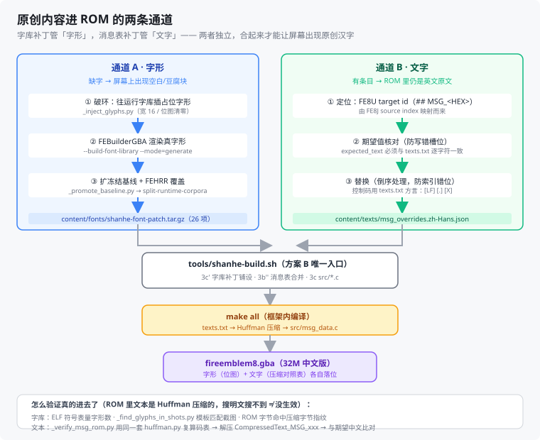

# 方案 B · 内容外置 实施规划

> 版本：v1.19
> 日期：2026-09-25
> 状态：**已拍板采用**（用户 2026-09-25 决定）
> 定位：把《山河烬》的原创内容与框架解耦，使本仓库自洽、可换机、可与上游共存。
> 关联：`4.项目规划手册.md`（**规划唯一来源**，本文档 §4/§7 已并入）、`2.设计文档.md` §12.6（策略决策）、`5.改版工程手册.md` §9（迁移流程）、`7.框架架构与机制详解.md`（框架本身）、`8.原创资产体系与框架资产对照.md`（资产体系，本文档 §2 已外移）、`10.关卡表数据化方案.md`（关卡数据的产出方式）

**版本记录**

| 版本 | 变更 |
|---|---|
| v1.0 | 首版：目标结构、五步同步、四阶段路线图、六项风险 |
| v1.1 | 增补：数据安全性三重保障实测、安全操作纪律、一键还原、六步流程；术语修正"覆盖"→"合并写入" |
| v1.2 | 查证 `src/*.c` 自动编译机制，撤销"需清单文件"的设计（见 `7.框架架构与机制详解.md` §4.2） |
| **v1.3** | **新增「原创资产体系」——五类资产（美术/武器/地图/音乐/文本）的目录、格式、与框架资产的对应关系、ID 与容量上限** |
| **v1.4** | **原「原创资产体系」章（384 行）独立为 `8.原创资产体系与框架资产对照.md` v1.0，本章改为指针 + 三条保留要点 + 三项待拍板决策；全文 `§2.x` 交叉引用改指文档 8** |
| **v1.5** | **§4 分阶段路线图与 §7 立即要做的三件事并入 `4.项目规划手册.md`（规划唯一来源），本章改为指针；定位收窄为「方案 B 实施细节」** |
| **v1.6** | **§2.2 待拍板表 4 项全部标记已定案（补 D-1、新增 D-6 关卡数据产出方式）；尾注同步指向文档 10** |
| **v1.7** | **M1 骨架全量审计（2026-09-25）修正三处**：① **§3.4 重大纠错**——`characters.json` 的 256 条是「94 条具名角色（`character` 键）+ 162 条杂兵模板（`characterId` 键，1-based）」两套互斥键方案，**不是**"94 条 + 空骨架"；照旧表述写脚本会 `KeyError` 崩溃、按下标合并会整体错位；② **§3.1 第 5 步替换**——官方 `expansion-modern-boot-check` 采用逐帧像素哈希（`framebuffer_hash`），改中文后必然失败，明确不可作验收工具，改为自建五项校验；③ §3.1 第 3 步补 `touch Makefile` 提醒 |
| **v1.8** | **★ 新增 §3.4a「round-trip 约束」—— 推翻 §3.4 上一版「增量合并即可构建」的结论**（2026-09-25 决定性实测）：框架 16 张 generated-data 表分两组，5 张无手写 round-trip 可自由改（章节/UI 表），11 张有 round-trip（改 JSON 必须同步改手写 C，否则 `make` Error 1）；`items` 有官方 `ITEM_EXPANSION_*` 豁免通道，`characters`/`classes`/`supports` 没有；M2 原创角色入表须专项调研。`shanhe-build.sh` 3a' 拆成两道校验 |
| **v1.9** | **★ 新增 §3.4b「原创角色入表通道」（M2 前置调研，已实测完成）**：四条出路全部实测——A（items 式豁免）❌ 框架无此机制；B（双写手写）✅ make 通过；**B'（生成产物回填）✅ 推荐**，全自动且 ROM 与 B 逐字节相同（`b64d264a`）；C（运行时 C 改写）⚠️ 未测；**D（移走手写 C）❌ 实测否决**（被本地化管线读作输入）。§1.3 铁律①补例外说明。新增 §3.4c（classes/supports 同类问题） |
| **v1.10** | **§3.1 步骤表同步实际实现**：① 第 5 步改为「自建五项」的准确描述；② **新增第 5b 步「导出 ROM 到 Windows 侧」**（`D:\workbuddy\shanhe-rom\shanhe-cn-32m.gba`，文件名由 lock 的 `rom_size_label` 派生 + SHA1 核对，目录不可写则不阻断） |
| **v1.11** | **§1.1 目标结构同步实际（用户反馈：GitHub 上的 `tools/` 与文档不符）**：① `tools/` 从 2 个补全为**实际 17 个**（11 个根级脚本 + `wsl/` 子目录 6 个，含 `build-host-tools.sh`）；② 根目录补 `README.md` / `GIT_WORKFLOW.md` / `.gitattributes` / `.githooks/post-commit`；③ `content/` 明确标注「骨架已建、内容待 M2 起填充」；④ 新增状态说明段 |
| **v1.12** | **§3.4b 标注 B' 已落地**：B' 回填已写进 `shanhe-build.sh` 3a'（三道：`validate --no-roundtrip` → B' 回填 → `validate` round-trip 复核），并写明**边界**（只对 hand source 是整文件的 4 张全局表；章节表 partial-file 留给 M4）。实测：虞聪数值顶替艾莉卡 → 构建通过、产物数值与文档 3 一致 |
| **v1.13** | **★ 新增 §3.4d「中文文本覆盖通道」+ 落地 M2 虞聪三表入表**：① 实测确认 `texts/locales/zh-Hans/indexed.txt` 是**生成物**（importer 从 pinned 快照 + `indexed_overrides.json` 生成），手改会被 regenerate 冲掉、且台账校验因缺 provenance 失败；② 打通正确通道 `content/texts/locales/indexed_overrides.zh-Hans.json`（补丁）→ 合并 → `regenerate` → `text_edit_ledger generate`；③ **`shanhe-build.sh` 新增第 3b' 步**自动完成上述流程；④ 厘清**定位键 = FE8J source index（非 FE8U target id）**及 4 个主角语义槽位的双 ID 对照表 |
| **v1.14** | **★★ 重大修正 §3.4d 的致命遗漏 + 新增 §3.4e/§3.4f**：① **实测证明 `indexed.txt` 不进 ROM**（§3.4d 的通道 A 对 ROM 毫无影响，只做它会「审计全绿、ROM 里还是英文」）→ **新增 §3.4e**：补上真正生效的**通道 B（`texts/texts.txt` → `src/msg_data.c` → Huffman 压缩进 ROM）**，新增 `content/texts/msg_overrides.zh-Hans.json` 补丁 + `shanhe-build.sh` 第 3b'' 步；② **新增 §3.4f「字库补丁通道」**：原创汉字走「插占位 → FEBuilder 渲染 → 扩冻结基线 → FEHRR 覆盖」四步破死锁，产出 `content/fonts/shanhe-font-patch.tar.gz`；③ 4 条消息已字节级确证进 ROM（Huffman 解压 + 压缩字节命中）；④ 字库符号实测 +8/+3 字 |
| **v1.19** | **2026-09-25** | **§1.1 结构图同步：`tools/` 17 → 29 个文件**，并指向新增的 `tools/README.md`（按「我想做什么」索引的分类说明：日常主入口 / 环境搭建 1~7 / WSL 专有 / 中文文本验证 / 字库补字管线 / 实机调试与崩溃定位 / 命名约定）。同时登记一处冗余：`tools/wsl/` 下 5 个文件与根级**内容完全相同**，建议保留根级后删除副本（需先确认无脚本按 wsl/ 路径调用）|
| **v1.18** | **2026-09-25** | **✅ 崩溃问题收口：回退引擎层补丁，改用内容层修法（实机通过）**。统一规则＝凡 `DISABLEOPTIONS(~EVENT_MENUOVERRIDE_X)`（X≠WAIT）一律补 `& ~EVENT_MENUOVERRIDE_WAIT`，永远保留「待機」⇒ 菜单不可能为零项。改动 5 处（prologue 2 / ch1 3）。删除 `uimenu-empty-menu-guard.patch`（v1→v5 引擎层补丁），`src/uimenu.c` 已还原上游原样；反查白名单 `src/uimenu.c` → `src/events/*.h`。另修：`调试启动-GDB.cmd` 的 `start` 静默失败（改用 Start-Process）＋ mGBA 带 `-g` 会停在复位等调试器（现自动接上捕手 continue）|
| **v1.17** | **2026-09-25** | **★ 定位 uimenu 崩溃的源码级根因 + 补丁迭代至 v4**：教学章 `DISABLEOPTIONS(~EVENT_MENUOVERRIDE_ATTACK)`（隐藏除攻撃外全部，含待機）叠加 `src/bmmenu.c:2451` `AttackCommandUsability` 在 `US_HAS_MOVED` 时返回 `MENU_NOTSHOWN` ⇒ **可见项 = 0**（合法状态）；`uimenu.c` 的 `Menu_Setup` 允许产出 `itemCount==0` 且 `menuItems[]` 未写入，消费端 8 处无有效性检查 ⇒ 野指针。**v4 引擎层根因修法**：`itemCount == 0` 时 `Proc_End` 结束该菜单；其余 4 处为防御纵深。同时把 `characters.json.base` 修正为「设计值 − 职业基值」的增量（原先与职业基值重复相加）|
| **v1.16** | **★ 新增 §3.4g「框架补丁通道」——方案 B 铁律①的第一个例外**：实机教学关卡 `Menu_OnInit` 野指针崩溃（根因见文档 5 §5.7）在数据层修不了，必须动框架代码。以 **unified diff** 形式落补丁（`content/framework-patch/uimenu-empty-menu-guard.patch`），由 `shanhe-build.sh` 新增 **3c'' 步**自动「还原钉住版本 → apply」，**apply 失败即中止构建**（防静默漏补）；写前快照与反查白名单同步纳入。**同时修复 3b'' 消息表补丁的幂等性缺陷**（未先还原 `texts.txt`，第二次构建必然因 `expected_text` 不符而失败）|
| **v1.15** | **★★ 二次修正 §3.4e——撤销 v1.14 的"`indexed.txt` 不进 ROM"结论**。经外部研读报告（第 4 章）+ **ELF 段表复核**确证：`indexed.txt` 经 `game_localization_catalog.c` 进 **`.locale_data` 段**（实测 `0x157BE4`=1.4 MB，VMA `0x09000000` 上位 bank），且 `src/msg.c:539` 优先调用 `LocalizedGameText_ResolveCurrentToBuffer`。**正确模型 = 三条来源（A 本地化目录 / B 消息表 / C 框架 UI 目录）+ 优先级规则（A 优先、B 回退）**。错误根因：v1.14 只做**单向验证**（改 `texts.txt`→ROM 变）就断言"只有它进 ROM"，漏了 `.locale_data` 这条独立路径。**新增纪律：同一处文本 A/B 两条通道都要改且内容一致**（本项目 4 条已满足） |

---

## 0. 为什么是现在做（时机评估）

**勘察结论：现在是最佳时机，迁移成本为零。**

| 检查项 | 实测结果 |
|---|---|
| 框架仓库是否有本地改动 | **无**（`git status --porcelain` 输出 0 行） |
| 是否已有未纳管的原创内容 | **无** |
| 框架当前 commit | `ec1dc855`（与 `origin/master` 一致，未分叉） |
| 是否已配自有远端 | 无，只有 `origin` 指向 `laqieer/fireemblem8-expansion` |

→ 也就是说：**还没有任何东西需要搬**。现在建立外置结构，是"从第一行代码就放进正确的地方"，比写了几万字剧情后再重构便宜一个数量级。

---

## 1. 目标结构

### 1.1 本仓库（`Fire-Emblem-Realm-in-Ashes`，git 管理）

```
Fire-Emblem-Realm-in-Ashes/
├── README.md                  # 项目简介
├── GIT_WORKFLOW.md            # git 提交规范（含 CRLF 专节、自动推送钩子）
├── framework.lock             # ★ 钉死框架 commit + 子模块 + 基线 SHA1
├── .gitignore                 # 忽略 *.gba/*.elf/build/ 等产物
├── .gitattributes             # 统一 LF 行尾（* text=auto eol=lf）
├── .githooks/post-commit      # 提交即自动推送
│
├── docs/                      # 设计文档（分工见附录 A）
│   └── images/                #   文档配图（矢量 SVG）
│
├── tools/                     # 脚本（29 个文件，完整索引见 tools/README.md）
│   ├── shanhe-build.sh        # ★ 方案 B 核心：内容同步+构建+导出（六步+5b）
│   ├── shanhe.sh              #   环境一键诊断/修复/构建
│   ├── git-health.sh          #   文档体检：CRLF 扫描 + 伪 diff 识别
│   ├── 环境搭建指引.md         #   环境搭建操作指引
│   ├── 1-install-wsl.ps1      #   ① 装 WSL2 + Ubuntu
│   ├── 2-setup-project.sh     #   ② 项目初始化
│   ├── 3-verify-env.sh        #   ③ 环境验证
│   ├── 4-install-wsl-manual.ps1  # ④ 手动装 WSL（绕开 Store 403）
│   ├── 5-fix-virtualization.ps1  # ⑤ 修虚拟化误报
│   ├── 6-diagnose-build.sh    #   ⑥ 构建诊断
│   ├── 7-fix-and-build.sh     #   ⑦ 修复 + 构建
│   └── wsl/                   #   WSL 内可直接执行的副本
│       ├── shanhe.sh
│       ├── build-host-tools.sh       # 宿主机工具预构建（8 个）
│       ├── 2-setup-project.sh
│       ├── 3-verify-env.sh
│       ├── 6-diagnose-build.sh
│       └── 7-fix-and-build.sh
│
└── content/                   # ★ 所有原创内容（住本仓库，框架只读）
    ├── README.md              #   内容说明（含 256 槽位警告）
    ├── data/                  #   JSON 内容（合并进框架 src/data/）
    │                          #   ── 以下为规划中的文件，M2 起逐个填充 ──
    │                          #   characters.json    仅原创角色（顶替原版槽位）
    │                          #   classes.json       仅原创职业
    │                          #   items.json         仅原创道具（神器等）
    │                          #   weapontriangle.json 兵刃三环 + 三才法环
    │                          #   supports.json      仅原创支援（13 组）
    │                          #   chapter_objectives.json
    │                          #   chN_bundle.json    每章一个独立文件
    ├── texts/                 #   中文文本（合并进框架 texts/）
    │   ├── locales/zh-Hans/   #     3,414 条原版消息中译
    │   └── expansion/         #     框架扩展 UI 文本
    ├── src/                   #   原创 C 代码（追加进框架 src/，统一 shanhe_ 前缀）
    │                          #   （规划：shanhe_sacred_relics.c 神器 / shanhe_four_ominous.c 凶相）
    └── assets/                #   ★ 原创资产（详见文档 8 §2）
        ├── portraits/         #     立绘
        ├── banim/             #     战斗动画
        ├── tmx/               #     章节地图
        ├── tilesets/          #     地图瓦片集
        ├── icons/             #     武器/道具图标
        ├── unit_icon/         #     职业小图标
        ├── music/             #     原创 BGM（*.mid）
        ├── sfx/               #     音效
        ├── spells/            #     神器特效
        └── cg/                #     事件 CG / 背景
```

> **状态说明**（2026-09-25）：`content/` 的目录骨架已建（各目录留 `.gitkeep`），**内容文件待 M2 起逐个填充**。文件名以本文档为规划、以 `content/README.md` 为落地清单。

### 1.2 框架仓库（只读依赖，**改动可 100% 恢复**）

```
~/projects/fireemblem8-expansion/     # 由 framework.lock 钉死在 ec1dc855
├── src/data/     ← 脚本"合并写入"（不是粗暴覆盖）
├── texts/        ← 脚本"合并写入"
├── src/          ← content/src/ 追加进来
└── （其余全部保持上游原样，永不手改）
```

#### ⚠️ 关于"覆盖会不会把能跑的版本弄丢"（重要）

**不会。** 三条独立保障，任一失效都不会丢数据：

| 保障 | 实测证据 | 恢复方式 |
|---|---|---|
| **① git 追踪** | `src/data/*.json` 共 19 个文件、`texts/` 共 91 个文件**全部被 git 追踪**；工作区 0 处改动 | `git checkout -- src/data/ texts/` |
| **② 上游远端在线** | `git ls-remote origin master` 返回 `ec1dc855...` | 删掉整个目录重新 `git clone` |
| **③ 本仓库持有内容** | 方案 B 的核心：你的内容全在 `content/`，另有 git 保护 | 重跑 `shanhe-build.sh` |

**实测验证**（2026-09-25）：故意把 `characters.json` 改成 `{"broken": true}`，SHA1 从 `6cbf4ee7` 变为 `e3522cc0`；执行 `git checkout -- src/data/characters.json` 后 SHA1 **恢复为 `6cbf4ee7`，与原文件逐字节一致**。

**因此，脚本的"写入"操作本质是"可逆的临时改动"**——就像你在编辑器里改了一行然后撤销。而 `shanhe-build.sh` 的**第 5 步反查**会随时告诉你"框架里有哪些被改动了"，第 6 步还能一键还原（见 §3.3）。

> **术语修正**：规划早期版本用过"被覆盖"这个说法，容易让人误以为原数据被销毁。准确表述是「**由脚本合并写入，且随时可 `git checkout` 还原**」。

### 1.3 三条铁律

1. **框架仓库里永远不出现手改。** 任何改动都先写进 `content/`，再由脚本铺过去。
   - **例外（2026-09-25 补充）**：`src/data_characters.c` / `src/data_classes.c` / `src/data_supports.c` 等"手写参考"文件，由脚本**自动回填**（`generate --no-roundtrip` 的产物覆盖，即 §3.4b 的 B' 方案）。这是**受脚本控制的自动写入，不是人手改**：可 `RESTORE=1` 还原、内容与 JSON 严格一致（不引入漂移）、第 6 步反查须把它列入「预期清单」。理由：这些文件被 round-trip + 本地化管线同时依赖，必须与 JSON 同步，而手工维护一份 256 条 C patch 不现实。
2. **`framework.lock` 是唯一的上游依赖声明。** 升级框架 = 改这一行 + 重跑构建 + 跑回归。
3. **两边都要能自证。** 脚本跑完必须反查框架侧有无"未纳管的改动"（防止手滑直接改框架）。

### 1.4 安全操作纪律

为了把"可恢复"落实到日常习惯：

- **进框架仓库前先看一眼**：`git -C ~/projects/fireemblem8-expansion status --short`——干净才动手。
- **只在 `content/` 里编辑**。养成习惯后根本不会去碰框架。
- **`shanhe-build.sh` 已内建还原子命令**（见 §3.3），不确定时先 `RESTORE=1` 归零再重来。
- **不要 `git commit` 框架仓库**。它应该是永远"有未提交改动"的状态（那是脚本铺进去的内容），提交了反而会把上游历史搞乱。
- **`git clean` 要极其小心**：`git clean -fd` 会删掉未追踪文件。框架仓库里未追踪文件主要是构建产物，但若 `content/src/` 追加的新 `.c` 未被正确纳入，可能被误删。**别在框架仓库跑 `git clean`。**

---

## 2. 原创资产体系 → 已独立为文档 8

> **本章内容已于 2026-09-25 独立成 `8.原创资产体系与框架资产对照.md`（v1.0）**，因为资产话题的体量与独立性已超出本文档范围。
>
> 请以文档 8 为准，本文档不再重复。文档 8 在本文档原 §2 基础上**扩充了以下原文没有的内容**：
>
> | 文档 8 新增章节 | 说明 |
> |---|---|
> | §1 总纲 | 拥有缝 / 四要素原则 / 五级成熟度 / 14 行总对照表（本文档只有简表） |
> | §8 美术减负总原则 | 五级成本表（复用 / 调色板派生 / 局部改绘 / 数值重排 / 全新绘制） |
> | §9 工作量预估 | 11 项资产 × 需求量 × 手段 × 负担评级 |
> | §10 风险清单 | 11 项（本文档无） |
> | §11 验证方法 | 四层验证法 + 完整命令流程 + 4 项反例表（本文档无） |
> | §12 框架文档导航 | 12 份框架内文档的作用索引（本文档无） |
> | §6 字体 OFL-1.1 合规 | 中文字库的来源、许可、实测容量（本文档无） |
>
> 本文档保留以下**与方案 B 强耦合、不适合外移**的结论：

### 2.1 对应关系速查（详见文档 8 §1.5）

框架对每一类资产都有一个**「拥有缝（owning seam）」**——即"哪张表、哪个链接列表、哪个运行时消费者负责登记这个资产"。**你的原创资产必须挂到同一个缝上**，而不是新建平行体系。框架官方文档 `docs/community_asset_coverage.md` 把这条写成了硬规则：

> 适配器必须保留已列出的拥有缝……**不得新增手工维护的表、链接列表或 ID 命名空间**。

**本文档保留的三条要点**（与方案 B 的目录结构 / 路线图直接相关）：

| 要点 | 内容 |
|---|---|
| **① 目录落点** | 原创资产放 `content/assets/` 十个子目录（`portraits` / `banim` / `tmx` / `tilesets` / `icons` / `unit_icon` / `music` / `sfx` / `spells` / `cg`），见 §1.1 |
| **② 武器分两层** | **武器数据**（名称/威力/命中/耐久/特效）走 `content/data/items.json`，**零美术成本**；**武器图标**才需要美术（复用 + 改色）。别把这两件事混为一谈 |
| **③ 原创机制走 ID 空间扩展** | 神器 / 凶相这类原创内容 = **扩 ID 空间 cap**，不复用原版槽位（`--with-item-id-cap`）。见 `3.游戏数值设定.md` 与 `7.框架架构与机制详解.md` §5.4 |

### 2.2 三项待你拍板的资产决策

| # | 决策 | 影响面 | 为什么需要你定 |
|---|---|---|---|
| 1 | ~~**哪 22 个原版角色槽位被原创角色顶替**~~ | — | ✅ **已定案（2026-09-25）**：见 `9.角色槽位映射与美术平替方案.md` §3.2 矩阵 + §3.4 三处优化 |
| 2 | ~~**9 件神器特效如何精简**~~ | — | ✅ **已定案**：见 `8.原创资产体系与框架资产对照.md` §7.2 —— **9 件只需 3 个 ID**（物理神器走 banim 换色，法系才占 ID） |
| 3 | ~~**美术预算重心**~~ | — | ✅ **已定案（2026-09-25）**：走**分期摊销**——地图瓦片集前置攻坚 + 立绘/地图交错摊开，见 `8.原创资产体系与框架资产对照.md` **§14** |
| 4 | ~~**关卡数据的产出方式（D-6）**~~ | — | ✅ **已定案（2026-09-25）**：不建 Markdown 关卡表，直接落 `content/data/chN_*.json`（每章一个 bundle），见 `10.关卡表数据化方案.md` |

> 各项的详细选项与权衡：① 见 `9.角色槽位映射与美术平替方案.md`；②③ 见 `8.原创资产体系与框架资产对照.md` §7.2 与 §14；④ 见 `10.关卡表数据化方案.md`。

---

## 3. 同步机制设计（`tools/shanhe-build.sh`）

### 3.1 六个步骤

| 步 | 动作 | 失败处理 |
|---|---|---|
| **0** | **安全预检**：框架仓库工作区是否干净 | 不干净则提示"可能有未纳管的手改"，列出文件，询问是否继续 |
| 1 | **校验**：读 `framework.lock`，比对框架实际 commit | 不匹配则提示升级/回退命令，中止 |
| 2 | **写前快照**：记录将被改写文件的 SHA1 清单 | 存到 `~/shanhe-logs/prewrite-<时间戳>.sha1` |
| 3 | **铺设**：合并 `content/data/*.json` → 框架 `src/data/`；`content/texts/` → 框架 `texts/`；`content/src/*.c` → 框架 `src/` | 逐文件校验落地结果；**新增 `.c` 后必须 `touch Makefile`**（见 R-02） |
| 4 | **构建**：调 `make`（含宿主机工具保障） | 失败则打印日志路径与 grep 命令 |
| 5 | **验产物（自建五项）**：ROM 存在 + 尺寸 33554432 + header `FIREEMBLEM2E`/`BE8E` + 可引导 + 中文字形可见 | 否则 exit 1。**⚠️ 不要用 `expansion-modern-boot-check`**，理由见下 |
| **5b** | **导出 ROM**：复制到 `D:\workbuddy\shanhe-rom\shanhe-cn-32m.gba`（文件名由 lock 的 `rom_size_label` 派生）+ SHA1 核对 | 目录不可写则 warn，**不阻断**（可用 `SHANHE_ROM_DIR` 覆盖） |
| 6 | **反查**：`git -C 框架 status --porcelain` 列出所有被改动文件 | 与第 2 步快照对比，若有"预期外"的改动则高亮警告 |

#### ⚠️ 为什么第 5 步**不能**用官方的 `expansion-modern-boot-check`（2026-09-25 实测）

`modern.mk:2814` 的 `expansion-modern-boot-check` 执行：

```
gba_playtest.py verify --rom <rom> --scenario boot.json --expected fingerprints/boot.json --policy behavior
```

而 `gba_playtest.py:2917-2932` 的 `behavior` 策略**只排除顶层 `rom` 键**，其余全部逐字段严格比对——其中包含 `framebuffer_hash: "fnv1a64-rgb24:..."`，即 **frame 0/60/120 三个检查点的逐帧像素哈希**。

**结论**：该目标是**上游对自身基线的回归门禁**。一旦我们启用中文（字库扩容、菜单/title 文字中文化），title 画面像素必然改变 → `framebuffer_hash` 不匹配 → **boot-check 必然失败**。这不是 bug，而是它本就不为"改版项目"设计。

**→ 本项目第 5 步改为自建校验**（等价强度、不依赖像素哈希）：

| 检查项 | 方法 |
|---|---|
| ROM 存在 | `test -f <rom>` |
| 尺寸正确 | `stat -c %s` == `33554432`（32M） |
| header 正确 | 读 `0xA0` 起 12 字节 == `FIREEMBLEM2E`；`0xAC` 起 4 字节 == `BE8E` |
| 可引导 | mGBA 无头启动 N 帧不崩溃（`mgba-sdl` 或 `gba_playtest capture` 自建 scenario，**不比对**像素） |
| 中文字形可见 | 目视 / 或对 `祝`/`报` 等字形做**局部区域**像素断言（自建 fingerprint，不引用上游基线） |

### 3.2 关键设计约束

- **幂等**：可重复跑。铺设用合并 + 追加，不清空目录、不删上游文件。
- **不静默**：每一步打印实际做了什么（`[merge] characters.json +12 条`、`[skip] 无变化`）。
- **可预演**：`DRY_RUN=1` 只打印将要做什么，不落盘。
- **反查是防呆关键**：第 6 步存在的全部理由——它能在你忘记"应该改 content/"时立刻抓到。

### 3.3 一键还原（回应"怕丢数据"）

新增 `RESTORE=1` 子命令，把框架还原到上游原始状态：

```bash
# 查看框架被改了什么（不改动任何东西）
bash tools/shanhe-build.sh STATUS=1

# 一键还原：丢弃所有写入，回到 framework.lock 指定的上游状态
bash tools/shanhe-build.sh RESTORE=1
#   内部执行：git -C 框架 checkout -- <被改动的路径>
#   等价于你手动跑 git checkout，但会先列出将要还原的文件让你确认
```

**这意味着**：任何时候你都可以"推倒重来"。框架的原始数据永远在 git 里，`RESTORE=1` 只是把它取回来。

### 3.4 JSON 覆盖语义（**已实测，结论明确**）

> 2026-09-25 实地勘察结论，**2026-09-25 二次复测修正**。这一节决定了同步脚本的核心策略。

**实测发现（v1.6 修正版）**：

| 事实 | 证据 |
|---|---|
| `characters.json` 顶层键为 `["$schema", "fullCoverage", "characters"]`，`characters` 是 **256 元素数组** | `python3 -c "import json;d=json.load(open('src/data/characters.json'));print(list(d), len(d['characters']))"` |
| `"fullCoverage": true` = **256 个槽位全部必须有记录，不存在空槽** | 实测 256/256 下标全部有内容；`scripts/generated_data/characters/schema.py:94-99`：「toggles the dense `1..256` coverage check... all 256 designators authored」 |
| ★ **256 条分成两套互斥的键方案** | 见下表 |
| 生成器读的是**单一路径**的完整表 | `registry.py:102` 注释指明源就是 `src/data/characters.json` |

**★ 关键修正：256 条不是"94 条原版 + 162 空槽"，而是两套键方案的真实记录**

| 形态 | 条数 | 定位键 | 字段集 | 样例 |
|---|---|---|---|---|
| **A · 具名角色** | **94** | `"character": "CHARACTER_EIRIKA"`（符号名） | `character/nameTextId/descTextId/defaultClass/portrait/affinity/sortOrder/baseLevel/base/baseRanks/growth/attributes/supportData/visitGroup` | 下标 0 = 艾瑞珂 |
| **B · 无名杂兵模板** | **162** | `"characterId": 27`（**1-based 槽位号**） | `characterId/nameTextId/defaultClass/growth`（部分含 `miniPortrait`/`descTextId`/`baseLevel`） | 下标 26 = 山贼模板 |

**这带来两个必须写进脚本的硬约束**：

1. **不能用 `c["character"]` 做键** —— 162 条形态 B 条目没有该键，直接 `KeyError` 崩溃（复测时已实测崩溃）。
2. **不能"按下标 + N"或"按下标直接覆盖"** —— 实测 `characterId == 数组下标 + 1`（下标 26 → `characterId` 27），**整体偏移一格**。任何按下标定位的写法都必须在合并前显式断言 `idx + 1 == record["characterId"]`，任一不符立即中止，否则会静默错位、把角色数值写到隔壁槽位。

**→ 采用解法 b（合并）的正确形态**：

```bash
# 同步脚本的做法：以框架原表为基底，用你的增量补丁按槽位定位替换
1. 读框架 src/data/characters.json   （256 条完整记录）
2. 读 content/data/characters.json   （只含你的原创角色，如 CHARACTER_YU_CONG）
3. 定位键 = 槽位号（1-based）：
     · 你的 entry 必须自带 "characterId": <你要顶替的槽位号>
     · 断言 idx + 1 == characterId 后再替换该下标的整条记录
     · 若你的 entry 只有 "character" 符号名而无 characterId → 报错并中止（不猜）
4. 校验合并后仍是 256 槽、无重复 characterId、无重复 character 符号名
5. 写回框架 src/data/characters.json
```

**好处**：
- 你的 `content/data/characters.json` **只写原创内容**，不抄 256 条原版记录，文件小、可读、diff 干净。
- 框架升级（原版角色数值修正）能自动继承，不会因为你的整表覆盖而丢。
- 这本质上是"把你的人工改动**自动化**了"——手工做的话就是"打开框架文件、找到位置、粘贴进去"。

**同样的策略适用于**：`classes.json`（127 条）、`items.json`（206 条）、`supports.json`（33 条）——同为**整表 + 全覆盖**风格的表。⚠️ 但**定位键不通用**：`classes`/`items` 用各自的对象数组，`supports` 用 `records`，**每个文件都要单独确认键名**（19 个 JSON 的顶层结构已实测，见文档 7 附录）。

**关于本节的自我纠错**：本文档 v1.5 及更早版本写的是「94 条原版 + 256 槽骨架」并说"按 `"character"` 键合并"。经 2026-09-25 复测，`characters` 数组是 **256 条全满**（不是空骨架），且 `character` 键只覆盖其中 94 条。**照旧表述写脚本会 KeyError 崩溃。** 已按上表修正。

### 3.4a ★ round-trip 约束（**2026-09-25 决定性发现，推翻本节上一版结论**）

> 本节是方案 B 的**根本性修正**。上一版 §3.4 给出的「增量补丁合并 → 写回框架 JSON → 构建」路径，在合并阶段是对的，但**在构建阶段会被框架拦下**。以下为实测结论。

**框架的 16 张 generated-data 表，按「是否有手写 round-trip 参考」分成两组**：

| 组 | 表 | 手写参考（`default_hand_source`） | 改 JSON 的代价 |
|---|---|---|---|
| **无 round-trip（可自由改）** | `chapterobjectives` / `chapterbundle` / `eventscripts` / `autoplaystrategies` / `ui_presentation` | `None` | **零约束**，改完直接构建 |
| **有 round-trip（改 JSON 必须同步改手写 C）** | `characters` / `classes` / `items` / `supports`（全局锁定表）；`units` / `shops` / `traps` / `eventlists` / `terrainstats` / `movecost` / `weapontriangle`（章节/机制表） | 各自的 `src/data_*.c` / `src/events_*.c` | **改任何字段 → 生成器拒绝产出 C → make Error 1** |

**实测证据链（2026-09-25，逐条可复现）**：

1. 手写 `src/data_characters.c` 已**退出链接**，仅作 round-trip 比对基准（`Makefile:219` 的 `ALL_OBJECTS` 链接的是 `build/generated/data/data_characters.o`，由 JSON 生成）。
2. `generated_data.mk:683` 的规则是硬依赖：`data_characters.c: characters.json …` → 跑 `generate` → 内部强制 round-trip。
3. 只改 `characters.json` 一个字段（`baseLevel 4→5`）不同步改手写 C → **实测 `make[3]: *** [generated_data.mk:685: build/generated/data/data_characters.c] Error 1`**。
4. 同步改手写 C（`baseLevel 4→5`）→ **实测 round-trip 通过，生成器正常产出 C**。

### 3.4b ★ 原创角色入表通道（M2 前置调研，**已实测完成**）

> 2026-09-25 M2 前置调研。四条出路全部做过实测，结论明确。

**先厘清一个关键事实：`src/data_characters.c` 不只是 round-trip 参考，它被 3 条管线同时使用**：

| # | 消费方 | 用途 |
|---|---|---|
| 1 | `characters/parser.py` | round-trip 比对基准 |
| 2 | `scripts/localization/game_locales/fixed_width_labels.py:30` | 提取角色名的**固定宽度标签** |
| 3 | `scripts/localization/game_locales/crosswalk.py:306` | 原版 en/ja 对照 |
| — | `modern.mk:2399`（本地化目录生成器） | 依赖 2/3，缺文件即 `make` 报 `No such file` |

→ **它必须存在，且内容必须与 `characters.json` 一致。**

**四条出路的实测结论**：

| 出路 | 做法 | 实测结论 |
|---|---|---|
| **A. items 式豁免** | `characters_expansion.json` + `ITEM_EXPANSION_*` 式豁免 | ❌ 框架**无**此机制（仅 `items` 有）；要用就必须改框架 `characters/schema.py`，**违反铁律①** |
| **B. 双写（手写维护）** | JSON + 手写 patch `src/data_characters.c` | ✅ **实测完整 `make` 通过**（ROM `b64d264a`）|
| **B'. 生成产物回填** ★ | JSON → `generate --no-roundtrip` → 用产物覆盖 `src/data_characters.c` | ✅ **实测完整 `make` 通过，ROM 与 B 逐字节相同（`b64d264a`）** |
| **C. 运行时 C 改写** | 原创 `shanhe_*.c` 改 `gCharacterData[]` | ⚠️ 未实测；绕过校验，须自律越界与存档兼容 |
| **D. 移走手写 C** | 删掉 `src/data_characters.c` 让 round-trip 跳过 | ❌ **实测否决**——被本地化管线读作输入，`modern.mk:2399` 直接 `No such file` 报错 |

**★ 推荐 B'（生成产物回填）**，理由：

1. **全自动**——不需要手工维护一份 256 条的 C patch。
2. **round-trip 自动通过**——回填后「手写参考 == 生成产物」，逐字段天然一致。
3. **产物语义正确**——B 与 B' 产出的 ROM SHA1 **完全相同**（`b64d264a`），证明两者语义等价。
4. **唯一框架侧改动**是 `src/data_characters.c`，特点是：受脚本控制、可 `RESTORE=1` 还原、内容与 JSON 严格一致（不引入漂移）。

**B' 的操作序列**（✅ 2026-09-25 已写进 `shanhe-build.sh` 的 3a'，脚本自动完成）：

```
1. 合并 content/data/characters.json → 框架 src/data/characters.json
2. python3 -m scripts.generated_data generate --table characters \
     --no-roundtrip --out-dir build/generated/data
3. cp build/generated/data/data_characters.c  src/data_characters.c   # 回填
4. make  （此时 generate 内部的 round-trip 自然通过）
```

**脚本实现细节**：3a' 对每张受约束的表跑**三道**——① `validate --no-roundtrip`（数据合法）② `generate --no-roundtrip` + `cp`（B' 回填）③ `validate`（round-trip 复核，通过即证明 `make` 不会卡）。
**边界**：只处理 hand source 是**整文件**的 4 张全局表（`characters`/`classes`/`items`/`supports`）；章节表是 partial-file，整文件回填会抹掉其它章节 → 留给 M4。

**B' 对铁律①的定性**：这不是"人手改框架"，而是**脚本自动铺设 + 可还原的受控写入**（与铺设 `characters.json` 同性质）。第 6 步反查时须把 `src/data_characters.c` 加入「预期清单」。→ 已在 §1.3 铁律①补例外说明。

**副发现**：`expansion-modern-boot-check` 对「改角色数值」**不敏感**（改 `baseLevel` 后 boot-check 仍 passed），只对「改中文/字库」敏感。这印证了 §3.1 的判断——它是像素级比对，但 title 画面不受角色数值影响。

### 3.4c 其余锁定表的同类问题

`classes` / `supports` 与 `characters` 同属「有 round-trip、无豁免」的全局锁定表 → **同样适用 B'**（`src/data_classes.c` / `src/data_supports.c` 回填）。`supports` 还需注意**双向对称**（Eirika 列 Ephraim，Ephraim 必须反向列 Eirika）。

### 3.4d ★ 中文文本覆盖通道（**2026-09-25 实测打通**）

> M2 交付物②（一批菜单/角色文本中文化）的前置。核心结论：**框架的 `indexed.txt` 是生成物，不能手改**——必须走「覆盖补丁 + regenerate」通道。

**先厘清一个关键事实：`texts/locales/zh-Hans/indexed.txt` 不是手写文件，而是生成的。**

| 环节 | 文件 | 性质 |
|---|---|---|
| 原始快照 | `texts/locales/source/fe8cn/FE8CN.txt`（pinned，只读） | 输入 |
| **覆盖补丁** | `texts/locales/indexed_overrides.json` + `indexed_audit_overrides.json` | **人手维护（156 条官方覆盖）** |
| 生成器 | `scripts/localization/game_locales/importer.py`（`regenerate` 子命令） | 工具 |
| **生成产物** | `texts/locales/zh-Hans/indexed.txt`（1.3MB）+ `manifest.json` | **输出，勿手改** |
| 台账 | `texts/locales/mapping/game_locale_text_edits.json` + `docs/game_locale_text_edits.md` | 生成物（记录每条改动+来源） |

→ **手改 `indexed.txt` 会被下一次 `regenerate` 冲掉；且台账校验会因「改动缺 provenance」直接失败。**

**实测证据链（2026-09-25，逐条可复现）**：

1. **`regenerate` 幂等**：零改动基线上跑 `python3 -m scripts.localization.game_locales regenerate` → `zh-Hans/indexed.txt` SHA256 **不变**（=manifest 声明的 `9010c7e1…`），`sha256sum -c` 通过。
2. **加一条覆盖即生效**：在 `indexed_overrides.json` 的 `sources.fe8cn_source.entries` 加 `0x0199`（艾瑞珂→虞聪）→ `regenerate` → indexed.txt 的 `#0x0199` 内容变为「虞聪」。
3. **台账闭环**：`text_edit_ledger generate` 刷新台账 → `text_edit_ledger check` **exit 0**（改动带齐 `provenance`/`reason` 即通过）。
4. **连带影响**：改 overrides 会连带刷新 `ja/indexed.txt` 的 `# Override SHA-256` 头行 + `manifest.json` 的 hash/计数——这是框架设计（override 文件哈希全局共享），非 bug。

**覆盖补丁的正确姿态（方案 B 外置）**：

```
content/texts/locales/indexed_overrides.zh-Hans.json     ← 你写这个（只写原创覆盖）
   ↓ 由 shanhe-build.sh 第 3b' 步合并（按 source_key）
框架 texts/locales/indexed_overrides.json                ← 156 条官方 + 你的
   ↓ python3 -m ...game_locales regenerate
框架 texts/locales/zh-Hans/indexed.txt                   ← 重生成，含原创文本
   ↓ python3 -m ...game_locales.text_edit_ledger generate
框架 texts/locales/mapping/game_locale_text_edits.json   ← 台账刷新
```

**定位键 = FE8J source index（`#0xNNNN`），不是 FE8U target id** —— 这是最容易踩的坑。两者的对应关系在 `texts/locales/mapping/fe8u_target_map.json`（`source_key` 字段指出语义槽位）。以主角为例：

| 语义槽位 | FE8J source | FE8U target | 原文本 | 已覆盖为 |
|---|---|---|---|---|
| `CHARACTER_EIRIKA.nameTextId` | `0x0199` | `0x0212` | 艾瑞珂 | 虞聪 |
| `CHARACTER_EIRIKA.descTextId` | `0x01F5` | `0x026E` | 心地善良，气质高雅的鲁内斯公主 | （虞聪说明） |
| `CLASS_EIRIKA_LORD.nameTextId` | `0x0246` | `0x02BF` | 领主 | 佩剑郎 |
| `CLASS_EIRIKA_LORD.descTextId` | `0x0291` | `0x030A` | 治理领地的君主后裔还很年轻，未成大器 | （佩剑郎说明） |

**每条覆盖的必填字段**：`expected_text`（原文本，防漂移）、`provenance`（`audit`/`context`/`target_ids`）、`reason`、`replacement_text`。缺 `provenance` → 台账 `check` 报 `changed source lacks reviewed provenance`。

**宽度约束（实测安全）**：角色名固定宽度 **40px**、职业名 **64px**（`fixed_width_labels.py` 的 `character_name_40`/`class_name_64` 面）；描述文本走 `system_default_240`（**每行** 240px，`[CTRL:0001]` = 换行，允许自动折行）。实测：虞聪 16px、佩剑郎 25px、虞聪说明 157px（含换行后单行 ≤85px）——全部远低于上限。

---

### 3.4e ★★ 修正：文本进 ROM 的**三条来源 + 优先级**（**2026-09-25 二次修正**）

> **本节被修正过两次，两次都值得记住**：
>
> **第一次（原版 §3.4e）**：发现 §3.4d 只做 `indexed.txt` 时「审计全绿、ROM 里还是英文」，于是判定 **"`indexed.txt` 不进 ROM"**，改推 `texts.txt` 通道。
>
> **第二次（本次，2026-09-25 晚）**：外部研读报告（`D:\AI\works\20260925_FE8改版框架研读\报告\04_本地化与中文改造.md`）指出 `indexed.txt` 经 Huffman 压缩进 32 MB ROM 上位 bank。**我们用 ELF 段表复核，报告是对的——原版 §3.4e 的结论错了。**
>
> **错误根因**：原判定只做了**单向验证**（"改 `texts.txt` → ROM 变" → 就断言"只有它进 ROM"），**漏了 `.locale_data` 段**这条独立路径。
> 教训：**"某条路没生效"≠"这条路不通"**——必须把候选路径**逐条**做产物层验证。

**正确模型 = 三条来源 + 一条优先级规则**：

| 来源 | 文件 | 编译产物 | 进 ROM | 定位键 | 运行时 |
|---|---|---|---|---|---|
| **A · 本地化目录** | `texts/locales/<locale>/indexed.txt`（由 `indexed_overrides.json` + 钉住的快照 `regenerate` 得到） | `build/<root>/game-localization/generated/game_localization_catalog.c` | ✅ **进 `.locale_data` 段** | FE8J **source index**（`#0xNNNN`） | **优先** |
| **B · 消息表** | `texts/texts.txt` | `src/msg_data.c`（`Makefile:562`，Huffman 压缩） | ✅ 进 `ROM` 段 | FE8U **target id**（`## MSG_<HEX>`） | 回退 |
| **C · 框架 UI 目录** | `texts/expansion/registry.json` + `catalog.<locale>.json` | `gExpansionCatalog_*`（145 条 × 7 语言） | ✅ | `ExpansionMsgId` | — |

**优先级规则**（`src/msg.c:536-545`）：

```c
status = LocalizedGameText_ResolveCurrentToBuffer(index, buffer, bufferCapacity, &len);
// 成功 → 用来源 A 的文本；失败 → 回退到来源 B（msg_data.c）
```

**字节级证据（可复现）**：

```bash
FW=~/projects/fireemblem8-expansion
# ① ELF 段表：.locale_data 段真实存在，1.4 MB，落在 32M ROM 上位 bank
arm-none-eabi-objdump -h $FW/build/expansion-modern/release/aapcs/fireemblem8.elf | grep locale_data
#  13 .locale_data  00157be4  09000000  ...  CONTENTS, ALLOC, LOAD, READONLY, DATA
# ② 本地化目录确实被编译，且含 zh-Hans 压缩 blob（约 497 KB）
arm-none-eabi-nm -S $FW/build/expansion-modern/release/aapcs/src/localized_game_text-catalog.o | grep -i zhHans
#  gGameLocalizationZhHansCompressedBlob   0x798ae
# ③ 生成器只在启用真实 CJK locale 时产出全游戏目录（modern.mk:470-520）
#    FORCE_MODERN_GAME_LOCALIZATION 保证该目录每次构建都重新生成（modern.mk:2393-2400）
```

> **⚠️ 由此推出本项目的一条硬纪律**：
> **同一处文本，A、B 两条通道都要改，且内容必须一致。**
> 因为 **A 有效时 A 会盖掉 B**——只改 B 会出现「`msg_data.c` 确实改了、游戏里却不显示」，
> 这比原来的"假成功"更隐蔽。
> **本项目当前状态**：4 条原创文本**两条通道都已覆盖且内容一致**（见下表），所以不存在被旧文本盖掉的风险。
>
> **来源 B 的内容外置补丁**：`content/texts/msg_overrides.zh-Hans.json`

```json
{
  "$schema": "shanhe.msg-overrides.v1",
  "locale": "zh-Hans",
  "messages": {
    "0x0212": {
      "expected_text": "Eirika[X]",
      "provenance": { "audit": "...", "context": "CHARACTER_EIRIKA.nameTextId（texts.txt:## MSG_212）", "source_key": "0x0199" },
      "reason": "原创主角虞聪顶替原版艾瑞珂槽位",
      "replacement_text": "虞聪[X]"
    }
  }
}
```

由 `shanhe-build.sh` 的 **3b'' 步**合并进框架 `texts/texts.txt`（**倒序处理**，防索引错位）。控制码用 `texts.txt` 方言：`[LF]` 换行、`[X]` 终止、`[.]` 停顿（**不是** `indexed.txt` 的 `[CTRL:0001]`）。

**两套坐标映射（已确认）**：

| FE8J source | FE8U target | texts.txt | 已覆盖为 |
|---|---|---|---|
| `0x0199` | `0x0212` | `## MSG_212` | 虞聪 |
| `0x01F5` | `0x026E` | `## MSG_26E` | 守鼎世家虞家次子，… |
| `0x0246` | `0x02BF` | `## MSG_2BF` | 佩剑郎 |
| `0x0291` | `0x030A` | `## MSG_30A` | 持剑守鼎的少年，… |

**实测证据（字节级，硬）**：

- **来源 B**：Huffman 解压 `src/msg_data.c` 得 `## MSG_212: '虞聪<00>'`；压缩字节在最终 ROM 中各命中 **1 次**。详见 `5.改版工程手册.md` §5.4。
- **来源 A**：最终 ELF 的 `.locale_data` 段真实存在（`0x157BE4` = 1.4 MB，VMA `0x09000000`）；`localized_game_text-catalog.o` 含 `gGameLocalizationZhHansCompressedBlob`（约 497 KB）。

---

### 3.4f ★ 字库补丁通道（原创汉字的"字形"从哪来）

> 通道 B 解决"文字"，本节解决"**字形**"。两个字都缺一不可：字库没这个字形 → 屏幕上显示空白/豆腐块；消息表没换文字 → 屏幕上还是英文。

**问题**：虞聪（865E 806A）、佩剑郎（4F69 5251 90CE）、鼎鸣（9F0E 9E23）这些字**不在框架自带字库语料**里。

**死锁**：`generate-inventory` → … → `apply_width_contract` → 读 `graphics/fonts/cjk/manifest.json` 的 codepoints → 报 `error: zh-Hans/system: U+865E is absent from the runtime font`。**校验先读字库，字库要先过校验才能生成** —— 死锁。

**破环四步**：

| 步 | 工具 | 说明 |
|---|---|---|
| ① 插占位字形 | `tools/wsl/_inject_glyphs.py` | 按 scalar 升序插入码位，宽 16、位图 64 字节零 |
| ② FEBuilder 渲染真字形 | `FEBuilderGBA.CLI --build-font-library --mode=generate` | 真字体画字 |
| ③ 扩冻结基线 | `tools/wsl/_promote_baseline.py` | 并入 `fonts/cjk/febuilder-baseline/`，否则 `split-runtime` 报 `no verified fallback` |
| ④ FEHRR 覆盖 | `split-runtime-corpora --fehrr-root $HOME/FEHRR` | 恢复日文假名 36px（不跑则变 46px，宽度校验报错） |

**产出**：`content/fonts/shanhe-font-patch.tar.gz`（26 项，1.5 MB），由 `shanhe-build.sh` 的 **3c' 步**铺设。

**实测证据**：`gLocalizedFontZhHansSystemCodepoints` `0x016d0`（1460）→ `0x016f0`（**1468**，+8 字）；`TalkCodepoints` 2382 → **2385**（+3）。`cjk check` 通过（`union=3257`），ja 假名宽度变化 **0**。

> 详规见 `5.改版工程手册.md` §3.7。

**四条通道全景**（数据 / 文本A / 文本B / 字库）：



### 3.5 章节类 JSON 语义（**已实测，比全局表简单**）

| 文件 | 实测结构 | 同步策略 |
|---|---|---|
| `chapter_objectives.json` | `{"$schema": "...", "chapters": []}` —— **空数组**，等你按章填 | **追加**：把你的章节记录合并进 `chapters[]` |
| `chN_bundle.json` | 每章一个独立文件，内含该章全部表的引用与依赖声明 | **新增文件**：你新增的章节就是新文件，**零冲突** |
| `chN_units/shops/traps/eventscripts/eventlists.json` | 同上，按章独立 | 同上 |

**结论**：章节内容走「**新增文件 + 追加记录**」路线，**天然无冲突**，比全局表简单。

⚠️ **但有个强约束要注意**：`ch2_bundle.json` 里的 `dependencies` 是**精确声明**——列出该章依赖的所有 `characters`/`classes`/`items`。你新建章节时：

- `dependencies.characters` 必须列出该章用到的**全部角色**（包括你新增的原创角色）
- `dependencies.classes` / `items` 同理
- **缺失、重复、过期、空、超容量、矛盾、循环、无效区域、未知引用都会失败**（框架的 validate 会报）

→ 这是好事：它保证你不会引用到不存在的资源。但意味着**加一章时要一次性把依赖列全**。

**另一个重要细节**：`ch2_bundle.json` 的 `externalReferences` 指向 `src/events/ch2-eventscript.h` 等**手写头文件**——说明章节的**事件脚本实现**（`EventScr_*` 符号的实际内容）需要写在 `src/events/` 下的 C 文件里。这部分**属于引擎层**，是章节制作中唯一需要写代码的环节。

| 章节组成 | 放哪 | 需要写 C？ |
|---|---|---|
| 单位组、商店、陷阱、事件列表 | `src/data/chN_*.json` | 否 |
| 胜利条件、AI 组 | `src/data/chapter_objectives.json` | 否 |
| **事件脚本实现**（`EventScr_*`） | `src/events/chN-eventscript.h` + `.c` | **是** |
| 地图 | `graphics/` + TMX/布局元数据 | 否（用工具编辑） |

---

### 3.4g ★ 框架补丁通道（**已知偏离：唯一允许覆写框架文件的通道**）

> **背景**：2026-09-25 实机遇到教学关卡 `Menu_OnInit` 野指针崩溃（根因链见 `5.改版工程手册.md` §5.7）。
> 该缺陷**在数据层修不了**——它是 `src/uimenu.c` 里"`Menu_Setup` 可合法产出 `itemCount == 0`，
> 而 `Menu_OnInit` 不做有效性检查就解引用 `menuItems[0]`"的代码缺陷。
> 因此必须动框架代码。**这是方案 B 铁律①「框架里不出现手改」的第一个、也是目前唯一的例外。**

#### 为什么不是"直接手改框架"

直接改框架 `src/uimenu.c` 有三个问题：**换机会丢**、**无法审计**、**上游一改就静默走偏**。
本通道用 **unified diff** 解决全部三点：

| 性质 | 实现 |
|---|---|
| 可复现 | 补丁存 `content/framework-patch/*.patch`，随仓库走；换机重建自动重放 |
| 可审计 | diff 极小、只含改动上下文；补丁头写清"修什么 / 为什么数据层修不了" |
| 防静默走偏 | 构建时**先 `git checkout HEAD -- <目标>` 还原为钉住版本**，再 `patch`；**apply 失败即中止构建**——宁可不构建，也不要"以为修了其实没修" |

#### 落地机制

```bash
# 补丁文件形态（content/framework-patch/<名字>.patch）
#   ├─ 头部注释：目标文件 / 基线 commit / 修什么 / 为什么数据层修不了
#   └─ 标准 unified diff（--- a/<path>  +++ b/<path>）

# shanhe-build.sh 第 3c'' 步自动执行：
#   1) git -C <框架> checkout HEAD -- <目标>     ← 幂等，保证从钉住版本出发
#   2) patch -p1 -N --no-backup-if-mismatch -i <补丁>
#   3) 失败 → die（不继续构建）
# 第 2 步「写前快照」与第 6 步「反查白名单」都已纳入补丁目标
```

**当前补丁清单**（2026-09-25 最终态）：

| 补丁 | 目标 | 修什么 |
|---|---|---|
| `prologue-tutorial-keep-wait.patch` | `src/events/prologue-tutorials.h` | 教学禁用一切时保留「待機」（2 处） |
| `ch1-tutorial-keep-wait.patch` | `src/events/ch1-tutorials.h` | 同上（3 处） |

> **✅ 最终采用内容层修法**：早期曾打引擎层补丁 `uimenu-empty-menu-guard.patch`（v1→v5 迭代，
> 见下方调试记录），**已回退**。因为它的本质是"给零项菜单打无害补丁"，
> 而**内容层修法直接消灭"零项"这个前提** —— 改动只有 5 行且全在教学内容里，风险低得多。
> **实机已验证通过**（2026-09-25）。

**`uimenu-empty-menu-guard` v2 的由来（一次典型的"修一处、冒一处"）**：

`uimenu.c` 里有一族**同型缺陷**——**共 8 处**不检查就解引用 `menuItems[...]`：

| # | 站点 | 备注 |
|---|---|---|
| 1 | `Menu_OnInit` | v1 只护了这里 |
| 2 | `ProcessMenuSelectInput` | **v1 之后立刻在这里崩第二次**（`LR=0x080BF0F7`） |
| 3 | `Menu_AutoHelpBox_OnInit` | 同型 |
| 4 | `Menu_AutoHelpBox_OnLoop` | 同型 |
| 5 | `ProcessMenuDpadInput` | 还会用 `itemPrevious`（初值 **-1** ⇒ `menuItems[0xFF]`） |
| 6 | `GetMenuCursorPosition` | 同型 |
| 7 | `RedrawMenu` | 同型 |
| 8 | `ApplyMenuCursorVScroll` | 同型 |

**⇒ 逐点加保护会"漏一个再崩一次"，所以 v2 改为根治**：

1. 定义**安全占位菜单项**（`def` 指向一个全 NULL 回调的定义）；
2. `Menu_Setup` 填充循环**之前**，把 `menuItems[]` **全部预置为该占位项**
   → 上述 8 处解引用**一次性**退化为安全 no-op；
3. 填充循环加 `itemCount < MENU_ITEM_MAX` 边界保护（单位菜单 15 项 vs 容量 11）；
4. `Menu_OnInit` 补 `itemCount == 0` 早退 + `itemCurrent` 夹取。

> **📌 这条经验值得记住**：面对"一族同型缺陷"，**修根（让非法状态不可能被解引用）比逐点加保护可靠得多**。
> 逐点修的实际结果是**每修一处就暴露下一处**，实机验证要重跑很多轮。

#### 纪律（**升级框架时必须执行**）

1. **升级 `framework.lock` 的 commit 后，立刻重跑构建**——补丁若 apply 失败会立即暴露，需人工 rebase（`git show HEAD:<目标>` 取新原文，重新生成 diff）。
2. **向 `docs/4` 风险册汇报**：本通道使"框架只读"降级为"框架基本只读 + N 个已登记补丁"。
3. **优先尝试上游报 issue**：补丁是自保手段，不是替代上游修复。上游修好后应删除本补丁。
4. **补丁不得夹带与本项目无关的重构**——只做最小必要改动，保持 diff 可一眼审完。

---


## 4. 分阶段路线图 → 已独立为文档 4

> **本章已于 2026-09-25 独立并升级为 `4.项目规划手册.md`**（v1.0），因为"规划"的体量与重要性超出本文档，且项目里当时并存着两套路线图（本文档 §4 与 `2.设计文档.md` §7），需要统一。
>
> **请以 `4.项目规划手册.md` 为准**，本文档不再重复。原 §4 的 Phase 1~5 已整合进文档 4 的里程碑体系：

| 原 Phase | 在文档 4 中的位置 |
|---|---|
| Phase 1 · 骨架与验证 | **M1 骨架可重建**（6 条门禁，含可恢复性与全新克隆重现测试） |
| Phase 2 · 第一个真实内容 | **M2 内容管线打通** |
| Phase 3 · 机制外置 | **M3 机制外置** |
| Phase 4 · 规模化 | **M6 全量** |
| Phase 5 · 资产管线 | **S5 工作流**（贯穿 M2~M6，可与其它流并行） |

> **本文档的定位收窄为：方案 B 的「实施细节」** —— §1 目标结构、§3 同步机制（六步 / 合并语义 / 一键还原）。**规划与进度一律看文档 4。**

---

## 5. 高价值发现：兵刃三环**可能不用写 C**

勘察时发现 `src/data/weapontriangle.json` 是**纯数据驱动**的：

```json
{ "$schema": "fe8.weapontriangle.v1",
  "rules": [
    { "attacker": "ITYPE_SWORD", "defender": "ITYPE_LANCE", "hitBonus": -15, "atkBonus": -1 },
    ...
  ] }
```

且它有完整的生产链路：
- schema 校验：`scripts/generated_data/weapontriangle/schema.py`
- C 生成：产出 `build/generated/data/data_weapontriangle.c`
- 已编入 ROM：`build/.../src/bmb-weapontriangle.o`

**当前结构 = 两个环**：
```python
GROUPS = (
    ("ITYPE_SWORD", "ITYPE_LANCE", "ITYPE_AXE"),      # 物理环
    ("ITYPE_ANIMA", "ITYPE_LIGHT", "ITYPE_DARK"),     # 魔法环
)
EXPECTED_RULE_COUNT = 12   # 每环 3×2 = 6 条，共 12 条
```

**这对本项目的意义**：
- 你的**兵刃三环**（枪克刀克锤克枪，剑中立）本质就是改 `GROUPS[0]` 的成员与规则 → **改 JSON 即可**。
- 你的**三才法环**（天克地克人克天）对应 `GROUPS[1]`（魔法环）→ 同样改 JSON。
- **但要注意**：`schema.py` 中 `GROUPS` 是**硬编码的封闭列表**（注释说明是刻意为之，不做通配扫描）。若你的"剑中立"需要表达"某类型不参与任何环"，可能需要在 schema 层面小改——**这属于 Phase 2.2 要实测确认的事**。

> **这是本次勘察最有价值的发现**：原文档 §11 把"武器三角改造"列为"必须改写原版的地方"，实际上可能只是个数据文件编辑。风险等级要下调。

---

## 6. 风险与对策

### 6.1 同步机制风险

| 风险 | 影响 | 对策 |
|---|---|---|
| JSON 是整表替换，覆盖会丢框架自带内容 | 高 | **已实测**，采用"增量补丁合并"（§3.4） |
| ~~新增 `.c` 文件框架不自动编译~~ | ~~中~~ | **已查证：自动编译（wildcard）。但新增文件需 `touch Makefile` 强制重解析**（见 `7.框架架构与机制详解.md` §4.2） |
| 上游频繁更新导致合并困难 | 中 | `framework.lock` 钉死 commit；升级是显式动作，不是自动的 |
| 同步脚本本身写错导致内容丢失 | 中 | DRY_RUN 预演 + 反查步骤 + 内容全在 git 里可回滚 |
| 两边都改同一文件导致冲突 | 低 | 铁律：框架永不手改。反查步骤专门抓这个 |
| 忘记跑同步就直接 `make` | 低 | `shanhe-build.sh` 是唯一入口，不要直接进框架 `make` |

### 6.2 资产风险（详见文档 8 §10）

| 风险 | 影响 | 对策 |
|---|---|---|
| **立绘 ID 只有 172 槽且原版已用满** | 高 | 22 名原创角色需**替换**原版槽位，不能新增；先定"哪 22 个原版角色被顶替" |
| **战斗动画是 Manual-only，单位成本最高** | 高 | 大量复用原版 + 调色板派生；只给主角做原创（文档 8 §7） |
| **卡片图/半身像/杂兵立绘是 manual-only** | 中 | 避免使用；需要时直接改 `portrait_data.c` |
| 章节地图仅支持 `tmx-safe-v1` 单图层正交子集 | 中 | Tiled 绘制时严守约束（2048 字节缓冲、4096 GID） |
| **地图变更（地形事件变化）是 manual-only** | 中 | 需要"打开闸门变地形"这类设计时，预算额外工时 |
| 法术特效 ID 只有 16 个（`0x80..0x8F`） | 中 | 9 件神器特效**必须精简**，或改走战斗动画路径 |
| 音乐采样内存/声道预算无统一校验器 | 中 | 新 BGM 一次加 1~2 首，实机验证后再加；Demo 先复用原版 |
| `BattleAnim.abbr` 仅 12 字节 | 低 | 命名缩写要短 |
| **误以为"编辑器能导出 = 框架支持"** | 中 | 牢记框架明文规则：编辑器预览/导出**不等于**集成（文档 8 §1.3） |
| 外部工具被当作构建依赖 | 中 | 框架禁用 FEBuilderGBA/EA/Tiled 进正常构建；它们只能当可选参考工具 |

### 6.3 新增风险：原创资产的"四要素"缺一不可

框架对资产集成的定义是**四者齐备**：

1. 项目自有的源文件包（committed **source** package）
2. 确定性校验/转换（deterministic validation/conversion）
3. 完整的登记/链接接线（complete registration/linker wiring）
4. 一个运行时消费案例（runtime consumption case）

**任何一环缺失，资产就是"躺在磁盘上没进游戏"** —— 而且往往不报错。**这必须写进同步脚本的验证步骤**（map 反查）。

---

## 7. 立即要做的三件事 → 已并入文档 4

> 本节已并入 `4.项目规划手册.md`：
> - 原第 1、2 项 → 该手册 **M1 骨架可重建**（6 条门禁）
> - 原第 3 项 → 该手册 **§10 待拍板决策总表** 的 **D-1 / D-2 / D-3 / D-6**（均已定案）
>
> **"现在该做什么"请看 `4.项目规划手册.md` §9.2 进度看板。**

---

*本规划随实施进展刷新。技术事实均经实地勘察（2026-09-25，框架 commit `ec1dc855`）。*
